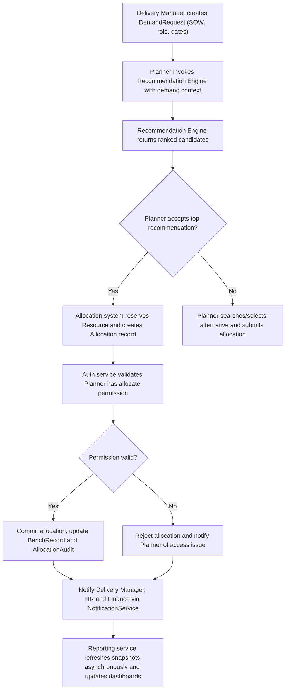
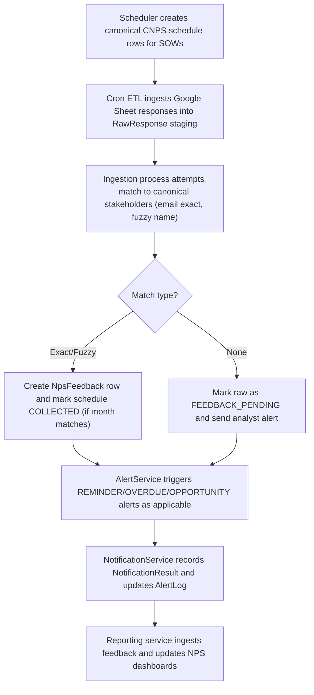
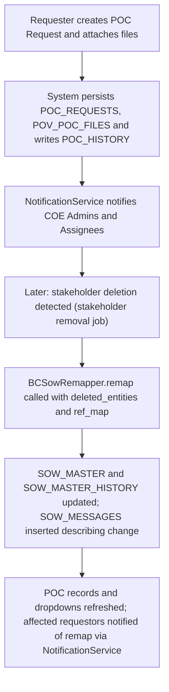
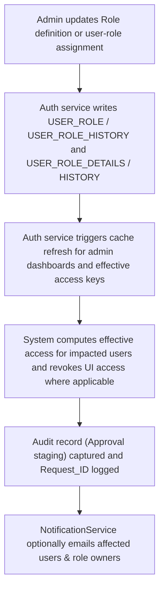

# RRE-API — Consolidated Business Overview

## Section 1: RRE-API Business Overview

Purpose
- The RRE-API provides an integrated platform to plan, allocate and manage people to client work (SOWs), capture customer feedback (NPS), manage POC requests and stakeholder mappings, generate intelligent candidate recommendations, and deliver operational and executive reporting — all governed by centralized authentication/authorization, notification, and configuration utilities.

Primary objectives
- Ensure timely fulfillment of demand (SOWs) with suitable resources while minimizing bench and billing conflicts.
- Maintain a canonical schedule and feedback lifecycle for NPS/CNPS activities to preserve customer feedback integrity and trigger timely follow-ups.
- Provide planners and managers with automated, explainable recommendations and conflict-free allocation workflows.
- Centralize role-based access control, auditability and notification delivery for cross-module actions.
- Deliver trusted operational and executive reports derived from canonical snapshots and reconciled adjustments.

Key value streams
- Demand-to-Allocation: SOW demand discovery → recommendations → allocations → billing status updates → reporting.
- Feedback-to-Action: CNPS/NPS scheduling → ingestion → scoring → alerts → follow-ups and re-scheduling.
- Stakeholder & POC lifecycle: POC requests → stakeholder assignment & files → SOW remapping → closure and audit.
- Governance & Observability: Role/access management → audit trails → notifications → reports/insights.

## Section 2: Stakeholders & Personas

Consolidated list of personas (business view)
- Administrator / Platform Admin: Manages roles, system configuration, notification and operational settings.
- Role Manager / Access Approver: Creates and maintains role definitions and page-level permissions.
- Resource Planner (Planner): Manages allocations, runs recommendation requests, accepts/rejects suggestions and performs manual allocations.
- Delivery Manager / Project Lead (Manager): Raises demand (SOW), approves allocations, reviews team-level reports and receives alerts.
- HR / Bench Owner: Manages bench lifecycle, redeployment and bench-duration interventions.
- Finance / Revenue Ops (Finance): Reviews billing status, projected vs actual revenue, and SOW amount movements.
- Analyst / Operations (Analyst): Runs ETL/ingestion jobs, resolves unmatched NPS responses, investigates conflicts and maintains data quality.
- Scheduler / CNPS Planner (Scheduler): Creates and maintains canonical NPS schedules and bulk updates.
- Program Owner / Account Manager (Program Owner): Oversees campaigns, approves reschedules and receives portfolio alerts.
- COE Admin / Approver (COE Admin): Receives POC notifications and governs POC approvals/oversight.
- Executive / Leadership: Views executive rollups and KPIs.
- Employee / Respondent (Employee): Views own profile, receives notifications and responds to NPS surveys.
- System / Service Accounts: Automated jobs and cron processes that perform syncs, recommendations, notifications and report generation.

## Section 3: Unified Data Entities & Relationships

Key business entities (business-level attributes)

- Employee / Resource
  - EMPLOYEE_ID (business id)
  - NAME, EMAIL_ID
  - JOB_ROLE, JOB_LEVEL, LOCATION, DEPARTMENT
  - JOIN_DATE, END_DATE, EMPLOYEE_STATUS
  - SKILLS_PERSONA, BILLING_STATUS, MANAGER_ID
  - Derived: NEXT_BILLABILITY_DATE, IN_NOTICE_PERIOD, YTD_UTILIZATION

- Role (ACCESS_ROLE)
  - ROLE_ID, ROLE_NAME, DESCRIPTION
  - PAGE_PERMISSIONS (list of {PAGE, ACCESS_TYPE}), ACTIVE_FLAG
  - Audit: CREATED_BY, UPDATED_BY, HISTORY

- UserRole (Assignment)
  - USER_ID/EMAIL_ID, ROLE_ID(s), ACCESS_ON (scope/context), ACTIVE_FLAG, CREATED_DATE

- SOW / DemandRequest
  - SOW_ID, UNIQUE_ID, SOW_NAME, ACCOUNT_ID, LEGAL_START_DATE, LEGAL_END_DATE, PROBABILITY, BILLING_MODEL, SOW_STATUS

- Allocation
  - ALLOCATION_ID, EMPLOYEE_ID/RES_UNIQUE_ID, SOW_ID, ALLOCATION_START_DATE, ALLOCATION_END_DATE, FTE/HEADCOUNT, BILLING_STATUS, CREATED_BY

- BenchRecord
  - EMPLOYEE_ID, AVAILABLE_FROM, AVAILABLE_TO, BENCH_REASON, BENCH_DURATION_DAYS, BENCH_FLAG

- Availability
  - EMPLOYEE_ID, DATE_RANGE, PART_TIME_FLAG, BLOCKED_DATES (special leave)

- Recommendation Candidate / RecommendationResult
  - DEMAND_ID, SUPPLY_ID, EMPLOYEE_ID, FIT, OVERLAP, LEFT_GAP, RIGHT_GAP, SKILLS_SCORE, PERSONA_SCORE, FINAL_SCORE, RECOMMENDED_FLAG

- CNPS/NPS Schedule (cnps_schedule / nps_sow_monthly_schedule)
  - SCHEDULE_ID, SOW_ID, UNIQUE_ID, CNPS_ENTITY_ID (stakeholder), ACCOUNT_ID, DUE_DATE / SCHEDULE_MONTH, STATUS (PLANNED/COLLECTED/MISSED), APPROVED_FLAG, CREATED_SOURCE, ACTIVE_FLAG

- NPS Raw Response / Feedback
  - RAW_RESPONSE_ID, ACCOUNT_ID, RAW_NAME, RAW_EMAIL, NPS_SCORE, DIMENSION_SCORES, MATCH_STATUS, CONFIDENCE_SCORE, PROCESSED_STATUS
  - FEEDBACK_ID: CAMPAIGN_ID, STAKEHOLDER_ID, SCORE, FEEDBACK_TEXT, SCHEDULED_MONTH

- POC Request
  - UNIQUE_ID, TITLE, DOMAIN, DOMAIN_TYPE, REQUESTOR_ID, ASSIGNED_TO_ID, STATUS, STATUS_RANK, ETA_REQUESTED, ETA_COMMITTED, FILES (S3 paths), DELETE_FLAG

- Notification (NotificationRequest / NotificationResult)
  - NOTIFICATION_ID, CHANNEL (EMAIL/TEAMS), RECIPIENTS, SUBJECT, TEMPLATE, STATUS, SENT_AT, ERROR_MESSAGE, RETRY_COUNT, METADATA

- Report Snapshot
  - REPORT_ID, REPORT_NAME, DATE, UPDATED_DATE, HEADER_DATA, SHEET_DATA, METRICS

- Audit / History Entities
  - AUDIT_ID, ENTITY_TYPE, ENTITY_ID, OPERATION, PERFORMED_BY, TIMESTAMP, PREVIOUS_VALUES, NEW_VALUES, REQUEST_ID

Relationships (business view)
- Employee 1..* Allocation: an employee can have multiple allocation records across time; active allocation determined by date ranges.
- Allocation belongs to a SOW; SOW aggregates allocations and drives billing/revenue metrics.
- BenchRecord derived from Employee allocations (no active allocation) and feeds Recommendation and Allocation suggestions.
- Recommendations are generated from Demand (SOW/demand rows) to Candidate (Employee/BenchRecord) and may be persisted as advisory artifacts.
- CNPS/NPS Schedule rows link to SOW and Stakeholder (CNPS entity) and are updated by NPS Feedback ingestion when responses match.
- POC Requests may reference SOW(s) and Employees; stakeholder or buying-center remapping updates SOW_MASTER and POC associations.
- Notifications reference source_app and entity references (e.g., allocation change triggers notification with reference_id linking to Allocation/Audit rows).
- Reports consume snapshots derived from SOW, Allocation, Bench and Feedback entities; reports also include adjustment overrides from adjustment sheets.

Data lifecycle & retention notes
- Audit/history tables exist for Role, UserRole, POC, SOW_MASTER and Allocation entities; business retention policies should define archival/cleanup windows.
- Raw NPS responses retained for analyst review until matched or archived; feedback rows aggregated into dashboards and may be retained per compliance needs.

## Section 4: Global Role vs Feature Access Matrix

Roles (consolidated): Admin, Role Manager, Resource Planner, Delivery Manager, HR/Bench Owner, Finance, Analyst/Operations, Scheduler/CNPS Planner, Program Owner/Account Manager, COE Admin, Executive/Leadership, Employee (self), System/Service Account, Platform Operator/DevOps

Features (grouped): Authentication & RBAC, Resource Allocation (create/update/approve), Recommendation Engine (run), CNPS Planning (create/bulk/edit), NPS Ingestion & Feedback (ingest/resolve), Reporting & Exports, Notifications (send/manage), Teams & Org Insights (view/edit scenarios), POC Request Management, Configuration & Secrets, Audit & History

Permission key: Full = full create/update/manage; Edit = create & modify in-scope; View = read-only; None = no access; Sys = system/service account only

- Authentication & RBAC
  - Admin: Full
  - Role Manager: Full
  - Resource Planner: None
  - Delivery Manager: View
  - HR/Bench Owner: View
  - Finance: View
  - Analyst: View
  - Executive: View
  - Platform Operator: Full (config)

- Resource Allocation (Demand/Allocation)
  - Resource Planner: Full
  - Delivery Manager: Edit (raise demand, approve) / View
  - HR/Bench Owner: Edit (bench operations) / View
  - Finance: View / Edit for billing adjustments
  - Admin: View
  - Analyst: View

- Recommendation Engine
  - Resource Planner: Run & View results (Edit = re-run with filters)
  - Delivery Manager: View
  - Analyst: View
  - Admin: View

- CNPS Planning & Scheduling
  - Scheduler/CNPS Planner: Full
  - Program Owner / Account Manager: Edit (approve stakeholders) / View
  - CNPS Admin: Full
  - Analyst: Edit (bulk/backfill) / View
  - Executive: View

- NPS Ingestion & Feedback
  - Analyst/Operations: Full (ingest, resolve, map)
  - Program Owner / Account Manager: View
  - Scheduler: View
  - Admin: View

- Reporting & Exports
  - Finance: Full (run/export)
  - Delivery Manager: View/Run
  - Executive: View
  - Analyst: View/Run

- Notifications & Communication
  - System Cron / Service Account: Sys
  - Platform Admin: Full (configure templates, allowed domains)
  - Program Owner / Account Manager: Receive (View)
  - Planner / Manager: Receive (View)

- Teams & Org Insights
  - HR: Full (create/save/finalize scenarios)
  - Manager: View / Edit within scope
  - Planner: View
  - Employee: View (self)

- POC Request Management
  - Requester: Create/Edit/Delete (own requests)
  - COE Admin: View & Receive notifications; Edit/Approve (as configured)
  - Delivery Owner/Assignee: Update status and upload files
  - Admin: View

- Configuration & Utilities
  - Platform Operator / DevOps: Full
  - Admin: View/Manage limited settings via admin UI

Notes
- The matrix above is a normalized, business-level view. Concrete enforcement is data-driven in RBAC tables (Role -> Page -> Access Type) maintained in the Auth module and persisted in USER_ROLE / USER_ROLE_DETAILS tables.

## Section 5: Cross-Module End-to-End Scenarios

Scenario 1: Demand-to-Allocation with Recommendation and Notification

Narrative
- A Delivery Manager raises a demand. A Planner requests recommendations. After review, the Planner accepts a recommended candidate. The Allocation system verifies Planner permissions, commits the allocation, updates bench records and audit trails, notifies stakeholders, and triggers reporting updates.

Acceptance Criteria
- Recommendation API returns a non-empty ranked candidate list when eligible supply exists.
- Allocation commit only succeeds when Planner has required role-based permission; otherwise action is blocked and a clear error returned.
- On successful allocation: Allocation record, BenchRecord update and AllocationAudit entries are persisted; notification delivered and report snapshots reflect the change within configured SLA (e.g., asynchronous refresh completes and dashboards show updated allocation within expected timeframe).

Scenario 2: CNPS Planning → Response Ingestion → Feedback → Alerting

Narrative
- Schedulers create planned NPS slots. Cron jobs ingest responses from Google Sheets. The ingestion process matches responses to stakeholders; matched responses become feedback and update schedule slots to COLLECTED; unmatched rows are flagged for analyst review. Alerts (reminders, overdue, opportunities) are created and delivered; NPS dashboards are refreshed.

Acceptance Criteria
- Canonical schedule rows are created and deduplicated by composite key (sow_id, unique_id, cnps_entity_id, due_date).
- Ingestion marks matched responses as PROCESSED and creates NpsFeedback idempotently; schedule rows are updated to COLLECTED when months match.
- Unmatched or ambiguous responses are queued for analyst review and generate alert records; alert payloads are sent per cooldown rules.
- NPS dashboards reflect collected feedback and compute NPS scores using defined thresholds.

Scenario 3: POC Request Creation → File Upload → Stakeholder Deletion → SOW Remapping

Narrative
- A Requester creates a POC and uploads supporting files; COE admins are notified. When stakeholders are deleted in downstream master data, the remapper updates affected SOW rows and histories. POC and SOW views are refreshed and impacted stakeholders are notified.

Acceptance Criteria
- POC creation persists unique UNIQUE_ID, file storage paths and history entries; presigned URLs are available for retrieved files.
- When stakeholder deletion leads to SOW remapping: SOW_MASTER and SOW_MASTER_HISTORY rows are updated and SOW_MESSAGES describe changes; POC dropdowns and caches reflect remapped values.
- Notifications are recorded in NotificationResult audit and include reference to remap operations.

Scenario 4: Role Change Governance & Access Revocation

Narrative
- An Admin modifies a role or user-role mapping. The auth service persists master/history, refreshes caches, computes effective access for impacted users, captures audit staging, and optionally notifies affected users. Downstream UI layers use the effective access snapshot to render permitted pages.

Acceptance Criteria
- Role updates produce master and history records and generate an audit staging entry with request id; cache refresh occurs and admin dashboards reflect changes.
- Access check APIs return updated effective access (grant/deny) for affected users immediately after cache refresh or within defined consistency window.
- Notifications to affected users include actionable detail and traceable audit reference ids.

## Section 6: Assumptions, Risks, and Open Questions

Assumptions
- RBAC enforcement is centralized via the Auth module and UI/API gateways consult Auth effective access endpoints before rendering or accepting privileged actions.
- Recommendation Engine is advisory; selection & commit flows are handled by Allocation module which enforces business validations and RBAC.
- Cron jobs, ETL and ingestion flows run under system/service accounts with appropriate permissions; results are idempotent.
- Google Sheets ingestion is the primary external source for NPS responses; configuration (gsheets.yaml or per-account config) is maintained by Analysts.
- SSM is the authoritative store for production secrets; local YAML fallbacks are allowed only for non-prod.

Risks
- Inconsistent eventual consistency between cache refresh and DB writes may produce transient access mismatches or stale dashboards immediately after changes.
- Reliance on Google Sheets as a primary ingestion source risks data quality and format variance; fuzzy matching may create ambiguous matches requiring manual analyst work.
- Missing centralized authentication (passwords, MFA) in examined modules is a security gap: authentication/session management must be implemented and integrated.
- Large optimization runs in the Recommendation Engine may exceed interactive SLAs for big datasets; fallback heuristics or batching needed.
- Notification delivery failures (SMTP/Teams webhook) can delay critical alerts; robust retry and escalation are necessary.

Open Questions (for product/ops)
- What are the retention and archival policies for audit/history tables (USER_ROLE_HISTORY, POC_HISTORY, SOW_MASTER_HISTORY, AllocationAudit)?
- Is MFA or centralized authentication required by policy, and where should it be integrated into the RRE platform?
- Define SLA expectations for: allocation commit → report refresh propagation, cache refresh after role changes, and recommendation response times under peak load.
- Approvals: are elevated role assignments subject to an approval workflow (APPROVAL_FLAG), and what is the approval matrix for high-privilege roles?
- Should the recommendation engine expose tunable weights per customer/account or per SOW to enable scenario-specific optimization?

Recommendations (high-level)
- Implement/verify centralized authentication & session management with strong password policies and optional MFA integrated with the Auth/RBAC service.
- Introduce telemetry and SLA monitoring for recommendation runs, ingestion jobs, cache refresh durations and notification delivery.
- Define explicit retention/archival policies for history/audit tables and implement automated archiving jobs.
- Create analyst workflows/UI to resolve ambiguous NPS matches and to retry ingestion for corrected mapping.

---

End of consolidated RRE-API overview
