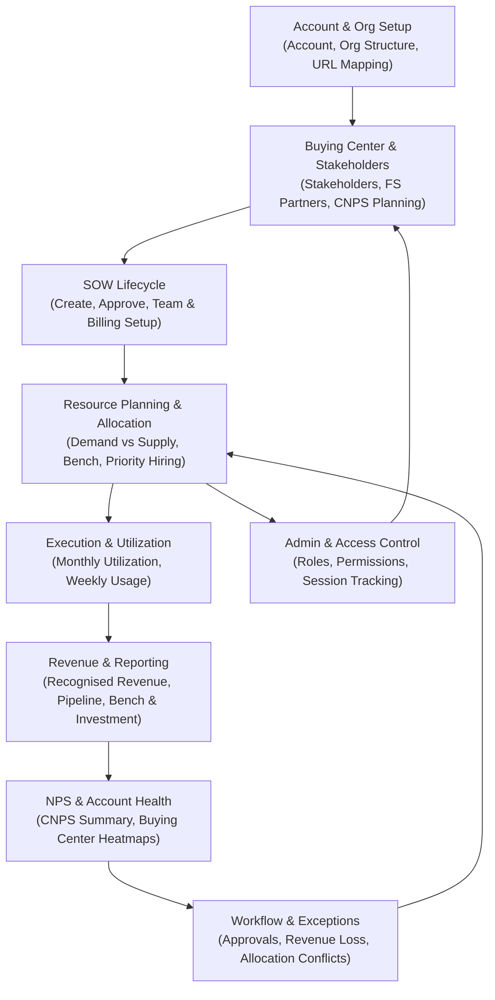

# RRE-UI End-to-End Business Process Flow

This high-level diagram summarizes the main lifecycle in RRE-UI from account and buying center setup through SOW creation, allocation, execution, utilization monitoring, NPS, reporting and exception handling.

This view is further elaborated and referenced in the master BUSINESS_REQUIREMENTS_DOCUMENT.md.
