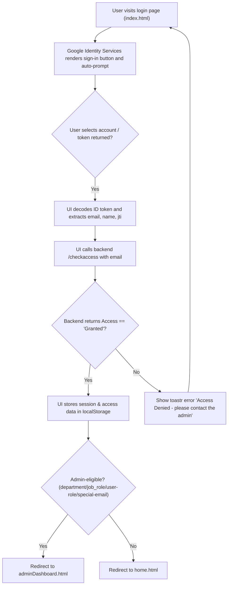
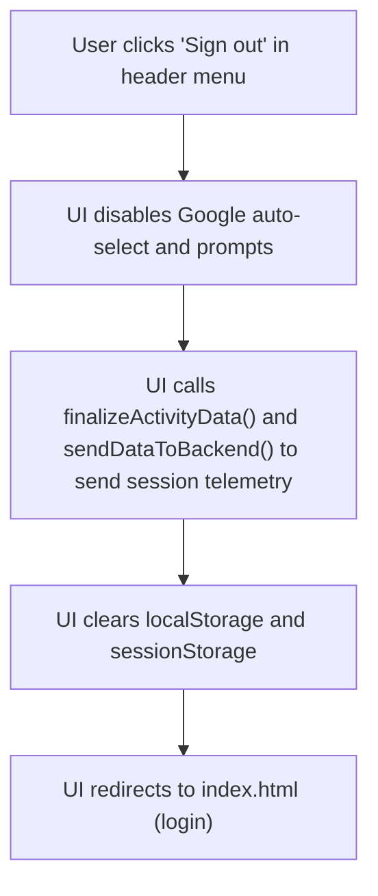
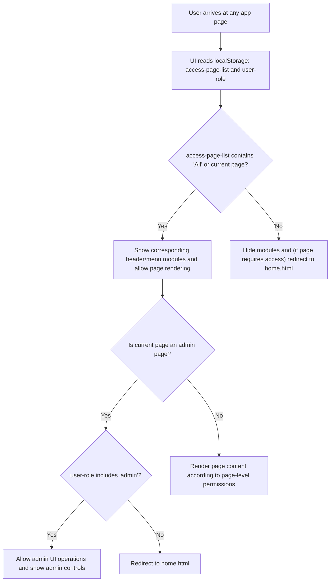

# Authentication & Access Control (UI perspective)

## Business Overview

This section documents how user authentication, session handling, and role-based access control are represented and assumed by the RRE-UI (ARCUS) front-end. The UI delegates identity proofing to Google Identity Services (GSI) and relies on backend APIs to validate access and provide per-user roles/permissions. The goal of this document is to capture the business-facing behaviors the UI enforces or expects so product owners and integrators can align backend and identity provider behavior with user experience expectations.

Target users / personas:
- End user (employee) who signs in via corporate Google accounts and uses the application features permitted by their roles.
- Admin user (role: admin) who manages roles and assigns access from the Admin Dashboard.
- System integrator / identity administrator responsible for configuring Google sign-in and backend access endpoints.

Business value:
- Provide single-click sign-in experience via Google and seamless redirection to the correct landing page (Admin or Home).
- Enforce role-based navigation and feature visibility in the UI to reduce unauthorized actions.
- Capture session and activity telemetry for auditing and session analytics.

Scope:
- UI-level login entry points, redirection rules, session persistence assumptions, logout and inactivity handling, role-based navigation and admin operations visible from the UI.

---

## Key Observations (UI behaviour summary)
- Login entry point: Google Identity Services (gsi) button and auto-prompt on index.html. The UI expects an ID token JWT from Google and decodes the token client-side.
- Backend validation: After receiving the Google email, the UI calls a backend endpoint (/checkaccess) to fetch user details, roles and page-access lists. The UI requires a backend response with Access="Granted" to proceed.
- Session persistence: The UI stores user session and authorization details in localStorage (keys include jti, email, EmpUserName, EmpUserID, ACCESS_LEVEL, Access, EDIT_ACCESS, GROUP_NAME, STATUS, Department, Job_Role, user-role, user-all-details, user-access-details, access-page-list). The UI reads these values on page load to determine access and routing.
- Redirection logic: Users are routed to adminDashboard.html or home.html based on Department, Job_Role, user-role or specific email addresses.
- Role-based visibility: Menu items and page-level components are shown/hidden client-side using access-page-list and user-access-details returned by backend and cached in localStorage.
- Admin operations: Admin UI exposes role creation, assignment and update workflows and calls admin APIs to persist changes.
- Logout: signOut() clears storage, sends telemetry and redirects to index.html. The UI calls google.accounts.id.disableAutoSelect() to stop auto sign-in.
- Session/activity telemetry: The UI tracks user activity, inactivity, and periodically sends session data to backend (/get_session_data).
- Error/alerts: Uses toastr for errors (access denied, AJAX failures, validation feedback) and redirects to home where access isn't permitted.

---

## Functional Requirements

**FR-001**: The system shall present a Google Sign-In control on the public login page so users can authenticate with a corporate Google account.

**FR-002**: The system shall, upon receiving a Google ID token, call the backend checkaccess endpoint with the user's email to retrieve authorization details before granting access.

**FR-003**: The system shall not display application content until backend access is confirmed (Access == "Granted"). If access is denied, the system shall show an error notification "Access Denied - please contact the admin".

**FR-004**: The system shall persist session and authorization attributes in browser storage (localStorage) so that subsequent page loads can determine user role and navigation without re-authenticating immediately.

**FR-005**: The system shall redirect authenticated users to either Admin Dashboard or Home based on role/department/job-role or designated emails.

**FR-006**: The system shall show or hide top-level menus and feature modules based on the access-page-list returned by the backend.

**FR-007**: The system shall restrict access to admin pages in the UI by verifying the 'user-role' value; attempts to access admin pages without the proper role shall redirect the user to the Home page.

**FR-008**: The system shall provide a visible Sign out control in the user menu, which when activated shall clear session storage, send final activity telemetry, and return the user to the login page.

**FR-009**: The system shall implement client-side inactivity detection and trigger session activity finalization after inactivity (3 minutes) and send periodic activity data (every 2 minutes) to a backend session endpoint.

**FR-010**: The system shall surface backend validation and operation results (success/failure) through user-facing toast notifications.

**FR-011**: The system shall allow admin users to view, create, update and assign roles to users from the Admin Dashboard UI and send role change payloads to backend APIs.

---

## User Roles & Permissions (UI view)

- Administrator (UI role identifier: "admin")
  - Capabilities seen in UI: Access Admin Dashboard, create/edit roles, assign roles to users, view role lists and team lists, perform role updates and deletions.
  - UI enforcement: admin pages check localStorage user-role and redirect to home if missing.

- Regular Employee
  - Capabilities seen in UI: Access only the modules and pages surfaced via access-page-list; cannot access admin pages.

- System / Special Emails
  - Certain hard-coded emails (e.g., "nitin.pandey@factspan.com", "nagarajan.v@factspan.com") are treated as admin-equivalent by client routing logic.

Permission matrix (simplified UI view):
- access-page-list contains a list of pages or "All". If "All", entire menu and header modules are shown. Otherwise only pages listed are shown.
- user-access-details contains page-level permissions (ACCESS_TYPE and ENVIRONMENT_ACCESS) used by checkEachPageAccess to decide view/edit/delete levels (UI uses array values to show or hide controls where implemented).

---

## User Workflows & Journeys

### User Workflow: Login (Google Sign-In + backend validation)

#### Workflow Steps:
1. User navigates to index.html where Google sign-in is rendered.
2. User interacts with Google prompt and grants authentication; the UI receives an ID token.
3. The UI decodes the JWT to extract email and user metadata.
4. The UI synchronously calls backend /checkaccess to fetch user roles, permissions and access flags.
5. If backend grants access, the UI saves session and access information to localStorage.
6. The UI redirects the user to Admin Dashboard or Home based on role/department or configured special emails.
7. If access is denied by backend, the UI displays an error toast and remains on the login page.

#### Business Rules Applied:
- BR-001: Only users with backend-provided Access == "Granted" can proceed past the login screen.
- BR-002: Admin routing is determined by Department in {"Products","CEO","COE"} or Job_Role == "Vice President" or user-role containing "admin" or specific privileged email addresses.
- BR-003: UI must persist user access details in localStorage for subsequent page loads.

### User Workflow: Logout (UI-driven)

#### Workflow Steps:
1. User selects Sign out from the profile dropdown.
2. UI calls google.accounts.id.disableAutoSelect() and triggers telemetry finalization.
3. UI sends remaining activity/session data to backend and then clears localStorage and sessionStorage.
4. User is returned to the login page and will be prompted for authentication on next visit.

#### Business Rules Applied:
- BR-004: Sign out must clear client-side session artifacts (localStorage/sessionStorage) to prevent accidental automatic re-entry.
- BR-005: The UI sends final telemetry to the session endpoint before clearing data to preserve activity logs.

### User Workflow: Role-based Navigation & Admin Page Access

#### Workflow Steps:
1. On page load the header script loads and reads access lists from localStorage.
2. Header shows/hides menu items based on access-page-list.
3. If user tries to access admin pages and user-role does not include admin, they are redirected to home.html.
4. Admin pages further fetch role/team data from backend to populate UI for management actions.

#### Business Rules Applied:
- BR-006: access-page-list returned by backend is authoritative for UI visibility — if it contains "All" show everything.
- BR-007: Admin pages require explicit 'admin' role in user-role; lack of role triggers a redirect to home.html.
- BR-008: UI uses user-access-details to decide per-page environment access and feature-level enabling (view/edit/delete) where implemented.

---

## Business Rules & Validations

**BR-001**: Only backend-validated users (Access == "Granted") may enter the application beyond the login page.

**BR-002**: Admin routing is based on Department in {"Products","CEO","COE"}, Job_Role == "Vice President", user-role contains "admin", or membership in a small list of privileged email addresses.

**BR-003**: The UI shall persist authentication context in localStorage keys (jti, email, etc.) and rely on them for session continuity.

**BR-004**: The sign-out flow shall remove all client-side session artifacts to prevent silent re-entry.

**BR-005**: Inactivity detection shall treat 3 minutes of no input as an inactive state and trigger telemetry finalization. (UI-side threshold)

**BR-006**: Menu and page visibility is driven by access-page-list. If the list contains "All" then the UI shows all modules; otherwise show only items listed.

**BR-007**: Admin UI endpoints are only shown when user-role includes 'admin'; the UI enforces navigation restrictions and redirects unauthorized access attempts to home.

**BR-008**: The UI must display backend error and success messages through toast notifications so users understand result of operations.

---

## Data Entities (Business View)

### User (session view)
- Attributes (as stored by UI):
  - email (identifier)
  - jti (session token, taken from JWT id claim)
  - EmpUserName (display name)
  - EmpUserID (employee id)
  - ACCESS_LEVEL (string)
  - Access ("Granted"/"Denied")
  - EDIT_ACCESS (string)
  - GROUP_NAME
  - STATUS
  - Department
  - Location
  - Job_Role
  - user-role (comma-separated list of role identifiers)
  - user-all-details (raw backend payload)
  - user-access-details (page-level access structures)

Lifecycle: created on successful /checkaccess call and persisted in localStorage until sign-out or manual clearing.

### Role (business view)
- Attributes: ROLE_ID, ACCESS_ROLE (label), DESCRIPTION, ACCESS_TYPE (view/edit/delete), ACCESS_ROLE_DATA (assigned employees)
- Manipulated in Admin UI: create, edit, assign and remove members; changes are sent to backend endpoints like /assign_new_role_new and /update_access_by_role_new.

### Session / Activity
- Attributes captured by UI tracking: url, module, startTime, endTime, totalTimeSpent, sessionId (jti), userEmpId, userDep, environment
- UI periodically sends session/activity payloads to backend session endpoint (/get_session_data) using navigator.sendBeacon and AJAX calls.

---

## Integration Points & Assumptions

- Identity Provider: Google Identity Services (GSI) is used for primary authentication. The UI expects an ID token (JWT) and decodes it client-side.
- Backend Authorization Endpoint: /checkaccess (derived from apiValue.url) accepts an email and returns access flags, user profile, roles, and access lists.
- Admin APIs: Various admin endpoints (e.g., admin_dashboard_by_role, all_roles_details, assign_new_role_new, update_access_by_role_new) provide role and team data and accept role update payloads.
- Session Telemetry API: Session/activity payloads are posted to a session endpoint (e.g., apiValue.url_ip + ":5002/get_session_data").

Assumptions the UI makes about the backend and IDP:
- The backend responds synchronously and reliably to /checkaccess with structured payload containing Access == "Granted" and a set of role/access lists.
- The ID token contains a unique jti claim and the user's email in the JWT payload.
- The backend is authoritative for permissions; UI must reflect backend-provided access-page-list and user-access-details.
- No UI-driven server-side session expiration is visible to the front-end; UI expects the backend to accept the session jti or require re-authentication when necessary.

---

## UI Error Handling & Messages (patterns)
- Access Denied: "Access Denied - please contact the admin" (toastr.error) when backend denies access.
- AJAX failures: Generic toastr.error messages with backend-provided message or "Message error" plus details logged to console.
- Admin updates: Success or error shown via toastr and some flows refresh or reload UI after success.
- Unauthorized access to admin pages: UI redirects to home.html with no specific toast by default.

---

## Non-functional Notes (UI-side)
- The UI performs synchronous AJAX for some login flows (async: false) to enforce sequential behavior; this affects perceived page responsiveness.
- Activity tracking intervals: telemetry sent every 2 minutes (120s) if active, inactivity threshold is 3 minutes (180s).
- Use of localStorage implies sessions survive page reloads and browser restarts until explicit sign-out or clearing.

---

## Business Scenarios & Use Cases

**US-001**: As an employee, I want to sign in with my Google account so that I can access my permitted modules.
- Acceptance Criteria: Google sign-in is presented; user is redirected to Admin or Home based on role; unauthorized users see Access Denied.

**US-002**: As an admin, I want to assign roles to employees so that they gain or lose access to modules via the Admin Dashboard.
- Acceptance Criteria: Admin can select roles, submit changes and receive confirmation; UI updates to show new role assignments.

**US-003**: As a security auditor, I want the UI to send session/activity telemetry so that user activity can be audited.
- Acceptance Criteria: UI tracks start/end times, inactivity and posts session data to the session endpoint; final data is sent on sign-out.

---

## Error Handling & Edge Cases
- If the backend /checkaccess call fails (network or error), the UI logs error and does not proceed to show protected pages.
- If localStorage data is absent or corrupted, header and page scripts may default to redirecting to login.
- Because the UI uses localStorage without explicit client-side expiry, stale sessions may remain visible until backend enforces a timeout or user signs out.

---

## Assumptions & Constraints
- Assumes Google Identity Services is enabled and configured with the client_id used in the page meta.
- Assumes backend provides consistent payload shapes for checkaccess and admin APIs.
- UI contains a small set of hard-coded email addresses treated as admin — this is a business shortcut and should be reviewed for security and maintainability.
- Session invalidation server-side is not visible to the UI unless backend reports Access change; front-end must be able to handle backend-enforced session expiry via subsequent API errors (not observed in UI code).

---

## Recommendations (business view)
- Remove hard-coded privileged emails and rely purely on backend role assignments.
- Add explicit client-visible session expiration UI and re-authentication flow to handle backend-side session invalidation gracefully.
- Consider using secure, short-lived cookies or a proper token store rather than localStorage for session-sensitive attributes (security improvement).
- Document the backend contract for /checkaccess and admin APIs so UI and identity administrators share the same expectations for attributes and error cases.

---

## Files Reviewed (UI scope)
- index.html — Google Sign-In entry, auto-prompt and initial redirect logic
- header.html — Menu rendering, reading access-page-list and profile/sign-out UI
- admin.html — Admin role/team management pages (UI layout and control hooks)
- adminDashboard.html — Admin landing and dashboard area where admin-specific controls appear
- js/admin.js — Admin UI logic for fetching role/team data, rendering tables and calling admin APIs
- js/common.js — Authentication callback (onSignIn), loginAuth(), signOut(), session/activity tracking and access checks

