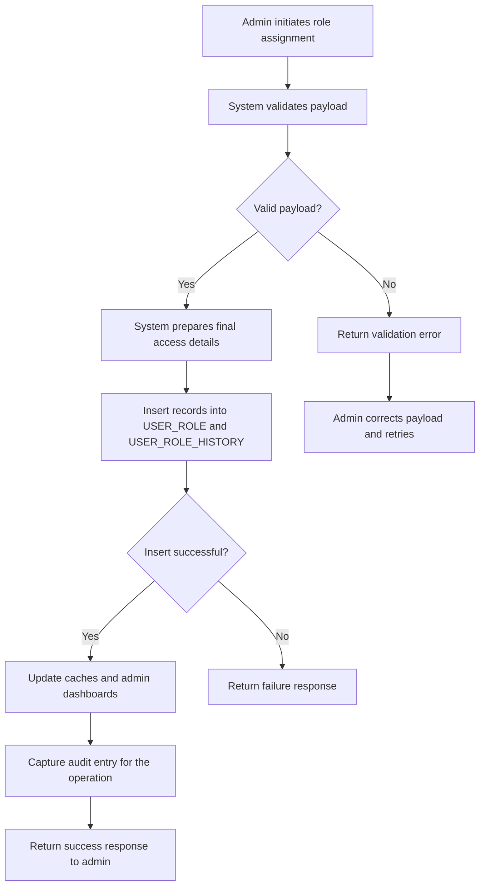
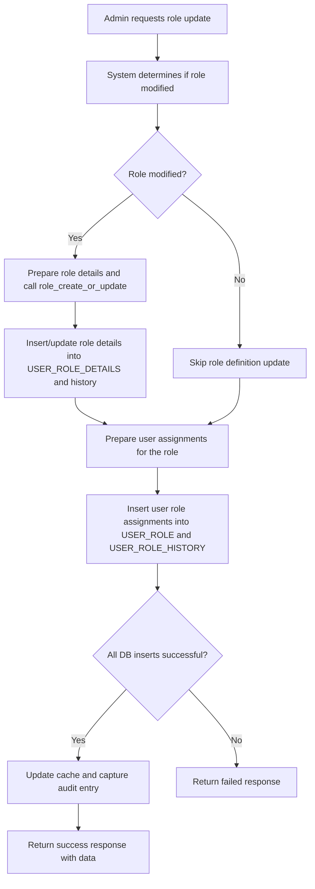
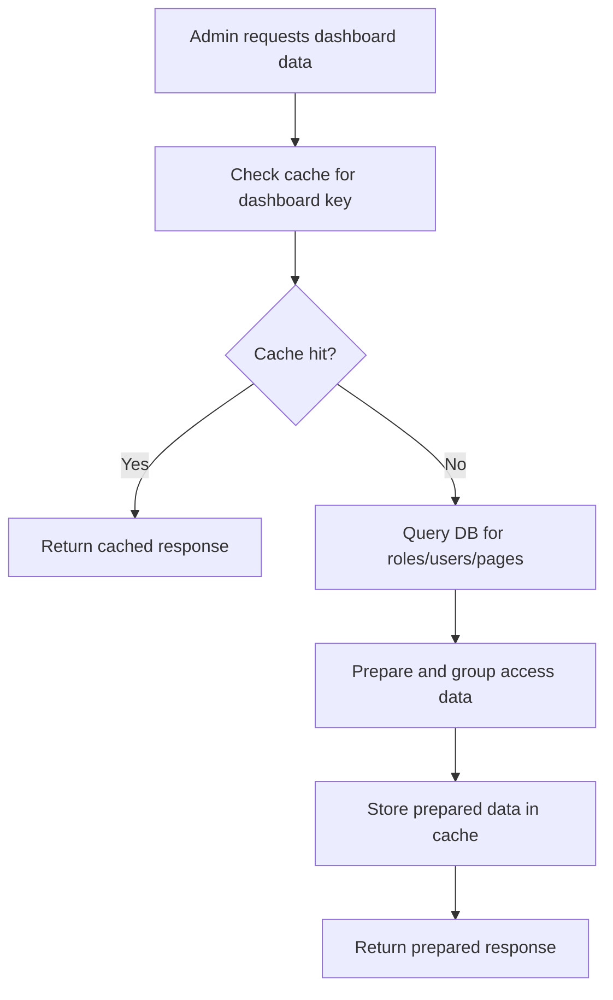
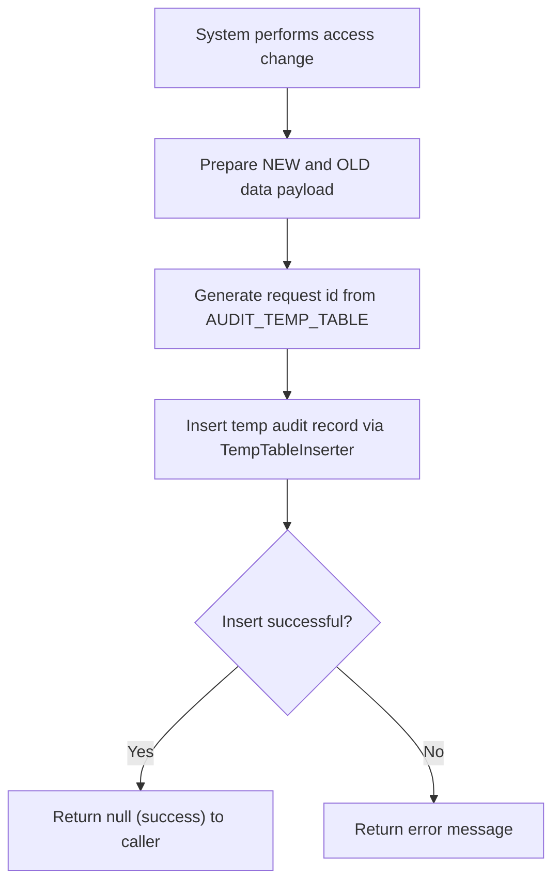

# Authentication & Authorization (RRE-API)

## Business Overview
The authentication and access control components provide secure access to RRE platform capabilities. Target users include internal employees, managers, administrators, and external stakeholders who require role-based access to modules and pages. The system enables administrators to define roles and page-level permissions, assign roles to users, and manage access across environments. Audit trails capture changes to access configurations and administrative actions for compliance and investigation.

## Scope
In scope: Role management, user-role assignment, access dashboards, page/module access configuration, audit capture of access changes.
Out of scope: Credential storage implementation details, token issuing (not present in explored files), external SSO integrations.

## Key Personas
- Administrator: Manages roles, pages, and assigns access; can view admin dashboards
- Manager: Granted elevated access via roles to view/modify certain pages
- Employee: Regular user with access per assigned roles
- External stakeholder: May be represented as users with restricted roles

## Functional Requirements
**FR-001**: The system shall allow administrators to create new access roles and associate pages and access types with a role.

**FR-002**: The system shall allow administrators to assign roles to users and record the assignment in master and history tables.

**FR-003**: The system shall provide an "admin dashboard by role" presenting role definitions, pages, and access types.

**FR-004**: The system shall provide an "admin dashboard by employee" showing users and their granted roles.

**FR-005**: The system shall allow administrators to update access by role, including creating or modifying role definitions and assigning multiple users.

**FR-006**: The system shall record audit entries for create/update operations on roles and user access, capturing old and new data, the acting user, operation type, and a request identifier.

**FR-007**: The system shall support adding new modules/pages to the access configuration.

**FR-008**: The system shall cache dashboard and dropdown data and provide endpoints to refresh the cache.

## User Roles & Permissions
### Roles
- Administrator (full role management capabilities)
- Role Manager (can create/modify roles and assign to users)
- Regular Employee (view and use assigned pages)
- External User (limited pages)

### Permission Types
- view
- edit
- delete

Permission matrix (high-level):
- Administrator: view, edit, delete on all pages
- Role Manager: view, edit on assigned pages
- Employee: view on assigned pages

## User Workflows & Journeys

### User Workflow: Assign New Role to User

#### Workflow Steps:
1. Administrator submits user_details and access_details payload.
2. System validates input and merges with existing DB records.
3. If valid, system inserts into master and history tables.
4. On success, caches for dashboards and dropdowns are refreshed.
5. Audit entry is captured with old and new data.
6. Success response returned; failures return meaningful error.

#### Business Rules Applied:
- BR-001: Insert must populate both master and history tables.
- BR-002: Audit must capture NEW and OLD data for access changes.
- BR-003: Cache refresh should occur after successful changes.

### User Workflow: Update Access by Role

#### Workflow Steps:
1. Admin submits a role update payload including PAGE_ACCESS_DATA and ACCESS_ROLE_DATA.
2. System checks if role definition changed; if so, updates role details.
3. System updates user assignments for the role.
4. On complete success, cache updates and audit are triggered.

#### Business Rules Applied:
- BR-004: Role IDs are generated with prefix (e.g., "RRE_") and numeric suffix.
- BR-005: When role modified, page-level permissions must be updated before user assignments.

### User Workflow: Admin Dashboard Retrieval

#### Workflow Steps:
1. Admin calls admin_dashboard endpoint.
2. System checks Redis/local cache for precomputed data.
3. If cached, returned immediately; otherwise, system queries DB and prepares grouped data.
4. Prepared data is cached for subsequent requests.

#### Business Rules Applied:
- BR-006: Cache keys: admin_dashboard_by_employee, admin_dashboard_by_role, all_roles_details.
- BR-007: Cached data must be cleared/refreshed after access changes.

### User Workflow: Audit Capture for Access Changes

#### Workflow Steps:
1. After DB insert operations, system calls Audit_details.capture_audit_details with user, operation, and payload.
2. System generates a numeric request id by reading AUDIT_TEMP_TABLE.
3. System writes a record to temp audit table for later processing.

#### Business Rules Applied:
- BR-008: Audit record must include NEW and OLD payloads and a REQUEST_ID.
- BR-009: Audit insertion errors should be surfaced but do not block access updates (current implementation logs error string).

## Business Rules & Validations
**BR-001**: All modifications to roles or access assignments must be recorded in both master and history tables.

**BR-002**: Any create/update operation must trigger cache refresh for related dashboard/dropdown keys.

**BR-003**: Role identifiers shall use a consistent prefix (default "RRE_") and incrementing numeric suffix.

**BR-004**: Page-level access types are limited to the set {"view","edit","delete"} and must be enforced on role definitions.

**BR-005**: Audit records must contain "NEW" and "OLD" fields and reference the acting user and operation.

**BR-006**: If audit capture fails, system should return a failure response for the operation (current code returns failure when audit_response is not None).

**BR-007**: System must validate input payloads and return clear error messages for malformed requests.

## Data Entities (Business View)

### User
- USER_ID (string)
- EMAIL_ID (string)
- EMPLOYEE_NAME
- JOB_ROLE
- DEPARTMENT
- ACTIVE_FLAG
- CREATED_BY / UPDATED_BY

### Role
- ROLE_ID (string) - business id like "RRE_1001"
- ACCESS_ROLE (string) - role name
- PAGE (string/list) - pages/modules associated
- ACCESS_PAGE (string/list) - page endpoints
- ACCESS_TYPE (list) - ["view","edit","delete"]
- DESCRIPTION
- ENVIRONMENT_ACCESS
- ACTIVE_FLAG

### Permission
- PAGE
- ACCESS_TYPE
- ACCESS_LEVEL

### Token / Session
- Not present in explored code. Token/session handling is out of scope for these files.

### AuditLog (TempTable)
- REQUEST_ID
- TABLE_DATA (stringified NEW/OLD payload)
- SUB_ID
- TABLE_NAME
- DB_NAME
- FLAG_DATA
- APPROVAL_FLAG

## Integration Points
- DB Service (dbServiceLauncher) for querying and inserting into USER_ROLE, USER_ROLE_HISTORY, USER_ROLE_DETAILS, ALL_PAGE_HTMLS, TEMP_AUDIT tables
- Cache (Redis or local in-memory) for admin dashboards and dropdowns
- Utilities: group_data, user_detail_input, update_cache, approval_data.TempTableInserter

## UI Requirements (Key Screens)
- Admin Dashboard by Role: list roles, pages, and page-level access types
- Admin Dashboard by Employee: list users and assigned roles
- Role Creation/Update Screen: define pages, access types, and description
- Assign Role to User Screen: select user(s) and roles, preview changes, submit

## Non-Functional Requirements
- Response for cached endpoints should be near real-time (sub-second when cache hit)
- Audit writes must be durable (written to DB) though current implementation writes to a temp table
- Availability: Admin endpoints should be highly available; cache reduces DB load

## Business Scenarios & Use Cases
**US-001**: As an Administrator, I want to create a role with page-level permissions so that managers can be granted appropriate access.
- Acceptance Criteria:
  - Role saved to USER_ROLE_DETAILS
  - Role history recorded
  - Cache refreshed for role dropdowns
  - Audit record created

**US-002**: As an Admin, I want to assign a role to an employee so that they get access to pages defined in the role.
- Acceptance Criteria:
  - Assignment saved to USER_ROLE and USER_ROLE_HISTORY
  - Dashboard cache for employee updated
  - Audit record created with OLD and NEW

**US-003**: As an Auditor, I want to see a record of role changes with old and new data so I can investigate incidents.
- Acceptance Criteria:
  - Audit TEMP table has records with REQUEST_ID and TABLE_DATA

## Error Handling & Edge Cases
- Malformed request payloads return error strings; BadRequest is handled by trying request.get_json(force=True)
- Database insert failures return failure responses and do not update cache/audit
- Audit capture failures currently return an error string; calling functions treat non-None as failure and may return failed response
- Missing ROLE_ID generation handles empty lists by starting at 1001

## Assumptions & Constraints
- Authentication tokens and session management are not implemented in these files; authenticationapp exposes endpoints for role management rather than login/token issuance
- Code relies on DB views/tables (e.g., ALL_USER_ALL_ROLE_DETAILS_VW, EMPLOYEE_MASTER) being present and populated
- Cache may be local in development and Redis in production
- Audit TEMP table is used as intermediate; a separate approval/processing step likely ingests temp records

## Open Questions & Recommendations
- Recommend centralizing error responses into a consistent JSON error model
- Recommend ensuring audit failures do not silently block necessary operations or, conversely, always record audit successfully (retry on failure)
- Recommend documenting token/session handling and login flows if present elsewhere

