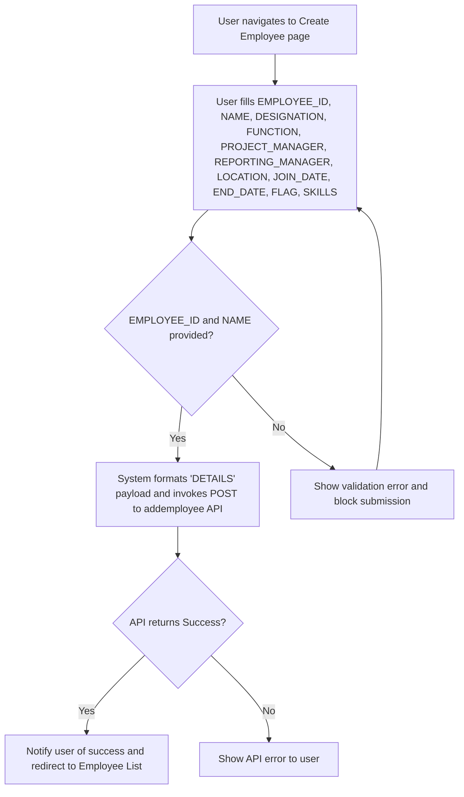
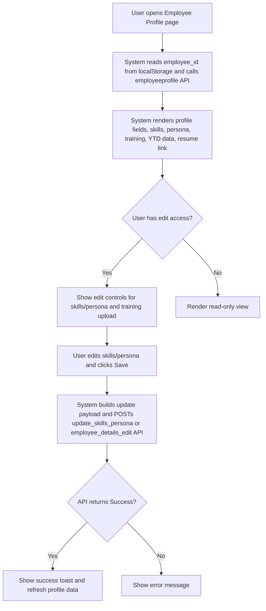
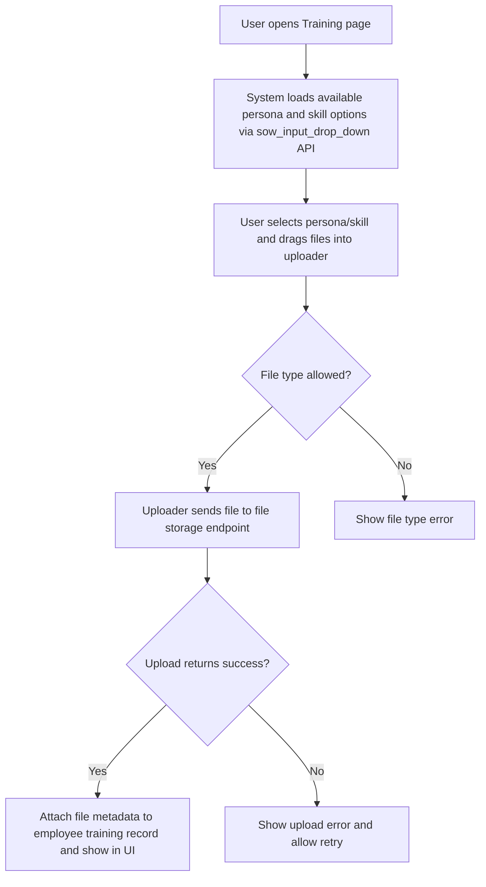
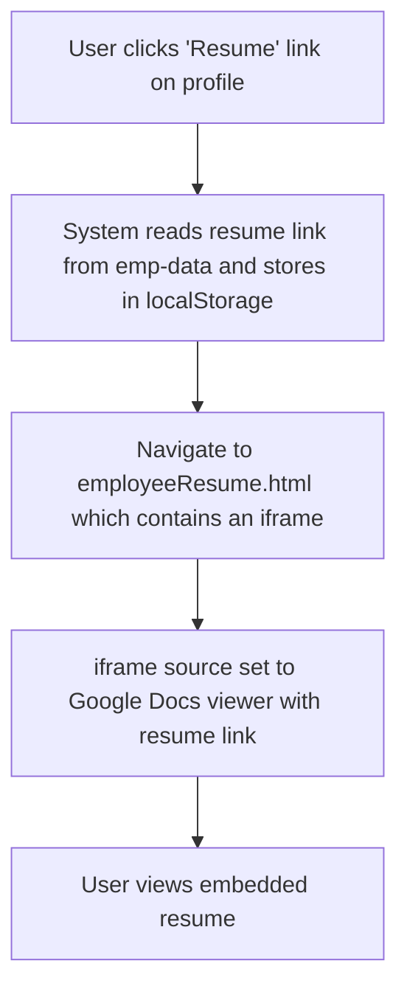

# Employee Management (RRE-UI)

## Business Overview
This section documents the employee master data, profile, skills, training, and resume/document management workflows surfaced by the RRE-UI. The UI provides HR and delivery teams the ability to create, view, update, and deactivate employee records, manage skills and personas, capture training and certification data, and view/resume employee resumes. The objective is to ensure accurate master records for resource allocation, skill-based matching, training tracking, and compliance.

## Scope
Files analyzed (UI layer only):
- employee.html
- employee_create.html
- employee_profile.html
- employeeProfile.html
- employeeExperience.html
- employeeTraining.html
- employeeResume.html
- js/emp_create.js
- js/empProfile.js

Note: Backend implementations / API servers were not opened; analysis is based on UI code and AJAX calls to known endpoints.

## Functional Requirements
**FR-001**: The system shall allow authorized users to create a new employee record with EMPLOYEE_ID, NAME, DESIGNATION, FUNCTION, PROJECT_MANAGER, REPORTING_MANAGER, LOCATION, JOIN_DATE, END_DATE, FLAG, and SKILLS.

**FR-002**: The system shall send a POST to https://rre-api.factspanapps.com:5000/addemployee (or configured API) when creating an employee with required payload fields.

**FR-003**: The system shall display a searchable/filterable employee list by Name, Job Title, Manager, Location, Function, Customer, Billing Status, Status, and Skills.

**FR-004**: The system shall support filtering by geography (ALL/IND/USCA) via quick radio filters.

**FR-005**: The system shall allow authorized users to view detailed employee profile including contact, job role, reporting manager, billing/status, location, persona, skills with levels, YTD billing %, experience breakdown, certifications, completed training, and aspirations.

**FR-006**: The system shall allow authorized users to edit skills and persona, and save updates via a POST to update_skills_persona endpoint.

**FR-007**: The system shall allow authorized users to upload training/certification artifacts via a drag-and-drop file uploader on the training screen.

**FR-008**: The system shall present the employee resume in an embedded document viewer (Google Docs viewer) using a stored resume link.

**FR-009**: The system shall allow navigation between employee list, create, profile, experience, training, and resume pages.

**FR-010**: The system shall provide read-only or edit controls based on page-level access rights returned from access APIs (view vs edit).

**FR-011**: The system shall present persona and skill multi-select controls for bulk updates and ensure uniqueness when saving.

**FR-012**: The system shall display YTD billing and allocation history and indicate current allocation rows visually.

## User Roles & Permissions
- HR (Human Resources)
  - Create, edit, deactivate employee records
  - Upload training and certification documents
  - View full profile and history
- Delivery Manager
  - View and edit skills/persona
  - View allocation and YTD billing
- Employee (Self)
  - View own profile, training, certifications, and resume
- System / API (backend)
  - Accepts employee CRUD and profile update requests

Permission behavior:
- Pages check an 'accessLevel' via JS (checkDashboardPageAccessData / checkEachPageAccess) and hide/show edit UI elements accordingly.

## User Workflows & Journeys

### User Workflow: Employee Onboarding (Create Employee)

#### Workflow Steps:
1. User opens employee_create.html
2. User enters required fields (EMPLOYEE_ID, NAME at minimum)
3. User clicks "Create employee"
4. Client constructs empCreateData with EMPLOYEE_ID and DETAILS JSON string
5. Client POSTs data to addemployee endpoint
6. On success, user is notified (toastr) and may be redirected

#### Business Rules Applied:
- BR-001: EMPLOYEE_ID must be numeric and provided
- BR-002: NAME is mandatory for creation
- BR-003: If END_DATE is empty, default to "0000-00-00" in payload

### User Workflow: View & Edit Employee Profile

#### Workflow Steps:
1. Employee ID loaded from localStorage
2. UI calls employeeprofile API to fetch comprehensive profile
3. UI displays persona, skills with levels, training, certifications, and YTD/Aggregated data
4. If user has edit rights, they can open multi-selects and upload documents
5. Changes are POSTed to update endpoints

#### Business Rules Applied:
- BR-004: Only users with page-level EDIT permission can change persona/skills/training
- BR-005: Skills and persona saved should be unique lists (duplicate removal applied on client)

### User Workflow: Training & Certification Upload

#### Workflow Steps:
1. Select persona or skill from dropdowns
2. Drag-and-drop files using dm-uploader component
3. Uploaded files are stored remotely; UI receives link/metadata
4. Save operation associates uploaded certificates with employee profile

#### Business Rules Applied:
- BR-006: Only allowed file types can be uploaded (enforced by uploader config)
- BR-007: Uploaded certificates are associated with a persona or training record

### User Workflow: Resume Viewing

#### Workflow Steps:
1. Resume link (resumeURL) loaded from employeeprofile API response
2. Link stored in localStorage
3. employeeResume.html loads iframe with Google Docs viewer pointing to resume link

#### Business Rules Applied:
- BR-008: Resume link must be a publicly accessible URL (or accessible to Google Docs viewer)
- BR-009: If resume link contains extraneous quotes, strip them before use

## Business Rules & Validations
**BR-001**: EMPLOYEE_ID is mandatory and must be numeric. (emp_create.js enforces parseInt)

**BR-002**: NAME is mandatory for employee creation.

**BR-003**: JOIN_DATE and END_DATE format should be 'yyyy-mm-dd' or handled by datepicker; empty END_DATE maps to "0000-00-00".

**BR-004**: Only users with "edit" access (page-level) can perform edit operations; otherwise UI hides edit controls.

**BR-005**: When saving skills/persona, duplicates must be removed (client-side uniqueness applied).

**BR-006**: Training/certificate uploads must follow allowed types and upload success is required to attach to profile.

**BR-007**: Resume link must be cleaned of quotes before embedding in iframe.

**BR-008**: YTD allocation rows where current date falls between allocation start and end should be highlighted.

**BR-009**: If EMPLOYEE active status is "YES" for IN_NOTICE_PERIOD, the UI shows "In Notice Period" and a different styling.

## Data Entities (Business View)

### Employee
- Employee ID (unique, numeric)
- Employee Name
- Email ID
- Job Role / Designation
- Function / Department
- Reporting Manager
- Project Manager
- Location / Country
- Join Date
- End Date
- Status (Active / In Notice Period)
- Billing Status
- Employee Code
- Profile fields: Potential Score, Attrition Score, Next Available Date
- Resume Link
- Total Experience, Experience In-firm, Experience Outside
- Persona list (SKILLS_PERSONA)
- Skills with Level list (SKILLS_LEVEL)
- Training & Certification records
- YTD / Allocation history (SOW_DATA)

### Skill
- Skill Name
- Skill Level (R1, R2, R3)
- Associated Persona (optional)

### Persona
- Persona Name (e.g., Data Engineer)
- Persona Level / mapping to skills

### Training Record
- Training Name
- Training Level
- Completion Date
- Uploaded Certificate Link(s)

### Certification
- Certification Name
- Certification Level (if any)
- Completed On (date)
- Certificate Document Link

## Integration Points
- addemployee API: POST to https://rre-api.factspanapps.com:5000/addemployee (used by createEmpDetails)
- employeeprofile API: POST to apiValue.url_ip + ":5001/employeeprofile" (used by assignEmpData)
- update_skills_persona API: POST to https://rre.dev.factspanapps.com:5001/update_skills_persona (used by editSkillPersona)
- Generic API endpoint (apiValue.url) used for employee_details_edit operations
- sow_input_drop_down / sow_input_drop_down API for persona and skill option fetch
- File upload endpoint (configured in dm-uploader demo-config) for storing certificates (uploader code used but endpoint from config)
- Google Docs viewer for embedding resume URLs

## UI Requirements
- Employee list page: Filter controls (multi-selects), radio geography filters, data table with columns as shown
- Create employee page: Form fields for master data and Create button
- Profile page: Snapshot with photo, contact, key metrics, skills and persona lists, YTD Billing and allocation history, edit controls based on permissions
- Training page: Persona selector, skill selector, drag-and-drop uploader, Save button
- Resume page: iframe for embedded resume viewer

## Non-Functional Requirements
- Response: Profile API calls should return within acceptable time; UI records API time for monitoring (getApiTime)
- Security: Resume and certificate links must be sanitized before use in iframe or file link
- Access Control: UI only displays edit functionality based on access checks

## Business Scenarios & Use Cases
**US-001**: As an HR user, I want to create a new employee record so that the employee can be available for allocation.
- Acceptance Criteria:
  - Employee creation form is accessible
  - Mandatory fields validated
  - addemployee API is called with expected payload

**US-002**: As a Delivery Manager, I want to update an employee's skills and persona so that the employee can be matched to projects.
- Acceptance Criteria:
  - Skills and persona multi-selects available
  - Save triggers employee_details_edit / update_skills_persona with correct payload
  - UI shows success toast on update

**US-003**: As an employee, I want to view my profile and resume so that I can confirm my records are up-to-date.
- Acceptance Criteria:
  - Profile page loads data from employeeprofile API
  - Resume loads in embedded viewer

## Error Handling & Edge Cases
- If addemployee API returns error, display toast with error message (emp_create.js handles error)
- If employeeprofile API fails, UI logs error and may show empty state
- If resume link is malformed or inaccessible by Google Docs viewer, the iframe will fail to load; UI should show a placeholder message (not currently implemented)
- Uploader errors are shown via dm-uploader callbacks / toast

## Assumptions & Constraints
- API endpoints and domain names used in UI are correct and available
- Resume links must be reachable by Google Docs viewer (public or accessible)
- The UI relies on localStorage for transferring selected employee IDs between pages
- Access control decisions are implemented server-side and enforced by API responses; UI only hides/shows controls

## Open Questions & Recommendations
- The UI uses localStorage to store employee_id and resume-link — recommend server-driven navigation or query params to avoid stale data
- Add client-side validation for email format and date formats
- Implement user-friendly messages when resume or certificate files are inaccessible
- Consider centralizing API base URLs in a single config rather than scattered constants

