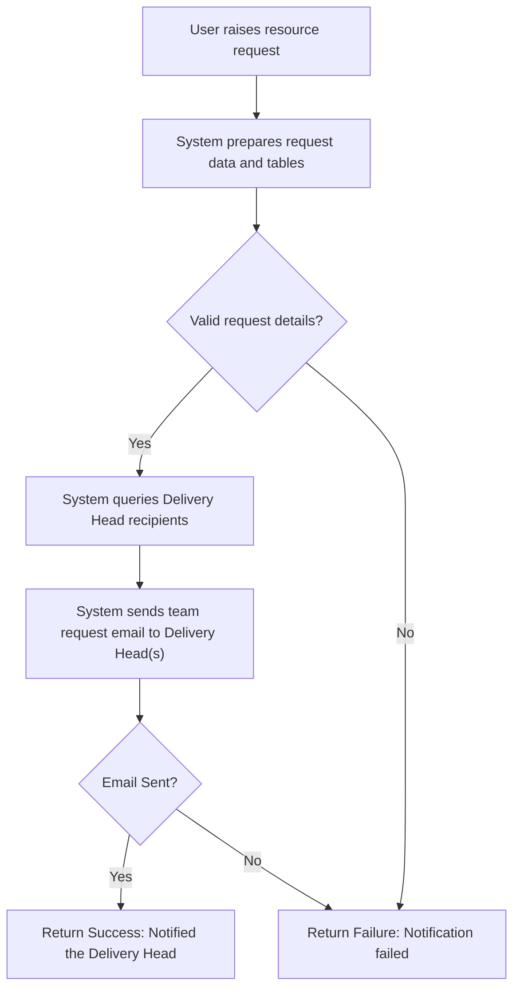
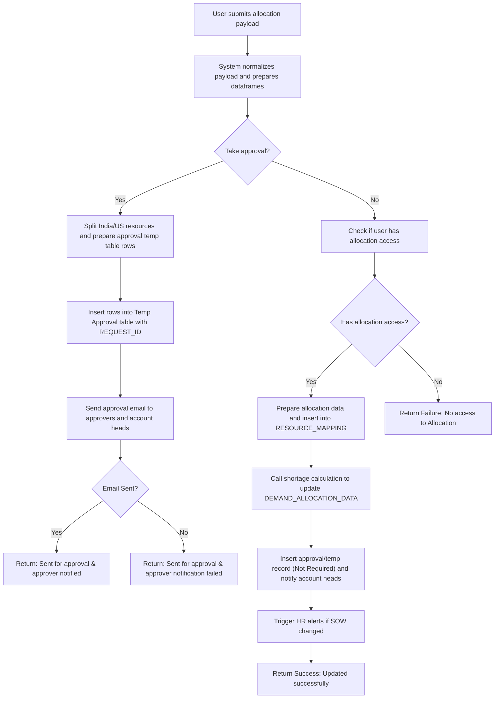
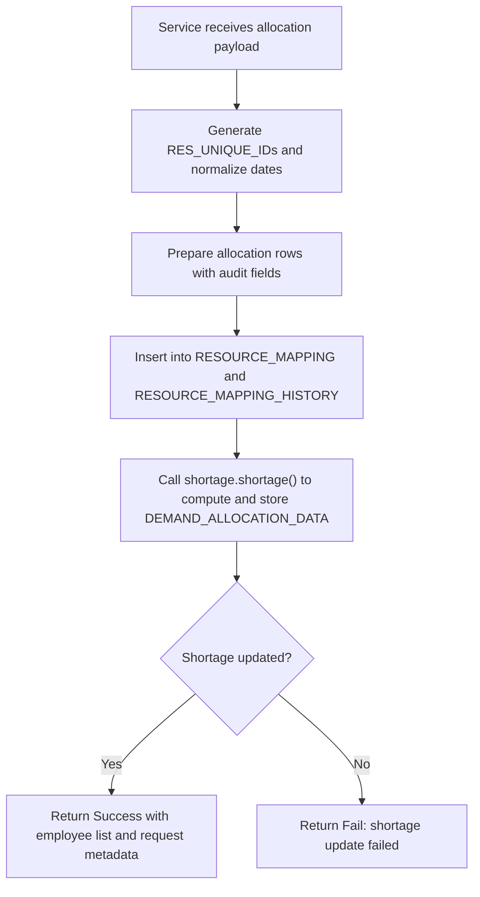
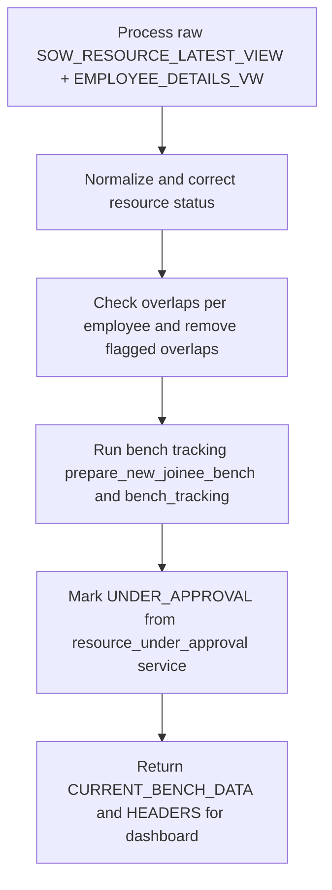

# Resource Allocation Management

## Business Overview

The Resource Allocation Management feature coordinates how people (resources) are requested, allocated to SOWs/projects, reallocated between SOWs, placed on bench, and released. Target users include Delivery Managers, Account/Business Heads, HR/Operations, and Resource Managers. The feature ensures demand is matched to supply across time windows (current and future), tracks bench availability, enforces approvals when required, detects allocation conflicts, and triggers notifications and escalation to relevant stakeholders.

Business objectives:
- Reduce project resource shortages and overlap/conflicts
- Ensure approvals and audit trails for allocation changes
- Maintain bench visibility and enable prompt allocation
- Automate shortage calculation and data updates to cache and reports

## Functional Requirements

**FR-001**: The system shall allow a user to request additional resources for a SOW, providing demand details and current team snapshot.

**FR-002**: The system shall notify Delivery Heads and relevant approvers when a resource request is raised.

**FR-003**: The system shall support allocation creation, extension, and release operations for resources against SOWs.

**FR-004**: The system shall support both immediate allocation (when user has allocation access) and approval-based allocation workflows.

**FR-005**: The system shall compute allocation shortages (current, future, green/prospective) by merging SOW demand and existing allocations and persist shortage data.

**FR-006**: The system shall detect allocation overlaps/conflicts for an employee and mark/remove invalid overlapping allocations before presenting bench/dashboard.

**FR-007**: The system shall prepare and persist audit messages and allocation change records for tracking and reporting.

**FR-008**: The system shall auto-generate unique allocation/resource identifiers and ensure uniqueness across the mapping table.

**FR-009**: The system shall support bench dashboard that shows current and future bench data with availability windows and under-approval flags.

**FR-010**: The system shall update cache and trigger background audit processes asynchronously after successful allocation.

**FR-011**: The system shall merge demand rows to per-resource granularity using billing rate repeat logic (expand rows to res_count) for shortage computation.

**FR-012**: The system shall ensure allocation dates fallback and filling logic for partial date data (group-wise forward/backward fill and actual date fallbacks for investment resource groups).

## User Roles & Permissions

### Roles
- Delivery Head / Business Head
- Account Head / Finance Head
- Resource Manager (Operations)
- HR
- Regular User (Requestor)
- System (RRE automated processes)

### Permissions
- Delivery/Business/BU Heads: receive notifications, approve allocations when configured
- Resource Managers / Operations: create allocations without approval (if in allocation access list)
- Regular Users: raise requests and submit allocations for approval
- HR: receive alerts on SOW manager changes and new SOW allocations

Permission notes:
- allocation_access_roles() queries EMPLOYEE_MASTER for BUSINESS_HEAD and roles (Associate Manager, Senior Director) to determine who can allocate without approval.

## User Workflows & Journeys

### User Workflow: Resource Request (Notify Delivery Head)

#### Workflow Steps:
1. User submits request payload containing user_details, current_team_details, demand_details.
2. System prepares DataFrame views of current team and demand.
3. System identifies Delivery Head recipients via DB query.
4. System calls notifier.Email_alert to send an email with TEAM_REQUEST data.
5. System returns success/failure based on mail response.

#### Business Rules Applied:
- BR-001: Request must include ACCOUNT_ID and SOW_ID
- BR-002: Email recipients are Delivery Heads for the account

### User Workflow: Allocation Create / Submit for Approval

#### Workflow Steps:
1. System reads resource_new_data/resource_old_data and approval flags.
2. If take_approval == YES, resource rows are prepared and inserted into a temporary approval table via approval_data.TempTableInserter.
3. Email notifications are sent to approvers and account heads. Operation ends with pending approval.
4. If no approval needed and user has allocation access, system prepares data (prepare_allocation_data), writes to RESOURCE_MAPPING and triggers shortage recalculation and notifications. HR alerts are triggered if SOW changed.

#### Business Rules Applied:
- BR-003: If APPROVAL_DATA.TAKE_APPROVAL == 'YES', allocations must be written to Temp approval table and wait for approval.
- BR-004: Only users in allocation_access_roles (Business Heads, specified roles) may allocate without approval.

### User Workflow: Allocation New Flow (Service)

#### Workflow Steps:
1. System generates unique IDs for each resource allocation.
2. System prepares rows with CREATED/UPDATED audit fields and inserts into RESOURCE_MAPPING.
3. System updates audit history and shortage table; may insert SOW_MESSAGES if audit messages exist.
4. On success, system returns metadata and triggers asynchronous audit/shell processes and cache updates.

#### Business Rules Applied:
- BR-005: Unique RES_UNIQUE_ID must be generated per allocation and must not collide with existing IDs.
- BR-006: After successful allocation, shortage data must be recalculated and persisted.

### User Workflow: Bench Dashboard & Tracking

#### Workflow Steps:
1. Merge SOW_RESOURCE_LATEST_VIEW with EMPLOYEE_DETAILS_VW to get full employee context.
2. Use correct_resource_status to standardize statuses and remove duplicates.
3. For each employee, check overlaps (sow_data_filter.SowDataFilter.check_overlap), drop invalid overlaps, then run bench tracking.
4. Merge with resource_under_approval.UnderApproval to flag resources under approval.
5. Return formatted bench data with availability windows.

#### Business Rules Applied:
- BR-007: Only allocations with BILLING_STATUS in ['Use Bench','Bench'] appear in bench dashboard.
- BR-008: Overlapping allocations for the same employee are filtered to keep the earliest non-overlapping record.

## Business Rules & Validations

**BR-001**: Requests must include ACCOUNT_ID and SOW_ID.

**BR-002**: Allocations must include SOW_ID, BILLING_STATUS, ALLOCATION_START_DATE, ALLOCATION_END_DATE, EMPLOYEE_ID as key columns.

**BR-003**: If TAKE_APPROVAL == 'YES', allocations are written to a Temp approval table and stay in 'Active' approval flag state until approved.

**BR-004**: Users listed by allocation_access_roles() can allocate without approval; others must use approval flow.

**BR-005**: RES_UNIQUE_ID must be unique across RESOURCE_MAPPING; generator references current IDs to avoid collisions.

**BR-006**: Allocation overlaps per employee must be detected and flagged; overlaps are removed before bench and shortage calculations.

**BR-007**: For shortage calculations, missing demand dates are backfilled group-wise; Investment groups use SOW actual dates as fallback.

**BR-008**: DEMAND_ALLOCATION_DATA is replaced (delete and insert) per calculation run to ensure only current shortage entries exist for the requested SOWs.

**BR-009**: Bench data includes 'UNDER_APPROVAL' flag if the resource is currently in approval temp table for TEAM_ALLOCATION.

**BR-010**: Email notifications are used extensively: TEAM_REQUEST, REQUEST_MAIL for approvals, and alerts to account heads.

## Data Entities (Business View)

### Resource
- RES_UNIQUE_ID (unique allocation id)
- UNIQUE_ID (SOW-level uid)
- SOW_ID
- ACCOUNT_ID
- EMPLOYEE_ID
- EMPLOYEE_NAME
- BILLING_STATUS (Billed/Investment/Bench/Use Bench)
- ALLOCATION_START_DATE
- ALLOCATION_END_DATE
- RESOURCE_GROUP, SUB_RES_GROUP
- CREATED_BY, CREATED_DATE, UPDATED_BY, UPDATED_DATE

### Allocation Request / Temp Approval
- REQUEST_ID
- SUB_ID
- TABLE_DATA (payload rows)
- APPROVAL_FLAG (Active/Not Required)
- APPROVAL_STATUS (Pending/Approved/Rejected)
- APPROVER list
- RAISED_BY, RAISED_ON

### Demand (SOW Billing Rate)
- NUMBER_OF_RESOURCE
- BILLING_RATE_USD
- LOCATION
- RATE_START_DATE, RATE_END_DATE
- RESOURCE_GROUP, SUB_RES_GROUP

### Shortage / Demand Allocation record
- SOW_ID, UNIQUE_ID
- DEMAND_START_DATE, DEMAND_END_DATE
- DEMAND_BILLING_STATUS
- LOCATION
- EMPLOYEE_ID (if allocated), ALLOCATION_START_DATE, ALLOCATION_END_DATE, BILLING_STATUS

### Manager / Account / Approver
- EMPLOYEE_ID, EMAIL_ID, JOB_ROLE, DEPARTMENT

## Integration Points
- notifier.Email_alert - sends request and approval emails
- approval_data.TempTableInserter - stores pending approval rows
- DB via db_launch.query_execute - reads/writes RESOURCE_MAPPING, DEMAND_ALLOCATION_DATA, SOW_MESSAGES
- bench_tracking & benchapp - bench preparation and bench data caching
- update_cache.CallApi - updates shortage and allocation cache pages
- module_executor.FileExecutor - triggers asynchronous shell/audit processes

## User Interface Requirements
- Allocation request form capturing demand details and snapshot of current team
- Approval inbox for approvers with request details and approve/reject action
- Bench dashboard showing available_from/to, skills, UNDER_APPROVAL flag
- Allocation page showing shortage/current allocations with filters by SOW/Account/Date
- Notifications UI linking to request/approval ids

## Non-Functional Requirements
- Performance: Shortage calculation and allocation page should complete within acceptable SLA (configurable cache and async audit helps)
- Security: Only authorized roles can allocate without approval; approval temp tables have access controls
- Availability: Background cache updates should not block allocation endpoint responses

## Business Scenarios & Use Cases

**US-001**: As a Delivery Manager, I want to request 2 additional resources for a SOW so that the project has required capacity.
- Acceptance: Request email sent to Delivery Head, request appears in shortage report.

**US-002**: As an Operations user with allocation access, I want to allocate a resource immediately without approval so the SOW is staffed.
- Acceptance: RESOURCE_MAPPING updated, shortage recalculated, bench updated.

**US-003**: As an Approver, I want to approve a pending allocation request so the resource is assigned to the SOW.
- Acceptance: Temp approval rows move to RESOURCE_MAPPING after approved; notifications sent.

## Error Handling & Edge Cases
- Overlap detection removes overlapping rows before bench calculation (flagging and dropping)
- If email sending fails, allocation requests may still be stored but notifications will be reported as failed
- Missing date fields in demand rows are filled using group-wise forward/backfill and actual SOW dates
- If shortage recalculation fails, allocation insertion is rolled back / report 'Failed to allocate'

## Assumptions & Constraints
- Email service (notifier) is available and reliable
- DB queries return expected columns and views (SOW_RESOURCE_LATEST_VIEW, EMPLOYEE_DETAILS_VW)
- This analysis excludes unrelated services (authentication, reports, notification services) per scope

## Open Questions & Recommendations
- Consider explicit SLA values for allocation, approval and notification timeouts
- Add retries for email notifications and background audit execution logging
- Provide clearer permission configuration for allocation_access_roles via config

---

