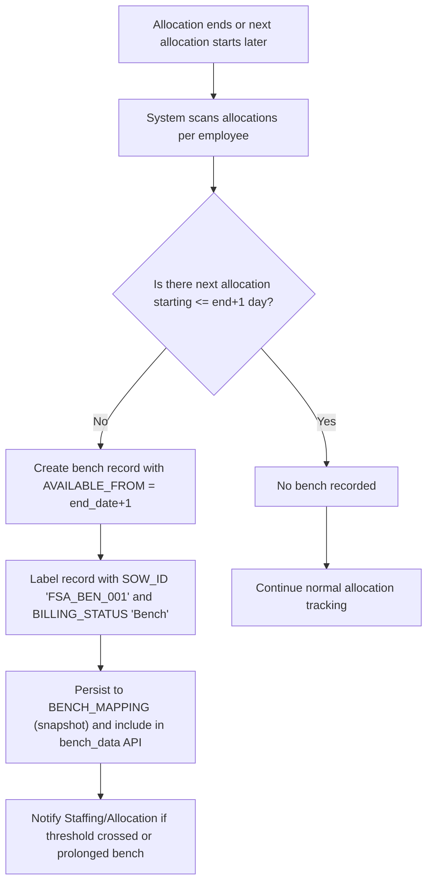
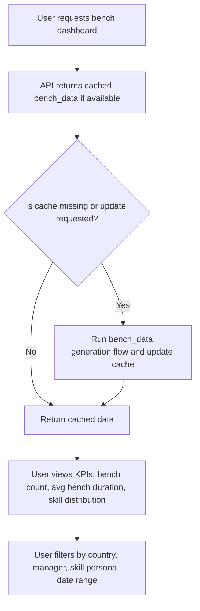
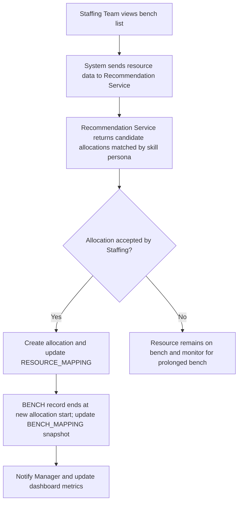

# Bench Management and Bench Reporting

## Business Overview
The bench management feature tracks employees who are not currently allocated to a billable SOW (Statement of Work) and therefore considered on "bench". The business objective is to identify idle resources, measure bench KPIs (duration, count, skill-level distribution), trigger notifications for prolonged bench, and provide actionable data to allocation and recommendation systems to minimize bench time and optimize utilization.

Target users:
- Resource Managers: monitor bench resources and reassign staff
- Delivery Managers / Account Managers: receive bench alerts for their teams and prioritise redeployment
- Staffing / Allocation Team: use bench reports to drive allocations and hiring decisions
- COE / People Ops: track bench trends and skills availability

Value proposition:
- Reduce non-billable bench time and associated cost
- Improve speed-to-allocation via targeted recommendations
- Provide leadership with timely KPIs and alerts for proactive resource planning

Scope:
- Definitions: when a resource is on bench (gap between allocations or unallocated joiners)
- Tracking and reporting of bench periods and current/future bench
- Threshold-based notifications for prolonged bench
- Integration points with allocation and recommendation services

## Functional Requirements
**FR-001**: The system shall identify bench periods for each resource where a gap exists between allocation end date and next allocation start date.

**FR-002**: The system shall treat new joiners with no initial allocation as bench starting from their join date.

**FR-003**: The system shall label bench records with attributes: EMPLOYEE_ID, EMPLOYEE_NAME, JOB_ROLE, COUNTRY, MANAGER_ID, MANAGER_NAME, SKILLS_PERSONA, AVAILABLE_FROM, AVAILABLE_TO, SOW_ID=FSA_BEN_001, BILLING_STATUS="Bench".

**FR-004**: The system shall generate current bench and future bench views, including header metadata for UI display.

**FR-005**: The system shall exclude leadership roles (configurable list) from bench reporting for leadership-specific logic.

**FR-006**: The system shall deduplicate bench entries per resource by AVAILABLE_FROM and AVAILABLE_TO, keeping the most recent UPDATED_DATE.

**FR-007**: The system shall detect overlapping allocations and handle them separately from bench periods; overlapping allocations are not considered bench.

**FR-008**: The system shall populate a BENCH_MAPPING table with current bench snapshot for downstream reporting (insert/update on demand).

**FR-009**: The system shall provide an API endpoint (/bench_data) to retrieve compressed bench data for dashboard consumption.

**FR-010**: The system shall flag resources "UNDER_APPROVAL" if legal/approval date fields indicate pending assignment (default NO when not present).

**FR-011**: The system shall compute "bench_flag" when AVAILABLE_FROM equals ALLOCATION_START_DATE to indicate immediate bench.

**FR-012**: The system shall normalize dates and provide consistent date formats (YYYY-MM-DD for display fields).

**FR-013**: The system shall allow scheduled cache updates for bench data to improve API performance and reduce DB load.

**FR-014**: The system shall provide a utility to convert unallocated resources (no EMPLOYEE_ID mapping) into bench records with default SOW and account values.

**FR-015**: The system shall expose operations to delete bench mapping records for a list of EMPLOYEE_IDs.

**FR-016**: The system shall prioritize allocation recommendations for bench resources based on skill persona and availability (integration requirement).

**FR-017**: The system shall exclude resources that have END_DATE before ALLOCATION_START_DATE (ended employees) from bench reporting.

## User Roles & Permissions
### Resource Manager
- Can view bench dashboard and receive notifications for team resources
- Can trigger redeployment or request recommendations

### Delivery/Account Manager
- Receives organizational bench alerts and can approve redeployments

### Staffing/Allocation Team
- Can view full bench reports and write to BENCH_MAPPING table
- Can configure bench thresholds and alerts (if in admin UI)

### System / Automated Services
- Recommendation Service: reads bench data to propose allocations
- Allocation Service: consumes bench suggestions and updates allocations

Permission Matrix (high-level):
- Read bench dashboards: Resource Manager, Delivery Manager, Staffing Team, COE
- Write BENCH_MAPPING: Staffing Team / Batch job only
- Configure thresholds/leadership roles: Admin only

## User Workflows & Journeys

### User Workflow: Resource moves to bench (allocation gap identified)

#### Workflow Steps:
1. System processes allocation records and employee master data.
2. For each employee, it computes gaps between allocations.
3. If gap > 0 days (no next allocation within end_date+1), a bench period is created starting end_date+1.
4. Bench record is annotated and saved into BENCH_MAPPING when snapshotting.
5. Notifications are triggered based on configured thresholds.

#### Business Rules Applied:
- BR-001: Bench starts the day after allocation end when no immediate next allocation exists.
- BR-002: A joiner with no allocation is benched from JOIN_DATE.
- BR-003: Overlapping allocations are not counted as bench periods.

### User Workflow: Monitoring and reporting bench KPIs

#### Workflow Steps:
1. Dashboard requests bench_data API.
2. API serves cached compressed data or triggers abackend update.
3. User inspects KPIs and filters results.

#### Business Rules Applied:
- BR-004: Cache is used to improve responsiveness; manual update endpoint exists.
- BR-005: Leadership roles are excluded from operational bench KPIs.

### User Workflow: Redeploying a benched resource using recommendations

#### Workflow Steps:
1. Staffing selects resource from bench and requests recommendations.
2. Recommendations propose suitable SOWs/accounts by skill match.
3. If allocation is accepted, allocation service updates resource mapping and bench period ends.
4. Bench snapshot is updated to reflect new allocation; metrics recalc.

#### Business Rules Applied:
- BR-006: Upon allocation, bench period end date aligns to allocation start date - 1 day.
- BR-007: Recommendations prioritize resources with longest bench duration and closest skill match.

## Business Rules & Validations
**BR-001**: Bench start is the next calendar day after allocation end when no next allocation starts immediately.

**BR-002**: New joiners without allocations are considered benched from JOIN_DATE.

**BR-003**: Resources with overlapping allocations (HAS_OVERLAP) are excluded from bench calculations; overlaps are logged separately.

**BR-004**: Leadership roles (configurable) are excluded from bench operational reports.

**BR-005**: Bench records with END_DATE earlier than ALLOCATION_START_DATE are invalid and excluded.

**BR-006**: Bench periods are deduplicated by EMPLOYEE_ID + AVAILABLE_FROM, keeping latest UPDATED_DATE.

**BR-007**: Bench records use SOW_ID 'FSA_BEN_001' and ACCOUNT_ID 'FSA' as canonical bench identifiers.

**BR-008**: Default BILLING_STATUS for bench records is 'Bench' (or 'Use Bench' per upstream filters).

**BR-009**: Date fields must be normalized to YYYY-MM-DD; missing dates use empty string or configured sentinel.

**BR-010**: Bench mapping snapshot can be refreshed by passing employee list or full update; delete operation is supported.

## Data Entities (Business View)

### BenchResource
- EmployeeID (EMPLOYEE_ID)
- Name (EMPLOYEE_NAME)
- JobRole (JOB_ROLE)
- Country
- ManagerID
- ManagerName
- JoinDate
- EndDate
- SkillsPersona
- SkillLevel/SkillDate
- BillingStatus
- CurrentSow (SOW_NAME)

### BenchPeriod
- BenchPeriodID (derived composite: EMPLOYEE_ID + AVAILABLE_FROM)
- AvailableFrom (AVAILABLE_FROM)
- AvailableTo (AVAILABLE_TO)
- Status (BILLING_STATUS)
- SOW_ID (FSA_BEN_001)
- AccountID (FSA)
- UpdatedDate
- UnderApproval (UNDER_APPROVAL)

### Skill
- SkillsPersona
- SkillsLevel/List
- SkillDate

### Manager
- ManagerID
- ManagerName
- LeadershipFlag (determined by config)

### Relationships
- BenchResource has 0..* BenchPeriod
- BenchPeriod references Skill and Manager

## Integration Points
- Allocation Service: Provides RESOURCE_MAPPING and allocation dates; consumes recommendations to update allocations.
- Recommendation Service: Receives bench resources to propose SOW matches based on skills and availability.
- DB (RRE DB): BENCH_MAPPING table for snapshot persistence and EMPLOYEE_MASTER/EMPLOYEE_SKILLS for source data.
- Cache (Redis): Stores compressed bench_data for API performance.
- Notification System: Sends emails/alerts when thresholds are crossed (inferred from bench_data_mail_sender and config).

## User Interface Requirements
- Bench Dashboard: list of current bench resources with filters (country, manager, skill persona, date range) and key KPIs.
- Bench Period Details: modal/panel showing bench start/end, skill match, last update, and recommended SOWs.
- Admin UI: configure leadership roles, bench thresholds (days), and schedule cache refresh.
- Export: snapshot export to BENCH_MAPPING table for reporting.

## Non-Functional Requirements
- NFR-001: Bench API shall respond within 2s when served from cache for typical payloads.
- NFR-002: Bench snapshot jobs shall run during off-peak hours and complete within scheduled window.
- NFR-003: Data retention for bench snapshots follows DB retention policy (not defined in code).
- NFR-004: Access to bench write operations restricted to batch jobs and staffing team service accounts.

## Business Scenarios & Use Cases
**US-001**: As a Resource Manager, I want to see which of my reports are on bench and for how long, so that I can prioritize redeployment.
- Acceptance Criteria: Dashboard shows EMPLOYEE_ID, AVAILABLE_FROM, AVAILABLE_TO, SKILLS_PERSONA, and manager name; filterable by date.

**US-002**: As a Staffing team member, I want the system to automatically create bench records for new joiners without allocation, so I can proactively find projects.
- Acceptance Criteria: New joiners appear on bench from JOIN_DATE with SOW_ID 'FSA_BEN_001'.

**US-003**: As a Delivery Manager, I want to receive alerts when team bench count exceeds a threshold for 7+ days, so I can take corrective actions.
- Acceptance Criteria: Notification is sent when threshold crossed; bench report highlights prolonged benchers.

## Error Handling & Edge Cases
- If allocation dates are missing or malformed, record is skipped and logged for manual review.
- Overlapping allocations generate a separate overlap record and are not turned into bench periods.
- Resources with END_DATE before ALLOCATION_START_DATE are excluded from bench reports.
- Large data loads should fallback to batch snapshot and cache to avoid API timeouts.

## Assumptions & Constraints
- Assumes allocation service provides accurate allocation start/end dates via RESOURCE_MAPPING.
- Recommendation and allocation updates are out of scope but consume bench snapshots.
- Notification sending logic is external (bench_data_mail_sender exists in repo); thresholds are configurable.
- Leadership roles configured in bench_data.yaml are not included in operational bench reports.

## Open Questions & Recommendations
- Recommendation: Add explicit bench duration KPI (avg, median, 90th percentile) and SLA targets.
- Open: How long should bench snapshots be retained in BENCH_MAPPING (DB retention policy)?
- Recommendation: Expose threshold configuration in Admin UI and allow manager-specific thresholds.

