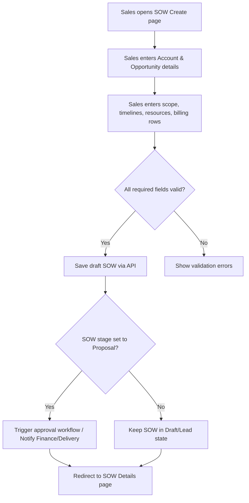
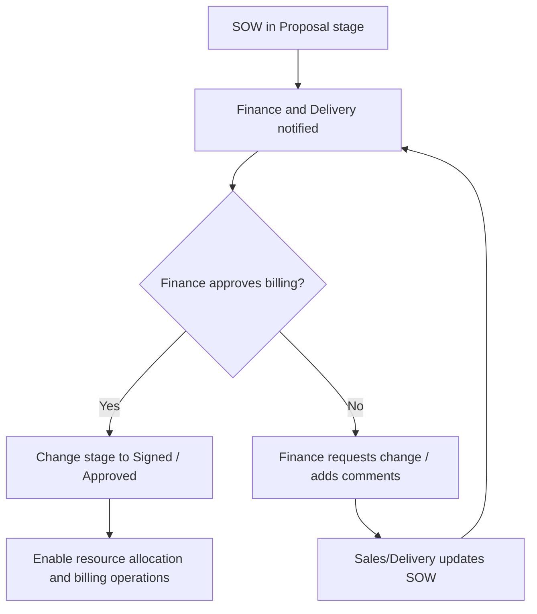
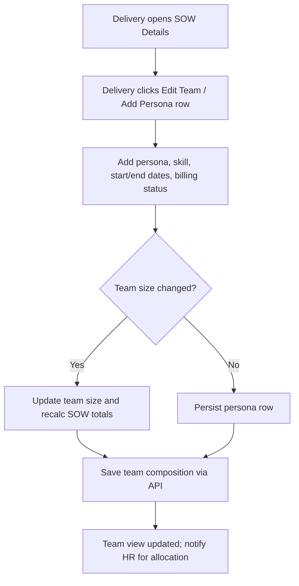
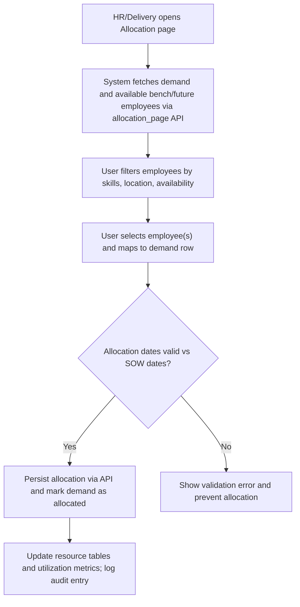

# SOW Lifecycle and Allocation

## Business Overview
The SOW (Statement of Work) module manages the lifecycle of client engagements from creation through approval, resource assignment, allocation, and closure. Primary users include Sales (create & propose SOW), Delivery Managers (plan resources and manage delivery), Finance (validate pricing & billing), and HR/Resource Managers (allocate employees and manage bench). The module captures scope, timelines, billing and financials, team composition, and monthly allocation/ utilization. It integrates with allocation/bench services, billing/finance systems and CRM/opportunity data.

### Objectives
- Allow Sales to create and propose SOWs tied to Accounts and Opportunities
- Capture SOW-level finance details (SOW amount, billing model, billing rates and persona-level rates)
- Support approval and state transitions (Lead, Qualified, Proposal, Signed, Renewal, Lost)
- Enable Delivery & HR to compose SOW teams, assign roles and schedule allocations
- Track resource allocation against demand and calculate utilization and monthly breakups
- Maintain audit trails and comments for collaboration and compliance

## Target Personas
- Sales: create & propose SOWs, provide opportunity details and rough estimates
- Delivery Manager: refine SOW scope, create team composition, request allocations, accept allocations
- Finance: validate billing model, verify billing rates, approve financials and changes
- HR / Resource Manager: view demand, source employees from bench/pool and allocate resources
- Admin: manage master data, provide access levels

## Scope of this Document
Covers SOW creation, editing, approval, team composition, and employee allocation workflows as implemented in the RRE-UI SOW pages and JS handlers.

---

## Functional Requirements
**FR-001**: The system shall allow Sales to create a new SOW with fields: Account, Opportunity, SOW Name, SOW Type, Pricing Plan, Legal Start/End, Billing Start/End, Actual Start/End, Number of resources (US/IND), and SOW Amount.

**FR-002**: The system shall present SOW stages (Lead, Qualified, Proposal, Signed, Renewal, Lost) and allow stage transitions with appropriate permission checks.

**FR-003**: The system shall capture persona-level billing rows (location, persona, skills, billing rate USD/INR, number of resources, billing status) as SOW Line Items.

**FR-004**: The system shall calculate and display projected and actual SOW amounts and updates on billing rate/amount change (monthly breakup and total SOW amount).

**FR-005**: The system shall maintain an audit log and comment feed for each SOW; users may post comments and view sorted notes.

**FR-006**: The system shall drive a Resource Allocation tab when SOW.ALLOCATION_FLAG == 'YES' to allow Delivery/HR to allocate employees to SOW roles.

**FR-007**: The system shall allow creation and editing of SOW teams (team size, persona, start/end dates, skills) and save team composition to SOW.

**FR-008**: The system shall provide an allocation screen that fetches available employees (bench/future) filtered by date availability and matches by skills/persona.

**FR-009**: The system shall enable allocating multiple employees to demand rows and set allocation start/end dates and billing status.

**FR-010**: The system shall enforce input validations for dates (start < end), numeric fields (positive integers), required fields for SOW creation, and unique constraints where applicable.

**FR-011**: The system shall hide or show UI sections (e.g., Resource Allocation tab) dynamically based on SOW flags and access permissions.

**FR-012**: The system shall fetch SOW details and related master data via backend API endpoints (e.g., sow_profile_details_figma, allocation_page, view_sow_comments) and render them for users.

**FR-013**: The system shall only enable edit/delete actions on allocation rows when the logged-in user has the page-level access (edit/delete).

**FR-014**: The system shall support creation of new Buying Center and NPS Stakeholder entries while editing SOW buying center details.

**FR-015**: The system shall expose clear UI affordances to renew a SOW (convert to Renewal pipeline) and copy/renew billing/persona rows.

**FR-016**: The system shall provide role-aware buttons and actions (e.g., create allocation button only visible to permitted users) and persist changes through API calls.

---

## User Roles & Permissions
- Sales
  - Create SOW drafts and fill opportunity fields
  - Propose SOW and change stage up to Proposal
  - Add comments
- Delivery Manager
  - Edit SOW details (timeline, team size)
  - Create SOW teams and request allocations
  - Approve/accept allocations where applicable
- Finance
  - Review billing rows and change billing status (Billed, Investment, Bench)
  - Approve financial values and billing rates
- HR / Resource Manager
  - Search bench and available employees
  - Allocate employees to SOW demand
  - Update allocation start/end dates
- Admin
  - Manage page-level access and show/hide actions

Permission Matrix (high level):
- View: All authenticated personas can view SOWs
- Edit: Sales/Delivery/Finance depending on page-level access controls
- Allocate/Delete allocation: HR/Delivery with edit/delete access
- Approve Finance-related changes: Finance role only

---

## User Workflows & Journeys

### User Workflow: SOW Creation

#### Workflow Steps:
1. Sales navigates to the SOW creation screen and selects Account/Opportunity.
2. Sales captures SOW name, type, pricing plan, legal and billing dates, number of resources (US/IND), and persona-level billing rows.
3. System validates required fields, date rules, and numeric constraints.
4. On success, save SOW as Draft/Proposal; optionally trigger notifications to Finance and Delivery.
5. User is redirected to the SOW details view.

#### Business Rules Applied:
- BR-DR-001: Legal Start/End and Billing Start/End must be valid dates; Start <= End.
- BR-DR-002: At least one persona row must exist if resource demand > 0.
- BR-DR-003: Billing model selection (Fixed Price vs Time & Material) hides/shows rate columns.

### User Workflow: SOW Approval & Stage Transition

#### Workflow Steps:
1. When SOW reaches Proposal and requires finance approval, Finance reviews billing rows and rates.
2. Finance can approve (stage moves to Signed) or request changes via comments.
3. If approved, allocation flag and billing operations are enabled for Delivery/HR.

#### Business Rules Applied:
- BR-APR-001: Only Finance can change billing status to Billed/Investment/Bench.
- BR-APR-002: SOW cannot move to Signed unless required finance approvals are present (audit/log entry).
- BR-APR-003: Comments and audit logs must record approver identity and timestamp.

### User Workflow: SOW Team Assignment (Compose Team)

#### Workflow Steps:
1. Delivery edits team composition via Billing Row UI or Team Allocation page.
2. Team rows include persona, location, skills, billing rate, number of resources and dates.
3. System recalculates SOW projected/actual amounts and adjusts monthly breakup.
4. Team composition saved and visible to HR for allocation.

#### Business Rules Applied:
- BR-TEAM-001: Persona row dates must be within SOW legal/actual start-end windows.
- BR-TEAM-002: If Billing status is "Fixed Price", per-person billing rate columns are hidden.
- BR-TEAM-003: When team size increases, system must create corresponding persona rows (or alert user).

### User Workflow: Employee Allocation to SOW Demand

#### Workflow Steps:
1. Allocation page loads SOW demand and available employees from bench service.
2. User filters and selects candidate employees whose availability intersects the SOW demand window.
3. Allocation is validated against SOW dates and business rules, then saved.
4. Post-allocation, the UI updates allocation indicators, monthly breakups and enables Save/Update.

#### Business Rules Applied:
- BR-ALLOC-001: Employee availability must overlap the allocation window (partial overlap allowed if business permits).
- BR-ALLOC-002: Allocation cannot exceed demand headcount for that persona/location.
- BR-ALLOC-003: Only users with allocation edit/delete permissions can change or remove allocations.
- BR-ALLOC-004: Allocations create audit entries with user, timestamps and previous vs new state.

---

## Business Rules & Validations
**BR-001**: Date validations — Legal Start/End, Billing Start/End, Actual Start/End enforce Start <= End and fall within acceptable ranges.

**BR-002**: Numeric validations — resource counts, billing rates, SOW amounts must be non-negative integers; billing rate decimals permitted for currency.

**BR-003**: Billing model toggles — selecting Fixed Price hides billing rate columns and disables per-person billing edits.

**BR-004**: Allocation flag — resource allocation UI (Monthly Breakup/Resource Allocation) is only visible when SOW.ALLOCATION_FLAG === 'YES'.

**BR-005**: Access control — edit/delete buttons for allocation rows depend on page-level access derived from user-role and page permissions.

**BR-006**: Persona and skill mapping — a persona row should have persona and skills assigned; for "Others" persona user must specify text input.

**BR-007**: Unique SOW identifier — SOWs are referenced by (UNIQUE_ID, SOW_ID) combination for URLs and API calls.

**BR-008**: Comments and audit — all comments and state changes must be persisted with commenter, timestamp, and stored in SOW notes/audit log.

**BR-009**: Billing defaults — when an account has default billing rates, persona rows default to those US/IND rates automatically.

**BR-010**: Allocation validation — employee allocation start/end must be within or overlapping SOW actual start/end and should not double-book employees beyond their available windows.

---

## Data Entities (Business View)

### SOW
- SOW_ID (business id)
- UNIQUE_ID (GUID used in URLs)
- SOW_NAME
- ACCOUNT_ID, ACCOUNT_NAME
- OPPORTUNITY_ID, OPPORTUNITY_NAME
- SOW_TYPE (Net New, Current, etc.)
- SOW_STAGE (Lead, Qualified, Proposal, Signed, Renewal, Lost)
- PRICING_PLAN (Fixed Price, T&M, etc.)
- LEGAL_START_DATE, LEGAL_END_DATE
- BILLING_START_DATE, BILLING_END_DATE
- ACTUAL_START_DATE, ACTUAL_END_DATE
- NUMBER_OF_RESOURCE_US, NUMBER_OF_RESOURCE_IND, TOTAL_NUMBER_OF_RESOURCE
- SOW_AMOUNT, PROJ_AMOUNT, ACTUAL_AMOUNT
- ALLOCATION_FLAG (YES/NO)
- CREATED_USER, CREATED_USER_ID, CREATED_DATE
- AUDIT_LOG (list)
- NOTES / ENGAGEMENT_NOTES

### SOW Line Item (Persona Row)
- LINE_ID
- SOW_ID
- LOCATION (US/INDIA)
- PERSONA (e.g., Analyst, Developer, Others)
- SKILLS (list)
- NUMBER_OF_RESOURCE
- BILLING_RATE_USD, BILLING_RATE_INR
- BILLING_STATUS (Billed, Investment, Bench)
- START_DATE, END_DATE
- AMOUNT (calculated)

### SOW Team Member / Allocation
- ALLOCATION_ID
- SOW_ID
- EMPLOYEE_ID, EMPLOYEE_NAME
- ROLE / PERSONA
- SKILL_SET
- ALLOCATION_START_DATE, ALLOCATION_END_DATE
- BILLING_STATUS
- RESOURCE_GROUP, SUB_RESOURCE_GROUP
- UTILIZATION_PERCENT (if calculated monthly)

### Supporting Entities
- Account (ACCOUNT_ID, DEFAULT_BILL_RATES, BUYING_CENTRE)
- Buying Center / NPS Stakeholder (id, name, designation)
- Bench / Employee Record (EMPLOYEE_ID, AVAILABLE_FROM, AVAILABLE_TO, SKILLS, LOCATION, BILLING_FLAGS)
- Audit Log Entry (USER, ACTION, OLD_VALUE, NEW_VALUE, TIMESTAMP)

Data lifecycle: SOW drafts retained; unverified drafts may be cleaned (business decision); audit logs retained for compliance.

---

## Integration Points & APIs (as implied)
- SOW profile APIs: /sow_profile_details_figma — fetch detailed SOW data, notes, audit log
- Comments: /capture_sow_comments, /view_sow_comments — persist and view comments
- Allocation service: allocation_page (ported as internal microservice) — returns demand, bench and allocation suggestions
- Bench data API: bench_data — bench employees & future availability
- Master data APIs: skill config, billing defaults, opportunity owners — used to populate dropdowns
- CRM/Opportunity: SOW references opportunity and owner data; changes may need to reflect back to CRM
- Billing/Finance systems: exported billing rows and rates used for invoicing
- Project systems / Timesheets: allocation and utilization information used by downstream time capture and invoicing systems

---

## User Interface Requirements
- SOW form screens: Creation, Edit, Details — capture and display all data fields listed
- Tabs: Overview, Monthly Breakup / Resource Allocation, Audit & Comments, Team
- Billing row UI: Add/remove persona rows, select skills and set rates
- Allocation UI: responsive table that shows demand and available supply; multi-select for employees
- Access-aware controls: buttons and columns shown/hidden according to user permissions
- Responsive: resource allocation screens should be usable on tablet/desktop; tables scroll horizontally for mobile

---

## Non-Functional Requirements
- NFR-001: API responses for SOW details should be returned within 2 seconds under normal load
- NFR-002: The allocation page data fetch may be heavier; aim for <5 seconds for allocation_page response
- NFR-003: All billing/financial data changes must be logged in audit trail (immutable log entries)
- NFR-004: Access control must be enforced on UI and backend APIs
- NFR-005: UI must sanitize and escape comments to prevent XSS (placeholders are used in code to store newline markers)

---

## Business Scenarios & Use Cases
**US-001**: As a Sales user, I want to create a SOW for an opportunity so that the delivery team can prepare resource plans.
- Acceptance Criteria: SOW form saves draft, required fields validated, SOW appears in SOW listing.

**US-002**: As Finance, I want to review and approve billing rates before a SOW is marked Signed so that invoicing is accurate.
- Acceptance Criteria: Finance can view billing rows, change billing status and approval is recorded in audit log; SOW stage changes only after approval.

**US-003**: As Delivery Manager, I want to add persona rows and team size so HR can allocate employees.
- Acceptance Criteria: Persona rows saved, SOW totals recalculated, allocation flag available when demand > 0.

**US-004**: As HR, I want to allocate bench employees to SOW demand within the SOW dates so that utilization is tracked.
- Acceptance Criteria: Employee availability checked, allocations saved, utilization metrics updated.

**US-005**: As Admin, I want page-level access control so only authorized users can edit allocations and billing.
- Acceptance Criteria: Edit/Delete buttons visible only to users with appropriate access; backend APIs enforce permissions.

---

## Error Handling & Edge Cases
- Invalid date ranges: UI must prevent saving and display explicit error messages.
- Missing rates: If billing rate is empty but required, warn user and prevent stage change to Signed.
- Allocation conflicts: If employee is already allocated outside allowed overlap rules, show conflict and prevent double allocation.
- API failures: show toast/toastr error messages and instruct user to retry; partial saves should be avoided.

---

## Assumptions & Constraints
- Assumes backend APIs specified (sow_profile_details_figma, allocation_page, bench_data) are available and return documented JSON structures.
- Assumes SOW unique identifiers are stable and used in URLs for bookmarking and direct access.
- Assumes centralized bench data reflects current employee availability.
- Timezones: dates returned by APIs may be UTC and transformed on-client; UI displays local formatted times.
- No social login flows or external identity mapping referenced in explored code.

---

## Open Questions & Recommendations
- Recommendation: Enforce explicit approval flag or digital signature step for Finance approval before Signed stage.
- Recommendation: Add utilization KPI dashboard to measure allocation effectiveness across SOWs.
- Open: Clarify retention policy for draft/unverified SOWs and auto-deletion rules.

---

## References (source files used)
- sow.html
- sowCreate.html (UI wiring)
- sowCreation.html (exists in scope)
- sowDetails.html
- sowProfileDetails.html
- sowTeamAllocation.html
- allocationSOW.html
- allocationSOWTeam.html
- allocationTeam.html
- js/sow.js
- js/sowCreate.js
- js/sowDetails.js
- js/sowEdit.js
- js/sowProfile.js
- js/sowTeamAllocation.js

