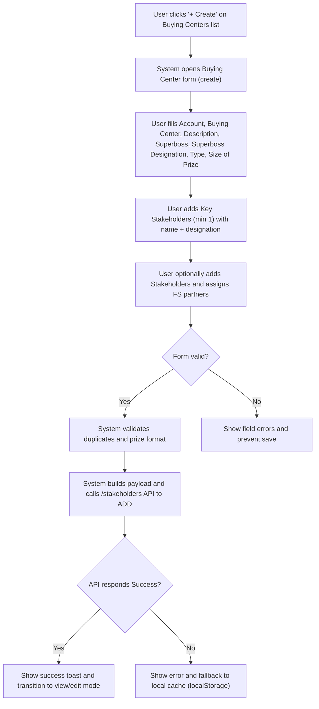
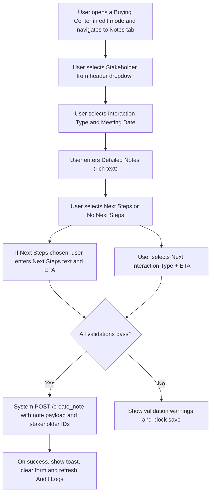
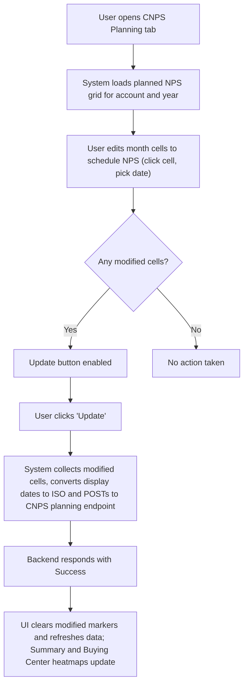

# Buying Center & NPS: Business Requirements

## Business Overview
Factspan's Buying Center feature models groups of decision-makers (Buying Centers) and the stakeholders within them for client accounts. It enables Account Managers, Sales Leaders, Customer Success and Executive Sponsors to capture the structure of buying units, assign owners (Factspan FS partners), log engagements (meetings, calls, notes), track planned and completed touchpoints, and run CNPS (customer NPS) planning, capture and summary workflows.

Objectives:
- Provide a canonical place to model the Buying Center for an account (Superboss, Key Stakeholders, Stakeholders, Key Directs).
- Capture meetings and interactions with stakeholder-level context (type, date, notes, next steps, next interaction).
- Maintain audit history of changes for compliance and traceability.
- Plan and capture NPS surveys, collect responses and summarise NPS by stakeholder, buying center and account.
- Enable segmentation (Net New / Current / Current - New) and revenue (Size of Prize) tagging to prioritize actions.

Scope:
- Buying Center creation, edit, and list views
- Stakeholders and Key Stakeholders management and FS partner assignments
- Engagement (notes) capture and audit log
- NPS planning, collection and summaries (planning, summary, buying-center heatmaps)

Target Personas:
- Account Manager
- Sales Leader
- Customer Success Manager
- Executive Sponsor

## Functional Requirements

**FR-001**: The system shall allow users to create a Buying Center with fields: Account, Buying Center Name, Description, Super Boss (name + designation), Type (Net New / Current / Current - New), Size of Prize (USD), and Key Stakeholders.

**FR-002**: The system shall validate required fields on save: Account, Buying Center Name, Description, Super Boss, Super Boss Designation, at least one Key Stakeholder (with name and designation), and Type.

**FR-003**: The system shall prevent creating duplicate Buying Center names (case-insensitive) across the account and against existing buying centers fetched from API.

**FR-004**: The system shall allow adding, editing and soft-deleting Stakeholders; deleted stakeholders are preserved as marked-for-deletion and require Save to persist.

**FR-005**: The system shall support FS Partner assignments (Growth / Delivery / Client / SME-Tech) at stakeholder level and allow assigning employees from employee lists returned by API.

**FR-006**: The system shall require mapping SOWs when deleting a stakeholder/key stakeholder that has associated SoWs — show a remap modal and store remapping decisions as part of the deleted-entities payload.

**FR-007**: The system shall support a Notes flow per Buying Center where users can log an engagement with: Interaction Type (In Person / Phone / Video / Slack / Text), Meeting Date, Detailed Notes (rich text), Next Steps (rich text + ETA) or No Next Steps, Next Interaction (type + ETA).

**FR-008**: The system shall validate Notes: stakeholder selection, meeting date, detailed notes, next steps text and ETA (if next steps enabled), and next interaction type and ETA.

**FR-009**: The system shall send Notes to API (/create_note) including resolved stakeholder IDs and buying center/account context.

**FR-010**: The system shall show an Audit timeline and Notes timeline; Notes are persisted separately and included in audit logs fetched from /get_audit_by_entity.

**FR-011**: The system shall save Buying Center changes via stakeholders endpoint (/stakeholders) with a payload that contains bc_master, superbosses, key_stakeholders, stakeholders, key_directs, fs_partners and deleted_entities for server-side processing.

**FR-012**: The system shall support CNPS planning: a calendar-based planning grid where each SoW/month cell can be set to Planned or Cleared; changes are tracked visually as modified and can be pushed via Update.

**FR-013**: The system shall render NPS Summary and Buying Center heatmaps showing planned/received NPS counts, avg NPS ratings, recent NPS indicators and allow filtering by account, sow, stakeholder and year.

**FR-014**: The system shall compute aggregates for NPS (planned, received, average rating, % received) and monthly averages for display in Summary and Planning views.

**FR-015**: The system shall protect read-only / view modes when a Buying Center is opened from external flows (from=engagement) and support transitioning between read-only and edit modes.

**FR-016**: The system shall persist temporary UI state (active tab, view, edit id, read-only) in sessionStorage and restore on reload.

**FR-017**: The system shall support inline validations (e.g., prize format, duplicate BC name) and display field-level errors and toast messages summarizing errors.

## User Roles & Permissions

- Account Manager
  - Create/Edit Buying Center, manage stakeholders, log engagements (Notes), plan/submit NPS in planning where allowed by role.
- Sales Leader
  - View and edit Buying Centers for accounts they have access to; approve planning and review summary dashboards.
- Customer Success
  - View and manage stakeholders and log engagements; run NPS surveys and view summary.
- Executive Sponsor
  - Read-only access to view buying center and NPS summaries (unless explicitly given edit rights).
- System Admin
  - Full access to manage lists, employees and override read-only protections.

Access control rules (implied):
- Page access is gated by access-page-list retrieved from localStorage with role checks; users without appropriate access are redirected to home.
- Editing of NPS planning dates restricted to specific departments/roles (VP or admin-level checks present in npsPlanning.js).

## User Workflows & Journeys

### User Workflow: Buying Center Setup

Workflow Steps:
1. User clicks Create and fills required fields.
2. User must add at least one Key Stakeholder with designation.
3. System performs client-side validations (required fields, prize format, duplicate name).
4. On save, system composes bc_master, superbosses, key_stakeholders, stakeholders and other arrays and sends to /stakeholders.
5. If deletion of stakeholders is involved and SOWs are linked, the system opens a remap modal and records sow_migrations in deleted_entities payload.
6. On success, UI transitions to view/edit (read-only) and persists state in sessionStorage.

Business Rules Applied:
- BR-001: Buying Center name must be unique (case-insensitive) across existing buying centers and unsaved local items.
- BR-002: At least one Key Stakeholder must exist; cannot delete last Key Stakeholder.
- BR-003: Prize fields accept numeric values with optional commas and decimals; empty prize is allowed.
- BR-004: Deletions of existing entities must record SOW remapping if SOWs exist.

### User Workflow: Engagement (Note) Logging

Workflow Steps:
1. Select stakeholder (Superboss/Key Stakeholder/Stakeholder) via header dropdown.
2. Choose interaction type and meeting date.
3. Enter detailed notes (Quill rich text) and optionally next steps and next interaction.
4. Save triggers validations and then a POST to /create_note.
5. On success, the Notes area is cleared and Audit Logs refreshed.

Business Rules Applied:
- BR-005: A stakeholder selection, meeting date, and detailed notes are mandatory.
- BR-006: If Next Steps are enabled, both Next Steps text and ETA are required.
- BR-007: Next Interaction type and ETA are always mandatory for notes.
- BR-008: Notes are saved with resolved stakeholder IDs; getStakeholderIdByName uses local state to resolve ID fallbacks.

### User Workflow: NPS Cycle (Plan → Collect → Summarise)

Workflow Steps:
1. Planning view shows a 12-month grid; each SoW row contains month cells (planned/placeholder/received).
2. Users with appropriate roles can edit cells; changes are visually flagged as modified.
3. The Update button collects modified dates, converts to ISO, and sends to the CNPS planning endpoint.
4. On success, UI clears modified indicators and refreshes.

Business Rules Applied:
- BR-009: Date editing permission limited to VP/admin or specific roles (see npsPlanning.js canEditDates).
- BR-010: Only modified cells are included in the submission payload and displayed as modified in the UI until update.

## Business Rules & Validations

**BR-001**: Buying Center name must be unique (case-insensitive) across both existing (API-provided) buying centers and unsaved local items.

**BR-002**: Buying Center must have at least one Key Stakeholder with name and designation; user cannot delete the last Key Stakeholder.

**BR-003**: Required fields for Buying Center: Account, Buying Center name, Description, Superboss, Superboss Designation, Type.

**BR-004**: Stakeholder rows may be soft-deleted (flagged) and remain in payload; newly added rows are removed locally if deleted before saving.

**BR-005**: Prize fields accept numbers with optional commas and decimals; validated by PRIZE_REGEX (e.g., 257,666,767).

**BR-006**: If a stakeholder/key stakeholder has linked SoWs, deletion must trigger SOW remapping flow; remapping choices are recorded in deleted_entities.sow_migrations.

**BR-007**: Notes must include stakeholder, meeting date and detailed notes; Next Steps text+ETA required if Next Steps enabled; Next Interaction type+ETA always required.

**BR-008**: NPS planning edits are permitted only to authorized roles (VP or admin by department/user-role check).

**BR-009**: Audit and Notes retrieval prefer cached logs but fetch via /get_audit_by_entity when needed; both notes and audit events are displayed differently in UI.

**BR-010**: When building payloads for edits, the system calculates field_changes arrays for bc_master, superbosses, key_stakeholders, stakeholders and fs_partners to support server-side change tracking.

## Data Entities (Business View)

### Buying Center
- id (UI stable id = bcName or generated crypto id)
- bcId (backend BC ID)
- account (account name)
- bcName
- description
- superboss (name)
- superbossDesignation
- superbossId
- bcType (Net New / Current / Current - New)
- sop1y (size of prize number)
- bcActiveFlag
- createdAt
- keyStakeholders: [ { id, name, designation, flag, isNew } ]
- stakeholders: [ Stakeholder ]
- FS partner assignments (growth/client/delivery/tech)

### Contact / Stakeholder
- stakeholderId
- name
- designation
- status (Net New / Current / Current - New)
- stakeholderType (Decision Maker / Influencer)
- keyStakeholder (parent name)
- keyStakeholderId
- keyDirects (string) & list
- level (N / N-1)
- prize (USD)
- comments
- isDeleted (soft deletion flag)
- fsGrowthPartner, fsDeliveryPartner, fsClientPartner, fsSmePartnerTech

### Engagement / Note
- noteId (backend)
- created_by (user id)
- actor_display_name
- detail_text (rich text)
- meeting_date (ISO)
- interaction_type (In Person / Phone / Video / Slack / Text)
- relevant_stakeholders (name)
- bc_id / bc_name / account_id / account_name
- next_steps_mode (ACTION_ITEM / NONE)
- next_steps_text
- next_steps_estimated_date (ISO)
- next_interaction_type
- next_interaction_estimated_date (ISO)

### NPS Survey / Planning
- survey_plan_id
- sow_id
- stakeholder_id
- month_key (YYYY-MM)
- planned_date (ISO) or placeholder
- status (planned / received / placeholder)
- rating (if received)
- last_nps_received_days
- strength / improvement notes

### NPS Response / Summary
- stakeholder (id/name)
- sow (id/name)
- month
- rating
- received_date
- notes

## Integration Points

- API endpoints used (implied):
  - /get_buying_centers (POST) — fetch Buying Center data by account
  - /stakeholders (POST) — save Buying Center, Key Stakeholders, Stakeholders, FS partner assignments, key direct mappings, and deleted_entities
  - /create_note (POST) — persist engagement note
  - /get_audit_by_entity (POST) — fetch audit logs and notes history
  - /get_sow_by_entity (POST) — check SoWs linked to an entity (for deletion remapping)
  - /cnps/planning, /cnps/summary-v2, /cnps/buying-center — endpoints for NPS data and buying center heatmaps

- CRM integration: The UI maps stakeholders and SoWs — system expects to receive account and SoW identifiers and will map/deconflict in payloads. (Implied integration: backend syncs with CRM for SoW ownership.)

- Survey tool integration: NPS responses are represented in endpoints used by planning/summary; backend likely integrates with survey delivery/collection systems.

## User Interface Requirements

Key screens:
- Buying Center Directory (list with sortable columns: Buying Center, Type, Description, Superboss, Key Stakeholder, Stakeholder, Size of Prize, Created)
- Buying Center Form (Overview / Stakeholders / FS Members / Notes / Audit Logs tabs)
- Buying Center Engagement iframe inclusion from Engagement page (data synced via postMessage)
- NPS Planning (grid), NPS Summary (hierarchical summary), NPS Buying Center heatmaps (account → BC → members table)

UI Elements & Interactions:
- Inline validations with error messages shown next to fields and toast aggregated error messages.
- Soft-delete pattern for stakeholders and key stakeholders; deletion requires Save to persist.
- Remap modal for deletion of entities linked to SoWs; supports mapping each SoW to a replacement stakeholder and optionally applying selection to all SOWs.
- Rich text editor (Quill) for notes and next steps; date pickers for meeting and ETA fields.
- Role-driven UI element visibility (e.g., FS members tab visibility, NPS Update button permission).

## Non-Functional Requirements

- Performance: Pages must load list or management view within acceptable time; API calls are used for large data loads and UI shows loaders.
- Security: User access checks enforced via local session and page access list; API calls include user id from local storage and rely on backend auth.
- Availability: NPS and Buying Center views should be available to users with access; caching (localStorage, sessionStorage) used as fallback for API errors.

## Business Scenarios & Use Cases

**US-001**: As an Account Manager, I want to create a Buying Center for a new opportunity with stakeholders, so that I can track decision makers and plan engagement.
- Acceptance Criteria:
  - Enter required fields and at least one Key Stakeholder
  - System validates and saves via /stakeholders
  - New BC appears in directory and is selectable

**US-002**: As an Account Manager, I want to log a meeting note against a stakeholder in a Buying Center, so that the team has a shared engagement history.
- Acceptance Criteria:
  - Select stakeholder, date, enter detailed notes and next steps
  - Save sends /create_note
  - Note appears in Audit/Notes timeline after save

**US-003**: As a Sales Leader, I want to schedule NPS surveys across months for stakeholders and SoWs, so I can ensure coverage and track response rates.
- Acceptance Criteria:
  - Plan month cells in the Planning grid
  - Modified cells show as changed and Update button becomes enabled
  - Update sends only modified dates to planning endpoint and UI refreshes on success

## Error Handling & Edge Cases

- API fetch failures: show friendly error UI, fallback to localStorage (buying centers) where available.
- Duplicate BC name: prevent save and show field-level error.
- Deleting stakeholder with linked SOWs: run remap modal; if user cancels, no deletion occurs.
- Note save failures: re-enable form, show error toast; keep editor content intact.
- Date parsing: multiple formats supported in utility functions; display/ISO conversions applied when sending to APIs.

## Assumptions & Constraints

- The backend will accept payloads in the shape constructed by the UI (/stakeholders) with operations (ADD/EDIT/REPLACE/DELETE) and ref_id references for mapping new entities.
- Employee lists and existing buying centers are provided by the backend; some IDs may be missing and the UI uses names as fallbacks.
- SOW lookup for deletion remapping uses /get_sow_by_entity and may return zero or more SOWs.
- NPS collection and ratings are handled by the backend; UI displays planning and summaries based on endpoints.

## Open Questions & Recommendations

- Consider adding a distinct stable UI id separate from bcName for local persistence to avoid collisions when BC name changes before server returns id.
- Add role-based feature matrix documentation (which roles can perform NPS planning updates, delete stakeholders, remap SOWs).
- Add server-side confirmation for duplicate detection when saving (current client-side check may be stale).

---

## Sidecar Index: files opened and items extracted

Saved sidecar next to BRD as _index_sidecars/04_buying_center_and_nps.json
