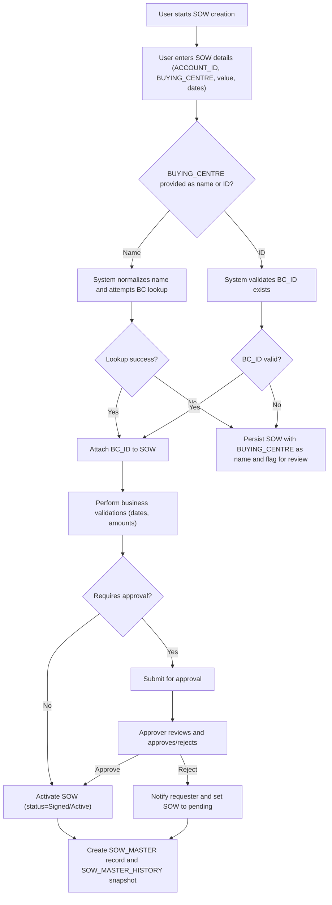
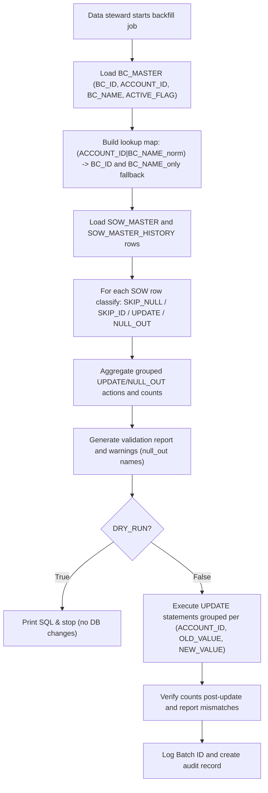
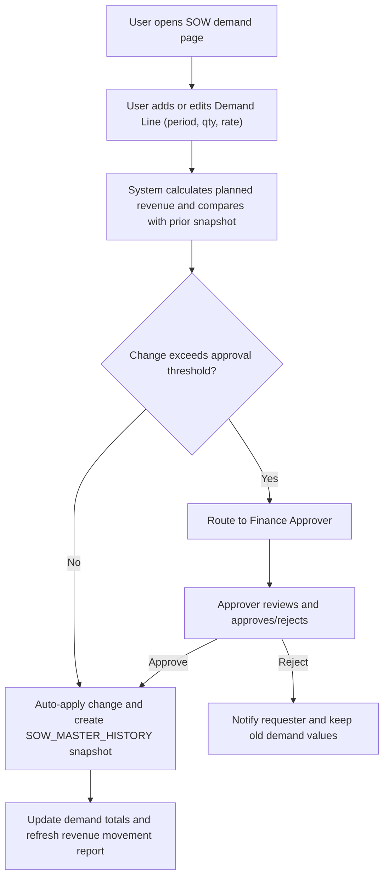
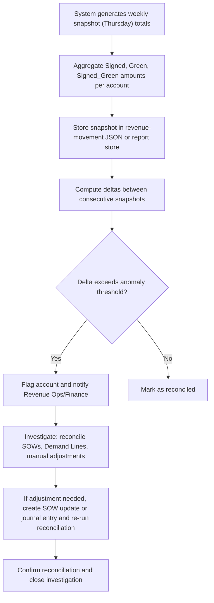

# SOW and Demand Planning

## Business Overview
The SOW (Statement of Work) & Demand Planning module manages capture, approval and lifecycle of SOWs, maps SOWs to accounts and Buying Centres, and tracks demand lines and revenue movement over time. Target users include Account Managers, Project Managers, Revenue Operations, and Finance. The module enables accurate revenue recognition, reconciles week-over-week revenue movements, and supports data hygiene tasks such as backfilling Buying Centre identifiers.

Business objectives:
- Ensure every SOW is correctly mapped to an Account and Buying Centre (BC_ID) to enable accurate reporting and allocation.
- Capture demand (planned resource spend) at SOW and DemandLine level, allow business approvals and track changes across time.
- Reconcile revenue movement (week-to-week deltas), enable finance to validate recognized revenue and detect anomalies.
- Provide tools for bulk data correction (e.g., Buying Centre backfill) with dry-run validation and apply semantics.

Scope of this document: SOW creation/update lifecycle, Buying Centre mapping and backfill, Demand entry/approval/change history, Revenue movement and reconciliation concepts.

## Functional Requirements
**FR-001**: The system shall allow users to create a new SOW with attributes: SOW_ID, UNIQUE_ID, ACCOUNT_ID, BUYING_CENTRE (name or BC_ID), start/end dates, status, and total value.

**FR-002**: The system shall validate and normalize Buying Centre names on SOW creation and update and accept either a BC name or BC_ID.

**FR-003**: The system shall provide a backfill utility to map existing SOW BUYING_CENTRE name strings to BC_MASTER.BC_ID using an (ACCOUNT_ID, BC_NAME) lookup and a fallback BC_NAME-only lookup.

**FR-004**: The system shall support a dry-run mode for any bulk backfill or data mutation operation, producing a validation report of intended changes grouped by (ACCOUNT_ID, OLD_VALUE, NEW_VALUE) and row counts.

**FR-005**: The system shall allow users to view and edit Demand Lines associated with a SOW. Demand Lines capture period, quantity, rate, and planned revenue.

**FR-006**: The system shall enforce an approval workflow for Demand Line changes where certain thresholds (e.g., value or % change) require manager or finance approval before becoming effective.

**FR-007**: The system shall record historical snapshots of SOW and Demand Line records (SOW_MASTER_HISTORY) to maintain an auditable change trail.

**FR-008**: The system shall produce revenue movement reports that show signed, green (pipeline), and signed+green totals per account and per snapshot date, including deltas between snapshots.

**FR-009**: The system shall flag and report Demand and Revenue anomalies (negative deltas, sudden large changes) for manual review.

**FR-010**: The system shall allow reconciliation checks post-update: verify the count of rows updated matches expected counts and surface warnings if mismatched.

**FR-011**: The system shall support scoping of bulk operations to a single ACCOUNT_ID for targeted corrections.

## User Roles & Permissions
- Account Manager
  - Can create and update SOWs for their accounts
  - Can create and propose Demand Lines
  - Can view revenue movement reports for their accounts

- Project Manager
  - Can manage SOW details and demand lines for assigned projects
  - Can submit Demand Line changes for approval

- Revenue Operations / Data Steward
  - Can run Buying Centre backfill utilities in dry-run and apply modes
  - Can view and resolve mapping warnings and perform reconciliations
  - Can access SOW_MASTER_HISTORY and run reports

- Finance Approver
  - Reviews and approves Demand Line changes which exceed thresholds
  - Reviews revenue movement and anomaly reports

- System Administrator
  - Manage BC_MASTER and system-wide configuration
  - Run scheduled or ad-hoc backfills

Permission matrix (high-level):
- Create SOW: Account Manager, Project Manager
- Edit SOW: Account Manager, Project Manager, Revenue Ops (data fixes)
- Backfill BUYING_CENTRE: Revenue Operations (dry-run by others as read-only)
- Approve Demand Changes: Finance Approver, Revenue Operations (conditional)

## User Workflows & Journeys

### User Workflow: SOW Creation & Update

#### Workflow Steps:
1. User starts SOW creation and enters required fields.
2. System checks BUYING_CENTRE input — normalizes names and resolves to BC_ID when possible.
3. If BC lookup fails, SOW persists with name and is flagged for data stewardship review.
4. Business validations run; if approval required (by thresholds), SOW waits for approval.
5. On approval, SOW is activated and SOW_MASTER_HISTORY snapshot created.

#### Business Rules Applied:
- BR-001: BUYING_CENTRE names must be normalized (HTML decode, collapse whitespace, uppercase) before matching.
- BR-002: If BC_ID supplied, it must exist in BC_MASTER or the system flags the SOW.
- BR-003: SOW changes that alter total value by more than configured threshold (e.g., 10%) require Finance approval.

### User Workflow: Buying Centre Backfill / Mapping (Data Steward)

#### Workflow Steps:
1. Build BC lookup from BC_MASTER preferring ACTIVE_FLAG='Y' on duplicates.
2. Load SOW tables and classify rows into actionable categories.
3. Aggregate updates to minimize SQL statements, present dry-run summary.
4. On apply, execute grouped updates and verify affected row counts.
5. Produce auditable batch report with batch_id and run timestamp.

#### Business Rules Applied:
- BR-004: Prefer BC_MASTER rows with ACTIVE_FLAG='Y' when duplicate (ACCOUNT_ID, BC_NAME) entries exist.
- BR-005: Do not overwrite BUYING_CENTRE if already contains a valid BC_ID (SKIP_ID).
- BR-006: Maintain DRY_RUN as default for safety; actual DB changes execute only when DRY_RUN=false.
- BR-007: Group updates by (ACCOUNT_ID, OLD_VALUE, NEW_VALUE) to avoid cross-account collisions.

### User Workflow: Demand Capture & Approval

#### Workflow Steps:
1. Users submit Demand Line changes; system computes delta vs previous snapshot.
2. If thresholds (absolute or percentage) are exceeded, changes require approval.
3. Approved changes create a history snapshot and update downstream reports.

#### Business Rules Applied:
- BR-008: Approval thresholds configurable by account or company-wide (e.g., >$50k or >10% change).
- BR-009: Demand lines with negative planned revenue are allowed but flagged for review.
- BR-010: All DemandLine changes create an auditable SOW_MASTER_HISTORY entry.

### User Workflow: Revenue Movement & Reconciliation

#### Workflow Steps:
1. Weekly snapshots aggregate per-account status totals (Signed, Green, Signed_Green).
2. System computes deltas and surfaces accounts with large negative or positive changes.
3. Finance investigates and reconciles by reviewing SOWs, demand lines, and potential data fixes.

#### Business Rules Applied:
- BR-011: Snapshot cadence is weekly and uses a consistent anchor date (e.g., Thursday).
- BR-012: Signed_Green = Signed + Green (business definition used in reports).
- BR-013: Deltas that are non-zero or exceed configured thresholds must be explained or corrected.

## Business Rules & Validations
**BR-001**: BUYING_CENTRE normalization: HTML entities decoded, internal whitespace collapsed, and string upper-cased before matching.

**BR-002**: BC lookup priority: (ACCOUNT_ID, BC_NAME_norm) -> BC_ID; fallback to BC_NAME_norm -> BC_ID.

**BR-003**: Do not modify rows where BUYING_CENTRE is already a BC_ID listed in BC_MASTER (SKIP_ID).

**BR-004**: Rows with empty/null BUYING_CENTRE remain null (SKIP_NULL) unless explicitly set by steward.

**BR-005**: Bulk updates must be grouped by (ACCOUNT_ID, OLD_VALUE, NEW_VALUE) to ensure atomic, scoped updates.

**BR-006**: Any bulk mutation must support DRY_RUN to produce a validation report without applying changes.

**BR-007**: Approval thresholds (dollar and percentage) determine whether a change requires Finance approval.

**BR-008**: All SOW and Demand changes must be captured in SOW_MASTER_HISTORY for audit and reconciliation.

**BR-009**: Revenue movement snapshots are anchored weekly, and deltas should be computed and stored for trend analysis.

**BR-010**: Negative deltas or large swings must trigger anomaly review workflows.

## Data Entities (Business View)

### SOW
- SOW_ID (system key)
- UNIQUE_ID (business identifier)
- ACCOUNT_ID (owner account)
- BUYING_CENTRE (string name or BC_ID)
- STATUS (e.g., Draft, Signed, Active, Closed)
- START_DATE, END_DATE
- TOTAL_VALUE
- CREATED_BY, CREATED_AT
- LAST_MODIFIED_BY, LAST_MODIFIED_AT
- Notes/Flags (e.g., BUYING_CENTRE_UNRESOLVED)

### BuyingCentre (BC_MASTER view)
- BC_ID (canonical identifier)
- ACCOUNT_ID
- BC_NAME (display name)
- ACTIVE_FLAG
- Other metadata

### DemandLine
- DEMAND_ID
- SOW_ID (FK)
- PERIOD (month/quarter)
- QUANTITY
- RATE
- PLANNED_REVENUE (calculated)
- STATUS (Proposed, Approved, Rejected)
- CREATED_BY, CREATED_AT
- APPROVED_BY, APPROVED_AT

### RevenuePlan / Snapshot
- SNAPSHOT_DATE
- ACCOUNT_ID
- STATUS_CATEGORY (Signed, Green, Signed_Green)
- TOTAL_AMOUNT
- SOURCE_SOW_IDS (aggregation pointer)

### SOW_MASTER_HISTORY
- HISTORY_ID
- SOW_ID
- SNAPSHOT_TIMESTAMP
- CHANGED_FIELDS
- OLD_VALUES
- NEW_VALUES
- CHANGE_REASON
- BATCH_ID (for bulk operations)

## Integration Points
- BC_MASTER (authoritative Buying Centre reference) — used for lookups and data hygiene.
- SOW_MASTER / SOW_MASTER_HISTORY tables — primary SOW storage and audit trail.
- Reporting store (JSON or BI dataset) for weekly revenue movement snapshots.
- Email/Notification service — to notify approvers and data stewards on anomalies (integration optional outside scope).
- Database service layer — bulk update and verification queries (must support transactional safety where possible).

## User Interface Requirements
- SOW creation/edit screen with BUYING_CENTRE autocomplete that accepts names or IDs and shows match confidence.
- Demand capture grid for adding/editing Demand Lines with inline delta calculation vs prior snapshot.
- Backfill utility screen for Data Stewards: run dry-run, view grouped results, preview SQL, and apply updates with confirmation.
- Revenue movement dashboard showing per-account Signed/Green/Signed_Green totals and weekly deltas with drill-down to SOWs.
- History/audit viewer to inspect SOW_MASTER_HISTORY records.

## Non-Functional Requirements
- Performance: Backfill dry-run should operate on large SOW tables in a manner that aggregates updates and avoids per-row transactions; apply mode should bulk-update grouped rows.
- Security: Only authorized roles may apply data changes; dry-run reports viewable by limited roles.
- Availability: Reporting snapshots generated on a scheduled cadence (weekly) with retry on failure.
- Auditability: All bulk operations must produce a batch_id and preserve pre/post-change counts for reconciliation.

## Business Scenarios & Use Cases

**US-001**: As an Account Manager, I want to create a SOW and link it to the correct Buying Centre, so that revenue is reported under the right BC.
- Acceptance Criteria:
  - SOW can be created with BUYING_CENTRE entered as name or BC_ID.
  - System normalizes and resolves BC; if unresolved, SOW is flagged.

**US-002**: As a Data Steward, I want to backfill BUYING_CENTRE fields across SOW records, so that legacy name strings are replaced with canonical BC_IDs.
- Acceptance Criteria:
  - Dry-run produces grouped UPDATE/NULL_OUT counts and lists example names.
  - Apply mode executes grouped SQL and verifies affected row counts.

**US-003**: As a Project Manager, I want to update Demand Lines and have changes routed for approval if they exceed thresholds, so finance oversight is enforced.
- Acceptance Criteria:
  - System computes deltas and routes for approval when thresholds exceeded.
  - Approved changes produce history snapshots and update revenue totals.

**US-004**: As Finance, I want weekly revenue movement snapshots with deltas, so I can detect and investigate anomalies.
- Acceptance Criteria:
  - Weekly snapshot stores Signed/Green/Signed_Green per account.
  - Deltas are computed and accounts with large changes are flagged.

## Error Handling & Edge Cases
- If BC_MASTER is empty, backfill should abort and raise an error — do not attempt blind mapping (handled in backfill load step).
- If BUYING_CENTRE value already equals a known BC_ID, skip updating to avoid accidental overwrite.
- When grouped update verification finds mismatched counts, surface warnings and do not silently assume success.
- Name collisions across accounts must not cause cross-account updates; WHERE clause must include ACCOUNT_ID.
- Null or blank ACCOUNT_ID handling: treat as empty string in lookups but prefer scoped matches first.

## Assumptions & Constraints
- BC_MASTER is the authoritative source for Buying Centre identifiers and must be maintained by a trusted team.
- Approval thresholds are configurable but default values should be defined in system configuration.
- Reporting snapshots use a weekly cadence anchored to a specific day (e.g., Thursday) and must be consistent.
- The system stores BUYING_CENTRE as BC_ID once mapped; historical records retain original names in SOW_MASTER_HISTORY.

## Open Questions & Recommendations
- Recommendations:
  - Add an interactive BC autocomplete with confidence score to reduce fallback NULL_OUT cases.
  - Maintain a reconciliation dashboard that links revenue deltas to specific SOW and DemandLine changes for faster triage.
  - Consider transactional batching for apply_runs to allow rollback on verification mismatch.

- Open Questions:
  - What are the configured default approval thresholds (dollar and percent) per account?
  - Is there an existing notification service available; if not, what is the preferred channel for approver notifications?

---

