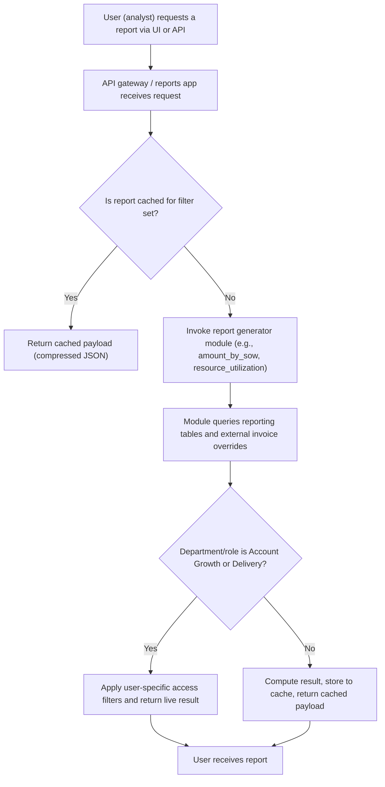
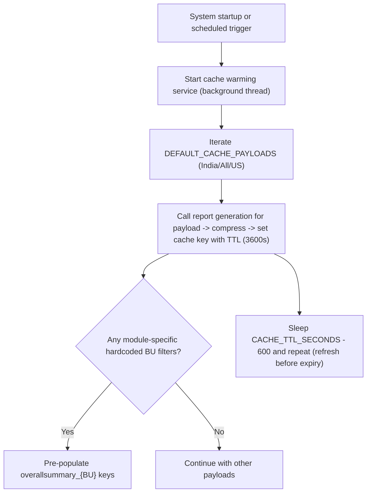
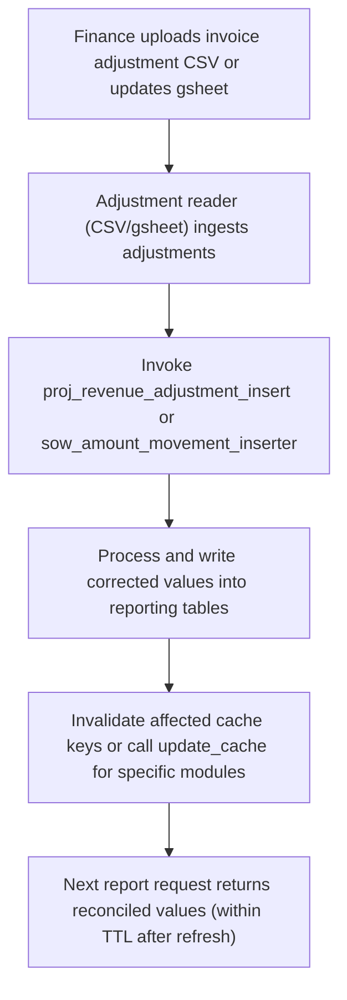
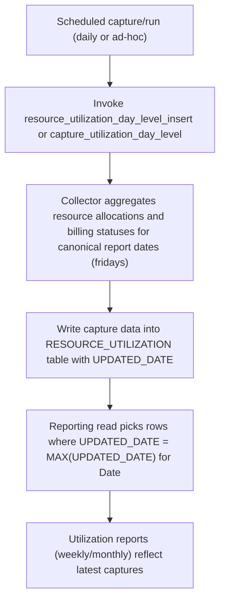

# Reporting & Analytics — Allocation, SOW, Revenue, Utilization

## Business Overview
The Reporting & Analytics capability provides business stakeholders (Account Growth, Delivery, Business Heads, Finance and HR/People Ops) with scheduled and on-demand reports for Allocation, Statement-of-Work (SOW) revenue and projections, Resource Utilization, Buy Center (buying center) summaries, Bench/Investment analysis and related reconciliation views. Reports are available via REST endpoints and cached for performance with configurable cache warming and refresh schedules. Reports support multi-level filters (country, business head, account, manager, department) and expose KPIs and diagnostic metrics required for capacity planning, revenue reconciliation and operational decision-making.

Scope of this document: Allocation summaries, SOW-level revenue (projected & actual), resource utilization and bench investment reporting, scheduling/caching behavior, filters/groupings, KPI definitions, data freshness and reconciliation expectations.

## Key Personas
- Business Head / Account Growth: needs account- and business-head level revenue and pipeline visibility
- Delivery Manager: needs utilization, bench and capacity views to balance demand and supply
- Finance / Revenue Ops: needs actual vs projected revenue, invoice reconciliation and roll-ups
- People & Operations: needs utilization and headcount trending for hiring and attrition planning
- Reporting Consumer (analyst): requests ad-hoc or scheduled datasets for downstream analysis

## High-level Capabilities
- On-demand API endpoints for: projected/actual revenue (by account / by SOW), overall summary, buying-center view, resource lists, utilization (day/month), allocation summaries, bench investment and high-probability SOW reports.
- Caching layer with explicit keys per report and TTL; background cache-warming for common filter combinations.
- Scheduled/invoked data insertors that populate reporting tables (monthly SOW-level tables, utilization day-level inserts and sow_amount_movement inserts).
- Reconciliation hooks: invoice corrections and overrides (CSV/template support) used to adjust projected/actual totals for specific financial periods.

## Functional Requirements
**FR-001**: The system shall provide an endpoint to retrieve projected revenue by account for the configured date window.

**FR-002**: The system shall provide an endpoint to retrieve actual revenue by account for the configured date window.

**FR-003**: The system shall provide an endpoint to retrieve projected revenue by SOW and to support payload filters including BUSINESS_HEAD_FILTER, department and emp_id for access control.

**FR-004**: The system shall provide an endpoint to retrieve actual revenue by SOW supporting the same filters as projected SOW reports.

**FR-005**: The system shall provide resource reports by account and by SOW with the ability to group and return headcount, billing status and allocation date ranges.

**FR-006**: The system shall expose resource utilization reports including weekly and monthly utilization and headcount supply/gap metrics (IND & US breakdowns).

**FR-007**: The system shall expose bench/investment reports with the ability to filter by geography and other payload attributes.

**FR-008**: The system shall support scheduled cache population and background refresh for a set of default filter payloads.

**FR-009**: The system shall provide data insertion endpoints (or processes) to populate reporting tables: sow_amount_movement_inserter, report_data_inserter, allocation_summary_inserter, resource_utilization_day_level_inserter.

**FR-010**: The system shall use invoice/adjustment inputs to override or re-calculate reporting totals for specific fiscal year(s) where required (e.g., 2024 adjustments via invoice_2024.csv).

**FR-011**: The system shall allow on-demand cache clearing and rebuilding via an update_cache API accepting module_name and filter payloads.

**FR-012**: The system shall restrict report-level access by department and employee id rules: Account Growth and Delivery roles may bypass aggregated cache and get live data for their accounts.

**FR-013**: The system shall return report datasets in compressed JSON payloads with optional caching metadata.

## Key Reports & Definitions
- Allocation Summary: current allocation across accounts and accounts’ allocated headcounts (module: allocation_summary, allocation_summary_data)
- Amount by Account (Projected/Actual): monthly revenue by account and rollups to YEAR totals (module: amount_report_by_account)
- Amount by SOW (Projected/Actual): monthly SOW-level revenue with account-level and overall roll-ups, invoice overrides for specific quarters/year buckets (module: amount_report_by_sow)
- Resource by Account / Resource by SOW: lists of resources assigned to accounts/SOWs with allocation windows and billing status
- Resource Utilization (weekly/monthly): supply & demand metrics, utilization % and gap analysis broken out by India / US and overall (module: resource_utilization)
- Bench Investment Report: bench counts, investment headcount, and bench costs (module: bench_investment_report)
- Planned vs Actual / SOW Amount Movement: project movement and revenue adjustments over time (modules: sow_type_planned_vs_actual, sow_amount_movement_report)

## KPIs & Metric Definitions (Business View)
- UTILIZATION (monthly, India): The system shall compute UTILIZATION as: 
  UTILIZATION = (ACTUAL_BILLED_ALL) / (Factspan_Product + Actual Bench + ACTUAL_BILLED_ALL + BUFFER_ALL + INVESTMENT_ALL + Training + Special Leave) * 100
  - Implemented as rounded percentage to 1 decimal place in monthly aggregation

- Total_IND_Utilization = (ACTUAL_BILLED_ALL) / (Total_IND) * 100 where Total_IND = total India headcount available (includes delivery + non-delivery as computed)

- SIGNED_SOW: Count of SOW resource demand with probability 100% and status Active (SOW_RESOURCE_BILLED)

- demand_70_per_probability: Sum of Signed + 70% probability planned resources

- demand_50_per_probability: Sum of Signed + 70% + 50% probability planned resources

- ACTUAL_BILLED_ALL: Count of unique resources flagged as Billed on the reference date

- BUFFER_ALL, INVESTMENT_ALL, LEADERS_INVESTMENT, FS_INVESTMENT: Headcounts labeled by billing status or role-based classification

- Proj_Delivery_Head_Count_Gap: Projected supply minus attrition-adjusted demand (includes New_joinee projections, attrition factor 25% applied to Attrition)

- Gaps (SIGNED_SOW_gap, gap_70_per_probability, gap_50_per_probability): Bench and usable supply minus demand buckets, delta applied when actual billed < sow resource billed

Note: All KPI labels and formulas above are extracted from the reported data assembly and must be validated against Finance definitions before operationalization.

## Filters, Groupings & Access Rules
- Common filters supported by APIs: BUSINESS_HEAD_FILTER (list), ACCOUNT_ID, COUNTRY, department, emp_id, manager_id, STATUS_AS_OF_DATE.
- Department-based access: "ACCOUNT GROWTH" and "DELIVERY" users receive live data constrained to their accessible accounts (special query logic); other users may receive cached aggregate data.
- Hard-coded business-head cache keys: application contains a small set of business-head ids (e.g., "006","0521","158") treated specially for cache warming and keyed overallsummary caches.
- Groupings exposed: by ACCOUNT, by SOW, by SOW_STATUS (Signed/Renewal/Proposal/Qualified), by SOW_TYPE (Current/Net New), and time buckets (monthly, quarterly, YEAR totals).

## Data Freshness, Cut-offs & Reconciliation Rules
- Cache TTL: Default TTL is 3600 seconds (1 hour) for warmed caches; background refresh runs every TTL - 600 seconds (i.e., 50 minutes) to refresh 10 minutes before expiry.
- Cache warming: The system warms caches for a small set of default payloads (India, All, US) and for hard-coded business-head keys.
- Latest-row selection: For time-series tables (e.g., RESOURCE_UTILIZATION), the reporting logic selects rows where UPDATED_DATE equals the MAX(UPDATED_DATE) for that Date; this ensures the latest update is used for each reporting date.
- Invoice overrides: For specific fiscal year adjustments (example: 2024), CSV templates (invoice_2024.csv) are used to override monthly/quarterly totals and quarterly labels (Q1_24..Q4_24). An internal function recalculates TOTAL_24 monthly, quarterly and year totals respecting filtered account lists.
- Capture windows: Utilization capture functions iterate over a list of canonical reporting dates (all_fridays / last_fridays) and drop historical/non-future dates during capture (capture keeps current and future weekly dates depending on capture logic).
- Reconciliation steps: Finance-driven reconciliation should be performed by updating invoice override templates and invoking the sow_amount_movement_inserter or proj_revenue_adjustment_insert (adjustment_gsheet_read) to write corrected values into reporting data stores. Acceptance criteria require automated insertion processes to finish without errors and to be visible in the reports within the configured cache TTL after refresh.

## Scheduling & Delivery Expectations
- On-demand: Business users call REST endpoints (examples: /amount_by_account_projected, /amount_by_sow_actual, /overallsummary_new, /resource_utilization) to retrieve report payloads.
- Cached responses: High-cost reports use cached serialized payloads keyed per report and filter set. Cache entries are refreshed either by the background cache-warming service or via explicit update_cache calls.
- Cache warming and background refresh run as a background thread and refresh default payloads (country/account combos) repeatedly every hour.
- Administrators can clear cache on start and trigger update_cache with a payload specifying module_name and optional filters to rebuild caches for targeted modules.
- Delivery format: JSON responses (compressed payloads available) delivered via REST; large exports are supported via CSV templates and CSV modules present in reports_service/modules.

## User Workflows & Journeys

### User Workflow: On-demand Report Request and Response

Workflow Steps:
1. User initiates a report request with filters.
2. Reports app checks cache for the key matching the filter set.
3. If cached, returns cached compressed JSON; otherwise invokes report generator.
4. Report module queries reporting views and invoice overrides, applies business-head/account filters and computes KPIs.
5. If the caller has privileged department (Account Growth/Delivery), live data is returned; otherwise computed result is cached and returned.

Business Rules Applied:
- BR-001 (cache-first): prefer cached datasets for non-privileged users if available
- BR-002 (access filter): Account Growth and Delivery queries are restricted to user’s accessible accounts

### User Workflow: Cache Warming & Background Refresh

Workflow Steps:
1. On startup, service populates cache for default payloads.
2. Each cache key is set with TTL (3600 seconds); background thread waits 50 minutes then refreshes caches 10 minutes prior to expiry.
3. Certain business heads (hardcoded) receive dedicated cache keys for faster BU-level access.

Business Rules Applied:
- BR-003 (cache TTL): cache entries expire after 1 hour; background refresh occurs 10 minutes before expiry
- BR-004 (hard-coded warming): selected business-heads are warmed separately for performance

### User Workflow: SOW Revenue Adjustment and Reconciliation

Workflow Steps:
1. Finance provides adjustments via the provided CSV template or connected sheet.
2. Ingest processes map and write overrides into reporting store (e.g., ACTUAL_INVOICE_SUMMARY or SOW_REPORTS_DATA_VW adjustments).
3. Operator triggers cache refresh or the system updates caches via update_cache endpoint.
4. Reports reflect reconciled values after cache refresh.

Business Rules Applied:
- BR-005 (invoice precedence): invoice override values (when present) replace projected values for matching account/SOW/month
- BR-006 (reconciliation visibility): reconciled results must be visible in reports within one cache TTL after a successful insert and cache refresh

### User Workflow: Utilization Day-level Capture and Report

Workflow Steps:
1. Capture process computes weekly snapshots on canonical dates (all_fridays/last_fridays).
2. Data is appended to RESOURCE_UTILIZATION table; updated_date maintained to allow latest-row selection.
3. Utilization views select latest updated rows per Date for reporting.

Business Rules Applied:
- BR-007 (snapshot latest): reporting selects the record for a date with the latest UPDATED_DATE
- BR-008 (canonical dates): reporting is calculated on canonical weekly dates (Fridays) to standardize time-series

## Business Rules & Validations
**BR-001**: Cache-first for non-privileged users — if a cached payload exists for requested filters and the user is not in Account Growth or Delivery, the system shall return the cached payload.

**BR-002**: Account-level access must be enforced — Account Growth and Delivery users shall only see accounts they have access to (via growth/delivery access tables).

**BR-003**: Cache TTL and refresh schedule — default TTL is 3600 seconds; background refresh must run 10 minutes prior to expiry to maintain warm caches.

**BR-004**: Invoice overrides precedence — invoice/csv override values shall be used instead of raw projected totals where present for specified fiscal year adjustments.

**BR-005**: Latest updated row selection — time-series reporting must always use the row with the maximum UPDATED_DATE for a given Date key.

**BR-006**: Reconciliation visibility SLA — after a successful adjustment insert, reconciled numbers must surface in reports within one cache TTL (1 hour) assuming background refresh or explicit update_cache is called.

**BR-007**: Utilization formula and rounding — utilization percentages shall be calculated per reporting code and rounded to one decimal place.

**BR-008**: Empty and zero-handling — rows with zero totals in TOTAL_YEAR and identical bucket flags should be dropped prior to presentation to avoid noise.

## Data Entities (Business View)
### Report Dataset: SOW Report Row
- SOW_ID
- UNIQUE_ID
- SOW_NAME
- ACCOUNT_ID
- ACCOUNT_NAME
- SOW_TYPE (Current / Current - New / Net New)
- SOW_STATUS (Signed / Renewal / Proposal / Qualified)
- MONTH (e.g., "Mar_24")
- YEAR
- VALUE (amount for the month)
- BILLING_MODEL
- PROBABILITY

### Report Dataset: Resource Snapshot
- Date (canonical Friday)
- EMPLOYEE_ID
- JOB_ROLE
- LOCATION
- BILLING_STATUS (Billed / Investment / Buffer / Bench / Use Bench / Training / Spl. Leave)
- ALLOCATION_START_DATE
- ALLOCATION_END_DATE
- SOW_ID / ACCOUNT_ID
- ACTUAL_BILLED_FLAG

### Support Entities
- Invoice adjustment templates (CSV files under reports_service/modules) used to override month/quarter totals
- RESOURCE_UTILIZATION table (time-series snapshots with UPDATED_DATE)

## Integration Points
- Database views: SOW_REPORTS_DATA_VW, ACTUAL_INVOICE_SUMMARY, RESOURCE_MAPPING, EMPLOYEE_MASTER, ACCOUNT_DETAILS
- Cache: Redis (configurable) used to store compressed JSON payloads per report key
- Adjustment sources: CSV templates and Google Sheets (adjustment_gsheet_read) used by Finance for overrides
- Background scheduler/daemon: background cache warming thread within reportsapp

## User Interface Requirements (Business)
- Reports UI shall allow selection of filters: Country, Business Head, Account, Manager, Department, Status As Of Date.
- Drill-down capability: From overall summary to Account-level and SOW-level views for the selected period.
- Export: ability to export SOW and allocation tables to CSV using provided templates where required.
- Indication: show data freshness and last-updated timestamp for each report (derived from cache metadata or underlying UPDATED_DATE for time-series)

## Non-Functional Requirements
- Performance: high-cost aggregated reports should return cached responses within 2 seconds for warmed keys; live generation may take longer but should finish within operational SLA for interactive use.
- Availability: reporting endpoints should be available during business hours; background refresh must not block on-demand queries.
- Security: report access must respect department/employee filters and not return data outside user’s permitted accounts.

## Business Scenarios & Use Cases
**US-001**: As a Delivery Manager, I want to see monthly utilization and bench counts by country, so that I can plan hiring and reallocate bench resources.
- Acceptance Criteria:
  - Endpoint returns utilization and bench metrics for selected month
  - Utilization matches formula and is rounded to one decimal
  - Drill-down to employee-level allocations is available

**US-002**: As a Finance analyst, I want to compare projected vs actual SOW revenue for each account, so I can reconcile invoices and report to leadership.
- Acceptance Criteria:
  - Projected and Actual reports can be produced per account and per SOW
  - Invoice override CSVs properly update totals for specified fiscal year
  - Reconciled numbers appear in reports after cache refresh

**US-003**: As an Account Growth user, I want live SOW pipeline for accounts I have access to, so I can prioritize growth actions.
- Acceptance Criteria:
  - Account Growth requests return live results constrained to accounts from growth access queries
  - Result includes signed/green/pipeline buckets and quarter/year roll-ups

**US-004**: As an HR analyst, I want to review historical utilization snapshots to validate attrition impact on capacity.
- Acceptance Criteria:
  - Resource utilization snapshots are stored by canonical weekly dates
  - Latest snapshot selection per date uses the newest UPDATED_DATE

## Error Handling & Edge Cases
- Missing invoice overrides: fallback to projected amounts and annotate results indicating no overrides applied.
- Empty datasets: return empty arrays and a clear header indicating months present or message that no data is available.
- Cache failures: if cache is unavailable, system shall compute live result and return it; caching errors should be logged and not block responses.
- Partial account access: if user has no access to accounts requested, return empty dataset and an informative message.

## Assumptions & Constraints
- Assumes underlying source systems (EMPLOYEE_MASTER, RESOURCE_MAPPING, SOW views and ACTUAL_INVOICE_SUMMARY) are maintained and reliably updated.
- Assumes Finance will provide invoice override templates consistent with the CSV headers that the system expects.
- Hard-coded business-head keys for cache warming are maintained by operations — change requires code/config updates.
- Some business logic (e.g., classification of "Investment" vs "Buffer") is implemented in utility/bench tracking and role lists in config.

## Open Questions & Recommendations
- Confirm Finance canonical definitions for UTILIZATION (denominator components) and rounding rules to ensure parity.
- Consider parameterizing business-head warming list and cache TTL via configuration to avoid code-level changes.
- Add last-updated metadata to each cache entry so UI can display freshness to users.

---

## Appendix: Relevant Endpoints (business-facing)
- POST /amount_by_account_projected
- POST /amount_by_account_actual
- POST /amount_by_sow_projected
- POST /amount_by_sow_actual
- POST /resource_by_account
- POST /resource_by_sow
- POST /overallsummary_new
- POST /buying_center_report
- POST /resource_utilization
- POST /resource_utilization_acc_sow
- POST /bench_investment_report

