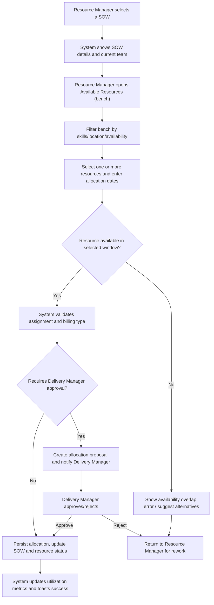
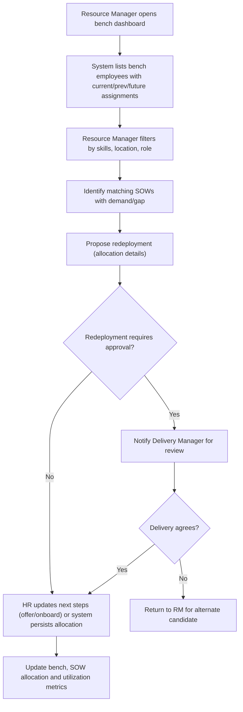
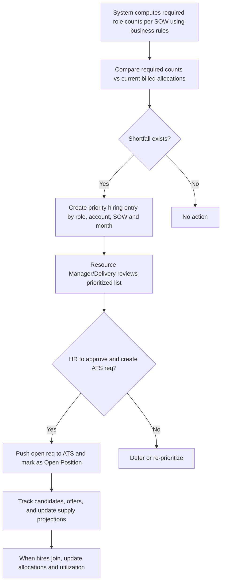
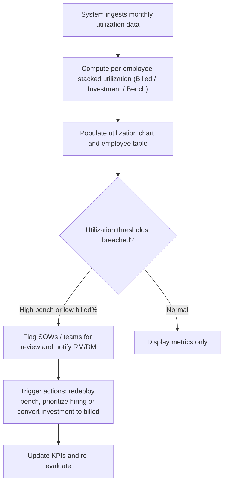

# Resource Allocation & Utilization (RRE-UI)

## Business Overview
The Resource Allocation & Utilization feature set provides Resource Managers, Delivery Managers, HR, and Finance with capabilities to assign employees to SOWs/projects, manage bench resources (redeployment and investment tracking), detect and act on overstaff/understaff scenarios, prioritize hiring gaps, and monitor utilization KPIs over time. The objective is to maximize billed utilization, minimize bench time, support redeployment, and ensure hiring actions are prioritized against demand and business rules.

Target users / personas:
- Resource Manager: assign/reallocate employees, view bench, propose redeployments
- Delivery Manager: approve allocations, review overstaff/understaff and business impact
- HR / Talent Acquisition: receive prioritized hiring pipeline and open positions
- Finance: track billing status, investments and utilization metrics

Scope:
- Assigning employees to projects/SOWs and reallocation
- Bench management and redeployment
- Overstaff/understaff identification and decision workflow
- Priority hiring pipeline and approvals
- Utilization KPIs, thresholds, and visualizations

## Functional Requirements
**FR-001**: The system shall allow a Resource Manager to view a SOW’s details (account, SOW name, start/end dates, demand by region) and current team composition.

**FR-002**: The system shall display available bench resources filtered by location, skills, designation, and availability window.

**FR-003**: The system shall allow the Resource Manager to assign one or more bench resources to a SOW by selecting employees, entering allocation start/end dates, billing type (Billed/Investment), and comments.

**FR-004**: The system shall validate that selected resource availability dates overlap with the SOW demand window before allowing assignment.

**FR-005**: The system shall persist allocation proposals and update the SOW allocation summary and resource status (Current/Previous/Future allocations).

**FR-006**: The system shall provide a bench dashboard that lists each employee with Current/Previous/Future assignments and allows filtering and searching by skills, job role, manager, location, billing status, and notice status.

**FR-007**: The system shall calculate and present overstaff counts by SOW (by role buckets: Associate, Analyst, Sr Analyst, AM) based on configurable business rules and highlight Investment + Buffer as the overstaff number.

**FR-008**: The system shall show an Overstaff detail modal with current vs desired allocation split by role and billing category (Billed, Buffer, Investment) for a selected SOW and month.

**FR-009**: The system shall allow a Delivery Manager or authorized user to view and edit Business Rules (team composition by team size) used to compute overstaff and priority hiring calculations.

**FR-010**: The system shall compute a "priority hiring" list by comparing required role counts (from business rules for a team size) to current billed allocation and flag shortfalls per role and billing category.

**FR-011**: The system shall expose open positions and allow Resource Managers/HR to add/adjust prioritized headcount items (Account, SOW, count) and persist them to the prioritized hiring standardization.

**FR-012**: The system shall provide utilization charts per employee (monthly) showing stacked proportions for Billed, Investment and Bench and compute YTD / FY utilization metrics.

**FR-013**: The system shall compute team-level KPIs (Total Available Headcount, Bench Available, Signed SOW demand, Gaps at different probability levels) and present them in interactive tables and charts.

**FR-014**: The system shall support export or API endpoints for utilization data to feed reports and downstream tools.

**FR-015**: The system shall provide filters on lists and charts (location, job role, department, skills) and support multi-select with dynamic option population based on filtered results.

**FR-016**: The system shall show tooltips (hover) that list contributing accounts/SOWs and role breakdowns for aggregated numbers.

**FR-017**: The system shall ensure allocation actions require a valid user session and role-based access control.

**FR-018**: The system shall maintain audit-friendly messages (toasts) for create/update/delete and require confirmation for destructive actions (delete entry from a prioritized hiring popup).

**FR-019**: The system shall compute monthly averages for utilization types across visible employees and display summary rows in the utilization table.

**FR-020**: The system shall allow administrators to reset prioritized hiring adjustments to a previous state via a reset function.

## User Roles & Permissions
- Resource Manager
  - Capabilities: Search bench, propose allocations, view SOW allocation recommendations, create prioritized hiring entries
  - Access: Create/submit allocation proposals; edit prioritization proposals

- Delivery Manager
  - Capabilities: Approve/validate allocations and business rule edits, review overstaff modal, accept redeployment recommendations
  - Access: Read/write for Overstaff and Business Rule screens

- HR / Talent Acquisition
  - Capabilities: Review prioritized hiring queue, approve/reject job postings, update candidate pipeline (via ATS integration)
  - Access: Read prioritized hiring, update OR export to ATS

- Finance
  - Capabilities: View billing status by resource/SOW, review investment and bench cost lines
  - Access: Read across allocation, bench and utilization dashboards

Permission matrix (high level):
- Allocation create/edit: Resource Manager (submit), Delivery Manager (approve)
- Business Rule edit: Delivery Manager & Admins
- Priority Hiring approval/change: HR & Delivery Manager
- Utilization reports: Read for all authorized personas

## User Workflows & Journeys

### User Workflow: Allocate Bench Resource to SOW

Workflow Steps:
1. Resource Manager opens the SOW allocation view and reviews SOW demand and team.
2. They open the bench listing and apply filters to find candidates.
3. They select candidate(s), set allocation start/end dates and billing type (Billed/Investment).
4. System checks availability overlap with candidate calendar; if invalid, suggests alternatives.
5. If assignment requires approval (per policy), creates a proposal and notifies Delivery Manager; else directly persists the allocation.
6. Allocation completion updates SOW tables, employee allocation history and utilization calculations.

Business Rules Applied:
- BR-001: Candidate must be available for the full allocation window.
- BR-002: Allocation outside SOW date range is not permitted.
- BR-003: Senior leaders may be excluded from buffer calculations (per rules).

### User Workflow: Bench Redeployment (Use Bench)

Workflow Steps:
1. Resource Manager uses bench dashboard to find redeployable employees.
2. They match skills to open demand, propose redeployment and specify billing status.
3. Decision point: approval may be required by Delivery Manager.
4. On approval, HR/Talent may be engaged if cross-organization changes are required; otherwise the system updates allocation.

Business Rules Applied:
- BR-004: Redeployments must satisfy skill match and start/end date overlap.
- BR-005: When redeploying from bench into Investment or Billed, update billing status and notify Finance team if required.

### User Workflow: Priority Hiring Pipeline

Workflow Steps:
1. System evaluates SOW-level demand against role-level business rules.
2. For roles with shortfall, the system generates prioritized hiring rows (Account, SOW, Role, Count).
3. Resource Manager/Delivery reviews and finalizes the list; HR consumes the queue to create ATS requisitions.
4. Hiring progress updates supply projections and utilization.

Business Rules Applied:
- BR-006: Use team-size based business rule mapping to compute role requirements.
- BR-007: If current billed allocation covers the requirement, role is not prioritized.

### User Workflow: Utilization Monitoring & Alerts

Workflow Steps:
1. System runs periodic jobs or APIs to load utilization metrics.
2. The UI visualizes the stacked utilization per employee (billed/investment/bench) and summary averages per month.
3. If thresholds are crossed (configurable), the system flags SOWs for action and notifies relevant personas.

Business Rules Applied:
- BR-008: Alert threshold example — Bench % > 20% for a team triggers overstaff review.
- BR-009: Billed utilization below configured minimum (e.g., 60%) flags hiring or redeployment.

## Business Rules & Validations
**BR-001**: Resource availability validation — a resource must have Available Start/End dates that fully cover the proposed allocation window.

**BR-002**: Allocation date bounds — allocations must lie within SOW actual start and end dates.

**BR-003**: Overstaff calculation — Overstaff = sum(Buffer + Investment) for specified role buckets; leaders (AM and above) treated per exception rules.

**BR-004**: Skill-match rule — for an allocation to be valid, resource must contain at least one of the requested skills at required level if the SOW requires skill-specific resources.

**BR-005**: Billing-type enforcement — changing billing type to Billed requires additional checks (client approval/finance) where configured.

**BR-006**: Priority hiring calculation — required role counts are pulled from business rules table (TEAM_HIRING) based on team size and compared to current billed allocation.

**BR-007**: De-duplication / uniqueness — prioritized hiring entries for a role-account-SOW-month should be unique; adding duplicates must aggregate counts instead of creating duplicates.

**BR-008**: Utilization threshold policy — configurable threshold values (e.g., bench %, billed %) are used to surface exceptions.

**BR-009**: Edit Governance — edits to business rules require Delivery Manager role and are audited (Tabledit edit flow triggers API to persist changes).

## Data Entities (Business View)

1. Allocation
- Attributes: Allocation_ID, Employee_ID, SOW_ID, Account_ID, Start_Date, End_Date, Billing_Status (Billed/Investment/Buffer), Comments, Created_By, Status (Proposed/Active/Approved/Rejected)
- Lifecycle: Created as proposal -> (optional) Approved -> Active -> Ended

2. Bench Resource (Employee)
- Attributes: Employee_ID, Employee_Name, Job_Role, Department, Location, Skills [ {Skill, Level} ], Current_Assignment, Prev_Assignments, Next_Assignments, In_Notice (Y/N), Availability_Start, Availability_End

3. Demand / SOW Demand
- Attributes: SOW_ID, Account_Name, SOW_Name, Actual_Start_Date, Actual_End_Date, US_Demand_Count, IND_Demand_Count, Resource_Data (current allocations)

4. Utilization Metric
- Attributes: Employee_ID, Month_Year, Billed_Percent, Investment_Percent, Bench_Percent, YTD_Utilization, FY_Utilization
- Relationships: Aggregated to team-level and SOW-level KPIs

5. Business Rule (Team Hiring)
- Attributes: Team_Size, Associate, Analyst, Sr_Analyst, AM, Buffer, MANAGEMENT_AM, Management_M_SM, SME
- Usage: Determines role headcount expectations per team size for overstaff and priority hiring calculations

6. Priority Hiring Entry
- Attributes: Entry_ID, Role, Billing_Status, Month, Account, SOW, Old_Value, New_Value, Total, Status (Pending/Approved/Reset), Created_By

## Integration Points
- HRMS / Employee Master (implied): To fetch or sync employee details, joining dates, notice status and to trigger onboarding updates.
- ATS (Applicant Tracking System): Push prioritized hiring requisitions and receive status updates for candidates/offers -> influences supply projections.
- Project / SOW System: Read-only or update SOW metadata (start/end dates, demand) — SOW selection depends on current project records.
- Utilization API endpoints: System calls resource_utilization and utilization_percentage_monthly_chart APIs to ingest metrics (observed in js files).
- Notification system / Email / Slack (implied): To notify Delivery Managers or HR on approval or exceptions.

## User Interface Requirements
- SOW Allocation screen: header with Account & SOW meta, current team table, available resources table, filter options, assign button and allocation input controls.
- Bench Dashboard: data table with Current / Previous / Future assignments per employee; multiselect filters for skills, roles, managers, locations.
- Overstaff screen: matrix of accounts/SOWs vs monthly columns showing Investment and Buffer counts and interactive modals for details.
- Priority Hiring screen: table of prioritized roles with capacity to open modal to add/adjust account/SOW counts and approve/submit.
- Utilization Chart: stacked bar visualization per employee per month and table with summary rows for billed/invest/in bench.
- Tooltips: Provide hover tooltips for aggregated cells listing accounts/SOWs and role breakdowns.
- Responsive behaviors: tables should support horizontal scrolling for narrow viewports and provide sticky header columns for context.

## Non-Functional Requirements
- Performance: Monthly utilization API should respond within acceptable limits; UI should paginate large employee lists and cache lookup lists (skills, job roles).
- Security: All actions require authenticated session; write actions guarded by role-based checks.
- Availability: Dashboards should tolerate short API outages and surface meaningful errors.
- Usability: Filter controls should be multi-select with search and dynamic option population.

## Business Scenarios & Use Cases
**US-001**: As a Resource Manager, I want to assign bench employees to a SOW with start/end dates, so that client demand is fulfilled and bench time is reduced.
- Acceptance Criteria:
  - User can select bench employees and set allocation dates
  - System validates availability and SOW overlap
  - Allocation persists and utilization updates

**US-002**: As a Delivery Manager, I want to review overstaffed SOWs and business-rule driven recommendations, so that I can decide on redeployments or hiring.
- Acceptance Criteria:
  - Overstaff screen lists SOWs and overstaff counts by month
  - Clicking a cell shows current vs desired allocation by role

**US-003**: As HR, I want a prioritized hiring list derived from demand vs capacity, so that recruiters can focus on highest-impact requisitions.
- Acceptance Criteria:
  - System generates prioritized list with Role, Account, SOW and counts
  - HR can export or push to ATS

**US-004**: As Finance, I want to see billing status breakdown across allocations and investments, so that I can reconcile cost/chargeable work.
- Acceptance Criteria:
  - Billing type is shown per allocation and in Overstaff/PH summaries
  - Finance can filter or export relevant views

## Error Handling & Edge Cases
- Allocation conflicts: if selected employee is not available or has overlapping allocation, show clear validation and prevent save (Allocation flow). (Handled by FR-004 and UI checks in resourceAllocation.js)
- Empty bench results: show helpful messaging and quick link to prioritized hiring or training (bench UI shows "No Available resources found").
- API failures: show loader/spinner and user-friendly error; allow retry (observed across js files with try/catch and loaders).
- Duplicate priority hiring entries: system should merge or prevent duplicates and show aggregated counts.

## Assumptions & Constraints
- HRMS and ATS integrations exist or will be connected; API endpoints used in the code (apiValue.*) are available.
- Business rules (TEAM_HIRING) are authoritative and editable by Delivery Managers.
- Skill matching is basic substring membership in employee.ALL_SKILLS as implemented in existing JS filtering logic.
- Senior leadership roles are excluded from some overstaff/investment counts per special-case rules.

## Open Questions & Recommendations
- Recommendation: Add explicit "propose" vs "direct assign" toggle for allocations to clarify approval workflow and audit trail.
- Recommendation: Add a small "impact" calculation in the allocation modal that shows how the change affects SOW billed % and team overstaff.
- Question: Should allocation changes automatically notify Finance when billing type switches to Billed? Implement configurable notifications.

---

## Appendix: Source references
Primary UI & logic files analyzed:
- resourceAllocation.html / js/resourceAllocation.js — SOW find & assign flows, allocation validation and UI assembly
- useBench.html / js/useBench.js — Bench listing, filters and employee details modal
- overStaff.html / js/overStaff.js — Overstaff calculations, business rule modal, cell modal for details
- priority_hiring.html / js/priority_hiring.js — Priority hiring generation, open positions and modals to edit/approve
- UtilizationChart.html / js/utilizationChart.js and js/resourceUtilization.js — Utilization data ingestion, per-employee stacked utilization UI and monthly KPI tables

