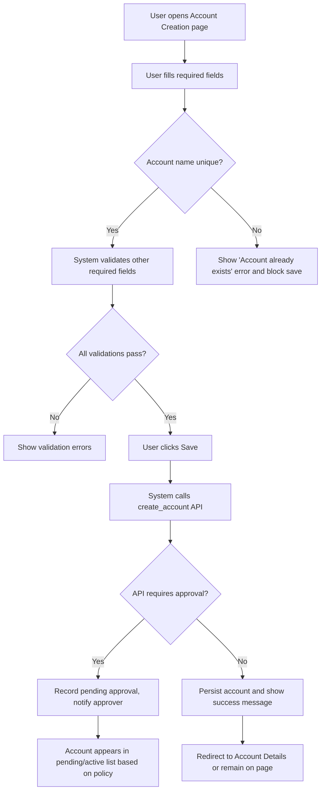
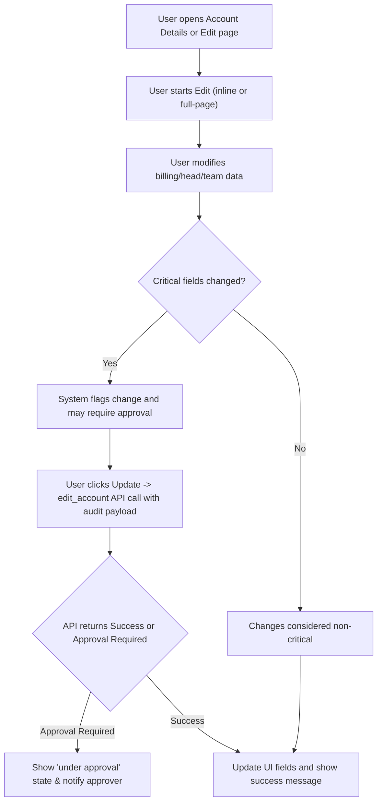
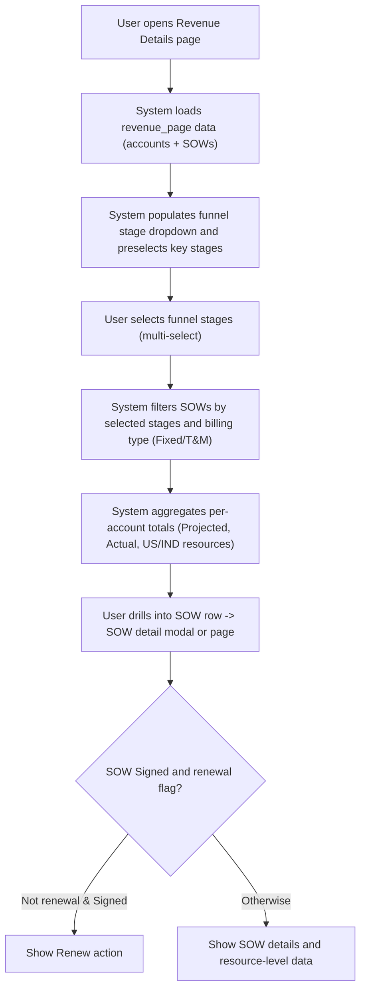
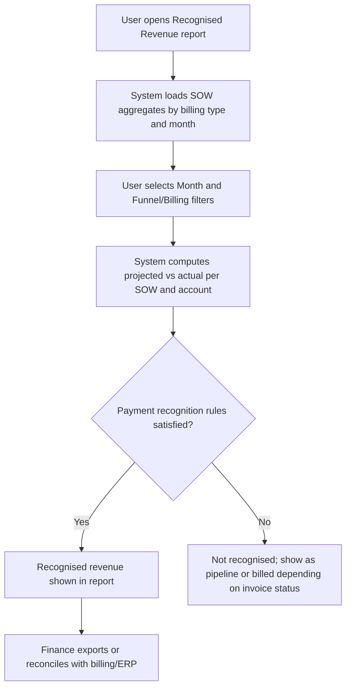

# Account & Revenue Management (RRE-UI)

## Business Overview
Factspan's RRE-UI account and revenue management screens provide Sales, Finance and Leadership with tools to create and manage accounts, maintain account hierarchy and team assignments, plan and track revenue at Account and SOW (Statement of Work) levels, and report recognised revenue vs billed vs pipeline. The features support account onboarding, enrichment (contact, heads, buying center, NPS stakeholders), account activation/inactivation workflows, account display ordering and team membership management. Revenue views provide funnel-stage filtering, SOW-level projections, actuals and KPIs for performance monitoring.

Objectives:
- Enable consistent account onboarding and enrichment to ensure revenue planning data quality.
- Provide clear workflows for account edits, approvals and activation/inactivation.
- Present revenue planning and tracking across SOW types (Net New, Current-New, Current) and billing models (Fixed Price, Time & Material).
- Surface recognised revenue, billed amounts and pipeline to Finance and Leadership for forecasting and KPI monitoring.

Target personas:
- Sales: create accounts, add SOWs, track funnel stage and pipeline, view account-level revenue.
- Finance: review recognised revenue, reconcile billed vs recognised, validate billing and payment terms.
- Leadership: view dashboards and KPIs, monitor account health and revenue performance.

Scope of this BRD section: account creation/enrichment/hierarchy, revenue planning & tracking at account and SOW level, recognised revenue reporting and dashboards as implemented in the referenced RRE-UI HTML and JS files.

---

## Functional Requirements

**FR-001**: The system shall allow authorized users to create a new account with mandatory fields: Account Name, Location, Buying Center, NPS Stakeholder, Account Head, Business Head, Delivery Head, Size.

**FR-002**: The system shall validate account name uniqueness during creation and display "Account already exists" if duplicate detected.

**FR-003**: The system shall support street-level billing attributes: Min Bill Rate (USCAN, IND) and Payment Term, editable during account creation and edit.

**FR-004**: The system shall allow users to save or cancel account creation and persist a "pending" state if approval workflows are required.

**FR-005**: The system shall allow authorized users to view a paginated account details table with columns: Account, MSA Signed, Location, Payment Term, Stake Holder, Account Head, Business Head, Delivery Head, Growth Members, Delivery Members, Size, Min Bill Rate (USCAN, IND), Actions.

**FR-006**: The system shall provide filters for account state: All, Active, Inactive, and persist selected filter (session) between workflows where applicable.

**FR-007**: The system shall allow account-level inline edit and full-page edit flows. Edits that change critical billing or heads trigger an approval workflow (edit_account API) and track edit/delete approval flags.

**FR-008**: The system shall allow activation / inactivation of accounts via a delete/activate action; actions may require approval and show user-facing confirmation dialogs.

**FR-009**: The system shall allow administrators to reorder active accounts with drag-and-drop and arrow-key reorder and persist account display order (save_account_order API).

**FR-010**: The system shall support assigning and managing Growth and Delivery team members per account with multi-select and the ability to add/remove membership; membership changes must be auditable.

**FR-011**: The system shall expose revenue planning pages supporting funnel stage multi-select filtering and SOW-level display for Net New, Current-New and Current SOWs.

**FR-012**: The system shall aggregate and display SOW totals per account including Projected Amount, Actual Amount, Resource counts (US, IND) and allow drill-down to SOW detail.

**FR-013**: The system shall support both Fixed Price and Time & Material recognised revenue views with separate tables and fields appropriate to the billing type (Projected Amount vs Actual Amount for Fixed Price; Hours, Leaves, Amount for T&M).

**FR-014**: The system shall allow exporting account details to Excel from account table.

**FR-015**: The system shall surface renewal actions (Renew button) for signed SOWs that are not already renewal flagged.

**FR-016**: The system shall provide role-based access to actions (edit, delete, view, reorder) and control visibility of action columns based on user role and access-page list.

**FR-017**: The system shall provide notes and audit log tabs per account to capture free-text notes and change history.

**FR-018**: The system shall enforce required validations on account update: MSA date present, Location selected, Payment Term selected, Stakeholder provided, Account Head/Business Head/Delivery Head selected, Size selected.

**FR-019**: The system shall handle account save/update API calls via edit_account/add_remove_account endpoints and reflect success/failure to the UI.

**FR-020**: The system shall support funnel-stage ordering and pre-select common funnel stages for revenue analysis (Qualified, Proposal, Signed, Renewal) while enabling user selection.

---

## User Roles & Permissions

- Sales (Standard User)
  - Create accounts, create SOWs, change funnel stage on SOWs
  - View account and revenue dashboards
  - Can request edits or inactivation (may require approval)

- Finance
  - View recognised revenue reports, billing dates, actual vs projected amounts
  - Export Excel reports

- Admin / Ops / Lead (Privileged)
  - Edit account details without approval where permitted
  - Reorder accounts display
  - Activate/Inactivate accounts (subject to approval rules)
  - Manage Growth/Delivery team assignments

Permission Matrix (summary):
- View pages: All roles with page access
- Edit account: Admin and users with edit access in access-page-list; edits may still trigger approvals
- Delete/Deactivate/Activate: Admin/Business head or steered via approver flow
- Reorder accounts: Admin only

---

## User Workflows & Journeys

### User Workflow: Account Onboarding (Create Account)

#### Workflow Steps:
1. User navigates to Account Creation page.
2. User enters Account Name, Location, Buying Center, NPS Stake Holder, Account Head, Business Head, Delivery Head, Size and optional billing details.
3. Client validates account name uniqueness and other required fields.
4. If validation passes, user saves; UI calls create account API.
5. Backend may require approval; if so, account is recorded as pending and approver notified; otherwise account is created active and visible in account list.

#### Business Rules Applied:
- BR-001: Account Name must be unique.
- BR-002: Mandatory fields must be present before save (Location, Payment Term, Account Head, Business Head, Delivery Head, Size).
- BR-003: If backend indicates approval required, account remains in pending state until approved.

---

### User Workflow: Account Edit & Approval

#### Workflow Steps:
1. User opens account from list and clicks Edit.
2. User updates fields (MSA date, location, payment term, stakeholder, heads, size, billing rates, growth/delivery members).
3. Client verifies required fields and compares against previous values to determine whether changes are critical.
4. For critical changes, the update is sent to edit_account endpoint and may be recorded as pending approval; non-critical changes may be committed immediately.
5. UI updates on success or shows pending state when approval is required.

#### Business Rules Applied:
- BR-004: Critical changes (billing rates, account heads, payment terms, size) must go through approval workflow.
- BR-005: All edits are logged in audit logs.

---

### User Workflow: Revenue Tracking & SOW Drill-down

#### Workflow Steps:
1. User navigates to Revenue Details.
2. System requests revenue_page API and populates UI with account-level and SOW-level data.
3. Funnel stage multiselect allows users to filter the SOWs displayed.
4. Aggregations and totals per account are shown including Projected, Actual and resource counts.
5. User can drill into SOW to view detailed dates, billing, actuals; Renew action shown where applicable.

#### Business Rules Applied:
- BR-006: Funnel stage filters drive which SOW sums are included; default preselection is Qualified, Proposal, Signed, Renewal.
- BR-007: Recognised revenue views must separate Fixed Price (Projected vs Actual) and T&M (hours and amounts).

---

### User Workflow: Recognised Revenue Reporting (Fixed Price example)

#### Workflow Steps:
1. User chooses month filter and billing type (Fixed/T&M).
2. System applies recognition rules (as implemented server-side) and displays recognised amounts at SOW and account level.
3. Items not meeting recognition criteria remain in pipeline/billed buckets as applicable.

#### Business Rules Applied:
- BR-008: Recognised revenue is determined by server-side recognition rules and displayed if rules are met.
- BR-009: Report must show clear separation: Recognised, Billed (invoiced), Pipeline (opportunity) amounts.

---

## Business Rules & Validations

**BR-001**: Account name must be unique across the system.

**BR-002**: Required account fields for create/update: Location, Payment Term, Stake Holder, Account Head, Business Head, Delivery Head, Size, MSA Signed (for update flows must be present).

**BR-003**: Billing rates (Min Bill Rate US/IND) are numeric and non-negative.

**BR-004**: Critical changes to billing, heads or size trigger approval workflow (edit_account API returns state indicating approval required).

**BR-005**: Account activation/inactivation actions require confirmation and may require approver sign-off. Results show in UI with pending indicators (DELETE_UNDER_APPROVAL, EDIT_UNDER_APPROVAL flags).

**BR-006**: Funnel-stage filtering controls which SOW sums are included in totals; if none selected treat as all stages.

**BR-007**: Recognised revenue vs billed vs pipeline must be distinctly reported; the UI depends on server-side recognition logic and flags.

**BR-008**: Growth/Delivery membership updates are processed as add/remove lists and must persist with status flags (ACTIVE_FLAG Y/N) and be auditable.

**BR-009**: Account display order is persisted via save_account_order API and used when showing Active accounts.

**BR-010**: Date fields follow MM-DD-YY UI format and are converted to normalized YYYY-MM-DD for API payloads.

---

## Data Entities (Business View)

### Account
- Attributes:
  - Account ID (unique)
  - Account Name
  - Location (India/US)
  - MSA Signed Date
  - Payment Term
  - Account Point of Contact (Stakeholder)
  - Factspan Account Head (employee ID + name)
  - Business Head (employee ID + name)
  - Delivery Head (employee ID + name)
  - Growth Members (list of employee IDs)
  - Delivery Members (list of employee IDs)
  - Account Size (classification)
  - Billing Data: [{LOCATION, BILLING_RATE}]
  - Account Active Flag (Y/N)
  - DELETE_UNDER_APPROVAL (flag)
  - EDIT_UNDER_APPROVAL (flag)
  - NOTES and Audit Logs

### SOW (Statement of Work) / Revenue Line
- Attributes:
  - SOW_ID, SOW_NAME
  - Account ID / Account Name
  - SOW Type (Net New, Current - New, Current)
  - SOW Stage (Lead, Qualified, Proposal, Signed, Renewal, Lost, Closed)
  - Probability
  - Legal Dates (start, end)
  - Billing Dates (start, end)
  - Actual Dates (start, end)
  - Number of Resources (US, IND)
  - SOW_AMOUNT, ACTUAL_AMOUNT, PROJECTED_AMOUNT
  - Billing Type (Fixed/Time & Material)
  - RENEWAL_FLAG

### RecognisedRevenue (Report row)
- Attributes:
  - Account ID, SOW ID
  - Month/Period
  - Recognised Amount
  - Billed / Invoiced Amount
  - Pipeline Amount
  - Billing Type
  - Reason or Comments

### Supporting Entities
- Employee: EMPLOYEE_ID, EMPLOYEE_NAME, role (Growth/Delivery/AccountHead)
- AccountOrder: list of ACCOUNT_ID for display

Data lifecycle and retention:
- Audit logs retained for change history per account; notes appended and presented in account tabs.

---

## Integration Points & Dependencies

- CRM (external) - ideally to sync account masters and buying center data (not directly shown in current UI, recommended integration)
- ERP/Billing system - to reconcile invoiced (billed) amounts with recognised revenue
- Backend APIs used by UI:
  - /view_all_account (get account list)
  - /get_account_order, /save_account_order (account display ordering)
  - /sow_input_drop_down (dropdown data for accounts, employees, billing defaults)
  - /edit_account (account update)
  - /add_remove_account (activate/deactivate)
  - /revenue_page (SOW and revenue aggregates)
- Authentication / Authorization - localStorage user-role and access-page-list drive UI action visibility

---

## User Interface Requirements

- Key screens: Account Creation page, Account Details table (list), Account Edit page, Revenue Details page, Recognised Revenue report.
- Account list must be searchable and pageable; toolbar allows entries per page and search term.
- Inline edit must hide/display edit fields vs read-only views (class toggles like "_show" and "_edit").
- Multi-select for funnel stage (revenue) and growth/delivery members with placeholder and clear options.
- Responsive: tables scroll and header stays sticky for long lists.
- Confirmation modals for destructive actions and reorder UI must support drag-and-drop and keyboard ordering.

---

## Non-Functional Requirements

- Performance: revenue_page and view_all_account calls should be optimized; UI captures API timings for telemetry.
- Security: actions gated by user role and per-page access list stored in localStorage; API calls should validate authorization server-side.
- Usability: default funnel stages preselected; inline edits provide clear Save/Cancel affordances and validation messages.
- Availability: Backend APIs must be available for live dashboards; offline behavior limited to client caches for short-lived sessions.

---

## Business Scenarios & Use Cases

**US-001**: As a Sales rep, I want to create a new account with contact, heads and size, so that I can attach SOWs and pipeline to it.
- Acceptance Criteria: Create page visible; mandatory fields validated; account appears in Account Details list after creation or as pending when approval required.

**US-002**: As an Account Manager, I want to update billing rates and growth members for an account, so that revenue planning reflects the correct rates and team.
- Acceptance Criteria: Edit page or inline edit available; required fields validated; edit triggers approval if critical and shows pending state.

**US-003**: As Finance, I want to see recognised revenue for a selected month and billing type, so that I can reconcile recognised numbers with billing.
- Acceptance Criteria: Recognised revenue report loads, applies funnel/billing filters, and exports to Excel.

**US-004**: As Leadership, I want to view account-level SOW totals and funnel stage breakdowns, so that I can understand pipeline progression.
- Acceptance Criteria: Revenue Details page aggregates SOWs per account and allows stage filtering and drill-downs.

---

## Error Handling & Edge Cases

- Duplicate account name -> show "Account already exists" and disallow save (client-side check during typing + server confirmation).
- Missing required fields -> show toaster error with field-specific message (MSA date, location, payment term, stakeholder, heads, size).
- API failures -> show toaster error, do not change UI state; retry option where applicable.
- Partial edits (only growth members changed) -> send access_data with only growth changes and mark only_growth flag.
- Reorder failure -> keep previous order and notify user that order save failed.

---

## Assumptions & Constraints

- Account master data is authoritative in RRE-UI; CRM sync is out-of-scope but recommended.
- Recognition rules for revenue are implemented server-side and UI consumes recognised/billed/pipeline flags from APIs.
- Access-page-list in localStorage accurately reflects server-side permissions; server must enforce final authorization.
- Date conversions: UI takes MM-DD-YY and converts to YYYY-MM-DD for API payloads.
- The UI relies on the provided APIs and dropdown endpoints to populate employee lists and defaults.

---

## Open Questions & Recommendations

- Q1: Which exact recognition rules are used server-side to classify recognised vs billed vs pipeline? (Recommend documenting in Finance integration doc.)
- Q2: Is there a need for audit trail retention policy (duration) for compliance?
- Q3: Should account creation support linking to external CRM IDs to avoid duplicates across systems?

Recommendations:
- Add a CRM sync job to keep account masters consistent.
- Add an explicit UI column for "Pending Approval" status on account lists to make approval states more visible.
- Add filters for Renewal Flag and SOW Type in revenue pages for quicker analysis.

