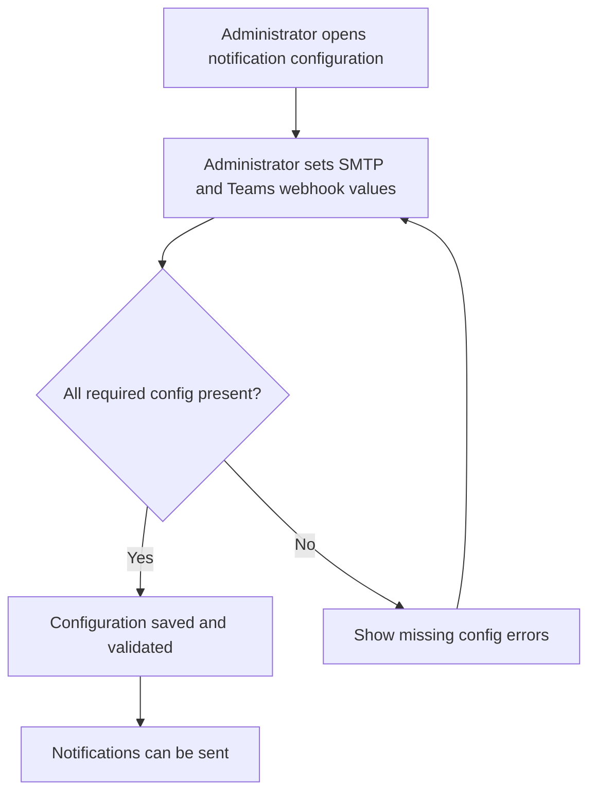
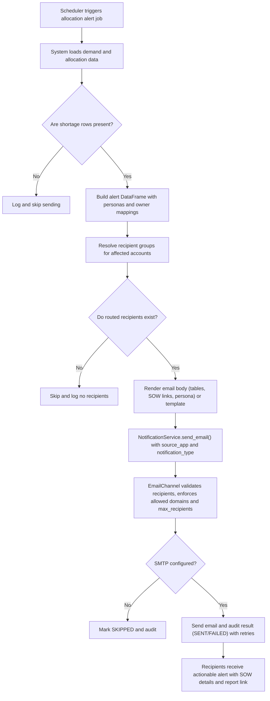
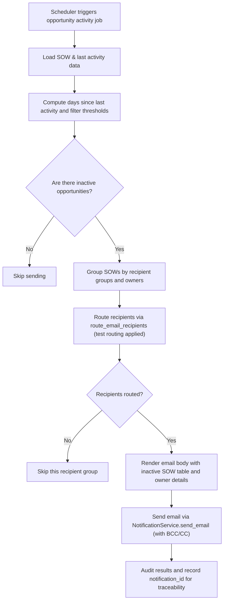
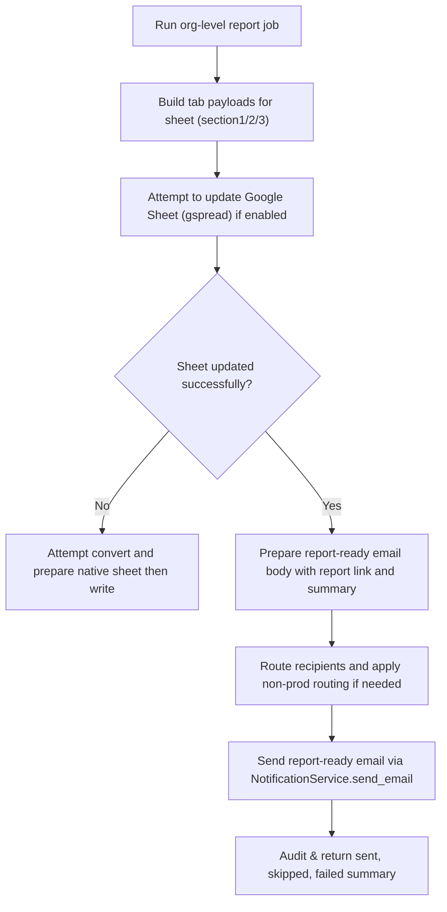

# Notification & Alerting — ARCUS RRE

## Business Overview

The Notification & Alerting framework delivers timely business-critical communications for the RRE platform. It centralizes generation and delivery of alerts (allocation shortages/excesses, opportunity inactivity, org-level allocation reports and similar business events) and supports multiple channels (Email, Microsoft Teams, and placeholders for SMS/Slack/WhatsApp). The framework separates business event detection (alerts modules) from delivery (notification_service) so business teams and administrators can rely on consistent formatting, routing, retrying, and audit logging.

Target users / personas
- System: scheduled jobs and cron processes that detect business events and create alert payloads.
- Delivery Head / Business Head / Growth members: recipients of allocation and pipeline alerts.
- Opportunity / Account owners and partners: recipients of opportunity activity alerts.
- Report owners / Admins: configure report recipients, review and act on alerts.
- Platform Administrator: manages notification configuration (SMTP, Teams webhook, allowed domains, audit settings).

Business value
- Early detection of revenue-at-risk events (allocation shortages) and pipeline stagnation.
- Standardized, auditable notifications across channels to ensure accountability and follow-up.
- Ability to route and test emails (non-prod routing) to prevent accidental production emails.

Scope
- Includes: alert generation code under alerts/ (allocation_shortage_excess_alert, opportunity_activity_alert, org_level_allocation_report_alert) and the generic notification_service (email, Teams channels, templating, provider factory, audit hooks).
- Excludes: cnps, nps, recommendation_service, poc_request_services, teams_service (except as channel provider), reports_service, authentication_service, allocation_services internals beyond their use by alerts.

---

## Functional Requirements

**FR-001**: The system shall allow business modules to submit a NotificationRequest with channel, recipients, subject, body or templateName and templateData.

**FR-002**: The system shall support delivery to Email and Microsoft Teams channels.

**FR-003**: The system shall validate NotificationRequest: channel and recipients required; for EMAIL, subject is required; either body or templateName must be provided.

**FR-004**: The system shall render HTML templates with substitution placeholders using {{key}} semantics and escape HTML by default, allowing SafeHtml keys to bypass escaping.

**FR-005**: The system shall resolve recipients against allowed domains and apply default CC and max_recipients limits before sending emails.

**FR-006**: The system shall retry transient delivery failures using configurable max_attempts and exponential/backoff seconds.

**FR-007**: The system shall record every send attempt in an audit backend (file or DB) including status (SENT, FAILED, SKIPPED), recipients, notification_id, and timestamp.

**FR-008**: The system shall allow business alert modules to call send_email, send_email_from_template, send_teams, or notify(channels, payloads) to route messages to multiple channels.

**FR-009**: The system shall skip sending (SKIPPED) and log a result when no valid recipients are resolved or when channel-specific configuration (SMTP or Teams webhook) is missing.

**FR-010**: The system shall allow alerts to include metadata such as source_app, notification_type, and reference_id for downstream filtering and traceability.

**FR-011**: The system shall support a synchronous send contract and an enqueue() async extension point that returns PENDING when queueing is not configured.

**FR-012**: Allocation and opportunity alert jobs shall build role-aware recipient lists (owners, business head, delivery head, growth members) and route them via route_email_recipients (supports non-prod routing and recipient mapping).

**FR-013**: The system shall include templated email bodies containing account, SOW name, shortage/excess numbers, personas, owner contact information and an as_of date to provide clear business context to recipients.

**FR-014**: Org-level allocation report process shall update a Google Sheet and send a "report ready" alert with a link to the sheet to delivery heads and configured recipients.

**FR-015**: Opportunity Activity alerts shall run weekly/auto and include inactivity thresholds; they shall include a table of inactive SOWs, days since activity, and owner details.

**FR-016**: The system shall support test / dry-run modes where emails are routed to TEST_RECIPIENTS or masked using non-prod routing to avoid accidental production sends.

**FR-017**: The system shall allow per-alert custom CC and BCC lists (e.g., BCC to support@ email addresses) for compliance or awareness.

**FR-018**: The system shall validate email addresses using a standard regex and filter out invalid addresses prior to dispatch.

**FR-019**: The system shall allow administrators to configure SMTP host/port/sender/password, Teams webhook URL, allowed domains, max recipients, retry/backoff and audit settings via notification.yaml or environment variables.

**FR-020**: The system shall expose notification priority levels (LOW, NORMAL, HIGH, CRITICAL) for future use in routing and escalation rules (present in the model even if not currently leveraged by alerts).

---

## User Roles & Permissions

Administrator
- Can configure notification settings (SMTP, Teams webhook URL, allowed domains, default CC, max_recipients, retry policy, audit backend).
- Can enable/disable async mode and non-prod email routing (via common_config feature flags).

Report Owner / Delivery Head / Business Head / Growth member
- Receive alerts relevant to their accounts/SoWs.
- Can be listed as recipients in per-alert recipient resolution queries.

System (Automated jobs)
- Runs scheduled alert jobs (daily/weekly/auto) that compute event data and call the NotificationService.

Permission & access notes
- Notification delivery relies on configured SMTP/Teams credentials; access to these secrets must be restricted to Administrators.
- Allowed domains restrict recipients to corporate domains to prevent external leakage.

---

## User Workflows & Journeys

### User Workflow: Configure Notification Channels

#### Workflow Steps:
1. Administrator updates notification.yaml or environment variables with SMTP, sender credentials, allowed domains and Teams webhook URL.
2. System validates key fields (smtp_host, smtp_sender, smtp_password) when attempting to send email.
3. If validation fails, administrators receive errors and must fix configuration.
4. Once valid, notification jobs can send messages via email and Teams.

#### Business Rules Applied:
- BR-001: SMTP sender, host and password must be configured before EMAIL sends are permitted.
- BR-002: Teams sends require a webhook URL.

---

### User Workflow: Allocation Alert Generation & Delivery

#### Workflow Steps:
1. Scheduler (cron) runs AllocationShortageExcessAlert with mode (auto/daily/weekly).
2. Alert job computes shortages/excesses, persona summaries and owner mappings.
3. Recipient groups are resolved via DB queries and route_email_recipients (supports non-prod routing).
4. If recipients exist, an HTML email is composed (tables of SOWs, shortage counts, persona and owner links).
5. NotificationService validates and sends email via SMTP, with retries/backoff; results are audited.
6. If configured, an org-level Google Sheet is updated and a report-ready email is sent.

#### Business Rules Applied:
- BR-003: Only SOWs with active statuses (Signed, Renewal) are considered for allocation shortage alerts.
- BR-004: Shortage-only rows trigger daily alerts; excess-only results do not trigger shortage alerts unless configured for weekly reports.
- BR-005: Non-production environments can route emails to test recipients to prevent accidental production emailing.

---

### User Workflow: Opportunity Activity Weekly Alert

#### Workflow Steps:
1. Weekly job computes opportunities that have not had activity beyond configured thresholds (30/90 days).
2. Data is grouped per recipient ownership and filtered against excluded statuses.
3. Emails are built per-owner including a table and routed recipients; test routing is applied if enabled.
4. Emails are sent and results audited; failures and skips are recorded for follow-up.

#### Business Rules Applied:
- BR-006: Opportunity SOWs with excluded statuses (e.g., SIGNED, LOST, CLOSED) are not included.
- BR-007: Recipient groups include fallback emails and escalation flags to include senior leaders (e.g., include_nitin).

---

### User Workflow: Report Ready (Org-level Allocation Report)

#### Workflow Steps:
1. Report job constructs tab payloads and updates a central Google Sheet.
2. The job computes recipients (delivery heads) and routes addresses via the routing utility.
3. A report-ready email containing the report link and summary is sent to recipients.
4. If the sheet update fails due to an Office file format, conversion is attempted and the link updated.

#### Business Rules Applied:
- BR-008: Org-level reports must be delivered to delivery heads for accounts included in the report.
- BR-009: If recipients cannot be resolved or routed (skip_email), no report-ready email is sent.

---

## Business Rules & Validations

**BR-001**: SMTP sender (NOTIF_SMTP_SENDER), host (NOTIF_SMTP_HOST) and password (NOTIF_SMTP_PASSWORD) must be set for email sends.

**BR-002**: Teams sends require NOTIF_TEAMS_WEBHOOK to be configured or payload.webhook_url provided.

**BR-003**: NotificationRequest must include channel and at least one recipient.

**BR-004**: EMAIL notifications require a subject. Either body or templateName must be present.

**BR-005**: Recipients are filtered by allowed_domains if configured; invalid email formats are excluded.

**BR-006**: The system will not attempt more than max_recipients per notification (configurable).

**BR-007**: Alerts should run in dry_run mode to preview recipients and content without sending; test routing MUST be used for non-prod.

**BR-008**: All send attempts are audited with status and retry_count for observability.

**BR-009**: Notification priority is available on the request object but alerts currently do not alter routing/escalation automatically based on it.

**BR-010**: Templating escapes HTML by default; only SafeHtml or keys listed in safe_html_keys bypass escaping.

---

## Data Entities (Business View)

### NotificationRequest
- channel: Email/Teams/SMS etc.
- recipients: list of addresses or webhook targets
- subject, body or template_name
- template_data: substitution context
- cc, bcc
- priority (LOW, NORMAL, HIGH, CRITICAL)
- source_app, notification_type, reference_id
- notification_id

### NotificationResult (audit)
- notification_id, channel, status, sent_to, sent_at, error_message, retry_count, metadata

### Alert (business concept)
- alert_type (e.g., ALLOCATION_SHORTAGE, OPPORTUNITY_ACTIVITY)
- as_of_date, affected_accounts, row_counts (shortage/excess)
- recipients/resolution (owners, heads, growth members)
- report_link (optional)

Data lifecycle
- Audit logs written to file or DB and retained per audit backend policy (configurable). Templates are stored in templates/ folder and sourced by name.

---

## Integration Points

- allocation_services / bench_service: provide demand/allocation data used to detect shortages (alerts call into these services).
- common_config utilities: route_email_recipients and is_non_prod_email_routing_enabled affect routing rules.
- Google Sheets (gspread / Google API): org-level report updates and link sharing.
- teams_service only as configuration reader/utility in some report modules; Teams channel posts via webhook configured in notification.config.
- SMTP provider (Gmail app password or other SMTP host) used for actual email delivery.

---

## User Interface Requirements

Key screens (business view):
- Notification configuration screen (SMTP host/port/sender, allowed domains, Teams webhook, default CC, retry settings, audit settings).
- Alert management dashboard (list of recent notifications with status, notification_id, timestamp and recipients).
- Report viewer that links to Google Sheet and shows last run summary.

Display requirements
- Emails must contain a clear subject, summary paragraph, tabular details for SOWs, and an as_of date.
- Teams cards must contain title and activityText summarizing the alert.

---

## Non-Functional Requirements

**NFR-001**: Delivery retries: the notification service shall attempt up to configured max_attempts (default 3) with backoff_seconds (configurable) between retries.

**NFR-002**: Response time: synchronous sends should complete within a reasonable timeout (email SMTP and Teams webhook calls use network timeouts configured in respective libraries).

**NFR-003**: Security: SMTP credentials and Teams webhooks must be stored securely and restricted to administrators.

**NFR-004**: Scalability: The design provides an enqueue() extension point for async processing via SQS/RabbitMQ/Redis streams to scale sends.

**NFR-005**: Observability: All notifications are audited (file or DB) including status, recipients, and retries for troubleshooting.

---

## Business Scenarios & Use Cases

**US-001**: As a Delivery Head, I want to receive allocation shortage alerts for my accounts so that I can address resource gaps promptly.
- Acceptance Criteria: Email contains account name, SOW name, shortage counts, personas, owner contact and a link to the org-level report if available.

**US-002**: As a Growth Member, I want weekly opportunity inactivity reports so that I can follow up on stalled deals.
- Acceptance Criteria: The report lists SOWs with last activity date, days since activity, owner name and contact.

**US-003**: As an Administrator, I want to enable non-prod routing so that automated jobs do not send production emails during development or testing.
- Acceptance Criteria: When non-prod routing is enabled, route_email_recipients substitutes real recipients with test addresses and includes a preview in the email body.

---

## Error Handling & Edge Cases

- Invalid recipient addresses are filtered; if no valid recipients remain, the notification is SKIPPED and audited with a reason.
- Missing SMTP or Teams configuration causes a SKIPPED result and records an error message in audit logs.
- Transient network errors trigger retries; final failure is recorded with error_message and retry_count.
- Large recipient lists are truncated to max_recipients to prevent accidental mass emails.

---

## Assumptions & Constraints

- Routing utilities (common_config) implement non-prod routing and recipient mapping; this BRD documents expected behavior but configuration lives outside notification_service.
- Notification priority is present in models for future routing/escalation but is not currently used by alerts to change behavior.
- Template engine is intentionally lightweight; more advanced templating (conditional logic, loops) is not available without migration to a richer engine.

---

## Open Questions & Recommendations

1. Recommendation: Implement programmatic severity-to-escalation mapping that translates NotificationPriority or business thresholds (e.g., shortage count > X) into escalations (add senior leaders, raise priority, trigger SMS/Teams pings).
2. Recommendation: Expose an administrative UI to manage templates, default CC and allowed domains safely rather than editing yaml/env.
3. Open Question: Define SLA expectations for "time to notify" after an event is detected (currently immediate within job run; define business SLA windows for P1/P2 events).

---

## Files inspected
- notification_service/models.py — NotificationRequest, NotificationResult, EmailPayload, TeamsPayload, enums
- notification_service/service.py — NotificationService: send, enqueue, send_email_from_template, notify, retry behavior
- notification_service/provider_factory.py — provider selection
- notification_service/config.py — NotificationConfig and validation
- notification_service/channels/email_channel.py — EmailChannel: validation, recipient filtering, SMTP dispatch
- notification_service/channels/teams_channel.py — TeamsChannel: webhook card build and dispatch
- notification_service/templates/engine.py — TemplateEngine: render, render_string
- alerts/allocation_shortage_excess_alert.py — AllocationShortageExcessAlert: data assembly and send_consolidated_alert usage
- alerts/opportunity_activity_alert.py — OpportunityActivityAlert: weekly report, recipient groups and send_alert
- alerts/org_level_allocation_report_alert.py — OrgLevelAllocationReportAlert: sheet update and report-ready email

