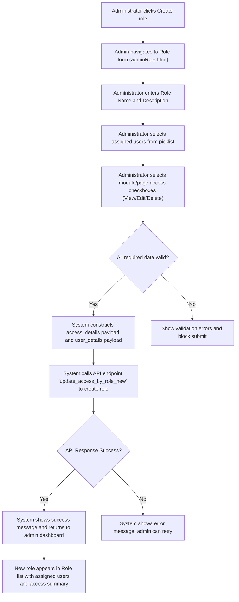
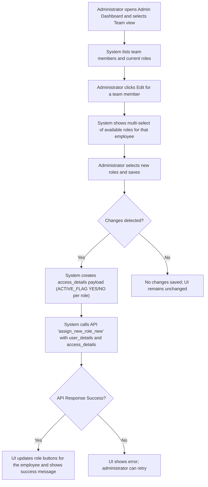
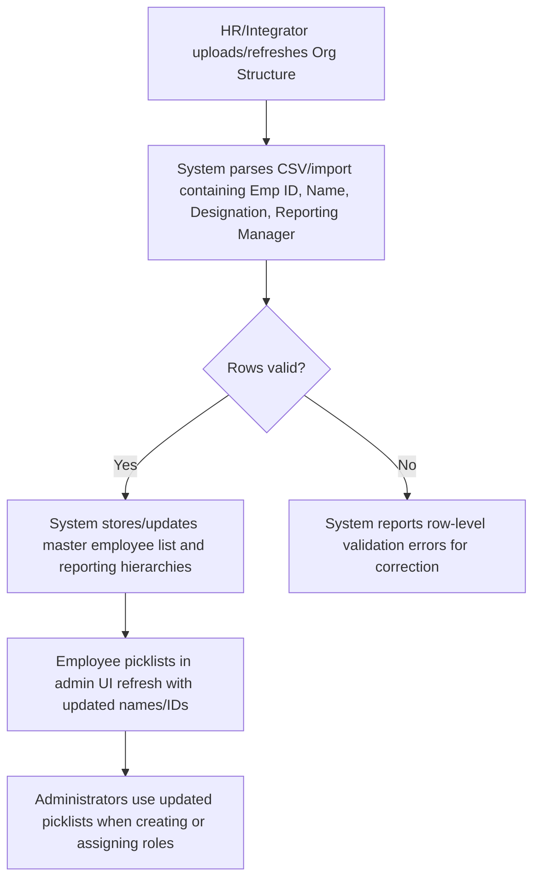

# Admin & Configuration — RRE-UI

## Business Overview
RRE-UI provides centralized administrative capability to manage access, roles, and organizational configuration used across the ARCUS application. The admin area enables creation and maintenance of access roles (page/module level), assignment of roles to users (employees/team members), and monitoring via an admin dashboard. Master/reference data for organization structure (employees, reporting relationships, designations) is used to populate assignment lists and support role-user relationships.

Primary business objectives:
- Control who can view, edit, and delete features at a module/page level through reusable roles.
- Provide administrators with simple UI to create/update roles and assign or remove users from roles.
- Maintain an authoritative organization structure and use it as a source for role assignment and reporting.
- Provide monitoring (admin dashboard) to view role distributions and employee-role assignments.

Target users / personas:
- Administrator: creates/edits roles, assigns users, configures module access.
- Role Manager: defines page/module access rules and access levels (view/edit/delete).
- HR / Identity Integrator: maintains org data (employees, reporting manager, designation) and ensures it is available for assignment.
- Regular User: consumes assigned access; not part of admin flows.

Scope of this document: role/permission administration, org-structure configuration, reference/master data management and admin dashboard monitoring available in the RRE-UI source files examined.

---

## Functional Requirements
- **FR-001**: The system shall allow Administrators to view the list of defined roles and the users assigned to each role from the Admin Dashboard.
- **FR-002**: The system shall allow Administrators to create a new role with a unique role name, description, module/page-level access selections, and an initial set of assigned users.
- **FR-003**: The system shall allow Administrators to edit an existing role's description, module/page access, and assigned users.
- **FR-004**: The system shall allow Administrators to assign one or more roles to a user and to remove roles from a user.
- **FR-005**: The system shall support access levels for modules/pages including at minimum: "view", "edit", and "delete".
- **FR-006**: The system shall persist role page-access data in a structure containing PAGE, ACCESS_TYPE, ACCESS_LEVEL, ACCESS_PAGE and ACTIVE_FLAG.
- **FR-007**: The system shall produce API payloads when creating/updating roles and assignments that include user_details, access_details and old_details to support server-side processing and audit.
- **FR-008**: The system shall present a searchable table of roles and a separate table of users (team members) to support switching between Role-centric and Team-centric views.
- **FR-009**: The system shall prevent non-admin users from accessing admin UI; when access check fails the system redirects to home.
- **FR-010**: The system shall expose an Admin Dashboard with summary cards and a detailed table for monitoring account/SOW level metrics and supporting comment/history popups.
- **FR-011**: The system shall support import/consumption of organization master data (employee list with Emp ID, Designation, Reporting Manager) to populate assignment picklists.
- **FR-012**: The system shall mark role assignment changes as ACTIVE_FLAG "YES" (added) or "NO" (removed) in the update payload.
- **FR-013**: The system shall provide both bulk ("All Module Access") and per-module checkboxes to grant view/edit/delete access for modules.

---

## User Roles & Permissions
- Administrator
  - Full access to Admin Dashboard screens
  - Create, update, delete roles
  - Assign/unassign users to roles
  - View admin monitoring and API timings
- Role Manager
  - Create/edit role page access and descriptions
  - Assign users to roles (if permitted)
- HR / Identity Integrator
  - Provide and maintain org-master data (employee list, reporting manager, designation)
  - Import or update Org Structure CSV used by the UI
- Regular User
  - Not permitted to access admin pages; has assigned role(s) to control app behavior

Permission model notes:
- Permissions are applied at module/page level and map to access types: "view", "edit", "delete".
- Roles are collections of page access definitions and a set of assigned users.

---

## User Workflows & Journeys

### User Workflow: Create Role (Role Setup)

#### Workflow Steps:
1. Administrator opens Admin Dashboard and selects Create Role (or navigates directly to adminRole.html).
2. Administrator fills Role Name, Description, chooses users from the team picklist and selects page/module-level access (view/edit/delete) for modules.
3. System validates required fields (role name, at least one access or assigned user depending on policy) and builds JSON payload.
4. System submits to backend API; on success the role is persisted and visible in role list.

#### Business Rules Applied:
- BR-001: Role Name must be non-empty and treated as a unique identifier.
- BR-002: Each module access entry must include PAGE, ACCESS_TYPE and ACTIVE_FLAG.
- BR-003: Assigned users are submitted with ACTIVE_FLAG="YES" for new assignments.

---

### User Workflow: Assign/Update Roles for a User (Team-centric)

#### Workflow Steps:
1. Administrator switches to Team view to see employees and their assigned roles.
2. Administrator chooses an employee and edits their role selection via multi-select.
3. System computes added and removed roles; constructs API payload marking ACTIVE_FLAG for additions/removals.
4. System calls assign_new_role_new; on success UI refreshes to show updated role badges.

#### Business Rules Applied:
- BR-004: Role assignment updates must include both old_details and new access_details for audit.
- BR-005: When removing a role, the system must set ACTIVE_FLAG="NO" in the payload so server can process removal.

---

### User Workflow: Maintain Organization Structure (Master Data)

#### Workflow Steps:
1. HR/Identity owner provides Org_Structure.csv or updates the HR system that feeds the master data.
2. The import process validates required columns (Emp ID, Name) and reporting relationships.
3. The system updates the ALL_USERS list used by admin screens and reflect those employees in role assignment picklists.

#### Business Rules Applied:
- BR-006: Employee records must include a unique EMP ID used as the assignment key.
- BR-007: Reporting Manager references (by name or ID) must resolve to existing employee entries or be empty for top-level roles.
- BR-008: Org data update must not break existing role assignments - if an EMP ID changes, reconciliations must be flagged.

---

## Business Rules & Validations
- **BR-001**: Role Name must be unique and non-empty.
- **BR-002**: Role Description may be empty but changes are audited; role modification flag (ROLE_MODIFIED) is used in update payloads.
- **BR-003**: Access types supported are "view", "edit" and "delete"; module access is hierarchical (module -> page endpoint).
- **BR-004**: When roles are assigned/removed, payloads include ACTIVE_FLAG with values "YES" (assignment) or "NO" (removal).
- **BR-005**: Update payload must include old_details (prior assignment state) to enable server-side audit and rollback checks.
- **BR-006**: Employee must be identified by EMPLOYEE_ID when assigning roles; names are for display only.
- **BR-007**: Bulk selects (All_view/All_edit/All_delete) toggle per-module page checkboxes.
- **BR-008**: Only users with an "admin" role (client-side check uses localStorage user-role) are allowed to view admin UI; non-admins are redirected.
- **BR-009**: API call timings are captured client-side (getApiTime) for monitoring; slow or failed calls must be surfaced.

---

## Data Entities (Business View)

### Role
- Attributes:
  - ROLE_ID (string) — unique identifier assigned by backend
  - ACCESS_ROLE (string) — human-friendly role name (unique)
  - DESCRIPTION (string)
  - ACCESS_ON (string) — comma-separated module names or summary
  - PAGE_ACCESS_DATA (array of PageAccess records)
  - ACCESS_ROLE_DATA (array of assigned-user records)
  - ROLE_MODIFIED (YES/NO)

### PageAccess (part of Role.PAGE_ACCESS_DATA)
- PAGE (string) — module/page name
- ACCESS_TYPE (string) — "view","edit","delete" (or combinations)
- ACCESS_PAGE (string) — endpoint identifier
- ACCESS_LEVEL (string) — role access level
- ENVIRONMENT_ACCESS (string) — environment label from client (apiValue.environment)
- ACTIVE_FLAG (YES/NO)

### Permission
- Represented as combination of PAGE + ACCESS_TYPE. Permissions are not standalone objects in UI but implied by PageAccess entries.

### User / Employee (master data)
- EMPLOYEE_ID (string) — unique identifier used for assignments
- EMPLOYEE_NAME (string)
- EMAIL_ID (string)
- JOB_ROLE / DESIGNATION (string)
- DEPARTMENT (string)
- REPORTING_MANAGER (string or EMPLOYEE_ID)
- ACTIVE_FLAG (YES/NO)

### Org Unit / Location (business constructs)
- The UI consumes a flat employee CSV; higher-level org units (Business Unit, Practice, Location) are expected as master attributes or additional reference tables. If not present they must be introduced in the master data feed.

Data lifecycle & retention:
- Role definitions and assignment history must be auditable. The client already captures old_details in payloads; server should store audit trail and retain records per corporate policy.

---

## Integration Points
- API endpoints (observed in JS code):
  - POST /admin_dashboard_by_role — fetch role-centric dashboard data
  - POST /admin_dashboard_by_employee — fetch employee-centric dashboard data
  - POST /all_roles_details — fetch all roles, all users and module metadata
  - POST /assign_new_role_new — assign roles to a user (create/update/delete semantics)
  - POST /update_access_by_role_new — create/update role definitions and assigned users
- Identity & HR systems:
  - Org master data (employee list, reporting lines) must be synchronized; UI expects EMPLOYEE_ID as stable key.
- Audit & Monitoring:
  - Client calls getApiTime(...) to capture API durations and outcomes — server should accept and surface or log these metrics.
- Third-party UI components:
  - Select2 multi-select used for assignment picklists, DataTables for role lists, Toastr for notifications.

---

## User Interface Requirements
- Screens:
  - Admin Dashboard (adminDashboard.html): summary cards, filter pills, details table, comment/history popup.
  - Role & Team list (admin.html): toggle between Role and Team view, search box, create role button, edit/update actions inline.
  - Role form (adminRole.html): Role Name, Description, Assigned Users multi-select, module/page-level checkboxes, Create/Edit buttons.

Key UI controls:
- Radio toggle for Role vs Team view (calls getRoleTeamData)
- Role list table with inline Edit/Update buttons and per-role multi-select for assigned users (Select2)
- Role form with "All Module Access" shortcuts and per-module page checkboxes
- Validation: restrictSpecialCharactersById used on role name/description to avoid special characters

Accessibility & responsiveness:
- Tables should remain readable; admin pages include responsive CSS and sticky headers for long lists.

---

## Non-Functional Requirements
- Performance: APIs used by admin screens should respond quickly; client captures API times. Role list rendering should handle 100s of roles without UI locking.
- Security:
  - Only authorized admin users may view/modify roles; client checks localStorage for user-role but server must enforce.
  - All role changes must be transported over TLS and audited server-side.
- Availability: Admin functions should be available during business hours; non-critical operations can be queued if backend is down.
- Scalability: Multi-select picklists and tables should scale to thousands of employees with server-side paging if necessary.

---

## Business Scenarios & Use Cases
- **US-001**: As an Administrator, I want to create a role named "Revenue Reviewer" and grant view access to revenue pages so that reviewers can see data without editing.
  - Acceptance Criteria: Role created via role form, PAGE_ACCESS_DATA contains correct PAGE and ACCESS_TYPE, role appears in role list.

- **US-002**: As a Role Manager, I want to assign multiple users to an existing role so they immediately get the appropriate permissions.
  - Acceptance Criteria: Assignments POST to assign_new_role_new include ACTIVE_FLAG values and UI updates to show role badges for the users.

- **US-003**: As HR Integrator, I want to update Org_Structure.csv so that new joiners appear in the admin picklist for assignment.
  - Acceptance Criteria: After update/import, the ADMIN UI picklist includes new employees by EMPLOYEE_ID and name.

---

## Error Handling & Edge Cases
- If an API call fails (network or server error) the UI shows an error toast and does not commit the change locally.
- If role create/update payload is rejected by server (duplicate role name), display server message and keep admin on form.
- When an employee record referenced in an assignment is missing or EMPLOYEE_ID mismatch occurs, the system must flag reconciliation errors during import.
- Concurrent updates: if two admins edit a role concurrently, last-write-wins unless server enforces optimistic locking — recommend server track modification timestamps.

---

## Assumptions & Constraints
- The client performs a superficial check for "admin" role in localStorage; server-side authorization is assumed and mandatory.
- The master Org Structure CSV is a source for ALL_USERS; the product currently expects EMPLOYEE_ID as stable key.
- Module/page metadata (all_modules_html, ALL_MODULE_LST) is provided by /all_roles_details API and drives per-page checkbox rendering.
- Role creation and assignment use backend APIs on port 5006; the backend enforces uniqueness and audit.
- Location/Practice/Business Unit attributes are not present in the supplied Org_Structure.csv and must be added to master feeds if required.

---

## Open Questions & Recommendations
- Q1: Is EMPLOYEE_ID guaranteed stable across HR exports? If not, request a canonical unique identifier.
- Q2: Is there a server-side constraint preventing removal of the last admin? Implement guard rails if missing.
- Recommendation: Move admin role checks from client-side localStorage to a short-lived token-based access check to prevent spoofing.
- Recommendation: Server should provide endpoints to import/update org structure and return row-level validation errors to the UI.

---

## Files Referenced in this BRD
- admin.html — Role & Team list UI; toggles and create role action
- adminRole.html — Role creation/edit form and per-module access controls
- adminDashboard.html — Admin monitoring, summary cards and detail table
- js/admin.js — client logic for listing roles, team members, assigning roles, and calling role-related APIs
- js/adminRole.js — client logic for role form rendering, module checkbox generation, and create/update payloads
- Org_Structure.csv — example organization master data used to populate ALL_USERS picklist

