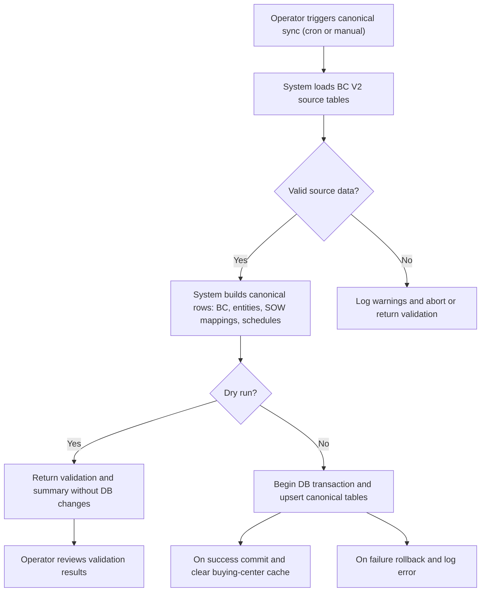
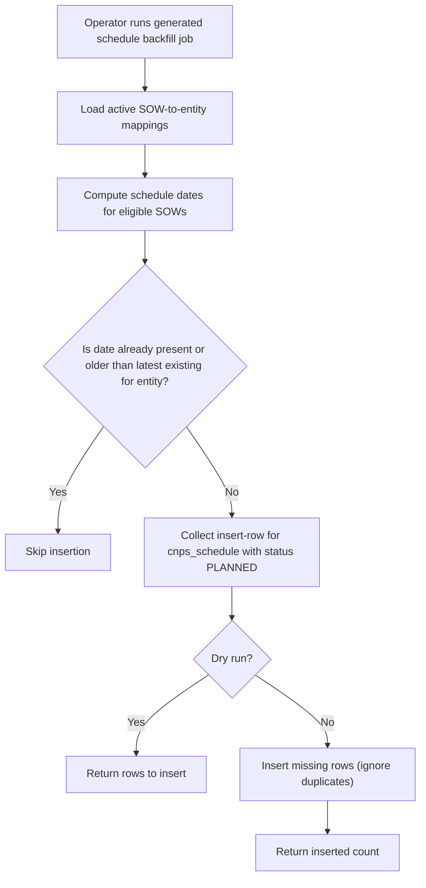
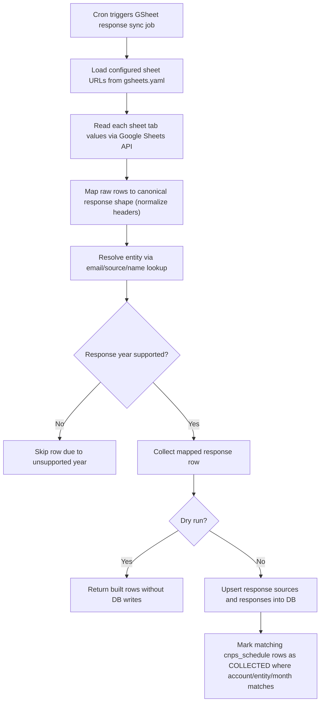
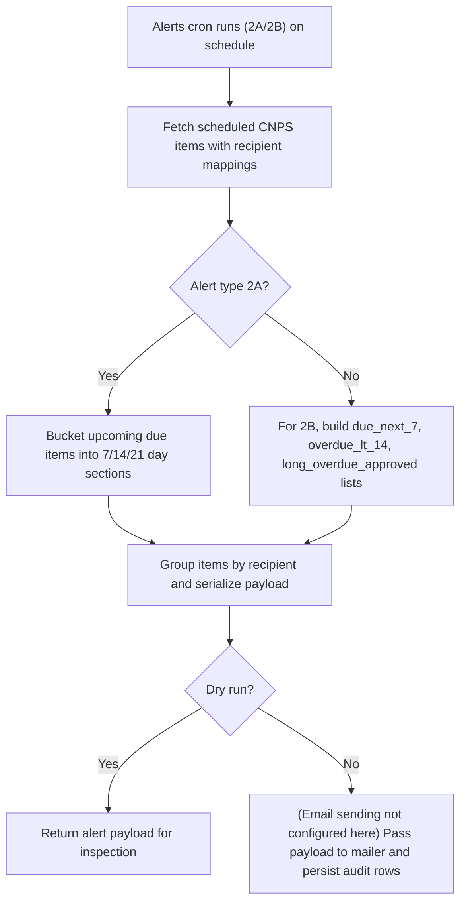

# CNPS Planning & Scheduling

## Business Overview

CNPS (Canonical Customer NPS) Planning & Scheduling provides a canonical read/write model for planning Customer NPS (CNPS) surveys at the SOW and Buying-Centre (BC) level, scheduling recurring or generated survey dates, collecting responses (primarily via Google Sheets), marking schedule items as collected, and producing alerts for upcoming or overdue CNPS items. The module's business objectives are to ensure timely customer feedback collection, assign stakeholder responsibility, and surface overdue or at-risk CNPS items to internal owners.

Target users / personas:
- Account Managers / Engagement Owners: configure and review CNPS schedules for SOWs and Buying Centers; respond to alerts.
- Delivery Partners / DP Recipients: receive reminders and alerts (2A/2B) about upcoming or overdue CNPS to follow up with stakeholders.
- Planning Admins / System Operators: run canonical syncs, backfills, and sheet-response ingestion jobs via cron or tools.
- Data & Reporting Teams: consume canonical CNPS tables and summary endpoints for downstream reporting.

Scope:
- Scheduling and lifecycle of CNPS items (cnps_schedule)
- SOW and stakeholder canonical mappings (cnps_sow_mapping, cnps_entity)
- Alerts and reminder payloads (2A account-level, 2B org-level)
- Response ingestion from Google Sheets (gsheet ingestion, mapping, matching)
- Sync from BC V2/source systems into canonical CNPS tables (daily or on-demand)

Out of scope (per task restrictions): legacy nps package and unrelated services (allocation, bench, recommendation, teams, notifications, reports, auth)

## Functional Requirements

**FR-001**: The system shall build and maintain canonical CNPS master data (buying centers, entities, SOW mappings, stakeholders) from BC V2 source systems.

**FR-002**: The system shall generate planning schedule rows (cnps_schedule) for approved/eligible SOW-stakeholder mappings according to SOW type and legal start/end dates.

**FR-003**: The system shall provide a safe backfill mode that inserts only missing generated schedule rows without modifying existing schedules.

**FR-004**: The system shall ingest CNPS response rows from configured Google Sheets, map them to canonical entities, and persist sources and responses to cnps_response_source and cnps_response.

**FR-005**: The system shall mark scheduled CNPS items as COLLECTED when a matched response exists for the same account, entity, and month.

**FR-006**: The system shall produce alert payloads for two alert types: 2A (account-level upcoming within 7/14/21 day buckets) and 2B (org-level: due next 7 days, overdue <14 days, long overdue approved stakeholders) for consumption by downstream mailer/renderer.

**FR-007**: The system shall support dry-run mode for sync, backfill, ingestion, and alert jobs to allow validation without DB writes.

**FR-008**: The system shall persist alert run audit rows and recipient/item logs for traceability of alert execution (cnps_alert_run, cnps_alert_recipient_log, cnps_alert_item_log).

**FR-009**: The system shall allow scoping syncs and backfills by account_id and bc_id.

**FR-010**: The system shall expose endpoints (canonical blueprint) to read planning grids, buying-center views, and summaries for UI consumption.

**FR-011**: The system shall clear cache of buying-center responses when canonical syncs are committed.

## User Roles & Permissions

- Account Manager / Engagement Owner
  - Can view planning grid and buying-center engagement
  - Can review scheduled CNPS items for SOWs they own
  - Receives alert reminders via email (2A scoped to account) when configured

- Delivery Partner / Recipient
  - Receives alert payloads listing scheduled CNPS items assigned to them
  - Can act to collect survey responses from stakeholders

- Planning Admin / System Operator
  - Can run sync, backfill, and ingestion cron jobs (dry-run or commit)
  - Can configure Google Sheet sources via gsheets.yaml
  - Responsible for running alerts cron

- Data/Reporting Consumer
  - Read-only access to canonical CNPS tables and summary endpoints

Permissions:
- Read access to canonical tables is available to UI and reporting services
- Write access to canonical tables is restricted to sync and ingestion jobs executed by system operators

## User Workflows & Journeys

### User Workflow: Create/Run CNPS Canonical Sync

#### Workflow Steps:
1. Operator schedules or runs cnps_canonical_sync_cron.py (cron daily or on-demand).
2. System reads source BC tables, stakeholders, hierarchy, sows.
3. System builds canonical rows and validates the build.
4. If dry-run, return validation; if commit, upsert canonical rows and clear buying-center cache.

#### Business Rules Applied:
- Only generate schedules for SOWs that meet eligibility (_should_generate_schedule_for_sow).
- Backfill mode must not modify existing schedule rows; it only inserts missing generated dates.

### User Workflow: Generated Schedule Backfill

#### Workflow Steps:
1. Operator runs cnps_generated_schedule_backfill_cron.py.
2. System fetches mappings and existing schedules filtered by account/bc scope.
3. For each eligible mapping compute due dates and insert only missing rows.

#### Business Rules Applied:
- Only consider signed SOWs with LEGAL_END_DATE >= current date.
- Do not generate schedules for FSA account ids.
- Skip due dates that are <= latest existing due date for the same entity.

### User Workflow: Google Sheets Response Ingestion

#### Workflow Steps:
1. Cron cnps_gsheet_response_sync_cron.py executes (daily or on-demand).
2. Service loads sheet config and reads each configured sheet/tab.
3. Each raw row is normalized, scored, and attempted to match to a canonical entity using email, source id, or name variants.
4. Supported-year responses (>= MIN_RESPONSE_YEAR) are persisted with match metadata.
5. After insert, schedule rows with matching account, entity, and month are updated to COLLECTED status.

#### Business Rules Applied:
- MIN_RESPONSE_YEAR is used to filter out old responses (default 2025).
- Matching priority: email (account+email) > source entity id > name variants.
- If matched, match_confidence_score=100 and match_status=MATCHED; else UNMATCHED.
- Response unique key is computed as MD5 over sheet/tab/row/timestamp/name.

### User Workflow: Alerts 2A and 2B

#### Workflow Steps:
1. Cron cnps_alerts_cron.py calls run_cnps_alert_2a_job and/or run_cnps_alert_2b_job.
2. Alert service fetches schedule rows joined with FS partner mapping to determine recipients.
3. Items are bucketed and grouped by recipient; payload includes sections and recipient counts.
4. Payload is returned in dry-run. Production would send emails via the notification/mailer service and persist audit logs.

#### Business Rules Applied:
- 2A buckets: next 7 days, next 14 days (8-14), next 21 days (15-21).
- 2B considers due next 7, overdue under 14, and long overdue for approved stakeholders (14-60 days) summarized at org level.
- Do not include schedules with no parsed due_date.

## Business Rules & Validations

**BR-001**: Only SOWs that meet eligibility criteria (_should_generate_schedule_for_sow) shall have schedules generated.

**BR-002**: Generated schedule backfill must not modify or deactivate existing cnps_schedule rows; it only inserts missing generated rows.

**BR-003**: Responses with submitted_at year < MIN_RESPONSE_YEAR are ignored and not persisted.

**BR-004**: Matching precedence for mapping responses is email match within account, then source entity id match, then display-name name variants.

**BR-005**: A schedule is marked COLLECTED only if there exists a MATCHED cnps_response with same account_id, cnps_entity_id, and submitted_month matching schedule due_date's YYYY-MM.

**BR-006**: Alerts 2A/2B payloads must group items by recipient and include counts per recipient.

**BR-007**: Backfill and sync operations must support dry-run mode and return summary/validation without DB writes.

**BR-008**: Alerts shall be run via cron (recommended weekly, Monday 12:00 PM IST in deployed scripts) and support account-scoped runs for 2A.

## Data Entities (Business View)

- CNPS Buying Center
  - bc_id, account_id, bc_name, account_name, active_flag, size_of_prize
  - Business use: group SOWs and stakeholders under a buying center for planning and revenue-context reporting

- CNPS Entity (Stakeholder / Key Stakeholder / Key Direct / Superboss)
  - cnps_entity_id, display_name, person_id, stakeholder_type, approved_stakeholder_flag, active_flag, from_date/to_date
  - Business use: represents individual stakeholder positions to which surveys relate

- CNPS SOW Mapping
  - sow_id, unique_id, account_id, bc_id, cnps_entity_id, approved_stakeholder_flag, source_sow_status, source_sow_type, start/end dates
  - Business use: links SOWs to CNPS entities for schedule generation

- CNPS Schedule
  - sow_id, unique_id, account_id, bc_id, cnps_entity_id, cnps_entity_type, due_date, status (PLANNED/COLLECTED), created_source, active_flag
  - Business use: planned survey occurrences; lifecycle transitions to COLLECTED when responses are matched

- CNPS Response Source
  - source_type, sheet_id, tab_name, account_id, last_loaded_at
  - Business use: audit/traceability of external data ingestion sources

- CNPS Response
  - source_row_key, account_id, bc_id, cnps_entity_id, stakeholder_name/email, submitted_at, submitted_month, average_score, question scores, match_status, raw_payload_json
  - Business use: raw and normalized survey response records used to mark schedules and compute NPS metrics

- CNPS Alert Run / Recipient / Item Logs
  - Audit rows capturing alert executions, recipients, and item-level inclusion/exclusion reasons

## Integration Points

- BC V2 Source DB: read SOWs, BC master, stakeholders, hierarchy to generate canonical CNPS model
- Google Sheets (via Google Sheets API): primary ingestion path for responses; gsheets.yaml contains configured sheet URLs and overrides
- Notification/Mailer Service (external): consumes alert payloads to render/send emails (not implemented in cnps module)
- Cache (Redis or in-memory via routes): buying-center endpoint responses cached; canonical sync clears cache on commit

## User Interface Requirements

Key screens / UI elements (business-level):
- Planning Grid: calendar-like view per account/bc/year showing planned CNPS dates and statuses (PLANNED, COLLECTED)
- Buying Center View: hierarchical stakeholder listing with latest NPS/engagement summary and revenue context
- Alerts Dashboard: display alert payloads and history per recipient; allow re-run or drill into schedule items
- GSheet Source Configuration: UI to manage sheet URLs, tab names, account scoping, header overrides

Navigation & Interactions:
- Operators need access to run dry-run vs commit for sync/backfill jobs
- Alerts page should allow account-scoped preview (2A) and org-level view (2B)

## Non-Functional Requirements

- Performance: Sync jobs should run as daily batch jobs and complete within operational window (e.g., < 30 minutes typical, variable by data size)
- Security: Google service account credentials must be securely stored; GSHEET access is read-only
- Scalability: System should support increasing number of sheets, SOWs, and responses without functional changes
- Reliability: Cron jobs should support idempotent dry-run/commit behavior and safe upserts/ignore-insert semantics

## Business Scenarios & Use Cases

**US-001**: As a Planning Admin, I want to run a canonical sync in dry-run to validate generated schedules, so that I can verify before committing to production.
- Acceptance Criteria:
  - Dry-run returns build summary and validation without DB writes
  - Commit mode upserts canonical tables and clears buying-center cache

**US-002**: As an Account Manager, I want to receive a weekly 2A reminder listing due CNPS in next 7/14/21 days for my accounts, so that I can ensure stakeholder follow-up.
- Acceptance Criteria:
  - Alert 2A groups items per recipient and includes counts and due dates
  - Cron supports account-scoped testing

**US-003**: As a Data Engineer, I want Google Sheet responses to be mapped and persisted with match metadata, so that schedules can be marked COLLECTED automatically.
- Acceptance Criteria:
  - Responses are upserted to cnps_response and linked to cnps_response_source
  - Matching uses email/source/name rules and sets match_status appropriately
  - COLLECTED schedule updates occur post-upsert

## Error Handling & Edge Cases

- Missing or malformed sheet URLs or tabs: the ingestion will record failure per sheet and continue with others
- Multiple candidate entities for a name: name variant resolution and tie-breakers are applied; if ambiguous, response remains UNMATCHED
- Unsupported response years: rows with submitted_at year < MIN_RESPONSE_YEAR are skipped
- Partial or missing due_date on schedule rows: such rows are excluded from alert building

## Assumptions & Constraints

- Google Sheets are the canonical external response mechanism for now; future sources may be added but must map to cnps_response structure
- Alert sending is handled by external notification/mail service; CNPS produces payloads and audit logs
- MIN_RESPONSE_YEAR is set to 2025 by code; adjust config if date expectations differ

## Open Questions & Recommendations

- Consider making MIN_RESPONSE_YEAR configurable via gsheets.yaml or environment to avoid hard-coded 2025 threshold
- Add ability to configure alert schedules and recipients via UI rather than cron and code
- Provide health/metrics for cron runs (duration, success/fail counts) for operational monitoring

# Sidecar Index

Saved sidecar JSON: _index_sidecars/07_cnps_planning_and_scheduling.json

