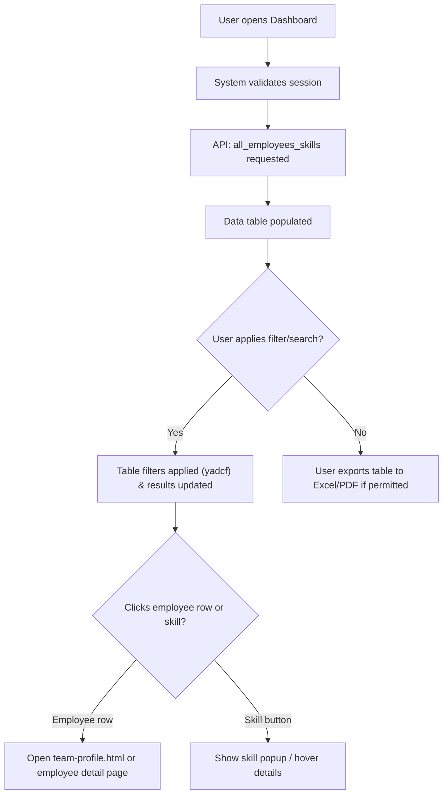
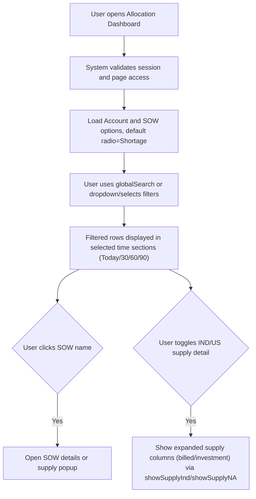
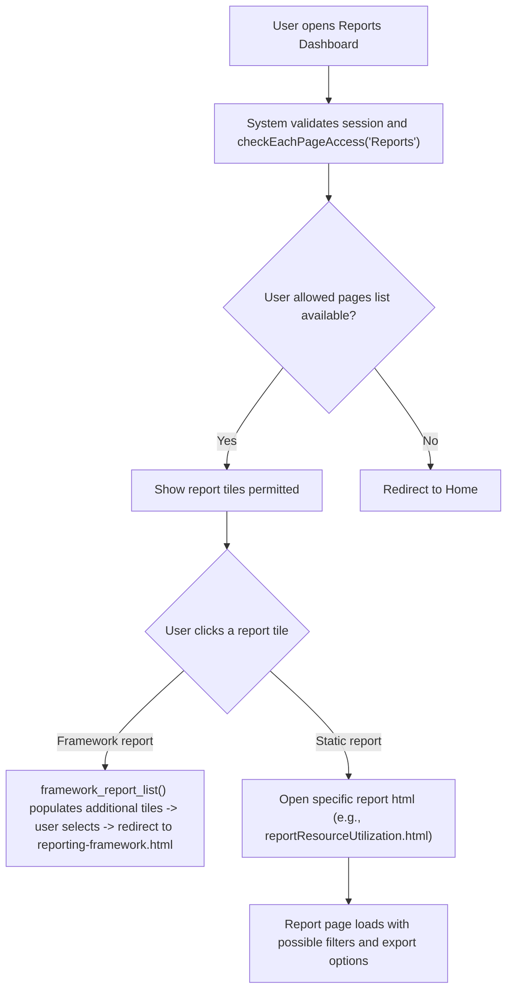
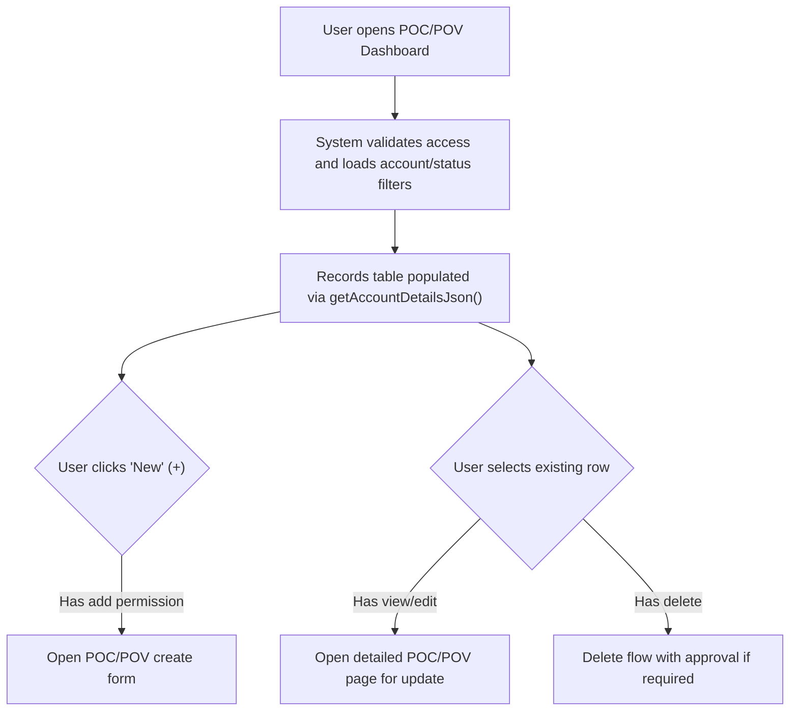
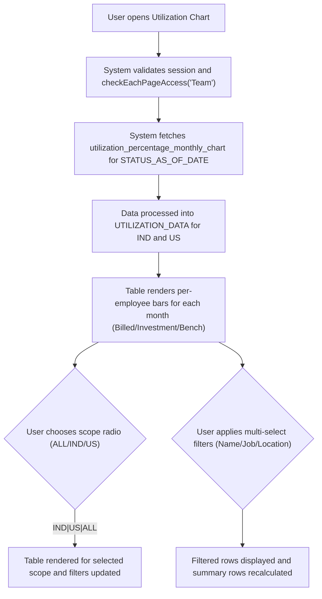

# Dashboards & Navigation — RRE-UI

## Business Overview
The Dashboards & Navigation feature provides a central entry point for users to access role-specific analytics and operational views in the RRE (Resource, Revenue & Engagement) UI. It consolidates high-level KPIs, widgets and module entry tiles (Home, Allocation, Reports, POC/POV, Utilization, Admin) and supports direct drill-downs into detailed lists and reports. The objectives are to: enable fast situational awareness for different user personas, enforce role-based module access, and provide consistent shared-filtering and export workflows across dashboard entry points.

Target users / personas
- Executive / C-suite: high-level dashboards and report exports
- Resource Manager / Growth Leader: allocation and utilization views, drill-down to SOWs and people
- Delivery Manager / Project Manager: POC/POV and SOW details, add/edit POC/POV
- Analyst / Reporting Consumer: reports dashboard, framework-driven reports
- Admin: access to Arcus Access and administration tiles

Business value
- Faster decision-making through consolidated KPIs and drill-downs
- Reduced context switching via shared filters and consistent navigation
- Controlled access to sensitive modules through role-based landing pages

---

## Scope of this BRD
Covers the Home page and global navigation, Dashboard listing, Allocation Dashboard, Reports Dashboard, POC/POV dashboard and Utilization Chart view, plus header navigation and associated JavaScript-driven behaviors for navigation, personalization and filters (files analyzed in source set were provided with scope).

---

## Functional Requirements
**FR-001**: The system shall present a Home page with prominent module tiles for Revenue, Team, Allocation, Buying Center, CNPS and Reports that navigate to the respective module pages when clicked.

**FR-002**: The system shall enforce session validation on every dashboard page and redirect unauthenticated users to the login page.

**FR-003**: The system shall show or hide navigation tiles and admin controls based on the user's role and the access-page-list stored for the user.

**FR-004**: The system shall present a Dashboard view that lists employees with searchable and column filters (Employee ID, Name, Job Title, Location, Reporting Manager, Customer, SOW and Skills) and allow exporting visible data.

**FR-005**: The Allocation Dashboard shall provide time-bucketed sections (Today, After 30/60/90 days) that show Demand, Supply (IND/US) and Shortage metrics per SOW and account and shall allow toggling Shortage/Excess/All.

**FR-006**: The Allocation Dashboard shall provide multi-select filters for Account and SOW, a global search box, and status checkboxes to refine displayed rows.

**FR-007**: The Reports Dashboard shall display a catalog of report tiles (Overall Summary, High Probability Pipeline, Bench & Investment, Resource Mapping, Resource Utilization, Audit, Weekly Usage, US Bench List, Org Chart) and shall dynamically append framework reports produced by an API call.

**FR-008**: The Reports Dashboard shall only display report tiles that the user's access-page-list permits, and make additional tiles visible for special roles (admin, finance, CEO) per business rules.

**FR-009**: The POC/POV dashboard shall list POC/POV records with filters for status and account, and shall expose Create and Edit flows for users with the corresponding page-level rights (view/edit/delete).

**FR-010**: The Utilization Chart shall present monthly utilization bars per employee (Billed, Investment, Bench) across 12 months, provide radio scope (ALL / IND / US), and offer multi-select filters for Name, Job and Location.

**FR-011**: The system shall surface consistent top-level navigation (HeaderMenu) across pages with links to Home, SOWs, Employee Details, Org Chart and Reports.

**FR-012**: All dashboards shall show a loader while data is being fetched and hide it once the view is ready.

**FR-013**: The system shall provide export capability on list and table views where visible (e.g., DataTables export to Excel/PDF) following the user's access rights.

---

## User Roles & Permissions
### Roles
- Admin
- Executive (C-level)
- Resource Manager / Growth Leader
- Delivery / Project Manager
- Analyst / Report Consumer
- Standard Employee (view-only)

### Permission model (high level)
- Admin: Full access to admin controls and all dashboards
- Executive: Access to reports, overall summaries and selected dashboards
- Resource Manager: Access to Allocation, Utilization, Team and SOW details
- Delivery Manager: Access to POC/POV workflows and SOW pages
- Analyst: Access to Reports Dashboard and export
- Standard Employee: Limited view-only access to their information

Permission examples (page-level)
- Reports page visibility is determined by checkEachPageAccess("Reports") and by local storage access lists
- POC/POV edit/delete controls shown only if page-level access contains "edit" or "delete"

Permission matrix (simplified)
- Admin: Home, Dashboard, Allocation, Reports, POC/POV, Utilization, Admin
- Resource Manager: Home, Dashboard, Allocation, Utilization, POC/POV (as applicable)
- Analyst: Home, Reports

---

## User Workflows & Journeys

### User Workflow: Home → Role-based Landing / Module Entry

```mermaid
flowchart TD
    A["User logs in"] --> B["Home page loads and validates session"]
    B --> C{"User has access-page-list?"}
    C -->|"Yes"| D["Show allowed tiles and modules"]
    C -->|"No"| E["Show default Home tiles only"]
    D --> F{"Clicks module tile?"}
    F -->|"Allocation"| G["Open allocationDashboard.html"]
    F -->|"Reports"| H["Open reportsDashboard.html"]
    F -->|"Team"| I["Open team.html / dashboard.html"]
    F -->|"Revenue"| J["Open revenueDetails.html"]
    G --> K["Apply saved filters or defaults"]
    H --> L["Show report tiles and dynamic framework reports"]
    I --> M["Show employee list with filters"]
    J --> N["Show revenue view"]
```

#### Workflow Steps:
1. After login, Home page reads session and localStorage keys (EmpUserName, EmpUserID, email, ACCESS_LEVEL, access-page-list).
2. System evaluates user-access-details and user-role to show/hide admin tiles.
3. User clicks a tile (Allocation/Reports/Team/Revenue) and is navigated to the selected module page.
4. Module loads with filters, and saved or default filters are applied.

#### Business Rules Applied:
- BR-001: If sessionName is null, redirect to login (index.html).
- BR-002: Only show admin tiles if user-role includes "admin".
- BR-003: Page-level visibility governed by access-page-list stored in localStorage.

---

### User Workflow: Dashboard (Employee list) → Drill-down

#### Workflow Steps:
1. Dashboard requests employee skills API and renders DataTable.
2. User may filter by Employee ID, Name, Job Title, Location, Reporting Manager, Customer, SOW Name, Skills.
3. Clicking a row navigates to the employee profile or related SOW details.
4. Export button allowed if DataTable export config is enabled and user has page-level export permission.

#### Business Rules Applied:
- BR-004: Filters should be available exactly for the columns indicated.
- BR-005: Export options should only export allowed columns and respect user access.

---

### User Workflow: Allocation Dashboard — Time-buckets & Drilldown

#### Workflow Steps:
1. When page loads, it populates account and SOW multi-selects and renders four time sections.
2. Users filter by account, SOW, status, and search; they can toggle Shortage/Excess/All.
3. Totals for Demand, Supply and Shortage are recalculated and displayed in footers.
4. Clicking a SOW or supply indicator drills into supply details or SOW page.

#### Business Rules Applied:
- BR-006: Toggle shortgage/excess/all drives row visibility.
- BR-007: Supply columns (IND / US) can expand to show billed/investment when requested.
- BR-008: Totals must reflect current filtered dataset.

---

### User Workflow: Reports Dashboard → Open / Generate Report

#### Workflow Steps:
1. Page calls API to fetch Framework report list and appends tiles dynamically.
2. Visibility of tiles is controlled by local access lists and additional rules for exec/admin users.
3. Selecting a report navigates to the report page where filters and exports are available.

#### Business Rules Applied:
- BR-009: Framework reports are appended only when API returns list for the environment.
- BR-010: Additional executive/finance-specific tiles are visible only for specific users.

---

### User Workflow: POC/POV Dashboard — List, Create, Edit

#### Workflow Steps:
1. POC/POV page enforces page-level access and applies filters for account and status.
2. New POC/POV button opens form only when allowed; existing POC/POV button toggles list view.
3. Each POC/POV row contains a Link and Comments field; editing depends on page-level privileges.

#### Business Rules Applied:
- BR-011: Page-level access must include one of view/edit/delete to display row actions.
- BR-012: Deletion may require approval workflow (UI shows delete action only if permitted).

---

### User Workflow: Utilization Chart — Monthly view & Filters

#### Workflow Steps:
1. Chart fetches monthly utilization by employee and splits into India / US datasets.
2. Visual row per employee shows stacked bars for Billed, Investment and Bench with tooltip details.
3. Users change scope and apply filters; summary rows (averages) are recalculated and appended.

#### Business Rules Applied:
- BR-013: Missing month values are treated as 0% and included to keep consistent 12-month alignment.
- BR-014: Summary rows (Billed/Investment/Bench averages) must exclude summary rows from counts and recalc correctly.

---

## Business Rules & Validations
**BR-001**: If sessionName (email in localStorage) is null or absent, the application shall redirect the user to login (index.html).

**BR-002**: The visibility of page tiles and controls shall be determined by the user-access-details and access-page-list stored in localStorage; admin role always exposes admin tiles.

**BR-003**: Allocation toggles (Shortage/Excess/All) shall filter rows immediately without page reload.

**BR-004**: Export operations shall include only the visible columns and rows after filters are applied.

**BR-005**: Dates and time-based sections shall show a consistent reference date (Status as of) and the UI shall display the date string used (e.g., "Today (As of Jan 19, 2026)").

**BR-006**: Reports and framework report tiles shall be rendered only if the framework API returns reports for the current environment.

**BR-007**: Utilization view shall treat absent monthly values as zero and preserve the 12-month order in the UI.

**BR-008**: Actions such as create/edit/delete on POC/POV shall only be shown if user page-level permissions include the corresponding verbs.

**BR-009**: Admin controls (Arcus Access tile) must only be visible to admin-level users.

**BR-010**: All list/table views must show a loading indicator until data arrives, and hide it when data is ready or an error occurs.

---

## Data Entities (Business View)

### Dashboard Widget
- id (UI id)
- title (e.g., "Allocation")
- tile_icon
- target_page (e.g., allocationDashboard.html)
- visibility_rules (roles / access-page-list)

### KPI
- id
- name (e.g., "Total Shortage IND")
- metric_type (count / percentage / currency)
- time_bucket (Today / 30 / 60 / 90)
- value
- drilldown_link (optional)

### Filter
- id (e.g., accountSelect)
- name (Account, SOW, Name, Job, Location)
- type (multi-select / radio / search)
- default_value
- scope (page-level / global)

### Report
- id
- title
- category (Framework / Static)
- target_url
- required_permissions

### SOW (business object referenced across dashboards)
- sow_id
- sow_name
- account_name
- billing_type
- status
- demand_ind / demand_us
- supply_ind / supply_us
- shortage_ind / shortage_us

### Employee (used in Dashboard & Utilization)
- employee_id
- name
- job_title
- location
- reporting_manager
- customer_name
- sow_name
- skills (array)
- UTILIZATION_DATA (array of {MONTH_YEAR, Billed, Investment, Bench})
- YTD_UTILIZATION
- CURRENT_YEAR_UTILIZATION

---

## Integration Points
- API: all_employees_skills (used by Dashboard) — supplies employee master data and skills
- API: utilization_percentage_monthly_chart — supplies monthly utilization per employee (used by Utilization Chart)
- API: get_report_list (port :5007) — provides list of framework reports to show in Reports Dashboard
- Page-level helper utilities (common.js) — shared functions for session, checkDashboardPageAccessData(), checkEachPageAccess(), assignMetaValue()
- Export libraries: DataTables buttons, jszip, pdfmake — used by table exports

Integration requirements
- All API requests must include environment and db_name in payload as current pages use environment gating.
- Report framework API must return data with an environment token matching apiValue.environment before tiles are shown.

---

## User Interface Requirements
- Home: tile-based entry with consistent iconography and text; click area wraps icon and label.
- Header: consistent across pages with Home, SOWs, Employee Details, Org Chart and Reports.
- Table behavior: client-side filtering (yadcf or DataTables), multi-select filters, sticky headers for large tables.
- Allocation: time-based sections displayed vertically (Today/30/60/90) with totals in footer rows.
- Utilization: stacked bar representation per month with inline tooltip detailing Billed/Investment/Bench percentages.
- Mobile/responsive: navigation collapses into hamburger menu and tiles stack vertically.

UX expectations
- Filters apply quickly (AJAX) and update totals; global search should search across relevant columns.
- Drill-downs should be one-click navigation to detail pages.
- Loader displayed during API calls.
- When access is denied, user should be redirected to Home rather than seeing an empty page.

---

## Non-Functional Requirements
- Performance: Dashboard and Allocation pages should render primary content within 3 seconds for typical datasets (up to several thousand rows paginated or virtualized).
- Security: All dashboards must validate session server-side and client-side; sensitive report pages must only be displayed after checkEachPageAccess verification.
- Availability: Reports and Allocation APIs must be available during business hours; UI should display friendly message on API unavailability.
- Usability: Filters, exports and drill-downs must be accessible, with keyboard navigation supported by underlying DataTables controls.

---

## Business Scenarios & Use Cases
**US-001**: As a Resource Manager, I want to see allocation shortages for the next 30 days so that I can prioritize hiring.
- Acceptance Criteria: Allocation page loads with "After 30 Days" section; shortage rows are visible when Shortage toggle selected; totals recalc after account filter.

**US-002**: As an Analyst, I want to open the Reports Dashboard and run a Framework report so that I can produce an executive summary.
- Acceptance Criteria: Reports Dashboard shows framework tiles fetched from API; selecting a framework navigates to reporting-framework page with preselected framework.

**US-003**: As a Delivery Manager, I want to create a new POC/POV when authorized so that the team can trial new work.
- Acceptance Criteria: New button is visible and opens create form only for users with add permission; created record appears in listing after save.

**US-004**: As a Project Lead, I want to view per-employee utilization across months so I can plan assignments.
- Acceptance Criteria: Utilization Chart shows stacked bars per month for selected employees; radio scope filters (IND/US/ALL) work correctly.

---

## Error Handling & Edge Cases
- If API for frameworks or reports returns error or empty list, show a concise info message "No framework reports available" and show static tiles permitted.
- If utilization API returns partial months, treat missing months as 0% and still show complete 12-month layout.
- If user has no access to any reports, redirect to Home with message "No access to requested page".
- Export fails due to network: show toast notification and allow user to retry.

---

## Assumptions & Constraints
- Assumes localStorage contains accurate user session and access lists (EmpUserName, EmpUserID, email, user-role, access-page-list).
- Assumes API endpoints provide environment-scoped responses (apiValue.environment) and the UI will only act on matching environment.
- The UI expects DataTables and yadcf filter plugins to be available and supported by target browsers.
- This BRD covers only the provided source files and does not modify backend APIs.

---

## Open Questions & Recommendations
- Q1: Should global filters (account, SOW) persist across module navigations (e.g., from Allocation → Reports)? Recommend: support shared filter state if business requires cross-module analysis.
- Q2: Should report exports respect data masking rules for non-admins? Recommend: implement server-side export pre-filtering.
- Recommendation: Add telemetry (page and API load times) to monitor dashboard performance and identify slow queries.

---

## Files Reviewed
- home.html — Home tiles & session/role logic
- dashboard.html — Employee dashboard and DataTables filters
- allocationDashboard.html — Allocation time-bucket tables and filters
- reportsDashboard.html — Reports tile catalog and dynamic framework list
- poc_pov_dashboard.html — POC/POV list, create and edit controls
- UtilizationChart.html — Utilization monthly chart and filter logic
- HeaderMenu.html — Global header navigation
- js/dashboard_details.js — getEmpData (employee loader)
- js/reportsDashboard.js — framework_report_list
- js/utilizationChart.js — getSowViewData, getEmpDataTable, filtering and rendering logic

---

## Next steps
- Review and confirm page-level access matrix with security team.
- Validate APIs for consistency in environment field and dataset completeness.
- Decide whether shared filters should be session-scoped across modules.

