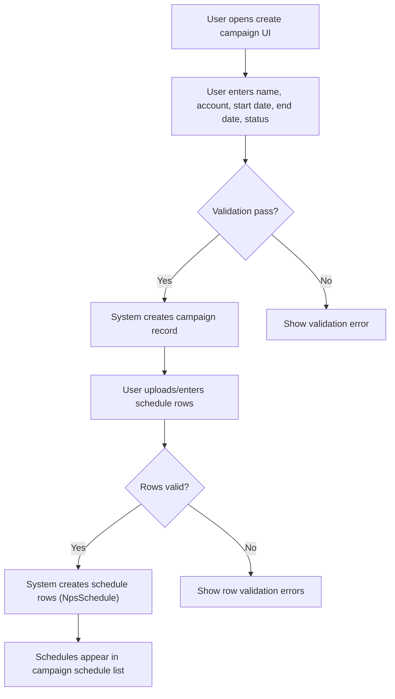
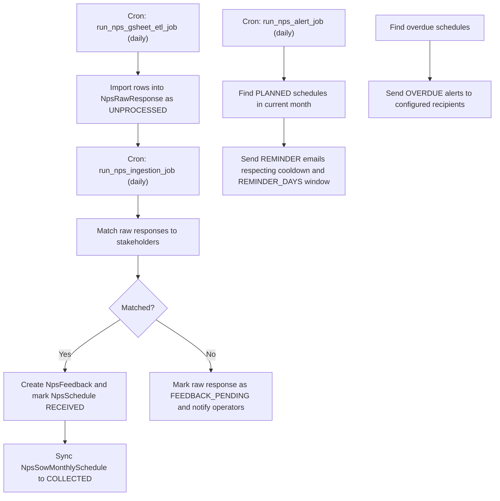
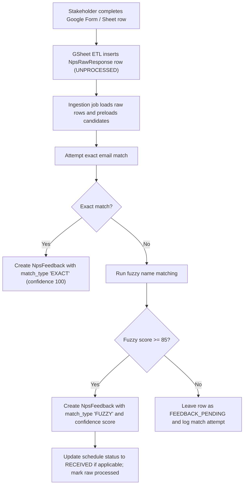
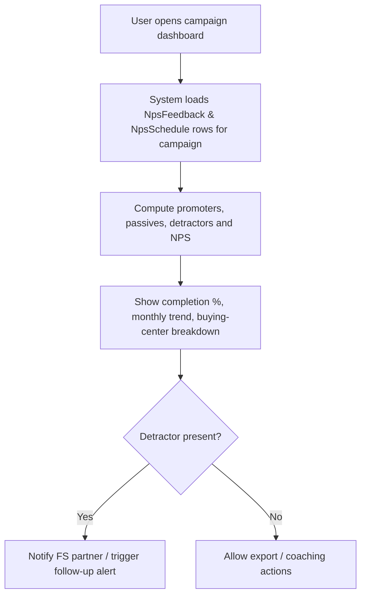

# NPS Surveys and Analytics

## Business Overview
The NPS module enables periodic Net Promoter Score (NPS) collection, scoring, and reporting across customer accounts and Statements of Work (SoWs). Target users include Growth/Delivery/Client partners, Delivery Directors/SDs, and senior leadership (AVP/VP). The module centralizes survey templates, scheduling, stakeholder targeting, ingestion of responses (Google Sheets or manual), matching responses to stakeholders, NPS computation and segmentation (promoter/passive/detractor), and timely alerts for reminders, overdue items and opportunity follow-ups. It integrates with existing RRE account and SoW master data in read-only mode.

Scope
- Survey templates & Google Sheet ETL
- Scheduling campaigns and per-stakeholder schedules
- Response ingestion, matching and scoring
- Campaign dashboards, buying-center and SoW analytics
- Planning alerts and reminder workflows

## Functional Requirements
**FR-001**: The system shall allow users to create an NPS campaign with a name, account, start date, end date and status.

**FR-002**: The system shall allow users to create schedule rows for a campaign specifying stakeholder, buying center, account, scheduled month, status and reminder count.

**FR-003**: The system shall import raw responses from configured Google Sheets or manual loads and persist them as raw responses marked UNPROCESSED.

**FR-004**: The system shall match raw responses to known stakeholders using email exact-match first, then name fuzzy matching, and record a match type and confidence score.

**FR-005**: The system shall create a structured feedback record for each matched raw response and prevent duplicate feedback for the same stakeholder and month.

**FR-006**: The system shall compute campaign-level NPS as (promoter% - detractor%) * 100, rounded to two decimal places.

**FR-007**: The system shall classify scores into Promoter, Passive, and Detractor using PROMOTER_MIN = 9, PASSIVE_MIN = 7, DETRACTOR_MAX = 6.

**FR-008**: The system shall send reminder and overdue alerts for scheduled NPS items and log alert delivery and status.

**FR-009**: The system shall allow scheduling of periodic tasks (ETL, ingestion, planning sync, alert emails) callable by cron jobs.

**FR-010**: The system shall expose campaign dashboards including total responses, NPS, completion percentage, monthly trend and buying-center breakdown.

**FR-011**: The system shall maintain mapping between stakeholders, buying-centers, SoWs and internal FS partners for ownership and escalation.

**FR-012**: The system shall support manual reschedule requests for SoWs with approval workflow (PENDING → APPROVED/REJECTED).

**FR-013**: The system shall preserve read-only integration to core RRE tables (Account details, SOW_MASTER, buying center legacy tables) for lookups but must not write to them.

## User Roles & Permissions
- Administrator / NPS Admin
  - Create/edit campaigns and schedule
  - Manage Google Sheet configurations
  - Trigger ETL and sync jobs (via cron or UI)
  - View and export analytics
- FS Partner (Growth / Delivery / Client / Tech)
  - View campaigns and assigned stakeholder schedules
  - Request reschedules for SoWs
  - Receive alerts and perform follow-ups
- Delivery Director / SD / SM
  - Receive account-level planning alerts
  - Review upcoming and overdue SoWs for their accounts
- Senior Leadership (AVP / VP)
  - Receive org-level planning alerts and portfolio summaries
- System (cron jobs)
  - Perform scheduled ETL, ingestion, sync and alerting tasks

Permission matrix (high-level)
- Create Campaign: Administrator
- Create Schedule Rows: Administrator
- Read Dashboards: Administrator, FS Partner, Delivery Director, Senior Leadership (filtered by scope)
- Send Alerts: System (AlertService) with configurable recipients

## User Workflows & Journeys

### User Workflow: Create Campaign and Schedules

#### Workflow Steps:
1. User opens campaign creation screen and enters campaign metadata.
2. System validates mandatory fields (name, account, valid date range).
3. If valid, system creates a campaign row (NpsCampaign).
4. User provides schedule rows in bulk (stakeholder, month, account, buying center).
5. System validates each schedule row and inserts NpsSchedule rows with status PLANNED.
6. Schedules are visible in campaign schedule list.

#### Business Rules Applied:
- Campaign date range must be valid and not empty.
- Schedules must specify stakeholder_id and scheduled_month.
- Duplicate schedule rows for the same campaign+stakeholder+month are rejected (unique constraint).

### User Workflow: Schedule Send & Reminder/Overdue Alerts

#### Workflow Steps:
1. Daily ETL job reads configured Google Sheets and inserts new raw responses.
2. Daily ingestion job matches raw responses to stakeholders (email exact then fuzzy name) and creates structured NpsFeedback if match is found.
3. If no match is found, row remains FEEDBACK_PENDING for manual review and is included in alerts.
4. Alert job sends reminders for PLANNED items late in the month and overdue alerts for past months; each stakeholder is rate-limited by cooldown.
5. On successful feedback creation, schedule status is updated to RECEIVED and monthly schedule rows are marked COLLECTED.

#### Business Rules Applied:
- Reminder emails are sent only in the configured window before month end and subject to per-stakeholder cooldown.
- Overdue alerts target PLANNED/SENT items whose scheduled_month is before current month.
- Raw responses without confident matches remain pending and are retried on subsequent ingestion runs.

### User Workflow: Respond to Survey (User journey and ingestion)

#### Workflow Steps:
1. Stakeholder submits a response via Google Form — data appears in configured sheet.
2. GSheet ETL reads new rows and inserts into nps_raw_response as UNPROCESSED.
3. Ingestion picks up raw rows, preloads stakeholder candidates for in-memory matching.
4. Exact email match is attempted first, otherwise fuzzy name matching (token set ratio) is used.
5. If match confidence >= 85, feedback is created; else the row stays pending and is included in match-alerts.

#### Business Rules Applied:
- Email exact-match takes precedence and yields 100% confidence.
- Fuzzy matches require a threshold (85) to be considered confident; multiple above-threshold candidates trigger an ambiguity alert.
- One feedback per stakeholder per month is enforced to avoid duplicates.

### User Workflow: View Campaign Analytics and Follow-up

#### Workflow Steps:
1. User requests campaign dashboard; system fetches feedback and schedule rows.
2. System computes promoters/passives/detractors and NPS using configured thresholds.
3. Dashboard shows completion percentage, monthly trend and buying-center breakdown.
4. Presence of detractors can trigger follow-up notifications to mapped FS partners or escalation recipients.

#### Business Rules Applied:
- NPS is calculated as (promoter% - detractor%) * 100 and returned rounded to two decimal places.
- Buying-center reports must show UNMAPPED bucket for feedback without buying_center_id.

## Business Rules & Validations
**BR-001**: Score classification — Promoter if score >= PROMOTER_MIN (9); Passive if PASSIVE_MIN (7) <= score < PROMOTER_MIN; Detractor if score <= DETRACTOR_MAX (6).

**BR-002**: One feedback per stakeholder per submitted_month — enforced by unique constraint (stakeholder_id, scheduled_month) and raw_response_id dedup.

**BR-003**: Raw responses without confident match (match_type NONE or low confidence) remain FEEDBACK_PENDING and are retried on subsequent ingestion runs.

**BR-004**: ETL sources (Google Sheets) are configured per account via GSheetConfig; column mappings may be overridden and must be present.

**BR-005**: Alerts (REMINDER / OVERDUE / CAMPAIGN_SUMMARY) are logged to AlertLog with status SENT / FAILED / SKIPPED and an audit record for recipients.

**BR-006**: Schedule uniqueness — campaign_id + stakeholder_id + scheduled_month must be unique.

**BR-007**: Matching precedence — email exact-match first, then name fuzzy-match; fuzzy threshold = 85 (confidence) to auto-assign.

**BR-008**: Ambiguity detection — if multiple fuzzy candidates score >=85, an ambiguous match alert must be generated for human review.

**BR-009**: NPS module shall not write to core RRE master tables; integration with legacy SOW and account tables must be read-only.

## Data Entities (Business View)
- Stakeholder
  - Attributes: id, name, normalized_name, designation, email, employee_id, stakeholder_type, level, is_active, stakeholder_status, is_approved
  - Relations: mapped to accounts and buying centers (StakeholderMapping)

- Buying Center
  - Attributes: id, account_id, name, type, description, service_description, super_boss_name

- Campaign
  - Attributes: id, name, account_id, start_date, end_date, status (PLANNED|SENT|RECEIVED|MISSED)

- Schedule Row
  - Attributes: id, campaign_id, stakeholder_id, buying_center_id, account_id, scheduled_month, status, reminder_count

- Raw Response
  - Attributes: id, account_id, raw_name, raw_email, nps_score, dimension scores, feedback_text, form_timestamp, processed_status

- Feedback (structured)
  - Attributes: id, campaign_id, stakeholder_id, nps_score, feedback_text, match_status, confidence_score, scheduled_month, buying_center_id, raw_response_id, created_at

- GSheetConfig
  - Attributes: id, account_id, sheet_id, tab_name, column_mapping, is_active

- SoW (NpsSow)
  - Attributes: sow_id, account_id, sow_name, nps_due_date, nps_frequency_days, last_nps_collected_date, nps_collection_count, delivery_owner, growth_owner

- AlertLog
  - Attributes: id, campaign_id, stakeholder_id, alert_type, sent_to, sent_at, status, error_message

## Integration Points
- Read-only lookups to core RRE tables: ACCOUNT_DETAILS, SOW_MASTER, BUYING_CENTER_OVERVIEW, BUYING_CENTER_STAKEHOLDERS for account, SoW and stakeholder synchronization.
- Google Sheets API / gspread for ETL into nps_raw_response (configured via nps/config/gsheets.yaml and per-account GSheetConfig rows).
- Notification/Email service (NotificationService) used by AlertService to send reminders, overdue notices and planning alerts.
- Slack/ops alerts for ambiguous matches and unmatched rows via cron_check utilities.
- Cron jobs (nps_gsheet_yaml_cron.py, nps_sync_all_cron.py, other nps_*.py) schedule ETL, ingestion, planning sync and alert tasks.

## User Interface Requirements
- Campaign Management Screen
  - Create/edit campaign form (name, account, date range, status)
  - Bulk upload schedule rows (CSV/JSON) with validation and preview
- Schedule Grid / Planning Grid
  - Yearly/monthly grid per account with ability to bulk-save planned dates and manual overrides
- Dashboard for Campaign
  - NPS summary, completion %, monthly trend, buying-center breakdown, list of detractors and passives
- Feedback Review Screen
  - List raw responses pending match, matched logs, ability to manually link raw response to stakeholder and mark processed
- Alerts & Notifications config
  - Configure org-level and account-level recipients; preview recipients and cooldown rules

## Non-Functional Requirements
- Performance: Dashboard queries should compute summary metrics within acceptable response times (< 2s for typical campaign sizes). Heavy sync/ETL work should be offloaded to cron jobs.
- Scalability: ETL and ingestion must support batch processing (configurable batch_size) and bulk-match with in-memory candidate loading to minimize DB queries.
- Security: Access controls must restrict campaign creation and planning edits to authorized roles and sensitive email routing must support non-prod routing flags.
- Availability: Cron jobs run daily/hourly and must be idempotent and safe to retry.

## Business Scenarios & Use Cases
**US-001**: As an NPS Admin, I want to create a campaign and schedule stakeholder surveys so that NPS can be collected for a quarter.
- Acceptance Criteria: Campaign created, schedule rows inserted, duplicates rejected.

**US-002**: As an FS partner, I want to see campaign analytics for my accounts so that I can prioritise follow-ups for detractors.
- Acceptance Criteria: Dashboard shows NPS, monthly trend and buying-center breakdown filtered to my account.

**US-003**: As a data operator, I want unmatched raw responses to be listed so I can manually map them to stakeholders.
- Acceptance Criteria: Raw rows with match_type NONE appear in FEEDBACK_PENDING list and logs show attempted matches.

**US-004**: As a Delivery Director, I want weekly planning alerts listing SoWs due for NPS in the next 7/14/21 days so I can ensure scheduling.
- Acceptance Criteria: Account-level planning alert email is generated and sent according to schedule.

## Error Handling & Edge Cases
- Duplicate raw rows or repeated imports should not create duplicate feedback (raw_response_id unique constraint and feedback dedup guards).
- Ambiguous fuzzy matches (multiple candidates >=85) trigger an ambiguous alert for manual review rather than auto-assigning.
- If a campaign referenced by a raw row is unknown, campaign_id is cleared when creating feedback.
- Raw rows with missing or empty names are marked as FEEDBACK_PENDING and retried.
- GSheet schema changes are handled by per-account column mapping; missing required columns result in ETL skip and alert.

## Assumptions & Constraints
- Score thresholds are fixed constants (PROMOTER_MIN=9, PASSIVE_MIN=7, DETRACTOR_MAX=6) and stored in constants.
- Google Sheets are the primary external data source; other sources may be added with ETL adapters.
- NPS module does not modify core RRE master tables — it reads SOW and account data only.
- Fuzzy matching depends on rapidfuzz; in environments without it, fuzzy matching will be disabled and require email matches.

## Open Questions & Recommendations
- Consider adding manual override in UI to accept fuzzy matches above a configurable threshold and to reduce operator workload.
- Add exportable CSV of detractors with FS partner assignment to facilitate operational follow-up.
- Consider storing anonymized derived analytics snapshots for faster dashboard performance on very large campaigns.

---

