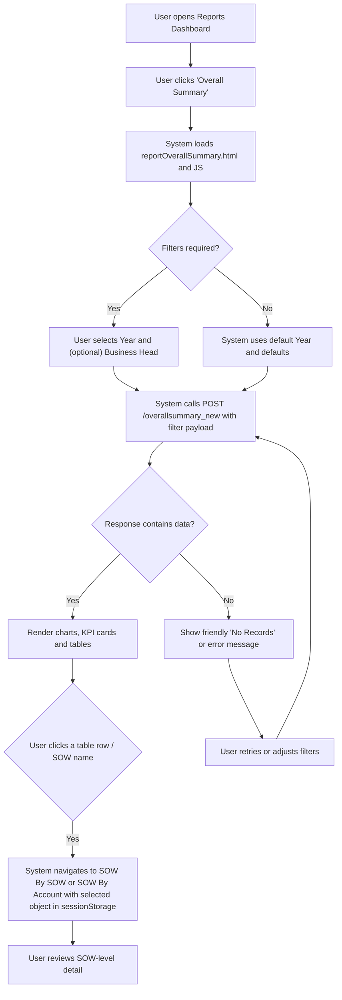
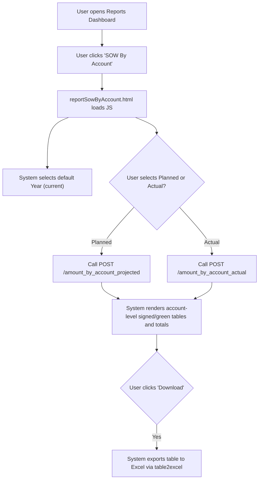
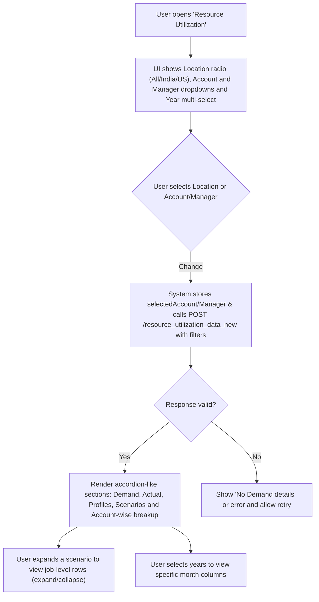
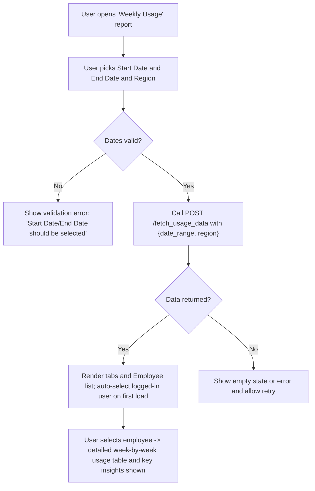
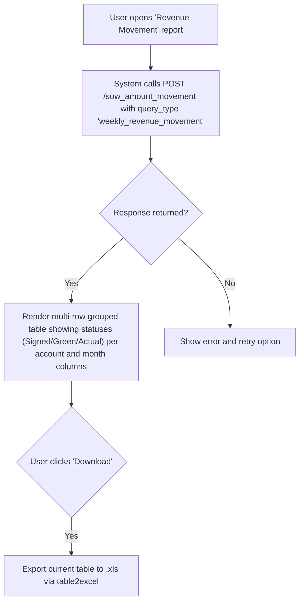

# Reporting & Analytics — RRE-UI

## Business Overview

The Reporting & Analytics feature provides business users (Executives, Account Managers, Resource Managers, Finance and Delivery leads) with a consolidated set of operational and financial reports that answer revenue, pipeline, resource and bench questions. Reports are accessible from a centralized Reports Dashboard and include Executive/Overall Summary, SOW-level and Account-level revenue views, Resource Utilization, Weekly Usage, Revenue Movement and Bench & Investment. The purpose is to enable timely insight, operational decisions (resourcing & delivery), and financial oversight (revenue recognition, pipeline quality, bench investment).

Objectives:
- Provide role-aware dashboards and tabular reports that answer revenue, pipeline and utilization questions.
- Offer filterable, drillable views across aggregation levels (Account, SOW, Resource, Time period).
- Support export/print of tabular results for offline analysis and distribution.
- Surface actionable items and anomalies (e.g., "No Demand details", missing data).

Scope:
- Reports surfaced from the Reports Dashboard and Reporting Framework embedded iframe.
- Observed reports: Overall Summary (Executive), High Probability Pipeline, SOW by SOW, SOW by Account, Resource Utilization, Weekly Usage, Bench & Investment, Revenue Movement, Account Allocation, Audit reports and ancillary lists (US Bench List).

## Catalogue of Available Reports (as observed)
- Overall Summary (Executive Summary)
- High Probability Pipeline
- Bench & Investment
- Resource Mapping
- Resource Utilization
- Audit Reports
- Weekly Usage
- US Bench List
- SOW By SOW (Projected and Actual)
- SOW By Account (Projected and Actual)
- Revenue Movement (weekly revenue movement / planned vs actual)
- Account Allocation

For each report the UI exposes filters and export actions (table-to-excel) where applicable.

## Functional Requirements

**FR-001**: The system shall display a Reports Dashboard listing all available report modules and controlling visibility based on the user's access-page list.

**FR-002**: The system shall allow the user to open a selected report and apply filters before fetching data (examples: Year, Business Head, Account, Manager, Location, Start/End Date, Planned/Actual toggle).

**FR-003**: The system shall retrieve report data from backend endpoints and render results as interactive tables and charts (charts: Chart.js used in Executive Summary).

**FR-004**: The system shall support export of tabular report content to Excel (.xls) via the UI for reports that include a download action.

**FR-005**: The system shall allow drill-down from summary rows (e.g., Overall Summary -> Account or SOW detail) by making the row clickable and passing the selected object to the next report.

**FR-006**: The system shall support role-based visibility for reports and UI controls (reports and filters shown/hidden based on localStorage access-page-list and user role/department).

**FR-007**: The system shall provide default selections for time-based filters (e.g., current year selected where available) and preserve lightweight filter state between views when appropriate.

**FR-008**: The system shall show a loader while data is being fetched and display a friendly error or "No records" state when backend returns no data.

**FR-009**: The system shall support expand/collapse behavior for hierarchical tables (Resource Utilization: scenario -> job levels; Account/SOW tables show totals and type-level grouping).

**FR-010**: The system shall provide both planned (projected) and actual data toggles where applicable (SOW by SOW / SOW by Account reports).

**FR-011**: The system shall normalize different backend response envelopes and handle stringified JSON responses gracefully for selected reports (bench investment normalization observed).

**FR-012**: The system shall allow date-range based queries for activity/usage reports (Weekly Usage) with server-side fetch of the specified range.

**FR-013**: The system shall include performance logging for API calls (client captures API response time and logs via getApiTime calls).

## User Roles & Permissions

- Executive (VP/AVP/CEO/Finance): Access to Overall Summary, Bench & Investment, Revenue Movement, Audit, Weekly Usage.
- Account Manager / Delivery Lead: Access to SOW-by-Account, Account Allocation, Resource Mapping, Resource Utilization.
- Resource/People Manager: Access to Resource Utilization, Resource Mapping, Weekly Usage.
- Finance / Revenue Analyst: Access to Revenue Movement, Overall Summary, Bench & Investment.
- Admin: Full access to all reports and filter controls.

Permission model (observed): localStorage contains an "access-page-list" and checkEachPageAccess("Reports") and checkDashboardPageAccessData() guard entry. Pages are shown/hidden by the reportsDashboard script.

## User Workflows & Journeys

### User Workflow: Executive — View Overall Executive Summary and drill to SOW

#### Workflow Steps:
1. User navigates to Reports Dashboard and selects "Overall Summary".
2. User sets Year and Business Head if required.
3. System posts filter payload to /overallsummary_new and waits for data.
4. If data returned, system populates KPI cards, charts and the account-level table.
5. User may click a SOW row to drill into SOW-by-SOW or SOW-by-Account for details.
6. If no data or API error, system displays a helpful error state with a retry option.

#### Business Rules Applied:
- Data defaults: current year is auto-selected if present in returned years (BR-001).
- Only users with page access (via access-page-list) can see or open the report (BR-002).

### User Workflow: Account Manager — SOW By Account (Planned vs Actual)

#### Workflow Steps:
1. Account manager opens the SOW By Account report from the dashboard.
2. The UI defaults to the current year and Planned view; user can switch to Actual.
3. System calls the corresponding endpoint and builds signed/green/total tables.
4. User can export the currently visible tabular data to Excel.

#### Business Rules Applied:
- The Planned/Actual toggle determines which backend endpoint is queried (BR-003).
- Monthly headers and totals are filtered to the selected year (BR-004).

### User Workflow: Resource Manager — Resource Utilization

#### Workflow Steps:
1. Resource manager sets Location and optional Account/Manager filters and selects one or more years.
2. System sends filter payload to resource_utilization_data_new and waits for JSON.
3. System renders grouped sections and job-level rows (which are collapsed by default).
4. User expands scenario or account rows to see job-level month-by-month values.
5. If the API returns the sentinel message "No Demand details", show a clear message and UI state.

#### Business Rules Applied:
- When server returns the specific string "No Demand details", the UI must show a dedicated no-data state rather than an empty table (BR-005).
- Job-level rows and account job-level rows are collapsed by default and toggled on expand action (BR-006).

### User Workflow: Delivery/Team Lead — Weekly Usage

#### Workflow Steps:
1. User selects a valid start and end date and region; the UI validates inputs before call.
2. System requests usage data for the range and renders multiple tabs (Employee's Usage, Overall, Delivery Heads, etc.).
3. The UI auto-selects the logged-in user on first load to speed self-review.
4. User can search/filter employees and pick one to see detailed usage.

#### Business Rules Applied:
- Date range is mandatory and validated client-side prior to API call (BR-007).
- Employees list auto-selects the logged-in user the first time the report loads (BR-008).

### User Workflow: Finance — Revenue Movement & Export

#### Workflow Steps:
1. Finance opens the Revenue Movement report, which queries the server for weekly/period movement.
2. System displays grouped rows per account with separate rows for Signed, >70% and Actual amounts.
3. User can export the table in Excel format for offline reconciliation.

#### Business Rules Applied:
- Monetary values are rounded and formatted with locale separators before rendering (BR-009).
- Table exports exclude non-data rows (e.g., separators with class noExl) (BR-010).

## Business Rules & Validations

**BR-001**: Default Year selection — When the backend returns available years, the system shall select the current year if present.

**BR-002**: Access control — A report page shall only be shown if the user's access-page-list (localStorage) contains the page or if "All" access is present.

**BR-003**: Planned vs Actual selection must map to the correct server endpoint; the UI shall not mix datasets.

**BR-004**: Year-filtering — columns shown in monthly tables must be limited to months that belong to the selected year only.

**BR-005**: Special-case server responses (text sentinel) — If the server returns the exact string "No Demand details", the UI shall show a dedicated no-data message instead of attempting JSON parsing.

**BR-006**: Expand/collapse — Job-level rows and account-job details shall be collapsed by default and expanded on user action, preserving DOM order for exports.

**BR-007**: Date range validation — Weekly Usage requires both Start and End dates; missing values cause a client-side error with a toast message.

**BR-008**: Auto-selection — Weekly Usage auto-selects the logged-in user on first load to surface personal activity.

**BR-009**: Currency presentation — Monetary fields displayed in revenue reports shall be rounded and formatted with thousand separators and include a leading currency marker where used in UI.

**BR-010**: Export sanitization — The export process shall exclude non-data rows marked with a special class (e.g., noExl) and include header rows appropriate for Excel consumption.

## Data Entities (Business View)

### Report
- id (logical name)
- title
- description
- filters (list of Filter)
- primary_metrics (list of Metric)
- supported_aggregations (Account, SOW, Resource, TimePeriod)
- available_exports (Excel)

### Metric
- id
- name (e.g., "Signed Amount", "Projected Amount", "Resource Count", "Utilization %")
- data_type (currency, integer, percentage)
- aggregation_level (SOW/Account/Resource/Time)

### Dimension
- Account
- SOW
- Resource (Employee)
- Job Role
- Month/Year
- Location (India/US/All)

### Filter
- id
- name (Year, BusinessHead, Account, Manager, Location, DateRange, Planned/Actual)
- type (multi-select, radio, dropdown, date-range)

### User
- id
- name
- email
- role
- department
- access-page-list (controls visible reports)

### Other Business Objects
- BenchInvestment (regioned data for bench and investment views)
- WeeklyUsageRecord (employee, date, duration, activity-type)
- ResourceUtilizationSnapshot (job-level month-by-month counts)

## Integration Requirements (observed)

- Data retrieval is via REST POST endpoints (observed base: apiValue.url_ip + ":5003/*"). Observed endpoints include:
  - /overallsummary_new
  - /resource_utilization_data_new
  - /amount_by_sow_projected
  - /amount_by_sow_actual
  - /amount_by_account_projected
  - /amount_by_account_actual
  - /sow_amount_movement
  - /fetch_usage_data
  - /bench_investment_report
  - /get_managers_account_names
  - /account_allocation

- Client-side libraries used: Chart.js (charts), DataTables (tabular experience), table2excel (export), jQuery multiselect.

- The Reporting Framework is embedded through an iframe which appends a JSON string of user/session parameters to a remote URL (observed SSO-like behavior to rre.factspanapps.com:81/?{urlParam}).

- The UI expects consistent JSON shapes but includes code to normalize wrapped or stringified responses (bench investment normalization) — integration must maintain compatible payloads or the client will attempt to parse and adapt.

## User Interface Requirements

- Reports Dashboard shows tiles for each report and uses role/permission checks to show/hide tiles.
- Each report must present clear filter controls (Year select, Business Head select, date pickers, location radio, account/manager dropdowns) and show a loading indicator while fetching.
- Tables must support pagination, sorting and export to Excel where observed.
- Charts (executive summary) must surface KPI cards, trend charts and hover tooltips with concise summaries.
- Expand/Collapse affordance must be visually clear (expand/compress icons) and preserve data for exports.

## Non-Functional Requirements (observed / implied)

- Performance: Reports should show a loader and capture API response time. Expected interactive response for single-report fetches (< 5s in normal conditions); large tables should paginate.
- Security: Report pages validate page-level access using an environment check and access lists in localStorage; iframe uses a JSON parameter payload for embedded framework access.
- Availability: Backend reporting endpoints must be available for on-demand report generation; the UI handles some degraded responses gracefully.

## Business Scenarios & Use Cases

**US-001**: As an Executive, I want to view the Overall Revenue Summary for the current year so that I can assess YTD performance.
- Acceptance Criteria:
  - System shows KPI cards and trend charts for the selected year.
  - The account-level table lists accounts and allows drill to SOW detail.

**US-002**: As an Account Manager, I want to view Planned vs Actual SOW amounts by account, so I can reconcile pipeline to delivery.
- Acceptance Criteria:
  - System provides Planned and Actual toggles.
  - Monthly columns map to the selected year and totals are calculated.
  - Data can be exported to Excel.

**US-003**: As a Resource Manager, I want to see monthly demand and fulfillment by job role and account so I can plan hiring or bench movement.
- Acceptance Criteria:
  - System displays scenario and job-level tables filtered to selected years.
  - Expand/collapse job-level rows show detailed month-by-month counts.

**US-004**: As a Delivery Lead, I want to fetch Weekly Usage by date range and review my team members' activity, so I can identify productivity or training needs.
- Acceptance Criteria:
  - System validates date range and retrieves weekly usage data.
  - Employee list and details render; logged-in user is auto-selected on first load.

**US-005**: As Finance, I want a Revenue Movement report grouped by account and status so I can reconcile recognized revenue and pipeline changes.
- Acceptance Criteria:
  - System shows multi-row account groups with statuses Signed/Green/Actual across monthly columns.
  - Export to Excel is available.

## Error Handling & Edge Cases

- API returns a sentinel plain-text message (e.g., "No Demand details"): the client shows a specific no-data UI with retry advice.
- Stringified JSON or wrapped JSON envelope for some endpoints: the client attempts to normalize (observed in bench investment handling). If normalization fails, display an error.
- Missing filters: date-range reports validate and block the call with a toast notification.
- Large data sets: tables are paginated (DataTables) and export operations exclude non-data rows.

## Assumptions & Constraints

- The system relies on server-side aggregation; the UI assumes endpoints return pre-aggregated month-by-month values.
- Access control is enforced on the client (localStorage lists) and should be mirrored server-side for security.
- Exports use client-side table-to-excel conversion; large exports may be limited by browser memory.
- Reporting endpoints are under "apiValue.url_ip + ":5003/"" and are environment-aware.

## Open Questions & Recommendations

- Consider standardizing JSON envelopes and removing stringified responses to simplify client parsing and reduce normalization logic.
- Evaluate server-side permission checks in addition to client-side list to avoid unauthorized API access.
- Add an explicit export-to-CSV/Excel server-side endpoint for large extracts to improve reliability.

---

(End of Reporting & Analytics BRD section)
