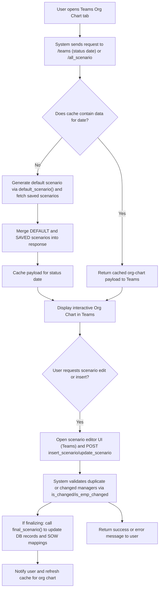
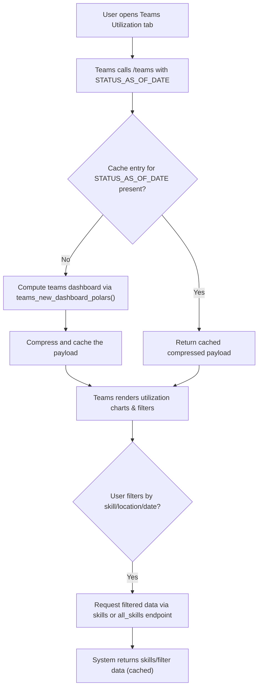
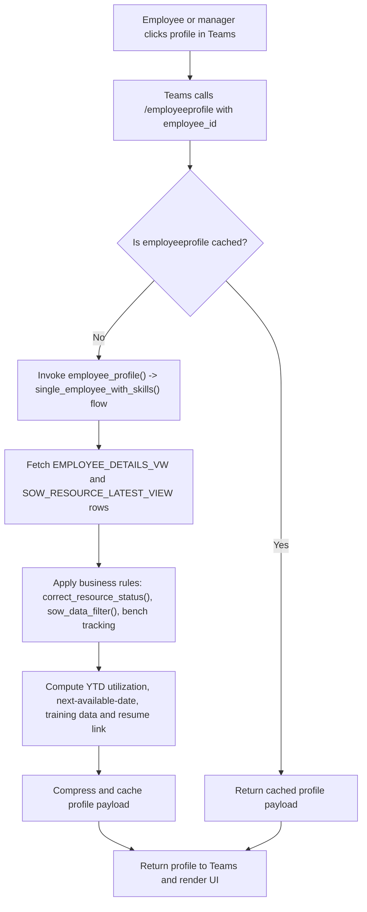

# Teams-based Workforce Insights & Org Views

## Business Overview
This feature delivers workforce insights and organizational views through Microsoft Teams integrations. It provides HR, Delivery Managers, and Employees with on-demand access to org charts, utilization dashboards, and individual profiles (including skills, allocations, and availability) inside Teams. The goal is to enable faster people decisions (reassignments, benching, hiring), increase visibility for managers, and provide employees with a self-service profile and historical utilization view — all while enforcing data visibility rules and ensuring data freshness.

Target personas:
- HR: audits headcount, status (active/notice/exit), training aspirations and compliance.
- Delivery Manager: reviews team org charts, utilisation, upcoming availability, and manages reporting changes via scenario workflows.
- Employee: views their profile (allocations, skills, resume link, training, YTD utilization) and next availability.

Scope:
- Teams tab/command endpoints serve Org Chart, Teams/Utilization dashboards, Employee Profile, Skills filters, and Charts consumed in Teams clients.
- Does not include allocation, bench decisioning, notifications, or recommendation services (out of scope).

## Functional Requirements
**FR-001**: The system shall provide an "Org Chart" view accessible via Teams that displays the default organization hierarchy and saved scenarios.

**FR-002**: The system shall allow Delivery Managers and HR to create, save, update, and publish org-chart scenarios (insert, update, finalize) that persist as named scenarios.

**FR-003**: The system shall expose a Teams-consumable Teams/Utilization dashboard that returns the workforce snapshot for a specified "status-as-of" date.

**FR-004**: The system shall expose an Employee Profile endpoint that returns an employee's personal details, allocations (SOW records), skills, training data, resume link, YTD utilization and next-available date.

**FR-005**: The system shall provide a Skills/Filters endpoint to populate dropdowns and filtering options used by Teams dashboards.

**FR-006**: The system shall cache expensive results (teams dashboard, employee profiles, skills, charts) and serve cached responses when available to reduce latency for Teams users.

**FR-007**: The system shall provide an administrative endpoint to explicitly refresh/update cache for specific modules (e.g., teams, employeeprofile, all_skills).

**FR-008**: The system shall support role-sensitive visibility rules: HR users see full sensitive attributes; Delivery Managers see their team and reporting lines; Employees see their own profile only.

**FR-009**: The system shall include business validations during scenario finalization (avoid duplicate scenarios, update historical SOW mappings and project allocation dates when manager or sow changes occur).

**FR-010**: The system shall return clear error messages in Teams-friendly JSON when data or configuration keys are missing or when DB operations fail.

## User Roles & Permissions
- HR
  - Can view org charts for all locations and perform scenario edits and finalize scenarios across the org.
  - Can view employee profiles including training and aspiration data.
- Delivery Manager
  - Can view team-specific org chart and utilization for their reports.
  - Can create and edit scenarios relevant to their span-of-control, and submit manager/employee reporting changes that are recorded via UI scenario flows.
- Employee
  - Can view their own profile, utilization (YTD), training/aspiration details and resume link.

Permission matrix (summary):
- Org Chart (default): HR (view/edit), Delivery Manager (view/edit own/team scenarios), Employee (view own node only)
- Employee Profile: HR (view), Delivery Manager (view direct reports), Employee (view own)
- Cache Management: Admins only (system or DevOps triggered endpoints)

## User Workflows & Journeys

### User Workflow: Access Org Chart in Teams

Workflow Steps:
1. User navigates to Org Chart tab in Teams.
2. Teams client requests org chart for a given location and status-as-of date.
3. System attempts to serve cached payload; if unavailable, it computes default scenario and includes saved user scenarios.
4. User may edit or insert scenarios; edits are validated (duplicate checking) before persistence.
5. Finalizing a scenario triggers DB updates to manager tables and SOW resource mappings and refreshes cache.

Business Rules Applied:
- BR-001: Scenarios must have unique names per creator and location.
- BR-002: Manager changes are recorded as UI-interface updates and update SOW_RESOURCE tables to preserve project history.
- BR-003: Dummy nodes (e.g., "NO MANAGER", "BENCH") are generated to represent unassigned or bench employees.

### User Workflow: View Teams / Utilization Dashboard in Teams

Workflow Steps:
1. Teams user opens Utilization dashboard and optionally specifies a status-as-of date.
2. System returns cached dashboard when present; otherwise computes and caches results.
3. Users interact with filters (skills, location) which call supporting endpoints.
4. Charts and summary metrics are displayed inside Teams.

Business Rules Applied:
- BR-004: Dashboard data is snapshot-based and tied to a STATUS_AS_OF_DATE.
- BR-005: Cached snapshots are the default response to keep Teams latency low; cache refresh occurs via admin endpoints or scheduled jobs.

### User Workflow: View Employee Profile in Teams

Workflow Steps:
1. User (employee or allowed manager/HR) opens an employee profile in Teams.
2. System returns cached profile if available; otherwise it queries DB, applies resource-corrections and availability logic, and caches the result.
3. Profile contains SOW allocation rows, computed experience, training & aspirations, resume link and YTD utilization.

Business Rules Applied:
- BR-006: Employees marked "Contractor" have different visibility and are treated separately in allocation and notice-period logic.
- BR-007: "NEXT_AVAILABLE_DATE" is determined from future allocations (bench/use-bench) or the latest allocation end date.

## Business Rules & Validations
**BR-001**: Scenario names must be unique per creator and location; insertion rejects duplicates.

**BR-002**: When changing a reporting manager for an employee, if the SOW remains the same, the system updates the REPORTING_MANAGER_ID on the latest SOW_RESOURCE_MAPPING entry rather than creating a new SOW mapping record.

**BR-003**: When changing a reporting manager and SOW simultaneously, the system closes the previous mapping by updating its PROJECT_ALLOCATION_END_DATE to the day before the new allocation and inserts a new mapping record with INTERFACE='UI'.

**BR-004**: Cache entries are keyed by STATUS_AS_OF_DATE for the teams dashboard and by employee_id for employee profiles.

**BR-005**: Unassigned reporting managers or missing manager data are represented with special dummy nodes (EMPLOYEE_ID -9999, or other sentinel IDs) to maintain org chart topology.

**BR-006**: Visibility rules: HR role sees all fields; Delivery Manager sees fields for employees under their management; Employee can view only their own profile.

**BR-007**: Data freshness expectation: dashboards are snapshot-based. Cache refresh should be executed daily or on-demand via the update_cache endpoint; UI must show "status-as-of" date.

**BR-008**: Inputs (payload) must include required keys (e.g., STATUS_AS_OF_DATE for /teams, employee_id for /employeeprofile) or the request is rejected with a Teams-friendly message.

**BR-009**: Training and skills fields stored as comma-separated strings are exposed as arrays in API responses (split and deduplicated).

**BR-010**: Sensitive personal data and PII must be restricted to HR and administrators; teammates and managers must receive only business-relevant attributes.

## Data Entities (Business View)

Employee
- Employee ID (unique)
- Employee Name
- Designation
- Department
- Location (India/US)
- Manager ID / Manager Name
- Billing Status (Billed/Bench/Use Bench/Spl. Leave)
- Join Date, End Date, Resume Link
- Skills (list)
- Training & Aspirations (lists)
- YTD Utilization (time series)
- Next Available Date

Org Chart Scenario
- Scenario Name
- Created By
- Created Date
- Location
- Org Structure: list of nodes {SOW_ID, EMPLOYEE_ID, EMPLOYEE_NAME, DESIGNATION, REPORTING_MANAGER_ID}

SOW Resource Mapping
- SOW_ID, SOW_NAME, CUSTOMER_NAME, START_DATE, END_DATE, PROJECT_ALLOCATION_* fields
- INTERFACE (source of change: UI/system)

Cache Snapshot
- Key (STATUS_AS_OF_DATE or employee_id)
- Compressed payload (teams dashboard, profile, skills)
- Timestamp

## Integration Points
- Microsoft Teams: tabs/commands call backend endpoints (/teams, /employeeprofile, /teams_chart, /all_skills).
- Database (rre_master / rre_derived / rre_rre views): primary source for EMPLOYEE_DETAILS_VW, ORG_CHART_VIEW, SOW_RESOURCE_LATEST_VIEW, SOW_RESOURCE_MAPPING.
- S3 or object store: resume links retrieved via fetch_s3object utility.
- Redis (or in-memory) cache: stores precomputed payloads to serve Teams with low latency.
- Internal utilities: correct_resource_status, sow_data_filter, bench_tracking used to normalize allocation and availability data.

## User Interface Requirements
- Teams tab screens for:
  - Org Chart: hierarchical view with toggle for DEFAULT vs SAVED scenarios and scenario editor in Teams.
  - Utilization Dashboard: status-as-of date selector, filter by skill/location/SOW, summary KPIs.
  - Employee Profile: header with name/designation, SOW allocation list, skills and training sections, YTD utilization chart, resume link, and next-available date.
- All screens must show the data "status-as-of" date and a cache indicator (e.g., "cached: YYYY-MM-DD HH:MM").
- Scenario editor must allow bulk manager changes and preview of resulting org structure before finalize.
- Filter lists (skills, managers, SOW) must be driven from cached endpoints (all_skills, team_chart) to keep Teams client lightweight.

## Non-Functional Requirements
- Performance: Teams API endpoints shall respond within 2s for cached payloads and within 5s for on-demand computed payloads (target; depends on DB load).
- Scalability: Caching must scale to handle concurrent Teams users; cache keys shard by date and module.
- Security: All endpoints must validate identity and enforce RBAC; PII exposure limited by role.
- Availability: Endpoint must be available during business hours; stale cache is preferable to blocking requests.
- Usability: Provide clear error messages and guidance inside Teams when data is missing or under refresh.

## Business Scenarios & Use Cases
**US-001**: As a Delivery Manager, I want to view my direct reports' org chart and utilization so that I can plan capacity and reassign resources.
- Acceptance Criteria: Manager can open Org Chart, filter by location, view direct reports and SOW allocations, and see next available dates.

**US-002**: As HR, I want to create and finalize org-chart scenarios to reflect approved manager changes and ensure SOW mappings are updated historically.
- Acceptance Criteria: HR can insert/update scenarios, finalize them (final_scenario), and DB records reflect manager changes and adjusted allocation end dates.

**US-003**: As an Employee, I want to view my YTD utilization and next-available date in Teams so I can track my assignments and availability.
- Acceptance Criteria: Employee profile returns YTD utilization percentage, list of SOW allocations, and a computed next-available date.

## Error Handling & Edge Cases
- Missing keys in requests (e.g., no employee_id) returns a structured error JSON prompting required parameters (FR-008/BR-008).
- Duplicate scenario insertion returns a friendly error and suggests renaming (BR-001).
- Partial data (no allocation history) yields defaulted fields and explanatory messages rather than failures.
- If cache backend is unavailable, system falls back to LocalCache no-op (in local mode) or computes on demand and logs warning.

## Assumptions & Constraints
- Assumes upstream HR/Payroll and SOW systems populate ORG_CHART_VIEW and SOW_RESOURCE_LATEST_VIEW reliably.
- Assumes Redis or equivalent caching is available in production; local runs use in-memory LocalCache.
- Teams integration is via simple HTTP endpoints (Teams app shell handles UI rendering) and expects JSON payloads.
- PII rules and RBAC must be enforced by an authentication layer; this BRD documents visibility rules but not the authentication protocol.

## Open Questions & Recommendations
- Add explicit audit trail / approval workflow for scenario finalization to avoid unauthorized org changes.
- Consider adding an "as-of" timestamp to cache metadata returned to Teams to make staleness transparent.
- Recommend configurable cache TTL per module (teams, employeeprofile, skills) and ability to trigger selective refresh via Teams command.

---

Saved: 09_teams_workforce_insights.md
