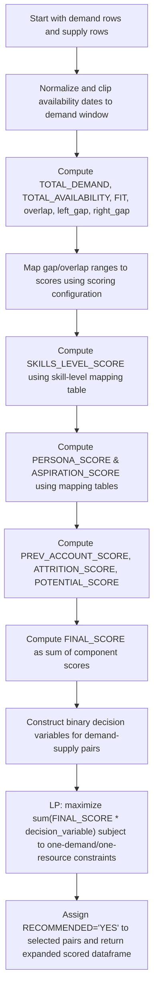
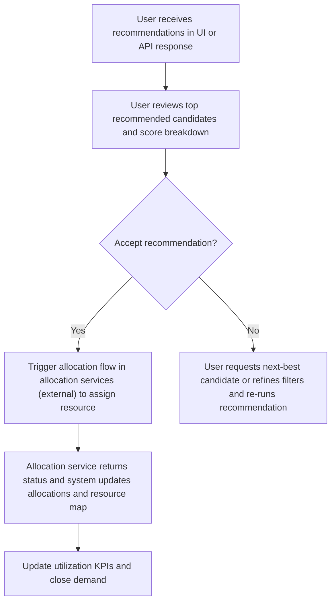

# Recommendation Engine for Resource Assignment

## Business Overview
The Recommendation Engine automates matching bench and available resources to demand (SOW) requirements. It aims to minimize time-to-fill, maximize resource utilization, and improve match quality between demand skill/persona requirements and supply. Target users are Resource/Staffing Managers, Project Managers (demand owners), and Staffing Operations teams. The engine integrates bench data, resource allocations, and demand definitions to produce ranked recommendations with scores and a constrained optimization step that enforces one-to-one allocations.

Scope: covers generation of recommendations, scoring of supply against demand, optimization constraints, and the API endpoint used to request recommendations. It does NOT cover allocation application workflows (handled by allocation services) or downstream UI actions beyond delivering recommended candidates and metadata.

Business value:
- Faster identification of high-fit bench resources for new demand
- Reduced unplanned bench days and improved utilization
- Consistent, auditable recommendation rationale (scores and reasons)

---

## Functional Requirements
**FR-001**: The system shall accept a recommendation request payload and return a ranked list of candidate resources for each demand item.

**FR-002**: The system shall compute availability-related scores (fit, overlap, left_gap, right_gap) for each demand-supply pair based on calendar overlap within demand and supply date ranges.

**FR-003**: The system shall compute skill matching scores using a configurable skill-level mapping table and sum skill-level scores into a skills score per demand-supply pair.

**FR-004**: The system shall compute persona and aspiration mapping scores using configurable mapping tables and include these in the final score.

**FR-005**: The system shall include configurable penalties/rewards for overlap, left gap, right gap and apply them to availability scoring.

**FR-006**: The system shall compute auxiliary scores including previous account experience, previous SOW exposure, attrition and potential ratings using configured score mappings.

**FR-007**: The system shall compute a FINAL_SCORE for each demand-supply pair as the rounded sum of availability, skills, persona, aspiration and auxiliary scores and expose it in the response.

**FR-008**: The system shall run a constrained optimization (binary linear program) to produce recommended assignments that maximize the aggregated scores while enforcing one-demand-to-one-resource and one-resource-to-one-demand constraints.

**FR-009**: The system shall return a flag (RECOMMENDED: "YES"/"NO") per demand-supply pair indicating whether the LP selected the resource.

**FR-010**: The system shall expose the recommendation function via an HTTP POST endpoint "/resource_recommender" that accepts a JSON payload and returns a JSON response with recommended candidates, scores, and supporting metadata.

**FR-011**: The system shall sanitize and normalize date and nested data types in the response so it is JSON-safe for API clients.

**FR-012**: The system shall allow configuration-driven scoring rules (reading from a scoring table or YAML) to change weights/score values without code changes.

**FR-013**: The system shall only consider supply records that meet eligibility criteria (bench status, billing status, location/country rules) before scoring.

**FR-014**: The system shall include a utility to normalize/extend supply availability (continuity and bench additions) so candidate availability windows are accurate for scoring.

**FR-015**: The system shall log and surface reasons for high/low scores (fit days, overlap days, persona mismatch) to support explainability.


## User Roles & Permissions
- Resource Manager / Staffing Specialist
  - Can request recommendations for a SOW or demand bundle
  - Can review recommended candidates and reason metadata
- Project Manager / Demand Owner
  - Can request recommendations for their SOW and review suggestions
- Staffing Operations / Admin
  - Can update scoring configuration tables (scores for skill levels, persona mapping, overlap/gap penalties)
- System / Scheduled jobs
  - Can trigger bulk recommendation runs (not user-initiated)

Permission matrix (high-level):
- Recommend endpoint available to authenticated staffing roles and internal services only
- Scoring configuration updates restricted to Admin

---

## User Workflows & Journeys

### User Workflow: Requesting Recommendations (API)

```mermaid
flowchart TD
    A["User or system calls \"/resource_recommender\" endpoint"] --> B["API receives payload and normalizes input"]
    B --> C["System validates required fields and access"]
    C --> D{"Payload valid?"}
    D -->|"Yes"| E["Trigger AvailableResources data pipeline"]
    D -->|"No"| F["Return validation error to caller"]
    E --> G["Gather bench & allocation data, skill mappings, scoring tables"]
    G --> H["Format demand into demand rows and expand required headcount"]
    H --> I["Filter eligible supply (bench, billing status, location rules)"]
    I --> J["Compute pairwise scores (availability, skills, persona, aspiration, previous experience, attrition, potential)"]
    J --> K["Run LP optimizer to select recommended assignments"]
    K --> L["Mark recommended rows and build response payload"]
    L --> M["Return recommendations JSON to caller"]
    F --> N["User corrects payload and retries"]
```

#### Workflow Steps:
1. User or system POSTs to /resource_recommender with payload (filter and demand data).
2. API normalizes dates and validates payload.
3. System gathers bench data and scoring configuration from DB/APIs.
4. Demand rows are expanded to individual demand items when multiple headcount requested.
5. Supply eligibility is applied (bench/billing rules, location-country match).
6. Pairwise scoring is computed (availability fit, gap/overlap penalties, skills/persona/aspiration/previous experience).
7. LP is executed to maximize the aggregated objective across demands and supplies while enforcing one-to-one constraints.
8. System returns recommended candidates and score metadata.

#### Business Rules Applied:
- Only supply with BILLING_STATUS in approved set (e.g., Bench, Use Bench, Billed/Investment) are considered.
- Location matching rule: preference for same country/LOCATION mapping as demand (special logic for India is present).
- Demand expansion creates distinct DEMAND_ID rows when NUMBER_OF_RESOURCE>1.


### User Workflow: Internal Recommendation Generation (Scoring & Optimization)



#### Workflow Steps:
1. Take all eligible demand-supply pairs.
2. Normalize and clip supply windows to demand period to compute fit and gaps.
3. Use configurable scoring tables to convert gap/overlap ranges into scores.
4. Calculate skill, persona and aspiration scores by merging required and supply attributes with mapping tables.
5. Sum component scores into FINAL_SCORE.
6. Build an LP with binary decision variables and constraints: each demand gets at most one supply; each supply used at most once.
7. Solve LP and mark recommended pairs.

#### Business Rules Applied:
- Score components and penalties are read from AVAILABILITY_SCORING table and/or YAML config.
- The LP objective is aggregative; weights are implied by absolute values in the scoring tables.


### User Workflow: Review & Take Action on Recommendations



#### Workflow Steps:
1. User reviews recommendation list and supporting metadata (fit days, skill match, persona match).
2. If accepted, user triggers allocation (integration point with allocation services).
3. Allocation service carries out the assignment and updates source-of-truth tables.
4. KPIs are updated to reflect the new allocation.

#### Business Rules Applied:
- Only resources flagged recommended and passing eligibility checks may be allocated via allocation service.
- Allocation is subject to business approval rules in allocation services (out of scope here).

---

## Business Rules & Validations
**BR-001**: Demand rows with NUMBER_OF_RESOURCE > 1 shall be exploded into multiple DEMAND_ID rows before scoring.

**BR-002**: Only supply records with appropriate BILLING_STATUS (Bench, Use Bench, Billed, Investment) shall be considered for recommendation.

**BR-003**: Country/LOCATION matching rule: supply and demand are matched preferentially when both LOCATION and COUNTRY are "INDIA" or both are non-India; cross-country matches are disallowed by filter logic.

**BR-004**: Availability computations shall clip supply availability to demand start/end windows when computing FIT and overlap metrics.

**BR-005**: Scores for overlap, left_gap, right_gap, persona mapping and aspirations shall be derived from configurable scoring tables (AVAILABILITY_SCORING) or YAML configuration.

**BR-006**: The optimization model shall enforce that each demand receives at most one resource and each resource is allocated to at most one demand per run.

**BR-007**: Date inputs shall be normalized to yyyy-mm-dd and invalid dates handled gracefully (rows excluded or returned with clear message).

**BR-008**: If skill strings are missing or contain placeholders ("NO_SKILL", empty), the skills score component shall default to 0.

**BR-009**: Bench rows may be synthesized for missing employees or derived from employee join dates when required to represent bench availability.

**BR-010**: The API shall return JSON-safe payloads (no NaT/NaN/datetime objects) and ensure nested list-of-dict fields are sanitized.

---

## Data Entities (Business View)

### Demand (DEMAND)
- DEMAND_ID (business row id, created for each headcount)
- SOW_ID
- ACCOUNT_ID
- RESOURCE_GROUP
- LOCATION
- LEGAL_START_DATE / LEGAL_END_DATE (demand window)
- BILLING_RATE_START_DATE / END_DATE
- SKILLS_DATA / REQUIRED_PERSONA
- NUMBER_OF_RESOURCE

### Supply (RESOURCE)
- SUPPLY_ID
- EMPLOYEE_ID
- EMPLOYEE_NAME
- AVAILABLE_FROM / AVAILABLE_TO
- SOW_NAME, ACCOUNT_ID (current/previous)
- BILLING_STATUS
- SKILLS_LEVEL / SUPPLY_SKILLS
- SUPPLY_PERSONA
- PREVIOUS_SOW_NAME / PREVIOUS_ACCOUNT
- ATTRITION_RATING / POTENTIAL_RATING

### Scoring Tables / Config
- AVAILABILITY_SCORING (score mappings for SKILLS_MAPPING, OVERLAP, LEFT_GAP, RIGHT_GAP, PERSONA_MAPPING, ASPIRATION_MAPPING, PREV_PERSONA_EXPERIENCE)
- SKILLS_MAPPING table mapping required-level and supply-level to numeric score
- YAML config keys for ATTRITION_SCORE, POTENTIAL_SCORE, PREVIOUS_EXPERIENCE_SCORE, REQUIRED_UI_COLUMNS

### Recommendation Result
- DEMAND_ID, SUPPLY_ID, FINAL_SCORE, component scores (fit_score, OVERLAP_SCORE, LEFT_GAP_SCORE, RIGHT_GAP_SCORE, SKILLS_LEVEL_SCORE, PERSONA_SCORE, ASPIRATION_SCORE, PREV_ACCOUNT_SCORE), RECOMMENDED flag

Data lifecycle & retention: scoring config persisted in DB (AVAILABILITY_SCORING) and historic allocations recorded in RESOURCE_MAPPING and SOW tables. Recommended results are ephemeral unless stored by calling system.

---

## Integration Points
- Bench Data API (BENCH_DATA_API): provides CURRENT_BENCH_DATA used to build supply availability
- DB tables: SOW_MASTER, BILLING_RATE, SKILLS_REQUIREMENTS, RESOURCE_MAPPING, AVAILABILITY_SCORING (read for demand, supply and scoring)
- Allocation Services: trigger to apply a recommendation (out of scope for internal code exploration) — integration is via higher-level service/API
- API Endpoint: /resource_recommender (HTTP POST) used by UIs or automated workflows

---

## User Interface Requirements
- Request screen (or API client) must collect SOW_ID, LEGAL/BILLING start/end dates, LOCATION, RESOURCE_GROUP, TEAM_COND/SUB_RES_GROUP, and optionally demand filters.
- Response display must include per-candidate: FINAL_SCORE, component scores breakdown (fit days, overlap, skill score, persona score), CURRENT_STATUS_RECOMMENDED (current billing/bench rows) and reason text.
- UI should allow re-run with adjusted filters and manual accept action to hand off to allocation service.
- Required UI columns are defined in config (REQUIRED_UI_COLUMNS.DEMAND_COLS and SUPPLY_COLS).

---

## Non-Functional Requirements
- Performance: Recommendation runs for a single SOW (typical demand size) should complete within a configurable SLA (e.g., < 30s) for interactive use; bulk runs should be batched.
- Security: API access must be authenticated and authorized, restricted to staffing roles.
- Scalability: Model must handle dozens to hundreds of demands and thousands of supply rows; LP solver should be invoked carefully for large problem sizes.
- Reliability: System must handle missing or malformed data gracefully and return helpful error messages.

---

## KPIs & Success Criteria
- Fill Rate: % of demands filled by recommendations that were accepted and allocated within X days.
- Time-to-fill: average days between recommendation request and allocation.
- Utilization lift: reduction in bench days for recommended resources vs baseline.
- Precision@N: percentage of accepted allocations present in top-N recommended candidates.
- Recommendation Quality Score: average FINAL_SCORE for accepted candidates vs all candidates.
- System SLA: API response time percentiles (p95 < 30s for typical runs).

---

## Business Scenarios & Use Cases
**US-001**: As a Resource Manager, I want to request recommended bench resources for a new SOW, so that I can quickly shortlist candidates for allocation.
- Acceptance Criteria: POST to /resource_recommender returns ranked candidates with FINAL_SCORE and component breakdown.

**US-002**: As a Staffing Admin, I want to update persona and skills scoring mappings, so that recommendations reflect current business priorities.
- Acceptance Criteria: Changes in AVAILABILITY_SCORING affect subsequent run scores.

**US-003**: As a Project Manager, I want recommendations that minimize bench days while meeting skill and persona needs, so that the project ramp is smooth.
- Acceptance Criteria: Top recommended resources have high fit_score and low gap penalties.

---

## Error Handling & Edge Cases
- Empty supply pool: return an empty recommendation list with reason "No eligible supply found".
- Invalid dates or payload: return validation error with missing/invalid fields.
- LP infeasible: if LP solver fails, fall back to top-N by FINAL_SCORE selection and surface solver error to logs.
- Missing scoring configs: treat missing mappings as zero-score defaults and log warnings.

---

## Assumptions & Constraints
- The engine assumes bench/current allocation data are accurate and refreshed prior to running recommendations.
- Cross-country assignment is restricted by business rules in the code (India vs non-India logic).
- Optimization is performed per run and is not persisted by this module.
- Allocation application is outside this module's responsibilities.

---

## Open Questions & Recommendations
- Consider exposing solver explainability (why a resource was excluded by the LP) to aid staff decisions.
- Introduce configurable weight factors (not only absolute scores) to allow business to tune importance of skill vs availability.
- Track historical recommendation acceptance to create ML-driven ranking in future iterations.

---

## Source Files Referenced
- recommendation_service/config/recommend.yaml (scoring keys & UI column lists)
- recommendation_service/modules/model.py (scoring and final score composition)
- recommendation_service/modules/lp_model.py (optimization model enforcing allocation constraints)
- recommendation_service/modules/available_resource_data_getter.py (bench data ingestion, eligibility, supply normalization)
- recommendation_service/recommendation_launcher.py (entry point wrapper)
- recommendationapp.py (API endpoint exposure)

