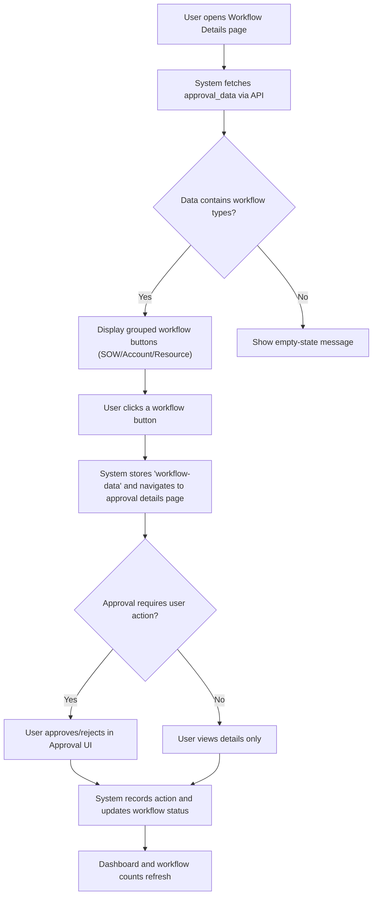
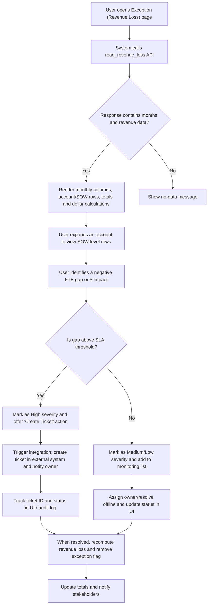

# Workflow Tracking and Exception Handling (RRE-UI)

## Business Overview

The Workflow Tracking and Exception Handling feature provides business users (operations managers, account owners, resource managers, and support teams) with visibility into active approval workflows (SOW approvals, Account approvals, Resource allocations) and exception reports (revenue loss, allocation conflicts, shortages). Its objectives are to:

- Visualize workflow states and progress across SOWs, Accounts and Resource modules
- Surface exceptions and quantify business impact (FTE gaps, $ revenue loss)
- Provide a structured triage and resolution path for exceptions, enabling root-cause analysis and tracking
- Integrate with downstream systems (ticketing, notifications, audit logs) for remediation and compliance

Scope: UI pages and client-side logic that render workflow accordions, per-SOW details and aggregated exception tables. (Files analysed: workflowDetails.html, workflowDetails.js, exceptionResult.html, exceptionResult.js)

## Target Users / Personas

- Operations Manager: monitors workflows and exceptions, assigns remediation
- Account Owner / Project Manager: investigates SOW / account-level issues and resolves resource gaps
- Resource Manager / Staffing Lead: addresses allocation conflicts and shortages
- Business Analyst / Finance: reviews revenue-impact metrics and validates calculations
- Support / IT: receives alerts/tickets for unresolved exceptions

## Business Value

- Faster detection of revenue-impacting exceptions
- Clear, auditable triage steps and ownership for remediation
- Reduced revenue leakage by timely staffing adjustments
- Consolidated view for cross-functional resolution (ops, staffing, finance)

---

## Functional Requirements

**FR-001**: The system shall display active workflows grouped by type (SOW Approval, Account Approval, Resource Allocation) with counts per group.

**FR-002**: The system shall allow users to expand an account to see contained SOWs and expand a SOW to view resource details (team members, job role, billing status, allocation dates).

**FR-003**: The system shall highlight date conflicts where allocation dates fall outside SOW legal start/end dates.

**FR-004**: The system shall list exception reports (revenue loss) with per-month columns, per-region FTE gaps, and dollar impact, and compute totals.

**FR-005**: The system shall mark negative gaps (resource shortfall) with a distinct visual treatment and include computed dollar values per region.

**FR-006**: The system shall allow navigation from a workflow item to the approval detail page for action (e.g., open approvalData.html with the request id).

**FR-007**: The system shall provide summary rows (totals by account/client-size and global totals) for exception tables.

**FR-008**: The system shall support show/hide of month columns and client-size filters to focus analysis.

**FR-009**: The system shall surface allocation conflict counts and shortage counts and expose expansion into detailed lists.

**FR-010**: The system shall provide machine-readable metadata to support root-cause analysis such as request id, SOW id, UNIQUE_ID, account id, employee id, allocation dates, billing status, and computed loss values.

**FR-011**: The system shall provide hooks to trigger external integrations for unresolved exceptions (e.g., create ticket, send notification).

**FR-012**: The system shall label all exception rows by severity (e.g., high/medium/low) derived from dollar impact thresholds.

---

## User Roles & Permissions

- Administrator / Admin Dashboard Access
  - Can view all workflows and exceptions across groups
  - Can navigate to any approval detail

- Operations Manager
  - Can view and expand workflows, mark or assign exceptions for remediation

- Account Owner / Project Manager
  - Can view SOW and resource details for their accounts
  - Can act on approval requests for assigned SOWs

- Resource Manager
  - Can view allocation conflicts and shortages and initiate reassignments

Permission notes: UI checks localStorage for session and role attributes; navigation to admin vs home dashboard is role-aware (getDashboardPageUrl).

---

## User Workflows & Journeys

### User Workflow: Workflow Tracking (discover and drill into a workflow)

#### Workflow Steps:
1. User navigates to the Workflow Details page (workflowDetails.html).
2. Client calls approval_data API and receives grouped workflow lists (SOW_DATA, RESOURCE_ALLOCATION, ACCOUNT_REMOVED, etc.).
3. UI renders collapsible groups and counts; each workflow entry is a button showing request id, account, and SOW name.
4. User selects a workflow entry -> client stores the payload in sessionStorage and navigates to approvalData.html with the request id.
5. User performs approval actions in the approval UI (outside scope) and the workflow counts and groups update on return.

#### Business Rules Applied:
- **BR-001**: Only users with an active session may view page data; otherwise redirect to login/index.
- **BR-002**: Workflow grouping and counts must reflect server response types (e.g., SOW_DATA, RESOURCE_ALLOCATION).
- **BR-003**: Selecting a workflow item must preserve the full request payload (for audit and re-entry).

---

### User Workflow: Exception Triage & Root-Cause Analysis

#### Workflow Steps:
1. User loads exceptionResult.html; client invokes read_revenue_loss API (sowResUtilz).
2. UI builds dynamic month header and per-account/SOW rows with computed metrics per region (IND/US/CA), FTE gaps, and $ values.
3. Negative gaps are highlighted and rows are expanded into multiple sub-rows showing FTE and dollar breakdowns.
4. User drills into a flagged SOW to view allocation details, legal vs allocation date conflicts, and resource-level records.
5. User classifies severity (based on dollar thresholds) and either creates a remediation ticket or assigns the issue to an owner.
6. Ticket creation records ticket id and links back to SOW/request; status updates must be reflected in the UI and totals recalculated.

#### Business Rules Applied:
- **BR-004**: Negative FTE gaps (resource shortage) must be rendered with a distinct visual style and included in totals.
- **BR-005**: Dollar impact is calculated per-region using fixed rate multipliers (IND: 40 * 168; US/CA: 110 * 168) as implemented client-side.
- **BR-006**: Summary totals row is mandatory and must match the aggregation of visible SOW rows.
- **BR-007**: Columns (months) can be toggled for visibility; totals must recompute correctly when columns are hidden.

---

## Business Rules & Exception Classifications

**BR-008**: Exception Severity is derived from dollar impact:
- High: > $100,000
- Medium: $10,000 - $100,000
- Low: <$10,000

**BR-009**: Date Conflict rule: allocation start earlier than SOW legal start or allocation end later than legal end is a "Date Conflict" exception and must be flagged for manager review.

**BR-010**: Only negative gaps (shortages) count as revenue loss; positive gaps (surplus) are shown but not counted as loss.

**BR-011**: All exceptions must capture a minimum set of attributes for RCA: request id, SOW id/UNIQUE_ID, account id, affected employee(s), allocation date ranges, billing status, computed $ impact, and timestamp of detection.

**BR-012**: Unresolved High severity exceptions must automatically create a ticket or escalate after a configurable SLA (e.g., 48 hours).

---

## Data Entities (Business View)

### Workflow Instance
- Attributes:
  - request_id (string) — e.g., encoded IDs parsed for display
  - type (enum) — SOW_DATA | RESOURCE_ALLOCATION | ACCOUNT_REMOVED | TEAM_ALLOCATION | SOW_DELETE
  - status (string) — approval status / pending / approved / rejected
  - created_by, created_at
  - request_payload (JSON) — full request data stored in sessionStorage for later retrieval
- Relationships: belongs to Account; may reference SOW and multiple Step records

### Step / SOW
- Attributes:
  - SOW_ID (string)
  - UNIQUE_ID (string)
  - SOW_NAME, SOW_STATUS, BILLING_MODEL
  - LEGAL_START_DATE, LEGAL_END_DATE, ACTUAL_START_DATE, ACTUAL_END_DATE
- Relationships: contains Resource allocations; belongs to Account

### Resource Allocation (business view)
- Attributes:
  - EMPLOYEE_ID, EMPLOYEE_NAME
  - JOB_ROLE
  - BILLING_STATUS (Billed | Investment)
  - ALLOCATION_START_DATE, ALLOCATION_END_DATE
- Business rules: flag date conflicts against SOW legal dates

### Exception (Revenue / Allocation)
- Attributes:
  - exception_id (generated)
  - request_id (link to workflow), SOW_ID, ACCOUNT_ID
  - region (IND | US | CA)
  - fte_gap (integer)
  - dollar_impact (numeric)
  - severity (High | Medium | Low)
  - status (Open | Assigned | Resolved | Closed)
  - owner (user id)
  - ticket_id (external system reference)
  - detected_at, resolved_at
- Lifecycle: Open -> Assigned -> Resolved -> Closed (with audit trail)

---

## Integration Points

- Ticketing System (e.g., JIRA/ServiceNow): create tickets for High severity or SLA-breached exceptions (FR-011).
- Notification Service: send emails or in-app notifications to owners on exception assignment and resolution.
- Audit/Logging: persist exception detection events and user actions (approvals, assignments) for compliance.
- Backend APIs: approval_data, read_revenue_loss, resource_conflicts (observed endpoints used by UI code).
- Data Warehouse / BI: export aggregated exception and resolution metrics for monthly reporting.

Integration Requirements:
- Tickets created must include request_id, SOW_ID, dollar_impact, recommended remediation, and link back to the UI.
- UI must store and display external ticket_id and ticket status when available.

---

## UI / Reporting Requirements

- Key screens:
  - Workflow Dashboard (grouped accordions for SOW/Account/Resource)
  - SOW detail card with resource table and date conflict highlights
  - Exception table (monthly columns) with expand/collapse SOW rows and totals
  - Exception detail/resolution panel showing owner, tickets, notes, timestamps

- Interactions:
  - Expand/collapse account and SOW rows
  - Click-through from workflow entry to approval page
  - Toggle month columns and client-size filters
  - Ability to create or link an external ticket from an exception row

- Accessibility / Responsiveness: layout collapsible accordions and tables should be usable on standard desktop widths (current UI is desktop-first).

---

## Non-Functional Requirements

- Performance: initial approval_data and read_revenue_loss API calls must return in a user-acceptable timeframe (target < 3s) to avoid blocking the rendering of the dashboard.
- Security: access to workflow and exception data must respect session and role-based permissions (client reads role/level from localStorage as implemented).
- Auditability: all user actions on exceptions (create ticket, assign owner, resolve) must be logged with user id and timestamp.

---

## Business Scenarios & Use Cases

**US-001**: As an Operations Manager, I want to view outstanding SOW approvals so that I can assign resources to pending approvals.
- Acceptance Criteria: Workflow groups show counts; clicking an item opens approval details.

**US-002**: As a Resource Manager, I want to see allocation conflicts and resource shortages so that I can correct allocations or hire.
- Acceptance Criteria: Conflict and shortage counts are displayed; clicking expands details showing SOW-level information and affected employees.

**US-003**: As an Account Owner, I want to identify revenue loss per SOW and month so that I can prioritize remediation.
- Acceptance Criteria: Negative FTE gaps are highlighted; dollar impact columns are calculated and totals are shown.

**US-004**: As a Support user, I want high-severity exceptions to automatically create tickets after SLA expiry so that issues are escalated appropriately.
- Acceptance Criteria: High severity exceptions generate tickets and ticket ids are visible in UI.

---

## Error Handling & Edge Cases

- If API returns an empty list for workflows, show friendly empty state and zero counts (FR-001/FR-002).
- If month headers are inconsistent or missing, default to showing available months and mark missing months as N/A.
- If payload contains inconsistent request structures (single object vs array), the UI must handle both (code checks for reqLen and parses accordingly).
- If computed dollar values overflow or are NaN, show '-' and log client-side error for investigation.

---

## Assumptions & Constraints

- The UI uses client-side multipliers for dollar calculations (IND: 40*168, US/CA:110*168); business should confirm these are stable or moved to the backend for single source of truth.
- Session and permission model is available via localStorage keys (EmpUserID, email, ACCESS_LEVEL, user-role).
- This BRD covers only the client-side UI and the immediate data shapes consumed by the UI; backend workflows, approval flows and ticket creation APIs must be implemented separately.
- The existing UI is desktop-first; mobile/responsive adjustments are out of current scope.

---

## Open Questions & Recommendations

- Recommend moving dollar-impact calculation to the backend to ensure consistent business rules and for easier auditing.
- Recommend adding an explicit "Create Ticket" control in the UI for flagged exceptions and store the ticket id on the exception record.
- Clarify severity thresholds (BR-008) with stakeholders; thresholds in BRD are provisional.

---

## References (source files reviewed)
- workflowDetails.html — UI layout for workflow groups and accordions
- js/workflowDetails.js — client logic for approval_data, resource conflicts, rendering SOW and allocation details
- exceptionResult.html — exception/revenue loss table UI
- js/exceptionResult.js — client logic for read_revenue_loss, table generation, toggles, and calculations

