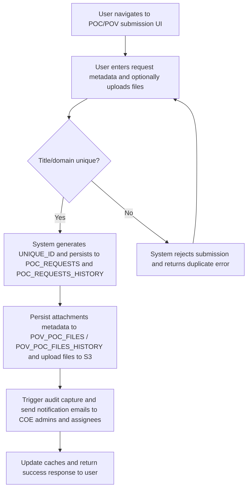
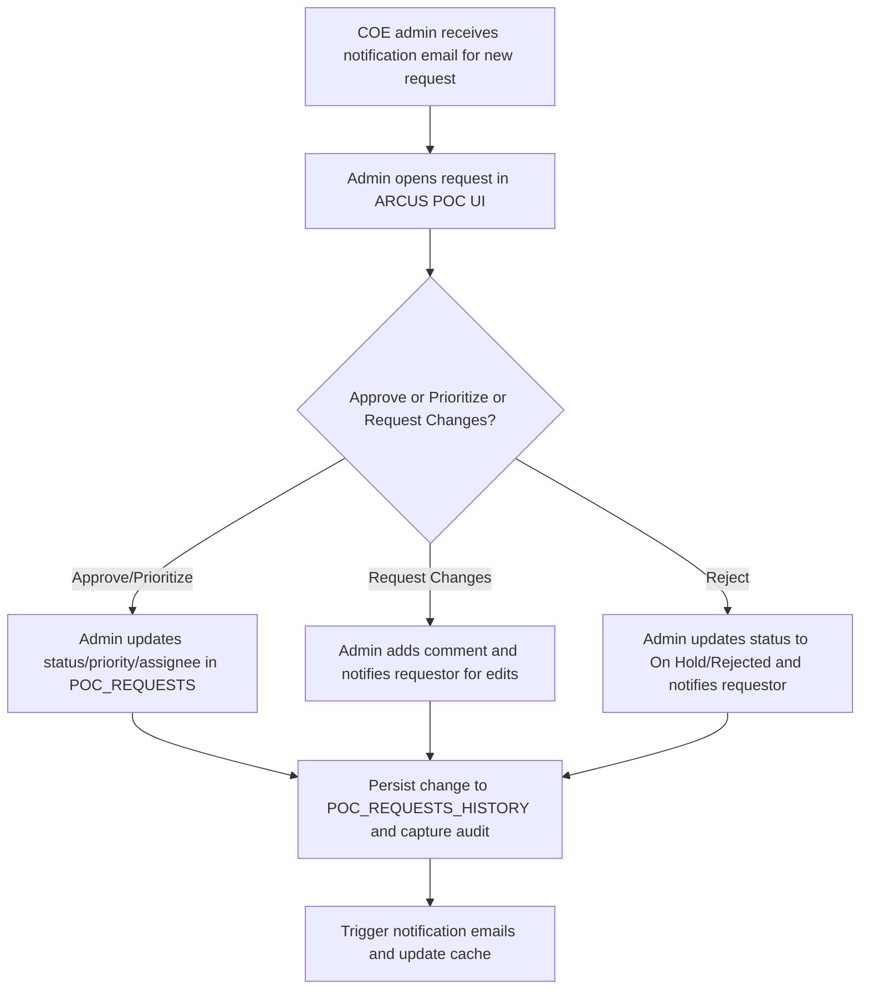
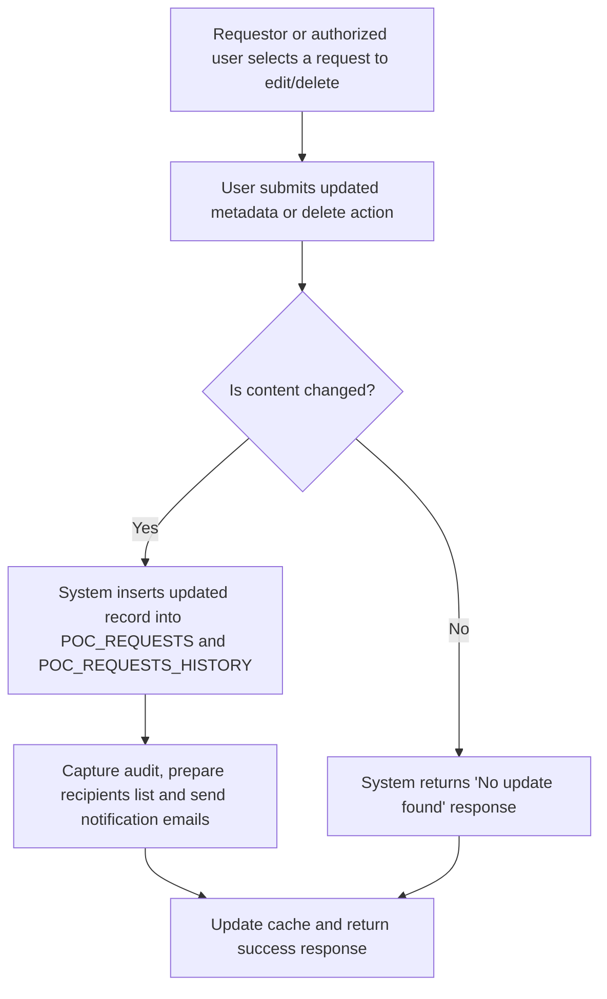
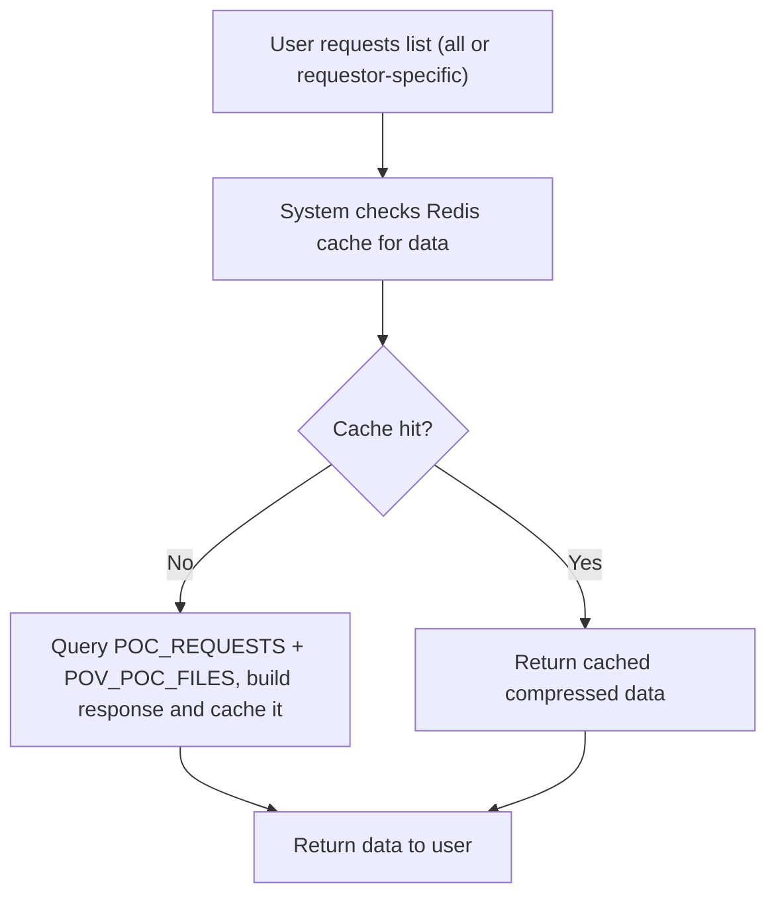

# POC/POV Request Management

## Business Overview
The POC/POV Request Management feature enables business stakeholders to submit requests for Proof-of-Concept (POC) or Proof-of-Value (POV) engagements. It streamlines intake, assigns ownership, captures supporting documents, routes for review by COE/administration, notifies stakeholders by email, and maintains an audit trail for compliance and traceability. Target users include requestors (business stakeholders), growth leaders, RRE COE administrators, assignees (delivery/resource owners), and system administrators.

Scope: intake, approval/prioritization workflow, file upload/storage, notifications (email), comments, auditing, and tracking request status.

Business value: standardize POC/POV intake, reduce manual coordination overhead, ensure approvals and SLAs are tracked, and maintain a complete audit trail and communication history.

## Functional Requirements
**FR-001**: The system shall allow a business user to submit a new POC/POV request with metadata (title, domain, domain type, description, priority, SOW reference, requestor details) and optional file attachments.

**FR-002**: The system shall generate a unique request identifier for every POC/POV submission.

**FR-003**: The system shall persist POC/POV request records into the forms database (POC_REQUESTS) and maintain history in POC_REQUESTS_HISTORY.

**FR-004**: The system shall allow users to edit or delete a POC/POV request; edits shall create a new history record and trigger notifications when content changes.

**FR-005**: The system shall allow file upload for POC/POV attachments, store them in S3 under a structured path, and record storage paths in POV_POC_FILES and POV_POC_FILES_HISTORY.

**FR-006**: The system shall provide pre-signed short URLs for stored attachments on request.

**FR-007**: The system shall provide endpoints to fetch all POC/POV details and requestor-specific POC/POV lists, with optional filters (by requestor, SOW).

**FR-008**: The system shall provide dropdown data for UI population including active SOWs, eligible employees, growth leaders, existing POC titles and domain details.

**FR-009**: The system shall notify COE administrators and relevant recipients by email on creation, edits, or deletes; notifications must contain request summary and metadata.

**FR-010**: The system shall capture audit entries for create, modify, and delete actions via an audit utility and persist temporary approval/audit records as needed.

**FR-011**: The system shall support adding comments to a request; comments shall be stored in POC_POV_COMMENTS with timestamps and author metadata.

**FR-012**: The system shall update in-memory/cache summaries (Redis) when records change, and provide endpoints to refresh or update cache.

**FR-013**: The system shall provide a mechanism to retrieve a list of completed POCs (with stored files) and mark statuses (Open, In Progress, Completed, On Hold).

**FR-014**: The system shall prevent duplicate POC titles within the same domain/domain-type combination (UI-level existing check and backend enforcement by reading existing titles).

## User Roles & Permissions
- Requestor (Business Stakeholder)
  - Create new POC/POV requests (FR-001)
  - Edit or delete own requests (FR-004)
  - Upload files and view presigned URLs (FR-005, FR-006)
  - Add comments to own requests (FR-011)

- Growth Leader / Assignee
  - Be assigned to request, receive notification, view/track request status
  - Add comments and update status/ETA (where permitted by UI/business process)

- COE Administrator (Role ID: RRE_1040)
  - Receive notifications for new/edited/deleted requests (FR-009)
  - Review and prioritize requests
  - Access all request data and audit trails

- System (Service) / Cache Manager
  - Update cache contents and trigger re-computation of aggregated details (update_cache endpoint)

Permission notes: Identification of COE admins is via ROLE_ID in ALL_USER_ALL_ROLE_DETAILS_VW. Only COE admins are auto-recipients on create/delete actions. Requestor's email is included in mail CC.

## User Workflows & Journeys

### User Workflow: Submit POC/POV Request

#### Workflow Steps:
1. User opens submission page and fills metadata: POV_POC_TITLE, DOMAINS, DOMAINS_TYPE, DESCRIPTION, PRIORITY, SOW reference, ASSIGNED_TO, GROWTH_LEADER, REQUIRED/ETA dates.
2. UI optionally uploads files; backend prepares file metadata and stores files to S3 with structured path (bucket/path/domain/domain_type/title/filename).
3. System checks for duplicate title within same domain/domain type; if duplicate, return validation error.
4. If valid, system assigns UNIQUE_ID and records request in POC_REQUESTS and POC_REQUESTS_HISTORY with CREATED_BY, CREATED_DATE.
5. If files present, records entries in POV_POC_FILES and POV_POC_FILES_HISTORY and uploads to S3; creates presigned shortened URLs for retrieval.
6. System captures audit details and sends notification email(s) to COE admins and recipients (assignees/requestor) via mail utility.
7. Cache entries are refreshed for dropdowns and listing endpoints.

#### Business Rules Applied:
- BR-001: POC/POV title + domain + domain type combination must be unique (duplicate submission blocked).
- BR-002: Each submission must have a generated UNIQUE_ID.
- BR-003: Files must be persisted to S3 and storage paths recorded in POV_POC_FILES.

### User Workflow: Review & Approve / Prioritize (COE Admin)

#### Workflow Steps:
1. COE admin triages incoming requests using the listing UI or email summary.
2. Admin can approve and set priority or assign to delivery resource, or request changes (comment), or mark rejected/on-hold.
3. Any change persists a new record to POC_REQUESTS and POC_REQUESTS_HISTORY and invokes audit capture.
4. System sends appropriate notification emails and updates cache/listings.

#### Business Rules Applied:
- BR-004: Any status change must create a history record and audit entry.
- BR-005: Notifications are sent to requestor, assignees, and COE admins on significant state changes.
- BR-006: Status mapping ranks: 'In Progress' (0), 'Open' (1), 'Completed' (2), 'On Hold' (3) (used for sorting in listing).

### User Workflow: Edit / Delete Request

#### Workflow Steps:
1. User selects existing request and submits edited fields or requests deletion.
2. System compares incoming payload with OLD_POC_DATA; if no changes, return failure message.
3. If changed, system creates a new record in POC_REQUESTS and POC_REQUESTS_HISTORY and captures audit.
4. Delete action marks DELETE_FLAG='YES' and persists similarly.
5. System sends notifications to COE admins and requestor and updates caches.

#### Business Rules Applied:
- BR-007: Edits only processed when there is an actual change compared to OLD_POC_DATA.
- BR-008: Delete is logical (DELETE_FLAG) and must be recorded in history.

### User Workflow: Track / List Requests

#### Workflow Steps:
1. UI or API calls /all_poc_pov_details or /requestor_poc_pov_details.
2. Backend checks cache; on miss, queries POC_REQUESTS joined with POV_POC_FILES to assemble full records.
3. Dates are normalized, statuses ranked and lists sorted for presentation.
4. Completed POCs (with files) are flagged and returned separately for quick access.

#### Business Rules Applied:
- BR-009: Cache should be updated after any create/edit/delete or file upload via update_cache triggers.
- BR-010: Date fields must be normalized (CREATED_DATE, UPDATED_DATE, ETA fields) for display.

## Business Rules & Validations
**BR-001**: POC/POV title with the same domain and domain type must be unique; attempt to create duplicates must be rejected.

**BR-002**: Each POC/POV submission shall be assigned a UNIQUE_ID (short hex, collision-checked) and recorded.

**BR-003**: File uploads shall be stored in S3 under configured bucket and path; metadata must include STORAGE_PATH and filename.

**BR-004**: All create/edit/delete operations shall insert a record to both POC_REQUESTS and POC_REQUESTS_HISTORY.

**BR-005**: All state transitions must be captured in the audit temp table via Audit_details and associated TempTableInserter.

**BR-006**: Editing a request where no fields changed must return a clear "No update found" response and not create history.

**BR-007**: Delete is logical—DELETE_FLAG='YES'—and must be recorded in history.

**BR-008**: Email notifications shall be sent to a recipients list including COE admins and CC the requestor when a POC is created/edited/deleted.

**BR-009**: SLA expectations: verification/notification workflow should complete within a short business timeframe — emails should be dispatched immediately after DB insert; presigned URLs must be generated on demand.

**BR-010**: Cache invalidation or update must run after data-changing operations (update_cache triggers called), ensuring front-end listings reflect the latest state.

## Data Entities (Business View)

### POC_REQUEST (POC_REQUESTS)
- UNIQUE_ID (string) — primary business identifier
- POV_POC_TITLE (string)
- DOMAINS (string)
- DOMAINS_TYPE (string)
- DESCRIPTION (string)
- PRIORITY (string)
- REQUESTOR_ID, REQUESTOR_NAME
- ASSIGNED_TO (string) / ASSIGNED_TO_ID (csv)
- GROWTH_LEADER_NAME
- STATUS (Open / In Progress / Completed / On Hold)
- COMMITTED_ETA, ETA_COMPLETE_DATE
- CREATED_BY, CREATED_DATE
- UPDATED_BY, UPDATED_DATE
- DELETE_FLAG (optional)

### POC_FILES (POV_POC_FILES)
- POV_POC_TITLE
- FILE (filename)
- STORAGE_PATH (S3 key)
- UPDATED_DATE

### POC_COMMENTS (POC_POV_COMMENTS)
- POV_POC_TITLE
- UNIQUE_ID
- COMMENTS
- COMMENTED_ON (timestamp)
- COMMENTED_BY (string)

### AUDIT_TEMP / APPROVAL_TEMP
- REQUEST_ID
- TABLE_DATA (old/new payload)
- APPROVAL_FLAG
- DESCRIPTION / OPERATION

Data lifecycle: History tables maintain immutable records for compliance; logical delete retains record with DELETE_FLAG; files stored in S3 are referenced by STORAGE_PATH and may be short-url accessed for a limited time.

## Integration Points
- S3 (via boto3) for file storage and presigned URL generation (ConfigRead.put_object, fetch_object_url).
- Email service (RRE.utilities.mail_sender.SendMail) for notification dispatch (PocPovMail.mail_structure).
- Database service (dbServiceLauncher and db_launch.query_execute) for persisting POC_REQUESTS, POC_REQUESTS_HISTORY, POV_POC_FILES, POC_POV_COMMENTS, and audit temp tables.
- Redis cache for storing compressed listings and dropdown data (configurable; LocalCache fallback for local/dev).
- Audit/approval utilities that insert temp records via approval_data.TempTableInserter.

## User Interface Requirements
- Screens/APIs:
  - Submit POC/POV form with metadata and file upload control.
  - Edit/Delete request UI with prefilled fields and comparison to OLD_POC_DATA.
  - Request list (all & requestor-specific) with filters for status and SOW.
  - Dropdowns: SOW selector, employee/assignee selector, growth leader, and domain/service-line buckets.
  - File preview/download via presigned shortened URLs.
  - Comments pane per request.
- Controls: file attachments, commit/submit button, cancel, add comment, change status dropdown (admin), assign resource.

## Non-Functional Requirements
- Performance: Listing endpoints should return cached response under normal load; updates should refresh cache within seconds.
- Security: Access to file presigned URLs should be time-bound; authorization enforced by API gateway/UI (outside scope here).
- Availability: Email delivery and S3 must be available for key flows; operations should gracefully degrade (e.g., queue notifications) if external services fail.
- Scalability: S3 and Redis enable scale for attachments and caching.

## Business Scenarios & Use Cases
**US-001**: As a requestor, I want to submit a POC request with attachments, so that RRE can evaluate it.
- Acceptance Criteria: request saved in POC_REQUESTS, UNIQUE_ID generated, files uploaded to S3 and recorded, COE admins notified.

**US-002**: As a COE admin, I want to review and prioritize a request, so that high-value POCs are actioned first.
- Acceptance Criteria: admin can change status/priority/assignee; a history record and audit entry is created; notifications are sent.

**US-003**: As a requestor, I want to edit my request and track comments, so that I can respond to admin feedback.
- Acceptance Criteria: edits persist to history, comments are stored with timestamps, and notifications are sent when applicable.

**US-004**: As a user, I want to view only my requests or view all requests depending on permissions, so I can manage my POCs.
- Acceptance Criteria: requestor-specific endpoint returns only their POCs; all_poc_pov_details returns aggregate list.

**US-005**: As an operator, I want all actions to be auditable, so I can trace who changed what and when.
- Acceptance Criteria: Audit entries created for create/modify/delete with payload snapshots via Audio_details utilities.

## Error Handling & Edge Cases
- Duplicate title detection returns friendly validation error and prevents DB insert (BR-001).
- File upload failures: upload_poc_pov returns "Failed to upload" and leaves DB in a consistent state (files not recorded) — UI should surface errors.
- Edit with no changes returns "No update found" and does not create history (BR-006).
- Missing SOW or invalid requestor details should return validation errors prior to insert.
- Presigned URL generation failures return explanatory errors.

## Assumptions & Constraints
- Assumes email sender, S3, and DB services are available and reachable.
- Assumes role mapping for COE admin is accurate and maintained in ALL_USER_ALL_ROLE_DETAILS_VW.
- Duplicate detection occurs on title+domain+domain_type but UI-level checks may not be synchronous — backend enforces uniqueness logically by checking existing titles.
- Delete operation is logical (DELETE_FLAG) and not a hard delete.

## Open Questions & Recommendations
- Recommendation: Add an explicit approval/priority workflow with status field values and SLA timers (e.g., initial triage within 3 business days).
- Recommendation: Expose an API-driven retry/queue mechanism for failed email or S3 uploads to improve resilience.
- Open Question: Are there role-based UI restrictions to prevent non-admins from changing priority/assignee? Clarify in product policy.

---

(End of POC/POV Request Management BRD section)
