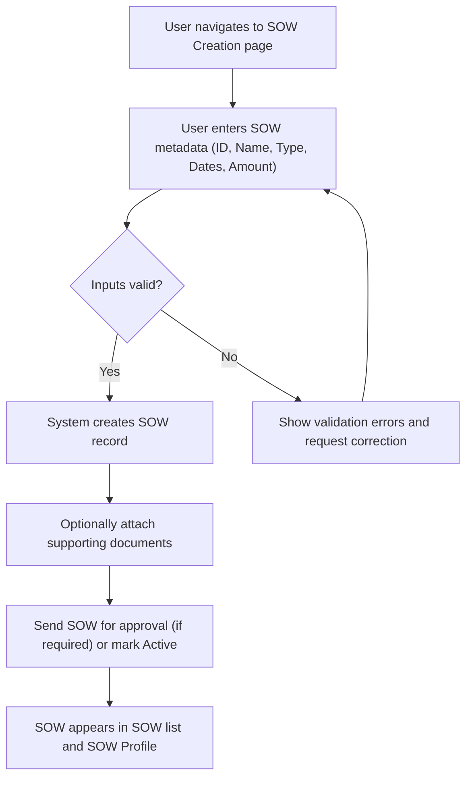
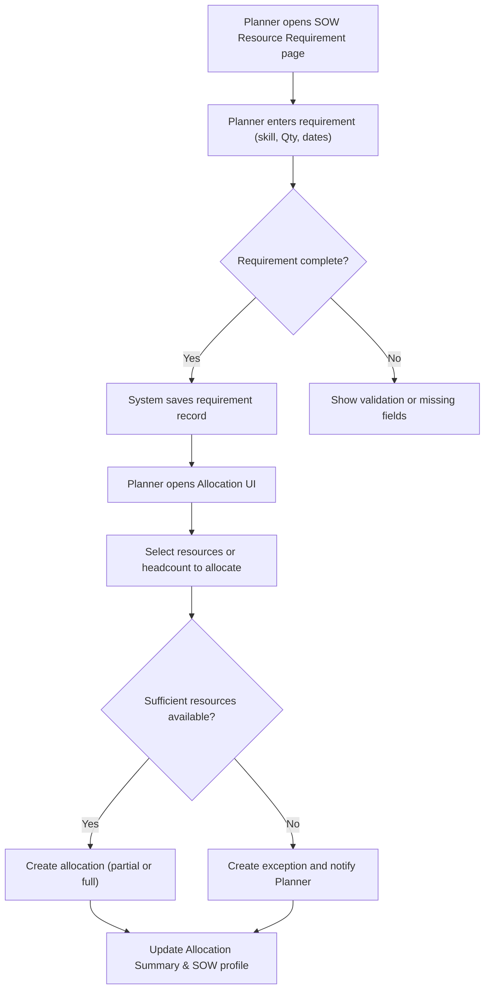
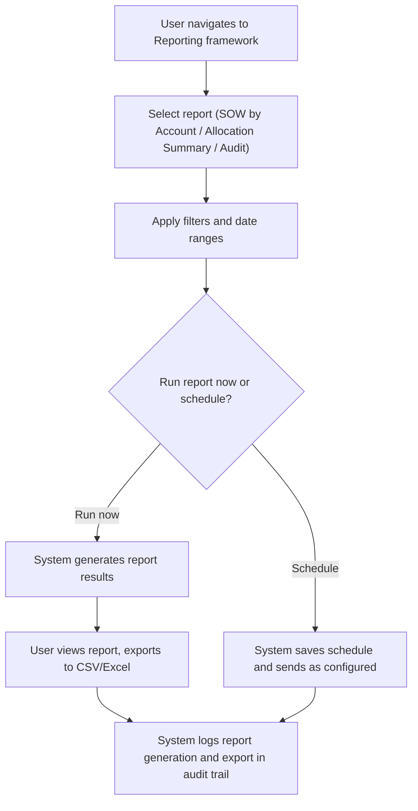
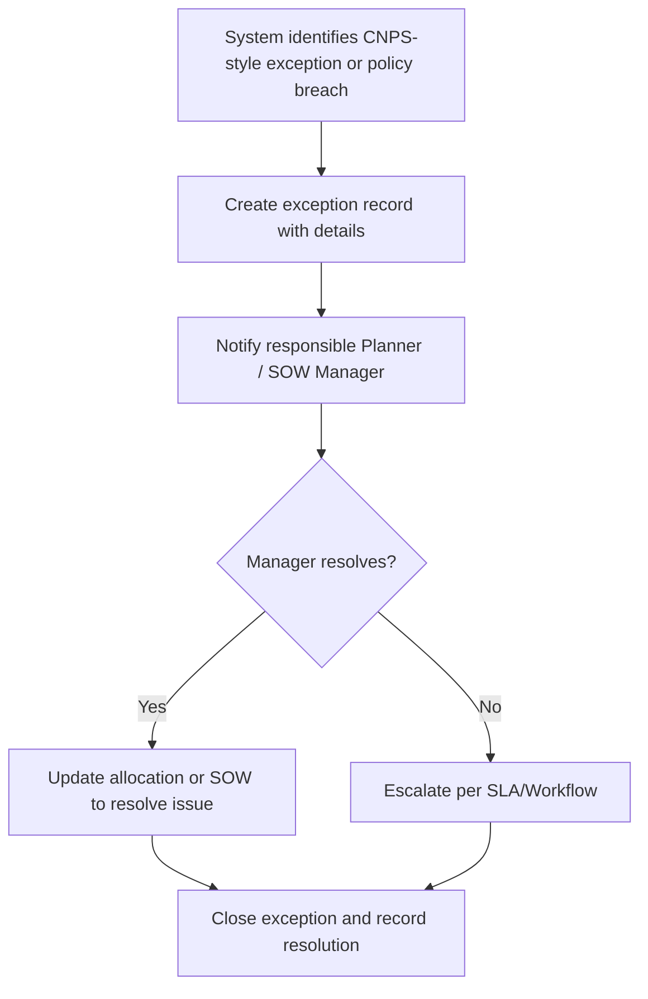

# User Manual Alignment: RRE UI vs User Manuals & Release Notes

## Business Overview
The RRE (ARCUS / RRE-UI) product is a resource and revenue enablement application focused on managing Statements of Work (SOWs), resource requirements and allocations, and operational reporting for account-based delivery. The user manuals and release notes indicate the product supports SOW lifecycle activities (creation, editing, profile & details), resource requirement capture, allocation summaries, and reporting & audit capabilities to support business decision-making and compliance.

Target users / personas:
- SOW Manager / Program Manager: creates and manages SOWs, defines SOW amounts and timelines
- Resource Planner / Capacity Manager: captures resource requirements and performs allocations to SOWs
- Finance/Revenue Analyst: reviews SOW-level revenue and reporting
- Business Administrator / Auditor: runs reports and audits SOW and allocation history

Business objectives:
- Standardize SOW capture and tracking across accounts
- Provide a single place to record resource requirements and allocations against SOWs
- Enable reporting and audit trails for SOWs, allocations and revenue
- Surface exceptions and allocation gaps for action

## Source Materials Reviewed (scope)
- RRE SOW User Manual (RRE_SOW_User_Manual-V1.pdf)
- ARCUS User Manual (ARCUS_User_manual _V1.pdf)
- ARCUS Release Notes (ARCUS_Release_Note_V1.pdf)

(Exploration limited to these three documents as provided.)

## Mapping of Documented Features to BRD Sections
- SOW Lifecycle & Management
  - Source: RRE_SOW_User_Manual-V1.pdf
  - BRD Sections: Feature: SOW Creation/Editing/Details (FR-001..FR-006)
- SOW Resource Requirement / Resource Request Capture
  - Source: RRE_SOW_User_Manual-V1.pdf, ARCUS_User_manual
  - BRD Sections: Feature: Resource Requirement entry, validation and matching (FR-007..FR-011)
- Resource Allocation & Allocation Summaries
  - Source: ARCUS_User_manual, RRE_SOW_User_Manual-V1.pdf
  - BRD Sections: Feature: Allocation flows, allocation summaries, exception handling (FR-012..FR-018)
- Reporting, Audit & Exceptions
  - Source: ARCUS_User_manual, ARCUS_Release_Note_V1.pdf
  - BRD Sections: Feature: Standard reports (SOW by Account, Audit trail, Allocation reports), export and scheduling (FR-019..FR-028)
- Release/Change Items
  - Source: ARCUS_Release_Note_V1.pdf
  - BRD Sections: Items that alter or extend features above; used to capture additional FRs and clarifications

## Additional Functional Requirements derived from manuals (not obvious from UI alone)
- **FR-001**: The system shall allow a SOW Manager to create a new SOW record capturing SOW ID, SOW Name, SOW Type, Start and End dates, and SOW Amount.
- **FR-002**: The system shall allow editing and versioning of an existing SOW with an audit trail of changes (who changed what and when).
- **FR-003**: The system shall support marking SOWs as Active, Pending, Completed or Cancelled and filter views by SOW status.
- **FR-004**: The system shall allow capture of SOW Resource Requirements (position, skills, quantity, start/end dates, rate/band) linked to a SOW.
- **FR-005**: The system shall validate SOW input fields (mandatory SOW Name, valid date ranges, non-negative amounts) and present clear validation errors.
- **FR-006**: The system shall allow attaching or linking supporting documentation to a SOW (e.g., SOW PDF or reference link).
- **FR-007**: The system shall allow Resource Planners to create resource requirement requests for accounts and associate them with one or more SOWs.
- **FR-008**: The system shall provide an allocation engine/UI to assign available resources or headcount to SOW requirements, supporting partial allocations.
- **FR-009**: The system shall present an allocation summary view (SOW Resource Allocation Summary) showing allocated vs required counts and highlight shortfalls.
- **FR-010**: The system shall emit exceptions when allocations cannot satisfy requirements (e.g., insufficient available resource pool) and list actions to resolve.
- **FR-011**: The system shall store historical allocation snapshots for audit and reporting.
- **FR-012**: The system shall provide standard reports: "Report SOW By Account", "Report SOW By SOW", allocation summary reports, and audit reports.
- **FR-013**: The system shall allow filtering and exporting of reports to CSV/Excel and support basic scheduled report delivery (email) where specified in release notes.
- **FR-014**: The system shall provide role-based access controls restricting SOW creation/editing to SOW Managers and read-only views to other roles.
- **FR-015**: The system shall support an exception result or dashboard showing critical items (e.g., unallocated requirements, past-due SOWs).
- **FR-016**: The system shall keep revenue-related SOW fields (SOW Amount) and surface them in financial reporting for revenue analysis.
- **FR-017**: The system shall provide an SOW persona/profile page summarizing SOW-level details, allocations, and audit history.
- **FR-018**: The system shall provide integration points for linking SOWs to account and project entities (account master data).
- **FR-019**: The system shall provide an audit trail for report generation and export actions tied to user identity.
- **FR-020**: The system shall support release-note listed configuration toggles or feature flags described in release notes (administrative controls).

## User Roles & Permissions (business view)
- SOW Manager
  - Capabilities: Create/Edit SOWs, view and edit SOW resource requirements, run SOW reports
- Resource Planner
  - Capabilities: Create resource requests, perform allocations, view allocation summaries and exceptions
- Finance/Revenue Analyst
  - Capabilities: View SOW financial fields, run revenue and SOW amount reports, export data
- Auditor / Business Admin
  - Capabilities: Run audit reports, view change history, configure report schedules / feature toggles

Permission matrix (high-level):
- Create SOW: SOW Manager
- Edit SOW: SOW Manager (with approval workflow if required)
- Create Resource Request: Resource Planner
- Allocate Resources: Resource Planner
- Run Reports: Finance/Analyst, Auditor (view/export)
- Manage system settings / release flags: Business Admin

## User Workflows & Journeys

### User Workflow: SOW Creation

#### Workflow Steps:
1. User opens the SOW Creation UI.
2. User fills required fields: SOW ID, SOW Name, SOW Type, Actual Start/End dates, SOW Amount.
3. System validates formats and business constraints.
4. If validation passes, system persists SOW and allows attachments and optional approval routing.
5. SOW is visible in SOW lists and profile pages.

#### Business Rules Applied:
- **BR-001**: SOW Name must be unique within an Account.
- **BR-002**: SOW Actual End Date shall not be earlier than Actual Start Date.
- **BR-003**: SOW Amount must be non-negative and in the account currency.

### User Workflow: Resource Requirement Capture and Allocation

#### Workflow Steps:
1. Planner captures resource requirements tied to a SOW.
2. System validates requirement fields (skill codes, dates, quantity).
3. Planner uses Allocation UI to assign resources.
4. System checks resource availability and either commits allocations or raises exceptions.
5. Allocations update SOW allocation summaries and historical snapshots.

#### Business Rules Applied:
- **BR-004**: A requirement must include at least one skill and a quantity > 0.
- **BR-005**: Allocation cannot exceed available pool; partial allocations are allowed and tracked.
- **BR-006**: Exceptions generated when allocation shortfalls occur must be recorded for action.

### User Workflow: Reporting & Audit

#### Workflow Steps:
1. User selects a standard report and applies filters.
2. User runs the report or schedules it.
3. System generates results and allows export.
4. System logs reporting actions for auditing.

#### Business Rules Applied:
- **BR-007**: Report exports must include metadata (filter criteria, run time, user).
- **BR-008**: Audit logs retained according to enterprise retention rules (see assumptions).

### User Workflow: CNPS / Exception Resolution (business-critical alerts)

#### Workflow Steps:
1. System detects exceptions (e.g., unallocated critical requirements, expired SOWs with open allocations).
2. System notifies owners with context and remediation suggestions.
3. Owner resolves or escalates per SLA.
4. System captures outcome and closes the exception.

#### Business Rules Applied:
- **BR-009**: Exceptions must include severity, owner, creation timestamp, and suggested resolution steps.
- **BR-010**: SLA for resolution should be tracked and reported (see Non-functional section).

## Business Rules & Validations
- **BR-001**: SOW Name uniqueness per Account.
- **BR-002**: Date range validations for SOW and requirement entries.
- **BR-003**: Numeric fields (SOW Amount, requirement quantities) must be non-negative.
- **BR-004**: Allocation cannot exceed available resource pool; partial allocations permitted.
- **BR-005**: Exceptions created for allocation shortfalls and must be visible on exception dashboards.
- **BR-006**: Audit trail required for SOW creation, edits, allocations, and report exports.
- **BR-007**: Report exports include user and timestamp metadata.

## Data Entities (Business View)
- SOW
  - Attributes: SOW ID, Name, Type, Account, Start Date, End Date, Amount, Status, Attachments, CreatedBy, CreatedAt, ModifiedBy, ModifiedAt
- Resource Requirement
  - Attributes: Requirement ID, SOW ID, Skill, Quantity, Start Date, End Date, Location (if applicable), Priority
- Allocation
  - Attributes: Allocation ID, Requirement ID, Resource ID (or Pool ID), Quantity Allocated, Allocation Start/End, AllocatedBy, Timestamp
- Report Run / Audit Record
  - Attributes: Report ID, Type, Filters, RequestedBy, RunAt, Exported (Y/N), ExportFormat
- Exception / CNPS Record
  - Attributes: Exception ID, Type, Severity, Owner, Related SOW/Requirement, CreatedAt, Status, Resolution

## Integration Points (as referenced in manuals)
- Account Master / Project Master: SOWs link to account and project data
- Resource/Staffing service: to fetch available resource pools for allocation
- Email/Notification service: to send scheduled reports and exception notifications
- Export/Storage (CSV/Excel) and attachment store

## User Interface Requirements (from manuals)
Key screens noted in manuals:
- SOW Creation/Edit screen (fields and validations)
- SOW Details/Profile screen (summary of SOW with allocation snapshot)
- SOW Resource Requirement capture screen
- Allocation UI / Allocation Summary screen
- Reporting framework with filter panel and export controls
- Exception / Dashboard screen listing open items and actions

Navigation & interactions:
- Clear primary actions (Create SOW, Save, Allocate, Run Report)
- Inline validation and informative error messages
- Access-controlled visibility of actions based on role

## Non-Functional Requirements (business-focused)
- Performance: Typical report runs should return datasets within acceptable time (< 30s for standard filters on typical dataset — to be validated against real data).
- Security: All create/edit actions logged and only accessible per role-based access.
- Availability: Business-critical resources (allocation engine, reporting) should be available during operational hours; plans to escalate for downtime noted in release notes.
- Data Retention: Audit and allocation snapshots retained per company policy (assumption: 1 year by default unless otherwise specified).

## Business Scenarios & Use Cases
US-001: As a SOW Manager, I want to create a SOW with dates and amount so that work and revenue can be tracked against it.
- Acceptance Criteria: SOW can be saved, shows on SOW list, validation enforced.

US-002: As a Resource Planner, I want to capture resource requirements for a SOW so I can allocate headcount to meet delivery.
- Acceptance Criteria: Requirement saved and available to allocate, allocation updates summary.

US-003: As a Finance Analyst, I want to run SOW financial reports so I can reconcile expected revenue.
- Acceptance Criteria: Report shows SOW Amount by account, exportable to CSV.

US-004: As an Auditor, I want audit logs for SOW edits and report exports so I can verify compliance.
- Acceptance Criteria: Audit records show user, time and action details.

## Error Handling & Edge Cases
- Invalid date ranges: system blocks save and surfaces error (BR-002).
- Partial allocations: allowed, system shows partial vs required quantity.
- Allocation conflicts: system prevents double-allocation of exclusive resources.
- Missing account link: SOW cannot be created without a valid account reference.

## Assumptions & Constraints
- Assumes manuals describe canonical business processes; actual UI may differ and must be reconciled with product owners.
- Retention periods, SLA windows and performance targets are not fully specified in manuals — require stakeholder clarification.
- Some features in release notes may be configuration toggles rather than globally enabled features.

## Gaps & Clarifications for Stakeholders
1. Manuals reference scheduling of reports and feature flags in release notes; confirm whether scheduled delivery (email) is implemented and configuration location.
2. Manuals indicate audit and historical snapshots: confirm precise retention policy and access controls for historical data.
3. CNPS/exceptions: manuals describe exception types but not SLAs — request definition of SLA timelines and escalation paths.
4. Integration endpoints (resource pool, account master) are referenced; confirm APIs and expected payloads / formats.
5. Role definitions in manuals are high-level; confirm exact permission matrix and whether multi-role users are supported.

## Recommendations
- Reconcile UI screens with FR list above and create a gap table between implemented screens and required fields/processes from manuals.
- Prioritize clarification of SLAs and data retention rules; these impact reporting and audit sections.
- Add automated report scheduling tests and audit logging checks during QA.

---

Prepared by: Business Analysis — user manual alignment review
Files reviewed (scope):
- RRE_SOW_User_Manual-V1.pdf
- ARCUS_User_manual _V1.pdf
- ARCUS_Release_Note_V1.pdf

