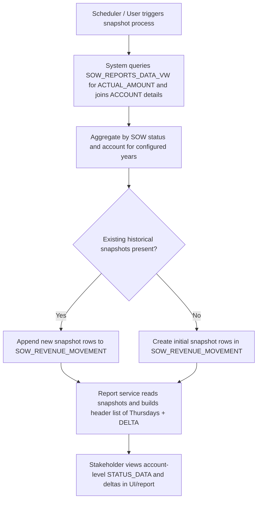
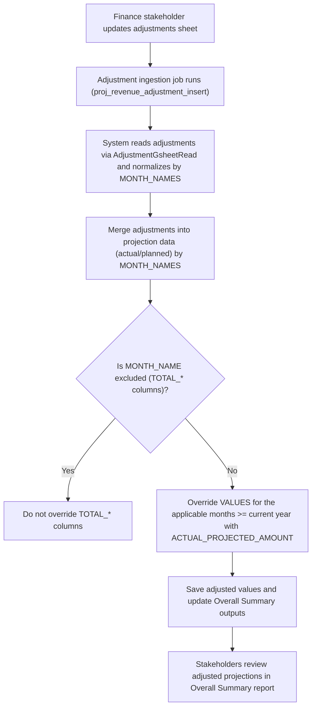
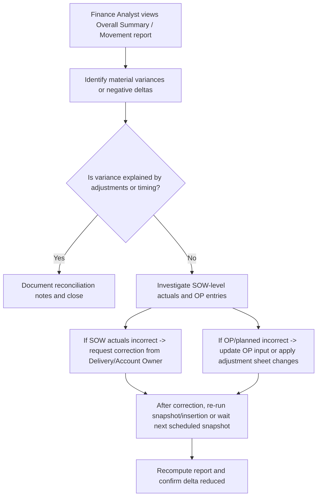

# Revenue Recognition & Movement Reporting

## Business Overview
This feature captures, adjusts, and reports revenue at the Statement-of-Work (SOW) and Account level to support weekly movement tracking, monthly/quarterly summaries, and reconciliations against planned amounts. It distinguishes between "actual/recognized" revenue (amounts recorded as realized in SOW reports) and "planned/projected" revenue (amounts in the overall plan / OP and planning months). Adjustments supplied by finance/stakeholders (via a maintained adjustments sheet) can override projected values for current and future months. Weekly snapshots (Thursday cadence) are persisted for trend reporting and delta-based reconciliation.

Target users / personas:
- Finance Analyst: review weekly revenue movements, reconcile to accounting systems
- Revenue Operations / Sales Ops: compare signed pipeline vs plan, track new logos and renewals
- Account Owner / Delivery Manager: validate SOW-level recognized amounts and approve adjustments
- Executive / Reporting Consumer: view high-level deltas, flags, and quarter summaries

Business value:
- Provide authoritative weekly snapshots of recognized revenue and status-segmented totals per account
- Apply stakeholder adjustments to projected revenue to reflect commercial realities
- Flag variances versus OP and enable reconciliation workflows

Scope:
- Ingest actual SOW recognized amounts from SOW_REPORTS_DATA_VW
- Apply planned OP amounts from overall plan datasets
- Read adjustments from a stakeholder-maintained adjustments sheet and apply to projections
- Persist weekly SOW_REVENUE_MOVEMENT snapshots and provide account-level movement report with historical Thursdays + DELTA
- Provide an overall summary report with OP vs Signed vs Actual/Projected breakdowns and GREEN/RED flags

---

## Key Business Definitions
- Recognized Revenue (Actual): amounts recorded as realized in SOW reports (source: SOW_REPORTS_DATA_VW.ACTUAL_AMOUNT). These are the authoritative, historical entries representing revenue already earned.
- Planned/Projected Revenue (Planned/OP): forward-looking amounts from the overall plan (OP/Planning months). Used for forecasting and target comparisons.
- Adjustment: a stakeholder-supplied override (from an adjustments sheet) that replaces projected values for applicable months (used primarily for current and future months when an exception is required).
- Revenue Movement Snapshot: a weekly (Thursday) persisted summary per Account that stores TOTAL_AMOUNT by status (Signed, Green, Signed_Green) and THURSDAY_DATE. Used to compute deltas and trends.
- Status buckets:
  - "Signed": SOWs whose probability/status maps to executed business (Signed / 100%)
  - "Green": pipeline categories that indicate high-probability proposals (e.g., Proposal, Renewal, Qualified)
  - "Signed_Green": combined Signed + Green for comparative analysis

---

## Functional Requirements
- **FR-001**: The system shall import SOW-level actual recognized amounts from SOW_REPORTS_DATA_VW and aggregate them into account-level totals for a configurable year range.
- **FR-002**: The system shall group SOW amounts into status buckets: "Signed", "Green", and "Signed_Green" using defined probability/status mappings.
- **FR-003**: The system shall persist weekly (Thursday) account-level snapshots to the SOW_REVENUE_MOVEMENT table with fields including ACCOUNT_ID, ACCOUNT_NAME, STATUS, TOTAL_AMOUNT, THURSDAY_DATE, CREATED_DATE.
- **FR-004**: The system shall compute and expose a historical header of Thursday snapshot dates and a DELTA column representing change between the two most recent snapshots.
- **FR-005**: The system shall read stakeholder adjustments from a maintained adjustments data source and apply these adjustments to projected/planned values for current and future months before generating summary reports.
- **FR-006**: The system shall surface an Overall Summary report that provides OP (overall plan), Signed, Signed+Green, and Actual/Projected sections per account, SOW type, and SOW status.
- **FR-007**: The system shall mark rows in the summary report as "GREEN" or "RED" when Signed+Green VALUES meet or fall below OP VALUES respectively.
- **FR-008**: The system shall allow the weekly movement insertion process to be scheduled or run on-demand to capture the latest actuals.
- **FR-009**: The system shall exclude certain summary total columns from adjustment application (TOTAL_* columns as configured) when applying adjustments.
- **FR-010**: The system shall provide new-logo logic: identify SOWs/accounts that are first-starting in a year and present them separately in reports.
- **FR-011**: The system shall allow reconciliation consumers to drill into account-level STATUS_DATA showing historical snapshot values and DELTA per status.

---

## User Roles & Permissions
- Finance Analyst
  - View and export weekly movement and overall summary reports
  - Trigger on-demand snapshot insertion (if allowed)
  - Propose or upload adjustments via the adjustments source (sheet)
- Revenue Operations / Sales Ops
  - View reports and approve proposed adjustments in the stakeholder adjustments sheet
  - Validate flags and anomalies
- Account Owner / Delivery Manager
  - Review SOW-level recognized amounts; request corrections
- System/Service Account
  - Automated processes that run snapshots and adjustment application

Permission matrix (summary):
- Read reports: Finance, RevOps, Account Owner
- Run insertion/ETL jobs: System account, Ops (restricted)
- Update adjustments sheet: Finance and authorized stakeholders

---

## User Workflows & Journeys

### User Workflow: Weekly Snapshot (Create Revenue Movement Snapshot)

Workflow Steps:
1. Scheduler or authorized user triggers the weekly insertion process.
2. System queries SOW_REPORTS_DATA_VW to pull SOW-level actual amounts and account metadata.
3. System aggregates SOW amounts into status buckets (Signed, Green, Signed_Green) at account level.
4. System persists totals with THURSDAY_DATE into SOW_REVENUE_MOVEMENT (append or initial insert).
5. Reporting service fetches historical snapshots and computes DELTA between latest two dates.
6. Stakeholders view the account-level historical STATUS_DATA and reconcile deltas.

Business Rules Applied:
- BR-001: Snapshot cadence is weekly with THURSDAY_DATE representing the snapshot day.
- BR-002: Status mappings are authoritative: Signed -> [Signed], Green -> [Proposal, Renewal, Qualified], Signed_Green -> union of the two.
- BR-003: If both current snapshot and historical data exist, compute DELTA as latest minus previous.

---

### User Workflow: Apply Stakeholder Adjustments to Planned Revenue

Workflow Steps:
1. Finance updates the adjustments source (typically a Google Sheet maintained by stakeholders).
2. Adjustment ingestion job reads adjustments into adjusted_df via AdjustmentGsheetRead.
3. For each account or global adjustment, system aggregates ACTUAL_PROJECTED_AMOUNT by MONTH_NAMES.
4. When preparing summary data, the system merges adjusted_df into projected/actual data. For months in or after the current year, adjusted values replace projected VALUES.
5. Certain SUMMARY TOTAL columns (TOTAL_* columns) are excluded from being directly overwritten per configuration.
6. Stakeholders review the adjusted outputs in the Overall Summary report.

Business Rules Applied:
- BR-004: Adjustments are applied at the MONTH_NAMES level, aggregated by MONTH where applicable.
- BR-005: Adjusted values override projected VALUES only for months that are not in the exclusion list and where the month year >= current year.
- BR-006: Adjustments are aggregated by month (ACTUAL_PROJECTED_AMOUNT is summed per MONTH_NAMES prior to merge).

---

### User Workflow: Review & Reconcile (Stakeholder Reconciliation Flow)

Workflow Steps:
1. Analyst inspects the movement and overall summary reports and flags unexpected deltas.
2. Determine whether adjustments or timing account for the variance.
3. If not explained, drill down to SOW-level actuals or OP planned entries to identify root cause.
4. Request corrections (SOW corrections or OP updates) or add an adjustment to reflect agreed amounts.
5. Re-run or wait for next snapshot to confirm reconciliation.

Business Rules Applied:
- BR-007: Deltas must be explainable either by an adjustment, a timing difference (recognition lag), or data correction.
- BR-008: Any adjustment applied must be traceable back to an entry in the adjustments source and timestamped by the ingestion process.

---

## Business Rules & Validations
- **BR-001**: Snapshots are created weekly; the THURSDAY_DATE is used as the canonical snapshot key.
- **BR-002**: Status bucket membership is deterministic: Signed: ["Signed"], Green: ["Proposal","Renewal","Qualified"], Signed_Green: union.
- **BR-003**: Adjustments data shall be aggregated by MONTH_NAMES before overwrite and the aggregated ACTUAL_PROJECTED_AMOUNT shall be used to replace VALUES for applicable months.
- **BR-004**: Do not overwrite configured TOTAL_* summary columns when applying adjustments.
- **BR-005**: Adjusted values replace projected VALUES only for months where YEAR >= current year (system enforces current/future month override logic).
- **BR-006**: When preparing account or type-level summaries, rows whose TOTAL_SUM across the reporting years are all zero shall be suppressed from the final output (cleaning zero-only rows).
- **BR-007**: New-logo accounts are identified by earliest SOW LEGAL_START_DATE grouped by account; new-logo presentation shows values only for the SOW start year.
- **BR-008**: All persisted snapshots should include CREATED_DATE for auditability.
- **BR-009**: DELTA is computed as latest snapshot TOTAL_AMOUNT minus previous snapshot TOTAL_AMOUNT for each status and account.
- **BR-010**: If adjustments sheet is unavailable or ingestion fails, reports should fall back to unadjusted projected values and log the failure.

---

## Data Entities (Business View)
- Account
  - account_id
  - account_name
  - account_signed_year (derived from MSA_SIGNED_DATE)

- SOW (Statement of Work)
  - sow_id
  - sow_name
  - sow_type
  - sow_status
  - legal_start_date
  - legal_end_date
  - probability
  - month (reporting month formatted as "Mon_yy")
  - year
  - actual_amount

- Overall Plan / OP Entry
  - account_id
  - planning_month (e.g., "Jan_24")
  - amount
  - planning_year

- Adjustment Entry (from adjustments sheet)
  - MONTH_NAMES
  - ACTUAL_PROJECTED_AMOUNT
  - ACCOUNT_ID (optional)
  - Source metadata (uploader, timestamp)

- SOW_REVENUE_MOVEMENT (snapshot table)
  - ACCOUNT_ID
  - ACCOUNT_NAME
  - STATUS (Signed / Green / Signed_Green)
  - TOTAL_AMOUNT
  - THURSDAY_DATE
  - CREATED_DATE

Relationships and lifecycle:
- SOWs roll-up to Accounts; SOW actuals feed into snapshots and overall summary calculations.
- OP entries are merged with SOW and adjustments when generating the overall summary output.
- Snapshots are appended weekly and provide time-series for reconciliation and trend analysis.

Data retention:
- Weekly snapshots are retained historically to allow trend/delta calculations; retention policy should be defined by Finance (recommended: retain at least 24 months).

---

## Integration Points
- SOW_REPORTS_DATA_VW (internal RRE DB view): source of SOW actual amounts and SOW metadata.
- ACCOUNT_DETAILS_VW (internal RRE DB view): source of account names and signed dates.
- Adjustments data source (AdjustmentGsheetRead): external Google Sheet or configured store where stakeholders maintain overrides.
- SOW_REVENUE_MOVEMENT table: persistence target for weekly snapshots.
- Reports services: Overall Summary and SOW amount movement report generation code read snapshots and adjusted data to produce UI/JSON payloads.

---

## User Interface Requirements
- Dashboard header with series of Thursday snapshot dates and a DELTA column to the right.
- Account list with per-account expandable view showing STATUS_DATA arrays (Signed_Green, Green, Signed) each with time-series values per header and DELTA.
- Overall Summary screens showing OP, Signed+Green vs OP with GREEN/RED flags at account and SOW-type aggregation levels.
- Adjustment status indicator showing when adjustments were applied and when ingestion last succeeded (audit trail link).
- Drill-down to SOW-level details (LEGAl_START_DATE, probability, monthly values) for reconciliation.
- Export to CSV/Excel for Finance-led reconciliations.

---

## Non-Functional Requirements
- Performance: reports should generate within acceptable limits (e.g., account-level movement payload within 10s for typical dataset). Complex aggregations may be precomputed by scheduled jobs.
- Security: access control for viewing and running snapshot/adjustment jobs; only authorized stakeholders may edit the adjustments sheet.
- Reliability: ingestion jobs should be resilient — failures logged and reported to stakeholders; fallback to unadjusted values if needed.
- Scalability: snapshot and aggregation processes should scale with number of accounts/SOWs; consider incremental snapshots for large volumes.

---

## Business Scenarios & Use Cases
- US-001: As a Finance Analyst, I want weekly snapshots of revenue per account so that I can monitor short-term movement and investigate deltas.
  - Acceptance Criteria: weekly rows exist in SOW_REVENUE_MOVEMENT; UI shows historical columns and DELTA.

- US-002: As a Revenue Ops user, I want adjustments to be applied to planned projections so that the summary reflects commercial amendments.
  - Acceptance Criteria: adjustments ingestion updates projected VALUES for current/future months; Overall Summary displays adjusted numbers and indicates adjustments applied.

- US-003: As an Account Owner, I want to reconcile SOW actuals vs OP so that discrepancies can be corrected before month-end close.
  - Acceptance Criteria: drill-down to SOW level shows actuals and planning values, and reconciliation notes can be recorded externally.

---

## Error Handling & Edge Cases
- If adjustment ingestion fails, the report should include a note that adjustments were not applied and fall back to original planned values (BR-010).
- If a month string cannot be parsed, it should be treated as non-date and excluded from date-based overrides; system logs parsing errors.
- If all totals for an account across years are zero, suppress account from final outputs to reduce noise.
- If SOW_REPORTS_DATA_VW returns duplicate rows, deduplicate by full column set before aggregation.

---

## Assumptions & Constraints
- Adjustments are maintained externally (e.g., Google Sheet) and ingested by the AdjustmentGsheetRead utility.
- Status mappings (Signed / Green lists) are stable and defined in code; any changes require a release or configurable mapping.
- The primary snapshot cadence is weekly (Thursday). Daily or different cadence not supported by current processes.
- Reconciliation to general ledger is out-of-scope; these reports support internal recon rather than accounting entries.

---

## Open Questions & Recommendations
- Recommendation: expose the status-to-probability mapping as configurable to avoid code changes when business definitions evolve.
- Open Question: Define retention policy for SOW_REVENUE_MOVEMENT (e.g., retain 24 months) and archival approach.
- Recommendation: Add audit metadata to adjustments (uploader, comments) to help downstream reconciliations.

---

## Appendix: Data Sources Referenced (files / modules)
- Adjustment ingestion: AdjustmentGsheetRead (used in Overall Summary subtraction logic)
- Weekly snapshot insertion: sow_amount_movement_inserter() (triggered by revenue_movement_insert_thursday.py)
- Adjustment insertion trigger: proj_revenue_adjustment_insert() (triggered by adjustment_revenue_insert.py)

