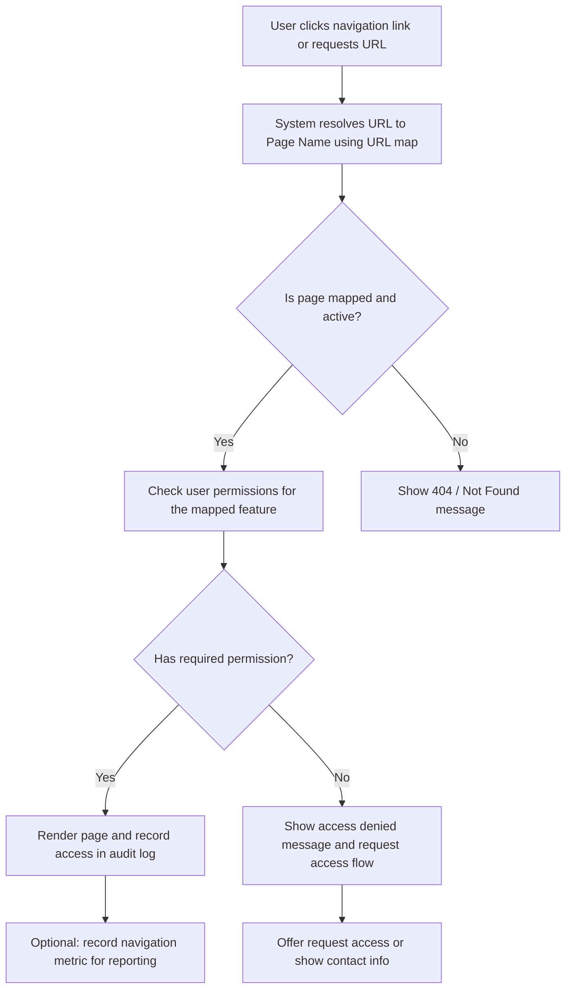
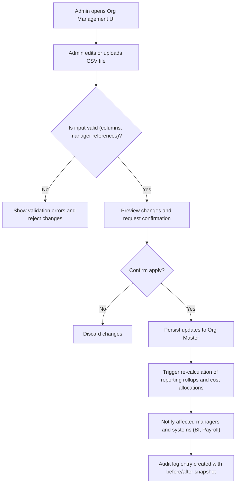

# Structural Metadata and URL Mapping

## Business Overview
This section explains how the application's URL mapping and organizational structure CSVs drive navigation, access control, reporting aggregation and resource allocation. The URL map links logical features and business pages to canonical URLs used by the UI and by access control rules. The organization structure file defines employees, reporting relationships, project managers and designations — the authoritative source for role assignment, reporting rollups and cost-center allocation.

Business value:
- Consistent navigation and page identification for users and integrations (reports, bookmarks, SSO)
- Single source of truth for reporting hierarchies and cost center alignment
- Deterministic mapping from user roles / manager relationships to access and report aggregation

Scope of this document: the CSV files
- URL mapping: maps file-based routes (e.g., "reportSowBySOW.html") to human-friendly page names (e.g., "Amount By SOW").
- Org structure: tabular employee records with Emp ID, roles, Project Manager IDs and Reporting Manager names used for permissions and reporting.

## Key Observations from Source Files
- URLMapping.csv contains two columns: "URL" and "Page Name". It lists ~38 canonical pages including dashboards (Reports Dashboard, Admin Dashboard), SOW-related pages, resource and utilization reports, and organizational pages (Teams, ORG Chart).
- Org_Structure.csv includes columns: "Name of the Employee", "Emp ID", "Designation", "Project Manager ID", "Reporting Manager" (and meta fields). It enumerates employee records and explicit manager relationships, with a top-level executive (VP) with Reporting Manager ID 0.

## Functional Requirements
**FR-001**: The system shall store a canonical URL-to-feature mapping that associates each navigable page URL with a single human-friendly page name.

**FR-002**: The system shall allow authorized administrators to create, update and deactivate URL mappings; changes shall be versioned (audit trail) and timestamped.

**FR-003**: The system shall use the URL-to-feature mapping as the authoritative source for navigation menus, breadcrumbs and bookmarkable links.

**FR-004**: The system shall map each URL to one or more required permission scopes (role, responsibility or entitlement) and enforce access checks on page load.

**FR-005**: The system shall load organizational hierarchy data (Emp ID, Reporting Manager, Project Manager ID, Designation) and use it to compute role-based access and reporting rollups.

**FR-006**: The system shall provide an administrative UI for managing organization structure records with bulk import/export (CSV), validation and preview before commit.

**FR-007**: The system shall prevent creation of circular reporting relationships and must validate manager references exist in the employee dataset.

**FR-008**: The system shall propagate changes in reporting structure to downstream reporting and cost allocation systems within a configurable delay (e.g., near-real-time or nightly batch) and provide a re-run option for historical recalculation.

**FR-009**: The system shall allow mapping of employees to cost centers and business units; cost center changes must be traceable with effective dates.

**FR-010**: The system shall expose APIs or data feeds for BI/reporting systems to retrieve the canonical URL mapping and the current organization hierarchy.

**FR-011**: The system shall restrict who can edit URL mappings and org structure to authorized roles (e.g., Admin, HR Admin, System Integrator) and log all changes.

**FR-012**: The system shall support read-only views of the URL map for auditors and for automated link-checking processes.

**FR-013**: The system shall use org hierarchy to determine report aggregation scope (e.g., roll-up by Reporting Manager, by Project Manager, or by Designation level).

## User Roles & Permissions
- Administrator
  - Can create/update/delete URL mappings
  - Can manage org structure and cost center assignments
  - Can trigger re-calculation of aggregated reports
- HR Admin / Org Manager
  - Can update employee records and reporting relationships
  - Can upload bulk CSVs for org updates (subject to validation)
- Business User (Manager)
  - Can view aggregated reports for their direct and indirect reports
  - Cannot change canonical URL mappings or organization master data
- Auditor / Read-only user
  - Can view the URL map and org structure history
- System/Integration user (API key)
  - Can read mappings and org structure via API; write access only through dedicated integration accounts

Permission matrix (extract):
- "Admin Dashboard" (URL: adminDashboard.html) -> Admin only
- "Reports Dashboard" (URL: reportsDashboard.html) -> Business Users + Admin
- SOW pages (sow.html, sowCreate.html, sowTeamAllocation.html) -> Project Managers + Admin

## User Workflows & Journeys

### User Workflow: Accessing a Page via URL Mapping

#### Workflow Steps:
1. User navigates by clicking a link or entering a URL.
2. System resolves the URL via the canonical URLMapping dataset.
3. If mapping exists and is active, system evaluates the permission scopes for the mapped feature.
4. If user has permission, page is rendered and access is logged.
5. If user lacks permission, an access denied flow is shown with option to request access.
6. If URL mapping does not exist, display Not Found and log for remediation.

#### Business Rules Applied:
- BR-001: Every UI route presented to users must be present in the canonical URL mapping.
- BR-002: Deactivated URLs must return a Not Found (404) or Redirect to a replacement URL.
- BR-003: Access to a page must be denied unless at least one assigned permission scope matches the user or their manager-based entitlements.

### User Workflow: Updating Organization Structure (Admin)

#### Workflow Steps:
1. Admin accesses the org management screen.
2. Admin uploads a CSV or edits a record inline.
3. System validates format, required columns and checks that referenced manager IDs exist and no cycles are introduced.
4. Admin previews changes and confirms.
5. System persists updates, recalculates rollups and notifies dependent systems; audit entry created.

#### Business Rules Applied:
- BR-004: All imports must include required columns: Emp ID, Name, Designation, Reporting Manager, Project Manager ID.
- BR-005: Manager references must exist and cannot create circular reporting chains.
- BR-006: Changes that affect cost center assignments must include an effective date.

## Business Rules & Validations
**BR-001**: Every navigable UI route presented to users must have a corresponding active entry in URLMapping.csv (URL -> Page Name).

**BR-002**: URL entries must include a default required permission scope; missing scopes default to Admin-only until assigned.

**BR-003**: Org structure records must include a valid Emp ID and a Reporting Manager reference (or explicit root marker e.g., 0) for top-level executives.

**BR-004**: Bulk imports must be validated for schema conformance and prevented from applying if any critical validation fails.

**BR-005**: No circular reporting (A reports to B reports to A). The system shall detect cycles and reject the change.

**BR-006**: Historical changes to organization structure and cost-center assignments must be auditable with before/after snapshots and timestamps.

**BR-007**: Access to pages mapped to financial data (Revenue, Allocation) must require elevated permissions and be logged for compliance.

## Data Entities (Business View)

### URLMapping
- URL (unique) — e.g., "reportSowBySOW.html"
- Page Name — human friendly label (e.g., "Amount By SOW")
- Feature/Module (derived) — e.g., Reports, SOW Management, Admin
- Status (active/inactive) — business metadata (recommended)
- Required Permission Scope(s) — roles or entitlements required to view page
- Owner (business owner)

### Employee (Org Structure)
- Emp ID (unique)
- Name
- Designation (e.g., BA, SC, C, SBA, M, VP)
- Project Manager ID (references Emp ID)
- Reporting Manager (name or Emp ID) — used for rollups
- Cost Center / Business Unit (recommended field)
- Effective From / To (for history)

### Relationships
- Employee -> reportsTo -> Employee (manager)
- Employee -> assignedTo -> Cost Center / Project
- URLMapping -> ownedBy -> Business Owner / Role

## Integration Points
- Authentication/Authorization service (identity provider) to evaluate user roles and map to permission scopes
- BI/Reporting platform that consumes org hierarchy for roll-ups and dashboards
- HRIS/Payroll systems for employee master sync and cost center allocations
- Link-checker/Monitoring job to verify mapped URLs return expected responses and to detect stale mappings

## User Interface Requirements
- Admin screens for URL mapping management with list, search, edit, activate/deactivate and audit history
- Org management UI with inline edit, CSV bulk upload, validation preview and apply workflow
- Navigation menu generation uses the canonical URL map and role filters to display permitted links
- Report filters include selectors for aggregation scope: "My Team", "My Department", "By Project Manager", "By Cost Center"

## Non-Functional Requirements
- NFR-001: URL resolution must be sub-100ms for navigation requests under normal load.
- NFR-002: Org import validation shall process a 10k-row CSV within acceptable batch window (e.g., <= 2 minutes) or run as background job with progress.
- NFR-003: Audit/Change logs must be retained per policy (e.g., 7 years for compliance-sensitive financial pages).
- NFR-004: Access checks enforced for mapped pages must be logged with user, timestamp, URL and result.

## Business Scenarios & Use Cases
**US-001**: As a Manager, I want to view the "Reports Dashboard" so that I can see aggregated KPIs for my team.
- Acceptance Criteria:
  - Dashboard URL resolves to reportsDashboard.html
  - Manager can see aggregated numbers for direct and indirect reports
  - Unauthorized users cannot view the dashboard

**US-002**: As an HR Admin, I want to upload a CSV with updated reporting managers, so that reporting structures are current for reporting and allocations.
- Acceptance Criteria:
  - System validates CSV schema and manager references
  - Admin can preview and confirm changes
  - Changes are applied and notifications sent

**US-003**: As an Auditor, I want a read-only export of the URL map and org structure, so that I can verify access and reporting rules.
- Acceptance Criteria:
  - Export returns canonical URL to Page Name mapping and current employee reporting tree
  - Export includes timestamps and last-modified user for each record

## Error Handling & Edge Cases
- Missing URL mapping -> show configurable fallback (404 or redirect to Dashboard) and log for remediation
- Manager ID not found in import -> validation error and row-level rejection or quarantine
- Circular manager relationships -> reject import and highlight cycle for correction
- Simultaneous edits -> optimistic concurrency control with conflict detection and user-friendly merge or retry guidance

## Assumptions & Constraints
- Assumes the CSV files are the source-of-truth for the UI until an authoritative DB-backed master exists
- Assumes Emp IDs are unique and stable identifiers across systems
- Cost center data is not present in the provided CSV and will need to be integrated or added as a field
- The mapping between Page Name and required permissions is not present in the CSV; it must be maintained in a separate permissions store

## Open Questions & Recommendations
- Recommend adding columns to URLMapping.csv: "Required Permission", "FeatureOwner", "Status", and "LastModified" for operational control.
- Recommend extending Org_Structure.csv to include "Cost Center", "EffectiveFrom", and numeric "Manager Emp ID" for unambiguous references.
- Add automated link validation to detect stale or removed pages and a scheduled sync with the CMS or routing system.

---

Appendix: Extract (sample) entries used from URLMapping.csv and Org_Structure.csv

- Key pages found in URLMapping.csv: "Home", "Reports Dashboard", "Admin Dashboard", "SOW Profile", "SOW Create", "Allocation Dashboard", "Resource Utilization", "Teams", "ORG Chart", "Amount By SOW", "Recognised Revenue Report", "Approval Dashboard"
- Org_Structure key columns: "Name of the Employee", "Emp ID", "Designation", "Project Manager ID", "Reporting Manager"
