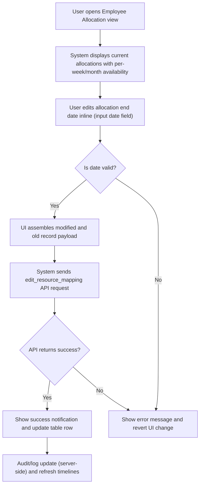
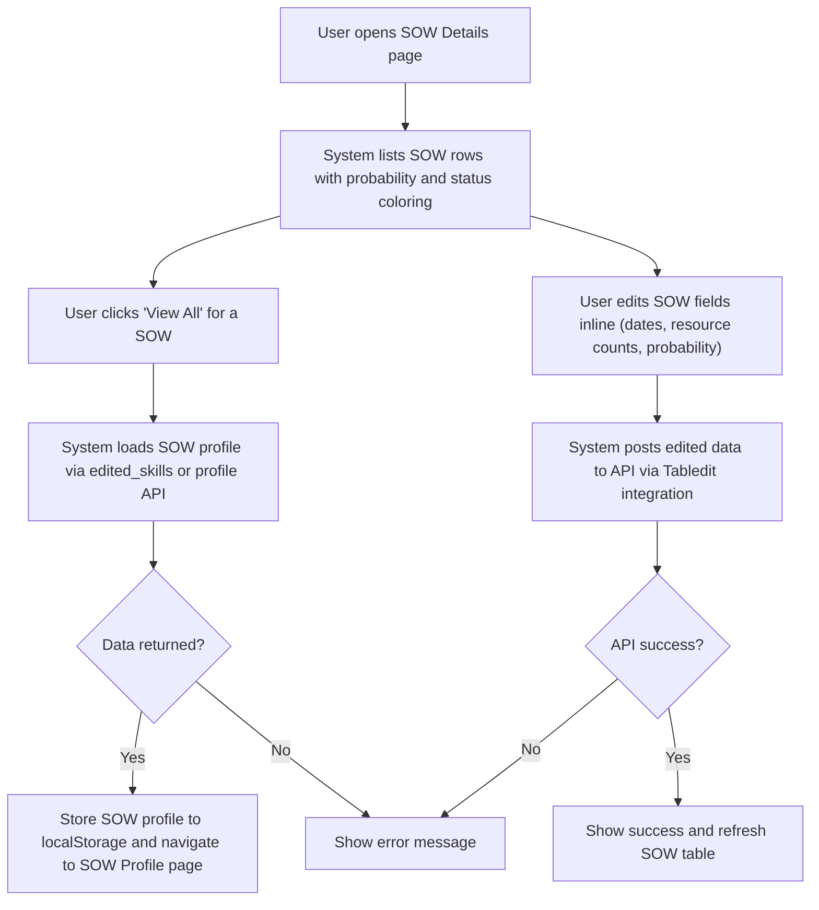
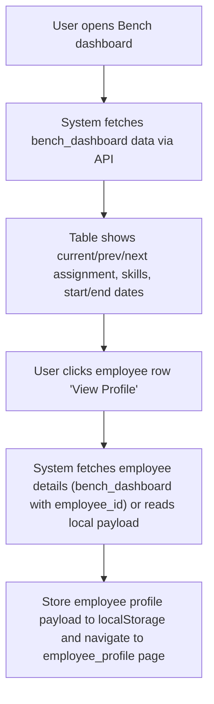
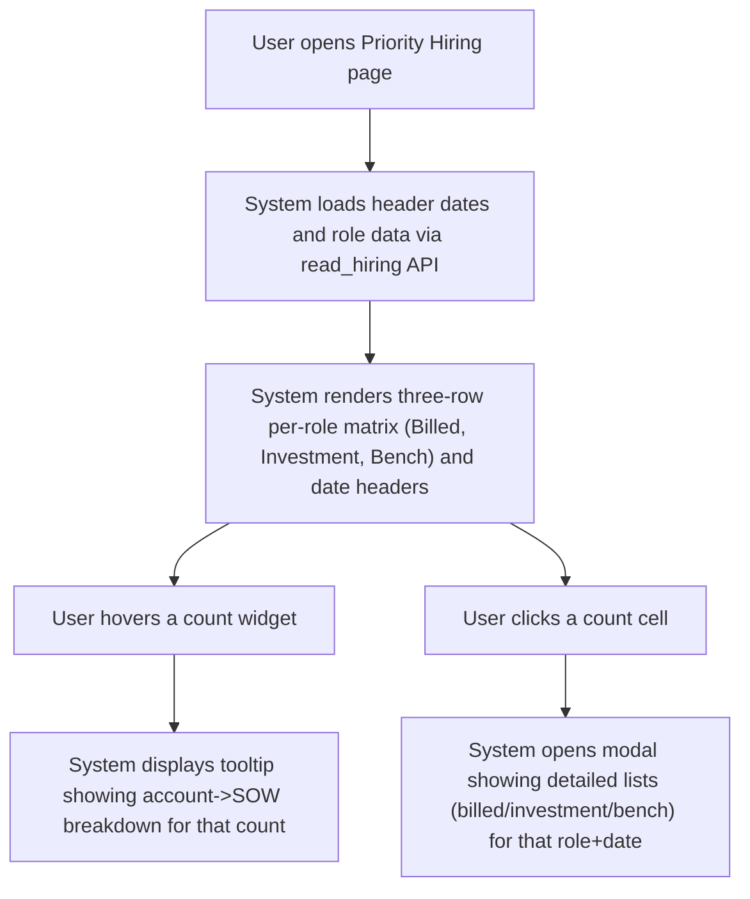

# Legacy UI and Historical Requirements

## Business Overview
This section documents legacy ("old") UI flows for Factspan RRE (employee, SOW, allocation, bench, priority hiring) to capture deprecated or alternate business behaviour retained for historical context and migration planning. The legacy UI is table-driven, optimized for inline edits and dense operational views (per-week availability, in-place allocation edits, Tabledit editing for SOW and team rules, tooltips with account/SOW detail).

Target users / personas:
- Resource Manager: manages employee allocations, updates project end dates, reviews bench and allocations
- SOW/Project Manager: views and edits SOW metadata (dates, probability, resource counts)
- Hiring/Workforce Planner: reviews priority hiring heatmaps and open positions
- Operations/Analytics user: uses bench dashboard and metrics to identify revenue loss, overstaff, utilization

Business value: preserve operational controls and decision data that drove allocations and hiring prioritization in the legacy UI to avoid regressions when migrating/simplifying the UI.

Scope of this document: legacy features found under the /old/ folder (employee allocation, SOW details, bench/use-bench, priority hiring). This captures business rules, workflows, and requirements that were implemented in the legacy UI and notes items that appear to have been simplified or retired in later versions.

---

## Summary of Major Differences Observed (legacy behaviours vs simplified/likely-new UI)
- Legacy UI offered heavy inline-edit capabilities (editable table rows using Tabledit and inline date inputs) for SOW and Employee allocation end-dates; that enabled operators to update allocation end-dates directly in tables. This places update control in UI.
- Legacy allocation view included granular per-week availability cells (12 months expanded into monthly/week cells) showing binary availability flags; dense time-series view useful for manual capacity checks. Newer/simplified UIs commonly collapse this to monthly or summarized views, so weekly detail may be lost.
- SOW probability coloring and dynamic status were applied client-side in legacy JS (sowDetails.js) using probability ranges to color rows — preserving immediate visual risk signals. Simplified UIs may remove this client-side logic or replace with server-derived status.
- Bench dashboard presented rich historical/current/next assignment columns and detailed skill buttons per employee; legacy UI also surfaced previous and next assignment dates. Simplified UIs may hide prev/next columns or reduce skill display granularity.
- Priority hiring legacy pages include two implementations: a static sample-based older script (priority_hiring_old.js) and an API-driven priority_hiring.js. The legacy approach included hover tooltips with account -> SOW breakdowns and three-row role breakdown (Billed, Investment, Bench) per role/date header — a dense analytical view that can be simplified in new UIs.
- Legacy code used synchronous/ajax patterns and localStorage to pass row/profile data between pages (employee profile, sow profile). Newer SPA approaches typically use central state or API endpoints; localStorage-based handoff may have been deprecated.

---

## Functional Requirements (retained from legacy context and additional legacy FRs)

**FR-001**: The system shall allow resource managers to edit an employee's project allocation end date directly from the Employee Allocation table.

**FR-002**: The system shall persist allocation updates to the resource mapping service and provide immediate feedback (success notification) upon update.

**FR-003**: The system shall display per-employee allocation status across time (legacy displayed per-week availability across months) so users can view granular availability in a timeline grid.

**FR-004**: The system shall allow SOW-level inline editing for date fields (legal, billing, actual start/end) and resource counts via an editable SOW Details table.

**FR-005**: The system shall display SOW probability and visual status (colored row backgrounds) based on probability thresholds and pre-defined mapping (e.g., 100% -> white, 70% -> green, 50% -> yellow, <30% -> blue).

**FR-006**: The system shall provide a Bench dashboard that lists current, previous, and next assignment details for each employee including start/end dates and present status, with skill tags rendered as action buttons.

**FR-007**: The system shall support a Priority Hiring view that presents role-wise three-line breakdown per date header: Billed, Investment, Bench counts and allow drill-down tooltips to see account and SOW contributions.

**FR-008**: The system shall support SOW profile drill-down: selecting "View All" for a SOW shall store the profile payload locally and navigate to a SOW profile details page.

**FR-009**: The system shall support employee profile drill-down: selecting an employee from bench or allocation lists shall store the payload locally and navigate to an employee profile page.

**FR-010**: The system shall support configurable business rules for team hiring (TEAM_HIRING table) editable via table UI and persisted via API.

**FR-011**: The system shall show tooltips listing account->SOW breakdowns when hovering count widgets in priority hiring and open position views.

**FR-012**: The system shall allow filtering of employee/bench/allocation lists by geography (IND/US/ALL), job role, reporting manager, function and skills (legacy used multi-selects for skill filters).

(These FRs are written as business-level items derived from legacy behaviour captured in the /old/ code.)

---

## User Roles & Permissions (observed/inferred from legacy UI)

- Resource Manager
  - Capabilities: edit allocation end dates, view allocation timeline, drill to employee profile, view SOW details
- SOW/Project Manager
  - Capabilities: view and inline-edit SOW metadata, open SOW profile
- Hiring/Workforce Planner
  - Capabilities: view priority hiring dashboards, open billed/investment/bench details, export/print (legacy code used DataTables)
- Operations Analyst
  - Capabilities: view metrics (SOW allocation summary, utilization), exception pages (overstaff, revenue loss)

Notes: Legacy UI did not include explicit role-check code in front-end artifacts examined. Access control may be enforced server-side or by navigation options. If migration removes inline edit operations, permission model should be audited.

---

## User Workflows & Journeys

### User Workflow: Edit Employee Allocation End Date

#### Workflow Steps:
1. Resource Manager navigates to the Employee Allocation page.
2. System displays a dense table of employees with current allocation and timeline cells.
3. User edits the inline date input for the allocation end date.
4. Client validates the date locally (format) and prepares modified_record and old_record payloads.
5. Client posts edit_resource_mapping to the API and waits for response.
6. On success, show a toastr success and update the row; on failure show an error and revert.

#### Business Rules Applied:
- BR-001: Allocation end date must be a valid future or non-empty date in acceptable format.
- BR-002: Changes must include both modified and old record payloads for audit and rollback.
- BR-003: Only allocation rows with ALLOCATION_STATUS == "CURRENT" should be editable inline.

### User Workflow: SOW Edit & Profile Drill-down

#### Workflow Steps:
1. User views SOW details in a table with colored rows indicating probability.
2. Clicking "View All" fetches detailed SOW profile and navigates to the SOW profile page.
3. Edits to date/resource fields are made inline and persisted by a Tabledit-backed API call.
4. System uses client-side probability parsing to determine color mapping.

#### Business Rules Applied:
- BR-004: Date values of SOW start/end must be stored in canonical format; UI may convert presentation format.
- BR-005: Probability strings are normalized (strip % and textual prefixes) and mapped to color bands.

### User Workflow: Bench Dashboard — View & Drill to Employee Profile

#### Workflow Steps:
1. Bench dashboard loads bench-specific dataset with skill buttons and hidden skill text data.
2. User selects an employee to drill into profile; client saves selected payload and navigates to profile page.
3. Profile page reads localStorage payload and renders detailed employee information.

#### Business Rules Applied:
- BR-006: Bench rows must include skill tags for quick scanning. Hidden concatenated skill text is present for data export.
- BR-007: For drill-down, employee payload must be retrievable by employee id.

### User Workflow: Priority Hiring Analysis (Role / Date matrix)

#### Workflow Steps:
1. System constructs a date-header matrix and maps role-level details into 3 rows-per-role.
2. Hover shows the contributor breakdown; click opens modal with contributor details.
3. Business rules determine flag classes (bill_flag_enable etc.) to indicate whether a cell is actionable.

#### Business Rules Applied:
- BR-008: Counts > 0 shall surface hover tooltips listing contributing accounts and SOWs.
- BR-009: Visual flags indicate whether Billed/Investment/Bench counts are actionable (enable/disable).

---

## Business Rules & Validations (legacy)

**BR-001**: Allocation end date input must be a valid date string; UI should not accept malformed dates.

**BR-002**: Inline edits must carry both modified and old record payloads when calling edit_resource_mapping so that server can audit/reconcile.

**BR-003**: Only allocations with ALLOCATION_STATUS == "CURRENT" are considered editable in the allocation view.

**BR-004**: SOW probability must be normalized (strip non-numeric characters) and mapped to color bands: 100 -> "white", 70 -> "green", 50 -> "yellow", 30/20/10/0 -> "blue".

**BR-005**: Unavailable or zero-count cells in priority hiring should render without hover details; enable flags applied only when counts > 0.

**BR-006**: LocalStorage usage is acceptable only for transient navigation payloads; persistent state or server-side APIs are preferred for migration.

**BR-007**: Team hiring business rules (TEAM_HIRING table) are editable and changes must update persisted business rule store.

---

## Data Entities (Business View)

### Employee (resource)
- Employee ID
- Employee Name
- Designation / Job Role
- Location
- Function
- Current Customer/SOW (name, id, code)
- Current Start/End date (allocation)
- Previous / Next assignments (customer, sow, start/end)
- Skills (SKILL, LEVEL) — displayed as buttons
- Billing Status
- In Notice Period flag

### SOW
- SOW ID
- SOW Code
- SOW Name
- Customer Name
- Legal / Billing / Actual start & end dates
- Project Duration
- Total/Onsite/Offshore resources
- Probability
- Dynamic Status
- Skills required

### Priority Hiring Matrix Objects
- HeaderDates (list of dates used as columns)
- Role (string)
- For each date and role: Billed, Investment, Bench counts and contributor lists (Account/SOW breakdown)

### Team Hiring Rules
- Team_Size
- Role counts (Associate, Analyst, Sr_Analyst, AM, Buffer, MANAGEMENT_AM, SME)

---

## Integration Points
- API endpoint (apiValue.url) with query_type values: resource_mapping, bench_dashboard, read_hiring, read_openPH, read_clientdetails, edited_skills, select (ALL_SOW_VIEW), edit_resource_mapping, hiring, etc.
- LocalStorage used to pass payloads between list and detail pages (employee_profile, sowProfileDetails)
- Tabledit plugin used to generate inline edits which call the same API endpoint
- DataTables library for pagination/search and client-side filtering

---

## UI Requirements (legacy-driven)
- Editable tabular lists with inline date inputs for allocation edits
- Dense timeline grid for allocation availability with month/week columns and show/hide toggles
- Color-coded rows for SOW probability
- Skill tag buttons in bench/employee lists
- Hover tooltips showing account -> SOW breakdown for counts in priority hiring
- Modals to display drilled detailed lists from matrix cells

---

## Non-Functional Requirements (observed expectations)
- Reasonable response feedback for inline updates (toastr success/failure)
- Pagination and searchability (DataTables with pageLength configured)
- Cross-origin AJAX support (legacy scripts used cross-domain calls)

---

## Business Scenarios & Use Cases

**US-101**: As a Resource Manager, I want to extend an employee's project end date directly from the allocations table so that I can quickly adjust schedules.
- Acceptance Criteria: inline date input is editable, API receives modified and old record, UI shows success notification and updates table.

**US-102**: As a SOW Manager, I want to edit billing and legal dates in a SOW table so that schedule data is current.
- Acceptance Criteria: Tabledit inline edit available for date columns, API persists changes, row color updates if probability changed.

**US-103**: As a Workforce Planner, I want a role-vs-date priority hiring matrix with drill-down to contributor details so that I can prioritize hiring actions.
- Acceptance Criteria: Matrix loads, hover tooltips show SOW contributions, clicks open modal with detailed lists.

---

## Error Handling & Edge Cases
- Network/API failures should show a user-facing error and not leave UI in inconsistent state (legacy shows toastr error on AJAX failure).
- Invalid dates entered inline should be rejected and not sent to API.
- Missing payloads for drill-down (localStorage empty) should redirect back to listing or show an error.

---

## Assumptions & Constraints
- Legacy front-end used localStorage and synchronous UX assumptions; migration should replace fragile client-side handoffs with API-driven state.
- Inline edits relied on client-side assembly of JSON payloads — server must accept and validate payloads still.
- Some legacy views exposed fine-grained weekly availability — carrying this forward increases UI complexity and may have been intentionally simplified in newer UI.

---

## Open Questions & Recommendations
- Recommendation: Preserve the edit_resource_mapping capability but restrict via role-based access and add server-side validation/auditing to avoid accidental overwrites.
- Recommendation: Retain priority hiring drill-down semantics (hover + modal) as they provide valuable context; if UI simplification required, provide an alternate compact view with link-to-details.
- Question: Are business rules edited via the UI (TEAM_HIRING) still actively managed by business users or should they be moved to an admin-only interface?

---

## Files Reviewed (source references)
- old/employee.html (page layout, navigation)
- old/js/employeeAlloc.js (getEmpData, getEmpDataTable, inline edit handling, edit_resource_mapping payload)
- old/js/employeeAlloc_old.js (historical variations)
- old/sowDetails.html (SOW table, View All mapping)
- old/js/sowDetails.js (getSowData, getSowProfileData, Tabledit integration, probability-color logic)
- old/useBench.html (bench page layout)
- old/js/useBench.js (bench_dashboard data handling, getEmpDataTable, drill to profile)
- old/priority_hiring_old.html (static legacy layout)
- old/js/priority_hiring_old.js (sample JSON payload and static rendering)
- old/js/priority_hiring.js (API-driven priority hiring matrix construction and tooltip/modal logic)

---

## Next Steps for Migration Teams
1. Inventory server-side endpoints used by legacy UI (query_type values) and ensure API contracts include audit and validation for inline edits.
2. Preserve data-rich drill-downs (priority hiring hover/modal, allocation weekly details) at least as optional expanded views to avoid loss of operational capability.
3. Replace localStorage handoffs with navigable URL parameters or server session state for deterministic behavior.
4. Add RBAC checks for edit actions and document acceptance criteria for retaining inline editing vs a form-based edit flow.

---

(End of legacy UI historical requirements)
