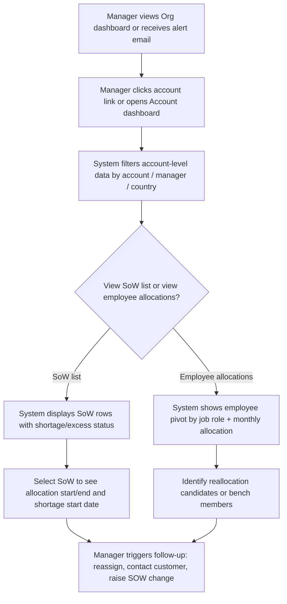
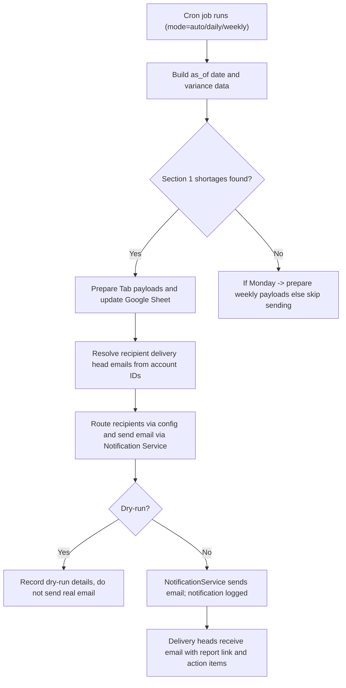

# Org-level & Account-level Allocation Views and Dashboards

## Business Overview
The Org-level and Account-level Allocation Views provide executive and manager stakeholders visibility into current and forecasted resource allocations across the organisation and individual accounts. These dashboards surface allocation shortages (negative allocation / risk of under-delivery), allocation excess (over-allocation), bench and investment exposures, and account-level staffing trends to enable timely actions — reallocation, hiring, SOW amendments, or customer engagement to mitigate revenue leakage.

Target users / personas:
- Executive (C-level / AVP/VP): high-level KPIs, org-wide trends, strategic decisions
- Delivery Leadership / Delivery Heads: account portfolio view, account-level KPIs, trend spotting
- Account Manager / Delivery Manager: drill into account/SoW level details, employee-level allocation
- Resource/People Operations: bench/investment monitoring and reallocation recommendations

Business value:
- Early detection of revenue leakage via allocation shortages in signed or renewal SoWs
- Faster remediation through routed alerts to delivery heads and managers
- Optimised bench/investment utilisation and reduced idle-costs
- Clear drill-down paths from organisation KPIs to account, SoW and employee level

Scope of this BRD:
- Org-level dashboards and account-level pivot views
- KPI calculations for shortage, excess, bench and investment
- Alerting/cron behavior that sends report-ready emails and updates Google Sheets
- Manager drill-downs and executive view (no changes to core allocation engine)

## Functional Requirements
**FR-001**: The system shall present an Org-level dashboard summarising allocation shortages, excess and bench/investment exposures for the current and next year.

**FR-002**: The system shall provide Account-level dashboards that allow managers to filter by account, manager, and country and drill down to SoW and employee-level allocations.

**FR-003**: The system shall compute monthly KPIs across two years (current year and next year) and present them as month-series from Jan_{YY} to Dec_{YY+1}.

**FR-004**: The system shall mark rows as "shortage" when India_shortage < 0 or US_shortage < 0 for the selected statuses (e.g., Signed/Renewal) and expose these as a dedicated section in the Org report.

**FR-005**: The system shall mark rows as "excess" when India_shortage > 0 or US_shortage > 0 and surface them in a separate section.

**FR-006**: The system shall send a report-ready alert email to routed delivery heads when unresolved allocations are detected (daily) and send a weekly summary when none are pending.

**FR-007**: The system shall update a Google Sheet with three tabs: (1) Shortage/Excess (Signed/Renewal), (2) Shortage/Excess (Qualified/Proposal/Pre-Qualified), and (3) Bench & Investment details.

**FR-008**: The system shall allow executives to view summary KPIs (total shortage rows, total excess rows, bench rows, investment rows) and access the underlying Google Sheet report link.

**FR-009**: The system shall provide export and last-updated metadata on the dashboard and in the report ("last_updated_on" and "as_of_date").

**FR-010**: The system shall allow managers to receive alert emails routed by account delivery-head mapping (delivery head email resolved from account list) for only the accounts included in the report.

**FR-011**: The system shall provide a bench & investment view that lists employees with current bench/investment assignments and allows linking to recommended reallocation suggestions.

**FR-012**: The system shall surface employee-level utilization snapshots (Bench/Investment/Billed) and personnel metadata (Job Title, Manager, Location, Tenure).

**FR-013**: The system shall support a cron mode configuration with modes: auto, daily, weekly and flags for dry-run and update-sheet.

**FR-014**: The system shall expose the account and org drill-down path: Org KPI → Account summary → SoW list → Employee allocations.

## User Roles & Permissions
Executive
- Read-only access to Org-level dashboards
- Can view report links and download data

Delivery Head / Manager
- Read/write for Account-level allocation assignments (if integrated with allocation update feature)
- Receive routed alert emails for their accounts
- Can drill into SoW and employee-level allocations for their accounts

People Ops / Resource Manager
- Access bench & investment tab and employee-level details
- Can trigger reallocation recommendations

System / Integration
- Cron job identity that updates Google Sheets and sends notification emails
- Notification service identity (send_email) used to record notifications

Permission matrix (high-level):
- Org KPIs: Executives, Delivery Heads (read)
- Account Details: Account Managers & Delivery Heads (read/drill)
- Edit Account Allocation table: Authorized ops users (via account_allocation API)

## User Workflows & Journeys
### User Workflow: Executive - Review Org Allocation Summary
```mermaid
flowchart TD
    A["Executive logs into dashboard"] --> B["System displays Org KPI summary tiles"]
    B --> C{"Any unresolved shortages?"}
    C -->|"Yes"| D["Click ""View Report"" to open Google Sheet"]
    C -->|"No"| E["Review weekly summary KPI tiles"]
    D --> F["Filter by region/country if desired"]
    F --> G["Drill into Account-level summary"]
    G --> H["Export data or share link"]
    E --> H
```

#### Workflow Steps:
1. Executive opens the Org-level dashboard.
2. Dashboard shows KPI tiles: shortage_rows, excess_rows, bench_rows, investment_rows, last_updated_on.
3. If unresolved shortages exist, the executive clicks the report link to view the Google Sheet with detailed rows.
4. Executive may filter by country or timeline and optionally share or export data.

#### Business Rules Applied:
- BR-001: Org shortage is flagged when India_shortage < 0 or US_shortage < 0 for the selected SoW statuses.
- BR-002: The org dashboard shows two-year monthly series (current and next year).

### User Workflow: Manager - Drill from Org to Account to Employee


#### Workflow Steps:
1. Manager arrives via dashboard or routed alert and opens the account view.
2. Manager applies filters (manager, country) to focus the account list.
3. Manager chooses to view SoW list or employee pivot.
4. Manager reviews shortage rows, dates, and personas to plan remediation.
5. Manager initiates follow-up actions (reassignment, SOW amendment request, escalate).

#### Business Rules Applied:
- BR-003: Account drill-down must include SoW status, billing type, start/end dates, and shortage start date.
- BR-004: When viewing employee allocations, months without allocations default to "Bench" and counts are computed per month.

### User Workflow: Alert Consumption - Cron & Report Email


#### Workflow Steps:
1. Cron (org_level_allocation_report_cron) runs on schedule and invokes OrgLevelAllocationReportAlert.run with mode.
2. The alert builds section 1 (Signed/Renewal) variance; if shortages exist it prepares payloads for three tabs.
3. The system resolves recipient emails for delivery heads for the affected accounts and routes using environment config.
4. Google Sheet is updated and a report-ready email is sent (or dry-run recorded).
5. Delivery heads follow up on the listed shortage rows.

#### Business Rules Applied:
- BR-005: Cron mode "auto" sends daily only if section-1 shortages exist; otherwise sends only on Monday (weekly summary).
- BR-006: Only accounts present in the payload shall have their delivery heads notified.
- BR-007: If email routing is disabled for non-prod, use TEST_RECIPIENTS and route_email_recipients patterns.

## Business Rules & Validations
**BR-001**: Org shortage is defined when India_shortage < 0 OR US_shortage < 0 for the SoW statuses that constitute Section 1 (Renewal, Signed).

**BR-002**: Org excess is defined when India_shortage > 0 OR US_shortage > 0.

**BR-003**: The "as_of_date" drives the snapshot of variance data; if absent, default to today's date.

**BR-004**: Cron modes: "auto" → send daily if shortages exist else send weekly only on Monday; "daily" → send only if section-1 rows exist; "weekly" → always send.

**BR-005**: Notification recipients are resolved by selecting distinct DELIVERY_HEAD email ids from ACCOUNT_DETAILS for included account_ids. Do not send to empty or invalid email addresses.

**BR-006**: Google Sheet update shall be skipped in dry-run or when update-sheet flag is false.

**BR-007**: Bench attribution: when a resource has no allocation entry for a date, count as "Bench" for that month/day.

**BR-008**: When computing monthly series across two years, months must be presented from Jan_{YY} to Dec_{YY+1} and missing months filled with zero/empty as appropriate.

**BR-009**: Do not notify recipients if routing configuration resolves to skip (skip_email true).

**BR-010**: All percent calculations that derive from a FIRST row shall avoid division-by-zero; zero denominators yield 0% or handled as empty per UI rules.

## Data Entities (Business View)
- Organization
  - Attributes: Org ID, Name, last_updated_on
- Account
  - Attributes: Account ID, Account Name, Delivery Head, Delivery Head Email, Account Managers
- SoW (Statement of Work)
  - Attributes: SoW ID, SoW Name, Status (Renewal/Signed/Qualified/Proposal/Pre-Qualified), Billing Type, Start Date, End Date
- Employee / Resource
  - Attributes: Employee ID, Name, Job Role, Manager, Country, Department, Tenure, Current Allocation(s)
- Allocation / Resource Mapping
  - Attributes: Allocation Start/End Date, Billing Status (Billed/Bench/Investment), UNIQUE_ID, SOW_ID, UPDATED_DATE
- Report Snapshot
  - Attributes: as_of_date, tab summaries (shortage_rows, excess_rows, bench_rows, investment_rows), report_link

Data retention: Keep historical snapshots for audit; "as_of_date" must be recorded with each report generation.

## Integration Points
- Notification Service: sends the report-ready email and logs notification status
- Google Sheets API (gspread / Google Drive): writes three tabs (shortage/excess, proposals, bench)
- DB (RRE schema): source of truth for RESOURCE_MAPPING, EMPLOYEE_MASTER, ACCOUNT_DETAILS
- Recommendation bench service: provides bench & reallocation candidates
- teams_service utility: configuration reader and resource status helpers

## User Interface Requirements
- Dashboard must show three summary tiles: Shortage (count), Excess (count), Bench (count), Investment (count) and last_updated_on.
- Drill-down screens: account list with quick filters (Account, Manager, Country), SoW table and employee pivot.
- Table columns for shortage/excess rows: Account, SoW, Status, Billing Type, Start Date, End Date, Shortage Start Date, Shortage (India), Shortage Persona (India), Shortage (US), Shortage Persona (US).
- Bench & Investment tab: employee list with persona, start/end dates and current SoW.
- Export button to CSV/Excel and link to Google Sheet.
- Support mobile-responsive view for executives (summary tiles and drill-to-link).

## Non-Functional Requirements
- NFR-001: The cron job shall complete payload generation and notification within acceptable window (< 5 minutes typical, depending on data volume); Google Sheet updates may take longer.
- NFR-002: Email notifications must be recorded in NotificationService with status (SENT/FAILED).
- NFR-003: Access to org-level reports must be limited to authorized users; report links should not expose PII to unauthorized recipients.
- NFR-004: Dashboard must handle empty datasets gracefully and show message "No data available".

## Business Scenarios & Use Cases
**US-001**: As an Executive, I want to see org-level shortages daily so that I can assess revenue risk across all accounts.
- Acceptance Criteria: Org KPI tile shows shortage_rows > 0; clicking report link opens detailed Google Sheet; last_updated_on present.

**US-002**: As a Delivery Head, I want to receive an email when my account(s) have unresolved allocation shortages so that I can take immediate action.
- Acceptance Criteria: Email sent only for accounts included in payload; email contains report link and context; notification logged.

**US-003**: As a Manager, I want to drill down from account to SoW to employee allocations so that I can reassign or escalate resource gaps.
- Acceptance Criteria: Account-level view lists SoWs, shortage/excess flags, SOW dates and employee pivots per month.

## Error Handling & Edge Cases
- If Google Sheets update fails due to non-native format, attempt to convert office file to native sheet and retry (as implemented).
- If recipient resolution fails or returns no emails, skip sending email and log a skipped reason.
- If NotificationService returns FAILED, capture failure details and retry according to operational policy.
- Division-by-zero in percent computations should return 0% or blank and must not break the flow.

## Assumptions & Constraints
- The core allocation computations (variance_service.build_allocation_variance_data) produce reliable INDIA_SHORTAGE and US_SHORTAGE values.
- Email routing configuration must be present in config to correctly resolve recipients.
- Google service account credentials are available and authorized for the spreadsheet.
- This BRD does not change allocation business rules in allocation_services; it describes reporting and alerting layers only.

## Open Questions & Recommendations
- Recommend a dashboard KPI definition doc to ensure stakeholders and code share consistent definitions for shortage/excess.
- Consider adding an actionable button in the email ("Acknowledge / Mark In Progress") to track remediations via NotificationService reference ids.
- Consider providing a secure viewer link for non-prod/testing vs production (routing already exists via config).

