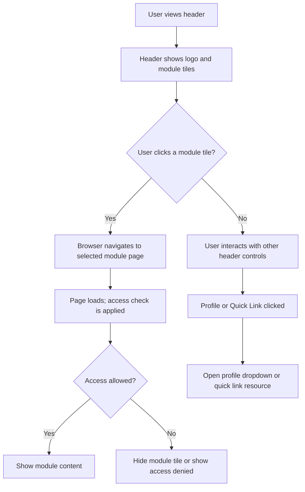
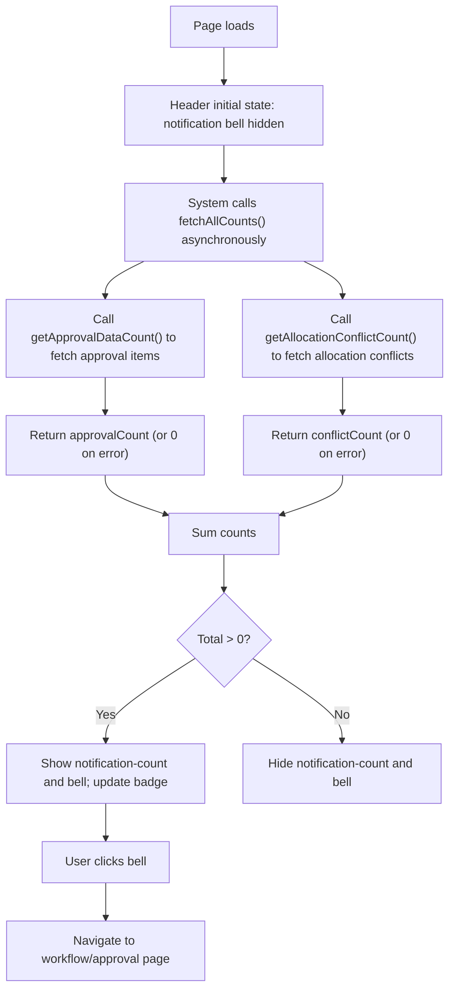
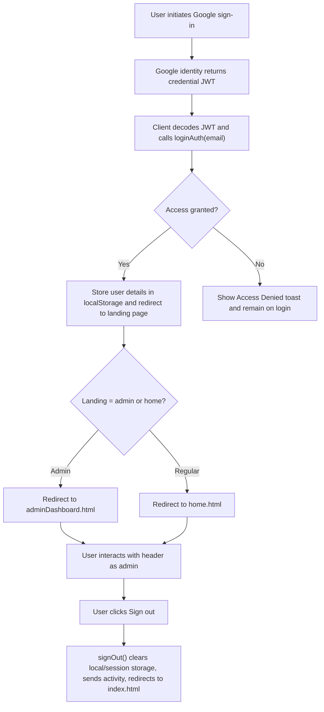
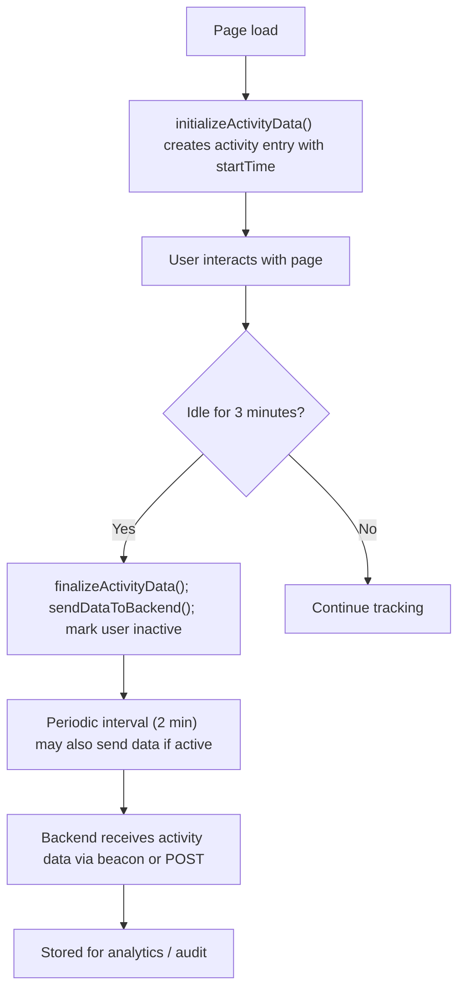

# Common Components & Cross-cutting UX — Header, Navigation, Quick Links, Notifications (RRE-UI)

## Business Overview
This section documents the shared UI components and cross-cutting UX patterns implemented in the RRE-UI header and common scripts. The header and home templates provide global navigation to major modules (Revenue, Team, Allocation, Buying Center, CNPS, Reports), user profile and sign-out, quick links (Notes/User guides), and a notification indicator that aggregates approval and allocation conflict counts. The common JavaScript provides role-based visibility, session and activity tracking, toast notifications, performance logging, and API integrations used across pages.

Target users / personas:
- Regular user (employee): Access module tiles relevant to their role, view personal profile and notifications, open quick links and help documentation.
- Manager / Approver: Receive approval notifications, access workflow and approval pages.
- Admin / Product/CEO roles: Redirected to admin dashboard and shown admin-level controls/tiles.
- Support / Auditor: Use activity logs and performance tracking for troubleshooting and audits.

Business value:
- Provide consistent, discoverable access to major application modules and tools.
- Surface actionable notifications for approvals and allocation conflicts.
- Enforce role-based visibility to reduce clutter and prevent unauthorized access.
- Track usage and performance for product improvement and auditing.

Scope of this document: header.html, HeaderMenu.html, home.html and js/common.js (only files in the assigned scope). Files in "old/" are intentionally excluded.

---

## Functional Requirements
- **FR-001**: The system shall display a global navigation header with links (icons + labels) to key modules: Home, Revenue, Team, Allocation, Buying Center, CNPS, Reports.

- **FR-002**: The system shall display the product logo in the header and allow the logo to navigate to the appropriate landing page (adminDashboard.html or home.html) based on the user's role and department.

- **FR-003**: The system shall determine which navigation tiles and modules are visible to a logged-in user based on the user's access list stored in local storage ("access-page-list" and "user-access-details").

- **FR-004**: The system shall present a profile control in the header showing the user's avatar, name, email and employee id and provide a Sign out button that clears session storage and redirects to the login page.

- **FR-005**: The system shall display a notification bell with an aggregated notification count that combines approval items and allocation conflict counts. The bell and count shall be hidden when total count is zero.

- **FR-006**: The system shall asynchronously fetch approval counts and allocation conflict counts from the API and update the notification count in the header when the page loads.

- **FR-007**: The system shall use role/department/email-based rules to determine whether a user is redirected to the admin dashboard or the standard home page after authentication.

- **FR-008**: The system shall include quick links/buttons in the header area for common user actions (e.g., open Notes Log, user manuals) that open the resource in a new tab.

- **FR-009**: The system shall provide consistent toast notifications across the application with custom icons, optional persistent messages (cancel button) and event hooks for certain messages (e.g., "Note saved successfully" triggers notes log activity update).

- **FR-010**: The system shall maintain activity tracking per page/tab with start/end times, inactivity handling, and periodic sending of aggregated session data to a backend endpoint.

- **FR-011**: The system shall respect access control when rendering admin-only controls; admin-level tiles shall be shown only when the user's role list includes "admin" or the user is in specific departments or emails.

- **FR-012**: The system shall log API and page performance data (latency and names) to the configured logger endpoint for later analysis.

- **FR-013**: The system shall gracefully handle API errors for notification counts by hiding the notification bell and not disrupting the rest of header rendering.

---

## User Roles & Permissions

- Administrator
  - Can access adminDashboard and admin features.
  - Shown admin tiles and the admin header control.

- Regular User
  - Sees header modules based on access list.
  - Can view profile and sign out.
  - Can see notifications relevant to them.

- Approver / Manager
  - Receives approval workflow notifications.
  - Can navigate to Workflow/Approval pages.

Permission controls observed in code:
- Local storage keys: "user-role" (comma-separated roles), "Access" (granted/denied), "ACCESS_LEVEL", "EDIT_ACCESS" and "user-access-details" / "access-page-list" determine visibility.
- Role/department/email exceptions: users in Departments Products/CEO/COE, Job Role "Vice President", or explicitly listed emails are treated as admin and redirected to adminDashboard.

Permission matrix (summary):
- Admin (user-role contains "admin" or special department/email): show admin tiles, redirect to admin dashboard.
- All: profile menu and sign out.
- Access list contains "All": show all menu tiles.
- Access list contains specific page names: show only corresponding tile(s).

---

## User Workflows & Journeys

### User Workflow: Global Navigation (Header Menu)

#### Workflow Steps:
1. User sees product logo and a row of module tiles with icons and labels in the header.
2. User clicks a tile (e.g., "Revenue" or "Team").
3. System navigates to the corresponding page.
4. On page load, the system evaluates the user's access via local storage and shows/hides page content and tiles accordingly.
5. If access is denied, the module remains hidden or user receives no navigation action.

#### Business Rules Applied:
- BR-001: Only modules present in the user's access-page-list are displayed.
- BR-002: Users in admin departments or specific emails are redirected to admin dashboard by default.

### User Workflow: Notifications Aggregation & Display

#### Workflow Steps:
1. On initial page load, the header hides the notification bell by default.
2. The system concurrently fetches approval data count and allocation conflict count.
3. The header aggregates both counts into a single badge.
4. If combined count > 0, show the bell and badge; otherwise hide it.
5. User can click the bell to navigate to the workflow/approval page.

#### Business Rules Applied:
- BR-003: If any API call fails, the notification bell is hidden and no count is displayed.
- BR-004: Only users with appropriate roles should see the notification bell if data applies to them (API-side filter applies using user id / access level).

### User Workflow: Login and Sign-out (Profile)

#### Workflow Steps:
1. User signs in with Google and the client decodes the JWT.
2. The application calls checkaccess/loginAuth to verify the user's access rights.
3. If access granted, store user details (email, EmpUserName, EmpUserID, ACCESS_LEVEL, roles) in localStorage.
4. Redirect user to adminDashboard or home according to role/department and explicit email rules.
5. User may open the profile dropdown and click Sign out to clear session and return to login.

#### Business Rules Applied:
- BR-005: Access must be verified via server call before granting session storage tokens.
- BR-006: Specific departments/emails and roles map to admin landing by default.

### User Workflow: Activity Tracking & Inactivity Handling

#### Workflow Steps:
1. Tracking begins on page load and a per-page activity record is created.
2. User interactions reset an inactivity timeout; inactivity of 3 minutes triggers finalize and send.
3. On tab close or navigation, finalizeActivityData is invoked and session data is sent to backend via navigator.sendBeacon or POST.
4. The system batches and sanitizes records (removes invalid entries) before sending.

#### Business Rules Applied:
- BR-007: Do not send activity data for users in Products department in Production environment (explicit exclusion).
- BR-008: Only entries with valid endTime and totalTimeSpent (between 1s and 500s) are sent.

---

## Business Rules & Validations
- **BR-001**: Menu tiles shall be visible only when the user's access-page-list includes the page or contains "All".
- **BR-002**: Admin landing page selection: users in Departments {"Products","CEO","COE"}, job role "Vice President", user-role containing "admin", or explicitly whitelisted emails shall be routed to adminDashboard.
- **BR-003**: Notification badge is shown only when combined approval + conflict counts > 0; if API calls fail, the badge is hidden.
- **BR-004**: Toast notifications must not block navigation; persistent toasts may be used for long-running tasks and must include an explicit cancel control.
- **BR-005**: Sign out shall clear localStorage and sessionStorage and redirect to index.html.
- **BR-006**: Activity data must be validated client-side: entries must have endTime and totalTimeSpent > 0 and <= 500 seconds before being sent.
- **BR-007**: Input fields with restricted characters use client-side prevention and tooltips—disallowed characters are removed and a tooltip is shown.
- **BR-008**: API failures for counts should be logged and must not surface stack traces in the UI; instead show zero counts/hide badge.

---

## Data Entities (Business View)

### User (session-local)
- Attributes: EmpUserName, EmpUserID, email, Fname, ACCESS_LEVEL, Access (Granted/Denied), EDIT_ACCESS, GROUP_NAME, STATUS, Department, Job_Role, Location, user-role (CSV list)
- Lifecycle: Populated at login (loginAuth/onSignIn), persisted in localStorage for the session, cleared on sign-out.

### Notification Count (derived)
- Attributes: approvalCount, allocationConflictCount, totalCount
- Source: approval API (apiValue.url POST with query_type approvals) and resource_conflicts endpoint
- Lifecycle: fetched on page load and periodically as needed; not persisted beyond session except for display

### Activity Record
- Attributes: url, startTime, endTime, totalTimeSpent, module, userEmailId, userName, userEmpId, userDep, userJob, sessionId, environment, pageModule, tabName
- Lifecycle: created on page load, updated during session, finalized on inactivity/pagehide/beforeunload and sent to backend

---

## Integration Points
- API endpoint apiValue.url (https://arcus.factspanapps.com:5004/app) used for checkaccess and approval counts
- Resource conflicts endpoint: ${apiValue.url_ip}:5005/resource_conflicts
- Logger endpoint: apiValue.logUrl for sending latency and performance data
- Activity ingestion endpoint: ${apiValue.url_ip}:5002/get_session_data (via navigator.sendBeacon)
- Google Identity Services (GSI) for sign-in
- Toastr library for client notifications

---

## User Interface Requirements
- Header must contain:
  - Product logo (clickable, target depends on user role)
  - Module tiles with icon + label (accessible by keyboard)
  - Notification bell with numeric badge; badge hidden when zero
  - Profile avatar leading to dropdown with name, email, employee id and Sign out button
  - Quick link icon for Notes that opens notesLogEngagement.html
  - Help/Release Note quick buttons visible on home page near chatbot container
- Accessibility: navigation items must have aria-label attributes where appropriate (example: workflow bell uses aria-label="Workflow details")
- Responsive: header collapses to hamburger menu on small screens (Bootstrap collapse behavior present)

---

## Non-Functional Requirements
- NFR-001: The system shall fetch notification counts asynchronously without blocking header rendering.
- NFR-002: Toasts shall render within 2s of trigger and persistent toasts must include a cancel control.
- NFR-003: Activity data sendInterval uses 2-minute periodic flush; inactivity timeout = 3 minutes.
- NFR-004: Performance and API latency shall be logged and sent to the logger endpoint for analysis.
- NFR-005: The header must render correctly and remain responsive under normal production load (100s concurrent users), leveraging CDN-hosted libraries.

---

## Business Scenarios & Use Cases

**US-001**: As an authenticated employee, I want to access the Revenue module from the header so that I can review and act on SOW details.
- Acceptance: Revenue tile is visible when access list contains the page; clicking navigates to revenueDetails.html.

**US-002**: As an approver, I want to see a notification badge for pending approvals so that I can prioritize review work.
- Acceptance: Notification count aggregates approvals + allocation conflicts and displays non-zero badge; clicking opens workflowDetails.html.

**US-003**: As an admin user, I want the logo and default dashboard link to take me to the admin dashboard so that I can access admin features.
- Acceptance: Users with admin roles/departments are redirected to adminDashboard.html at login and logo points to adminDashboard.html.

**US-004**: As any user, I want to sign out from the header so that my session and local storage are cleared.
- Acceptance: Clicking Sign out clears local and session storage and redirects to index.html.

---

## Error Handling & Edge Cases
- If approval or conflict APIs fail, the notification bell remains hidden and console logs the error; no blocking error is shown to the user (code hides the bell on error).
- If localStorage is missing session data (sessionName == null), the page redirects to index.html.
- If activity data contains invalid dates/times, the system uses the current timestamp as a fallback and logs the error to console.
- Profile image load failures use onerror fallback to a default person_icon.svg.

---

## Assumptions & Constraints
- Assumes Google Identity (GSI) library and API endpoints are reachable and available.
- Role and access decisions depend on server-provided data stored in localStorage; changes on server require re-login to refresh.
- Notification counts are aggregated client-side from two endpoints; there may be a small race-window where counts are stale.
- The UI relies on Bootstrap 3.4.1 and jQuery 3.5.1 and some inline CSS in templates.

---

## Open Questions & Recommendations
- Consider exposing a centralized Search box in the header for cross-module search (currently no global search control in scope files).
- Consider adding explicit loading state (spinner) in header when counts are being fetched to indicate background activity.
- Provide ARIA labels and keyboard focus states for the header tiles to improve accessibility beyond the current basic markup.
- Consider consolidating activity tracking configuration (timeouts, endpoints) into a single client config object for easier tuning.

---

## Files Reviewed (scope)
- header.html — header UI, profile dropdown, notification bell, per-page module active class logic
- HeaderMenu.html — alternate header/menu template and drop-down structure
- home.html — home page header usage, admin header tiles, workflow badge and quick links
- js/common.js — authentication hooks, access checks, notification count fetch, activity tracking, toasts and logging utilities

