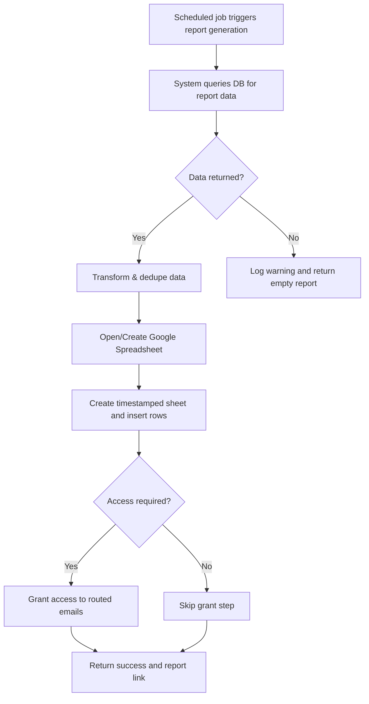
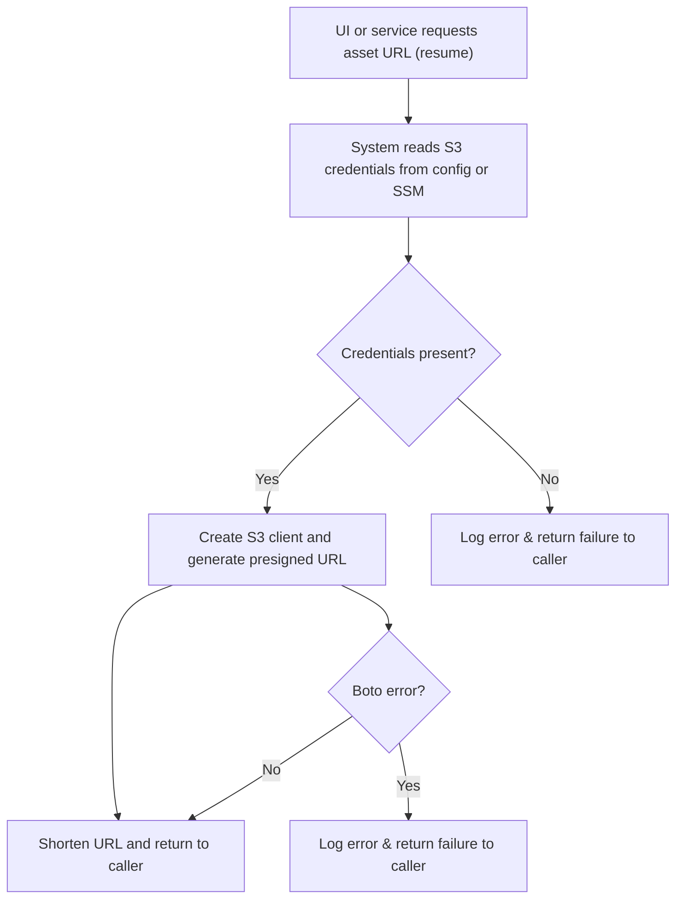
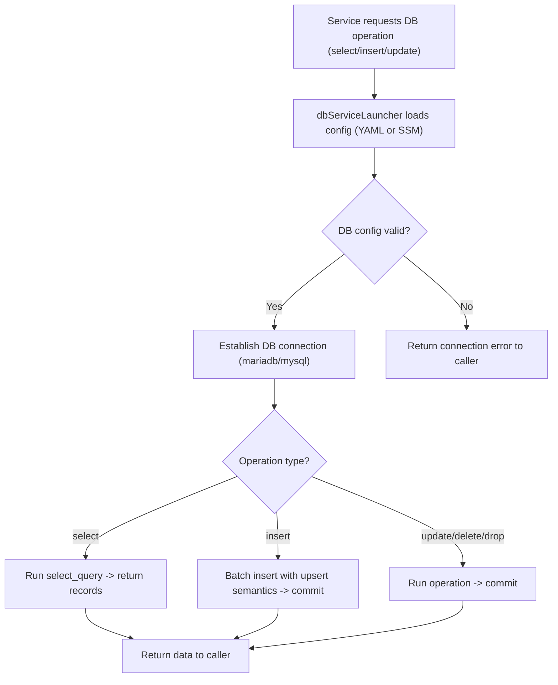

# Data Integration & External System Touchpoints

## Business Overview
This section documents how the RRE system integrates with external systems that provide or receive data: GSuite (Google Sheets), AWS S3, and the relational database service (MySQL/MariaDB via the db_service module). These integrations are drivers for reports, resume/document storage, scheduled ETL tasks, and operational persistence. The business value is timely, authoritative datasets for reporting and application features (reports, employee resume links, resource planning). This document focuses on ownership, refresh cadence, failure impact, and functional requirements for integration touchpoints.

## Scope
- Systems covered: GSuite (Google Sheets), AWS S3, Relational DB (MySQL/MariaDB via db_service)
- Code/config examined: config/client_secrets.json, config/data.yaml, config/api_cache.yaml, RRE/utilities/specific_gdoc.py, RRE/utilities/fetch_s3object.py, api_gsheet_report.py, db_service/db_service/db_service/*, common_config.py
- Outside scope: Business logic modules not directly related to integration drivers (data transformations, domain features)

## Key Findings (technical -> business translation)
- Google Sheets: System uses a Google service account (client secrets / service account info) loaded via SSM or local config to read and write spreadsheets. Gsheet interactions include reading records and creating/updating reporting spreadsheets (api_gsheet_report.py & specific_gdoc.py). A scheduled job (cron-style script) runs hourly/24-hourly depending on job settings; the latency report uses cron_interval=24 (hours).
- AWS S3: S3 is used to store binary assets (employee resumes) and to generate presigned URLs for UI consumption (fetch_s3object.s3_object.fetch_object_url). S3 credentials may appear in config/data.yaml for local runs but production secrets are expected to be provided via SSM (common_config patterns).
- Relational DB (db_service): A dbServiceLauncher provides a single integration abstraction for SELECT/INSERT/UPDATE/DELETE operations. The DB connection relies on environment/SSM-provided configuration (common_config.apply_environment_config/_load_arcus_db_config). The db_service exposes transactional inserts with batch support and upsert behavior for inserts (ON DUPLICATE KEY UPDATE).
- Secrets and configuration: The code prefers AWS SSM parameter store for production secrets (database credentials, Google service account, SSL, Gmail password). Local YAML files exist for development (config/data.yaml shows placeholders and some local S3 keys).
- Error handling: Integrations catch exceptions and return error objects or printed messages. DB connection failures return descriptive strings and raise ConnectionError in higher layers. S3 presigned URL generation catches BotoCoreError and returns error messages. Google Sheets errors are caught and returned to caller. Overall pattern: failures are logged/printed; many callers propagate error objects or strings.

## Functional Requirements
**FR-001**: The system shall authenticate to Google APIs using a Google service account whose credentials are provided via AWS SSM or local config.

**FR-002**: The system shall create or open a Google Spreadsheet and insert a timestamped worksheet with report data when a scheduled reporting job runs.

**FR-003**: The system shall grant edit access to a provided list of email addresses for created/updated Google Spreadsheets, subject to non-prod email routing rules.

**FR-004**: The system shall fetch presigned URLs for objects stored in AWS S3 and return a short URL for UI consumption.

**FR-005**: The system shall upload files to AWS S3 on demand and confirm successful upload or return an error.

**FR-006**: The system shall persist and read structured records from the production relational database using the db_service abstraction and use SSM-backed DB credentials in production.

**FR-007**: The system shall support batched inserts with upsert semantics (ON DUPLICATE KEY UPDATE) to avoid duplicate records and to enable idempotent ingestion.

**FR-008**: The system shall validate and sanitize data extracted from Google Sheets (trim blank cells, drop empty rows) before further processing.

**FR-009**: The system shall route emails differently for non-production environments (dev/uat) to avoid emailing real users.

**FR-010**: The system shall fail fast and record error context for integration failures; calling workflows shall surface these failures so that scheduled tasks can mark report generation as failed.

## High-Level Data Flows

### 1) GSuite (Google Sheets) - Report Generation & Read

Workflow Steps:
1. Scheduled job (cron) invokes report script (e.g., api_gsheet_report.prepare_excel_report).
2. System queries DB for records within a defined time window (cron_interval variable, e.g., last 24 hours).
3. If data exists, system applies transformations: datetime parsing, deduplication, sorting, column renames, fill empty values.
4. The system opens or creates the target Google Spreadsheet, duplicates a template sheet and renames with a timestamp.
5. Insert column headers and rows into the new worksheet.
6. If access_required is Yes, call grant_access to share with email addresses (subject to non-prod routing).
7. Return success or error.

Business Rules Applied:
- BR-001: Reports are limited to data in the last N hours where N is cron_interval (default 24).
- BR-002: Duplicate rows per defined key set must be removed before publishing.
- BR-003: In non-prod environments, sheet sharing must route to test recipients or be skipped.

### 2) S3 - Fetch object URL and provide to UI

Workflow Steps:
1. Caller supplies bucket and object key or the system reads defaults from config/data.yaml.
2. System obtains S3 credentials (local config or production via environment/SSM).
3. If credentials available, create boto3 resource/client and generate a presigned GET URL.
4. Optionally shorten the presigned URL (pyshorteners) before returning it to UI.
5. If any S3 error occurs, return an error string and log details.

Business Rules Applied:
- BR-004: Presigned URLs have limited lifetime (controlled by boto3 default or function settings) and must not be cached indefinitely by UI.
- BR-005: Confidential S3 credentials must not be stored in plaintext in repository; production secrets must be in SSM.
- BR-006: Missing object or permission errors must be surfaced to calling features so they can hide or mark the resource as unavailable.

### 3) Relational DB - Reads and Writes via db_service

Workflow Steps:
1. Caller constructs dbServiceLauncher with file/path or relies on service-wide config.
2. dbServiceLauncher resolves DB credentials from SSM in production or local config for development.
3. The launcher opens a connection (pymysql connector) or SQLAlchemy engine for bulk operations.
4. Appropriate execute_query.* is invoked per operation type. Insert uses batching and ON DUPLICATE KEY UPDATE to ensure idempotency.
5. Errors (TypeError, OperationalError, connectivity issues) are logged and returned to caller as strings or exceptions.

Business Rules Applied:
- BR-007: Production database credentials must be loaded from AWS SSM; local YAML is fallback only.
- BR-008: Insert operations should use configured batch_size to avoid large transactions; upsers must be applied to keep data idempotent.
- BR-009: Connections should be closed after operation; callers expect dbServiceLauncher to close open connections.

## Business Rules & Validations
**BR-001**: Reports only include records created within the configured cron interval (e.g., last 24 hours). 

**BR-002**: Data published from Google Sheets must be cleaned (trimmed, blank rows removed) before use.

**BR-003**: In non-production environments (dev/uat), external communications (emails, sheet sharing) must be routed to test addresses.

**BR-004**: Production secrets (DB credentials, Google service account) must be sourced from AWS SSM and never committed to VCS.

**BR-005**: Presigned S3 URLs are time-limited; UI must refresh them on-demand rather than cache long-term.

**BR-006**: DB insert operations shall use upsert semantics to prevent duplicate records when re-running ingestion.

**BR-007**: Integration failures (S3, Google, DB) must be logged and surfaced to scheduling/monitoring so that operators can act.

**BR-008**: If DB config is incomplete for ENV, the system shall raise a critical error and abort the integration task.

## Data Entities (Business View)

- Report
  - Attributes: report_name, generated_on, sheet_link, rows_count, generated_by, status
  - Owner: Reporting team / Engineering
  - Retention: Reports are snapshots; retained per organizational policy (not specified in code)

- EmployeeResume (S3 asset)
  - Attributes: employee_id, s3_bucket, s3_key, presigned_url, url_expiry
  - Owner: HR / People Operations
  - Refresh: URL regenerated on request; underlying object updated via upload flow

- DB Record (various domain tables)
  - Attributes: varies per table (SOW_MASTER, EMPLOYEE_MASTER_VIEW, etc.); core identifiers include SOW_ID, EMPLOYEE_ID, CUSTOMER_ID
  - Owner: Application data owners (Accounts, Delivery, HR)

## Integration Points & Responsibilities
- Google Sheets (GSuite)
  - Integration: read/write via google API using a service account
  - Responsible: Reporting/Analytics owners for sheet content; Engineering maintains service account credentials in SSM
  - Cadence: Scheduled reports run based on cron jobs (found cron_interval=24 in latency report); other jobs may run hourly or per schedule

- AWS S3
  - Integration: boto3 for presigned URLs and uploads
  - Responsible: HR for resume content; Engineering ensures credentials are available in SSM for production
  - Cadence: On-demand; presigned URLs generated per request

- Relational DB
  - Integration: pymysql/SQLAlchemy via db_service module
  - Responsible: Data owners for each table (SOW, EMPLOYEE_MASTER, etc.), Engineering for DB credentials/config
  - Cadence: Real-time reads/writes by application and scheduled ETL jobs

- AWS SSM Parameter Store
  - Integration: common_config uses SSM as authoritative store for DB and Google service account credentials
  - Responsible: DevOps or Cloud Admins to manage parameter values and access rights

## Non-Functional Considerations
- Security: Credentials must be stored in SSM in production. Local config files (config/data.yaml) may contain placeholder keys for dev only and must not be used in prod.
- Observability: The code logs errors and prints messages; scheduled tasks should be monitored and alert on failures (not fully implemented in code). Email/slack webhooks exist for alerts.
- Performance: DB insert logic batches rows using configurable batch_size; large batch_size may impact DB throughput.

## Business Scenarios & Use Cases
**US-001**: As a reporting analyst, I want the daily latency report to appear in a shared Google Sheet so that stakeholders can review system performance.
- Acceptance Criteria: Scheduled job runs, report inserted into a timestamped sheet, report link available, access granted to routed emails in non-prod/prod as appropriate.

**US-002**: As an employee, I want to click a resume link and view the document without exposing raw S3 credentials.
- Acceptance Criteria: UI shows a short presigned URL that opens the resume; link expires after configured time; missing object returns a friendly unavailable state.

**US-003**: As an integration owner, I want DB insert operations to be idempotent so that re-runs do not create duplicates.
- Acceptance Criteria: Insert uses ON DUPLICATE KEY UPDATE pattern and returns success or descriptive error.

## Error Handling & Edge Cases
- DB connection failures: dbServiceLauncher returns descriptive error strings and may raise ConnectionError; calling code should catch and surface failures to schedulers and monitoring.
- Missing S3 object or permission: fetch_object_url prints errors and returns an error string; calling features must handle the failure by hiding link or showing a helpful message.
- Google API auth failure: get_oauth2_service_account_credentials will raise if service account info missing; GSheet functions return error objects on auth failures.
- Partial failures: When a multi-step workflow (query -> transform -> publish) fails at any step, the process returns the error and does not publish the sheet.

## Assumptions & Constraints
- Production secrets are in AWS SSM; local YAML files are only for development/testing.
- Service account credentials include private_key and client_email and must be properly formatted (common_config normalizes private key newlines).
- Presigned URL expiry window is sufficient for typical UI use; regeneration is expected for subsequent accesses.
- Reporting cadence is determined by cron jobs external to core integration code; default values exist in scripts (e.g., cron_interval=24).

## Recommendations
- Centralize integration monitoring: capture failures from GSheet, S3, and DB integrations and emit structured alerts to Slack/monitoring.
- Harden error propagation: ensure scheduled jobs explicitly mark run status (success/failure) and include error context in notifications.
- Remove any plaintext credentials from repo and confirm SSM parameter usage in CI/CD and production service units.

