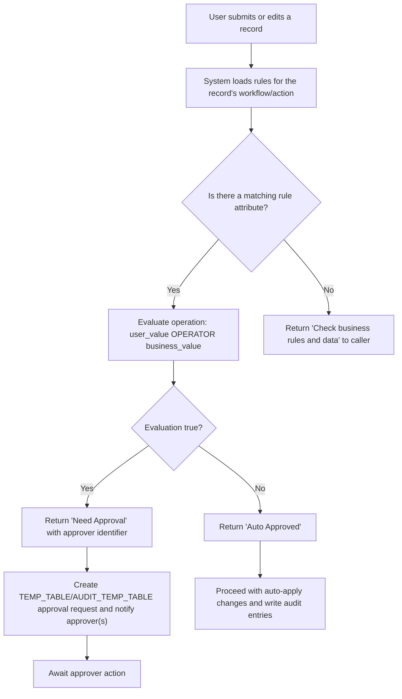
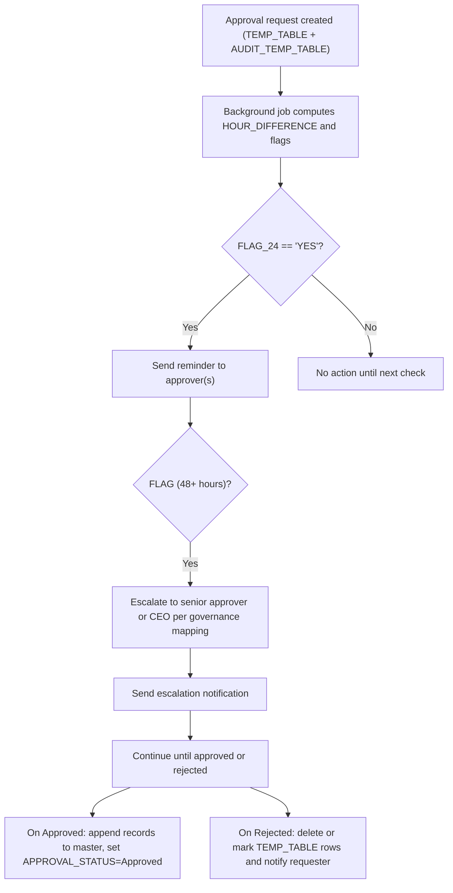
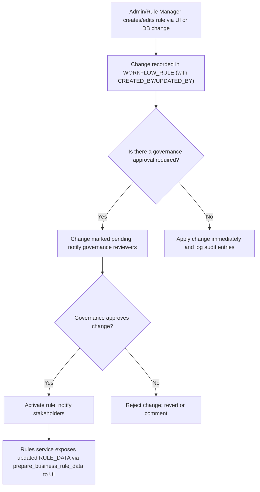

# Cross-cutting Business Rules, Configurability & Governance

## Business Overview
The platform centralizes cross-cutting business rules and approval governance to control when operational changes (SOW edits, resource allocations, billing updates) require human approval versus automated acceptance. Rules are persisted in a central WORKFLOW_RULE table and surfaced to the UI; the runtime engine evaluates record changes against those rules to determine "Auto Approved" or "Need Approval" and identifies approvers and alert recipients. Time-based escalation and approval lifecycle state are managed by background utilities that read the same rule/audit/temp tables and send notifications.

Target users / personas:
- Business Users (Account Heads, BU/Finance approvers) — receive approval requests and act on them
- System Operators / Admins — manage global rules in the WORKFLOW_RULE repository and system configuration files
- Application Users (requesters) — raise change requests that are subject to rules
- Governance/Compliance (Audit) — review approval history and escalations

Business value:
- Makes approval and validation logic configurable without code changes for many workflow scenarios
- Ensures consistent approval routing and escalation across features
- Provides centralized visibility and audit trail for governance and compliance

Scope of this document: covers the central rule engine, how thresholds and operations are configured, the approval lifecycle and escalation governance, data/config sources that drive decisions, and recommendations/assumptions.

---

## Functional Requirements
**FR-001**: The system shall persist cross-cutting workflow rules in a central repository (table "WORKFLOW_RULE") and allow the rules to be exposed to the UI.

**FR-002**: The system shall evaluate an incoming change (edit) against relevant rules and return one of: "Auto Approved" or "Need Approval" with a designated approver.

**FR-003**: The system shall allow rule conditions to include attribute(s), expected attribute value(s), an operation (e.g., >, <, ==, in), and an approver identifier; the evaluation engine shall apply these when deciding approval needs.

**FR-004**: The system shall support specifying alert recipients per rule (ALERTS_TO) so notifications can be sent when a rule triggers an approval.

**FR-005**: The system shall surface rule data grouped by workflow and action (RULE_IDENTIFIER = WORKFLOW + WORKFLOW_ACTION) for UI listing and editing.

**FR-006**: The system shall log approval requests in TEMP_TABLE and AUDIT_TEMP_TABLE with approver assignments and maintain approval status fields for audit.

**FR-007**: The system shall implement escalation behavior for pending approvals: send reminders and escalate to higher-level approvers after time thresholds are exceeded.

**FR-008**: The system shall allow configuration files (data.yaml, api_cache.yaml, logger.yaml) to define environment-specific endpoints, views, and other integration settings that affect rule-driven flows.

**FR-009**: The system shall ensure approval decisions and audit records are retained and accessible for governance reports.

**FR-010**: The system shall provide email notification templates for approval requests, reminders and escalations and accept recipient lists supplied by rules or by organizational lookup.

---

## User Roles & Permissions
### Roles
- Requester: raises change requests (creates records in TEMP_TABLE via UI or API). Capabilities: submit requests, view own requests.
- Approver (Account Head / Status Approver): receives approval tasks for requests assigned by rules. Capabilities: Approve/Reject, comment.
- Admin / Rule Manager: manages entries in WORKFLOW_RULE (create/update/delete rules). Capabilities: create/edit rules, set ALERTS_TO values, set approver identifiers or role keys.
- System Operator / DevOps: manages underlying configuration files (config/*.yaml) and database migrations that persist rules and tables.
- Auditor: read-only access to audit tables (TEMP_TABLE, AUDIT_TEMP_TABLE, SOW_MESSAGES) for governance.

Permission matrix (high level):
- Requester: create TEMP_TABLE rows; cannot change WORKFLOW_RULE
- Approver: update AUDIT_TEMP_TABLE approval status; cannot change WORKFLOW_RULE
- Admin/Rule Manager: write access to WORKFLOW_RULE (preferably via an audited UI); changes should require approval or tracked deployment
- System Operator: change yaml configuration and deploy code; changes to YAML should be logged and controlled via SCM/CI

---

## User Workflows & Journeys

### User Workflow: Rule Evaluation for an Edit

#### Workflow Steps:
1. User submits or edits a record through UI/API.
2. System queries WORKFLOW_RULE for rules matching the workflow and action.
3. If rule attributes overlap with changed data columns, system evaluates each rule's OPERATION against the user-provided value(s) and configured ATTRIBUTE_VALUE(s).
4. If any evaluation is true, the result is "Need Approval" and an approver identifier is returned; otherwise the record is auto-approved.
5. For "Need Approval", a TEMP_TABLE/AUDIT_TEMP_TABLE row is created and notification is sent to recipients defined by the rule (ALERTS_TO) or derived approver lookup.

#### Business Rules Applied:
- BR-001: RULE should include WORKFLOW_ATTRIBUTE, ATTRIBUTE_VALUE, OPERATION and APPROVER.
- BR-002: ALERTS_TO list drives notification recipients; if empty, system should fall back to organization lookup.

---

### User Workflow: Approval Escalation & Reminders

#### Workflow Steps:
1. When a TEMP_TABLE row exists, a scheduled job calculates HOUR_DIFFERENCE (current time - CREATED_DATE) and determines reminder/escalation flags.
2. If FLAG_24 indicates periodic reminder intervals (e.g., every 24 hours up to a limit), system sends reminder emails.
3. If FLAG indicates >48 hours, system escalates to higher-level approvers (intersection of audit approvers and account head list, or CEO if required).
4. On final approver action, system applies approved changes or rejects and notifies requester.

#### Business Rules Applied:
- BR-003: System shall send reminders at configured periodic intervals and escalate after defined thresholds.
- BR-004: Escalation recipients come from intersection of configured account heads and audit approvers; fallback behavior should be defined if none found.

---

### User Workflow: Rule Configuration Change (Governance)

#### Workflow Steps:
1. Admin proposes a new rule or edits existing rule entries in WORKFLOW_RULE (the authoritative source).
2. If governance mandates approval for rule changes (recommended), change should be recorded as pending and governance reviewers are notified.
3. Approved changes become active and are visible to the evaluation engine; rejected changes are recorded with reasons.
4. All changes must carry CREATED_BY/UPDATED_BY and timestamps for audit.

#### Business Rules Applied:
- BR-005: Rule changes should be auditable and preferably require governance approval for production-impacting workflows.
- BR-006: A staged promotion process (dev -> uat -> prod) is recommended for editing rules to avoid accidental production behavior changes.

---

## Business Rules & Validations
**BR-001**: Each workflow rule must have a non-empty WORKFLOW, WORKFLOW_ACTION, WORKFLOW_ATTRIBUTE, ATTRIBUTE_VALUE, OPERATION, and APPROVER.

**BR-002**: ATTRIBUTE_VALUE may contain multiple comma-separated acceptable values; system resolves these when evaluating.

**BR-003**: ALERTS_TO may contain comma-separated email addresses or role identifiers and should be treated as a list; empty lists require fallback lookup to organizational approvers.

**BR-004**: Time-based escalation thresholds (reminder and escalation windows) must be defined; current implementation uses 24-hour reminders and 48-hour escalation windows.

**BR-005**: Approval decision outcomes must be recorded with APPROVAL_STATUS values: Pending, Approved, Rejected, Not Required.

**BR-006**: Rule evaluation must return both a decision and the approver identifier so the workflow can create the proper audit/notification entries.

**BR-007**: Rule configuration changes must record CREATED_BY/UPDATED_BY and timestamps and be exposed to UI for governance review.

---

## Data Entities (Business View)
### WORKFLOW_RULE (business view)
- Workflow (string): logical workflow name (e.g., "SOW", "RESOURCE_ALLOCATION")
- Workflow_Action (string): specific action within workflow (e.g., "UPDATE", "CREATE")
- Workflow_Attribute (string): the field to evaluate (e.g., "SOW_AMOUNT", "BILLING_STATUS")
- Attribute_Value (string/list): value(s) to compare against
- Operation (string): comparison operator (e.g., >, <, ==, in)
- Approver (string): approver identifier or role key
- Complimentary_Value (string/list): additional values used in some rules
- Alerts_To (string/list): recipients for notification
- Created_By, Created_Date, Updated_By, Updated_Date

### TEMP_TABLE / AUDIT_TEMP_TABLE
- Request_ID, Sub_ID, Table_Name, Table_Data (NEW/OLD payload), Raised_By, Raised_On, Approval_Status, Approval_Flag
- Approver rows tracking STATUS_APPROVER, APPROVER_STATUS, STATUS_APPROVED_ON

### SOW_MESSAGES
- Stores message entries created on Approved/Rejected actions for SOW audit

Data lifecycle and retention:
- Approval audit records are retained for reporting and governance; retention policy should be defined (e.g., 3-7 years depending on compliance needs).

---

## Integration Points
- Database (WORKFLOW_RULE, TEMP_TABLE, AUDIT_TEMP_TABLE, EMPLOYEE_MASTER): primary storage and lookup for rules and approver contacts.
- Email/Notification Service (notifier module): sends approval requests, reminders and escalations to ALERTS_TO and derived approvers.
- UI/API: rule data exposed via prepare_business_rule_data for display and editing.
- Scheduler / Cron: background jobs that compute HOUR_DIFFERENCE and trigger reminders/escalations.
- Logger/Monitoring endpoint configured in logger.yaml for centralized logging of rule evaluation outcomes and errors.

---

## User Interface Requirements
- Rule Management Screen: list rules grouped by RULE_IDENTIFIER (WORKFLOW + WORKFLOW_ACTION), allow add/edit with fields: Workflow, Workflow Action, Workflow Attribute, Operation, Attribute Value(s), Approver, Alerts_To, Complimentary_Value, Active Flag.
- Rule Preview & Test: UI must allow testing a sample record against selected rule(s) and display evaluation result and approver.
- Approval Inbox: approvers should see pending requests, details (changed fields, before/after), and Approve/Reject buttons with optional comments.
- Audit View: auditors should view approval history filtered by workflow, date, requestor, approver, and status.

---

## Non-Functional Requirements
- NFR-001: Rule evaluation shall complete within 300ms for typical single-record checks (target)
- NFR-002: Notification delivery should attempt retries and raise incidents if email service is down
- NFR-003: Rule changes must be versioned and auditable
- NFR-004: Access to rule management shall be restricted to Admin/Rule Manager role and protected by audit logging

---

## Business Scenarios & Use Cases
**US-001**: As an Account Manager, I want to change SOW amount, so that finance can review if it exceeds configured thresholds.
- Acceptance Criteria: When the requested SOW amount exceeds configured ATTRIBUTE_VALUE for the SOW_UPDATE rule, system creates an approval request routed to configured approver(s) and notifies them.

**US-002**: As an Approver, I want to receive reminder escalations if I do not act, so that critical requests are not delayed.
- Acceptance Criteria: System sends reminders at periodic intervals and escalates after configured time thresholds.

**US-003**: As an Admin, I want to update rules for a workflow, so that business policy changes can be enforced immediately (subject to governance).
- Acceptance Criteria: Changes are auditable (CREATED_BY/UPDATED_BY) and either applied directly or staged pending governance approval.

---

## Error Handling & Edge Cases
- If WORKFLOW_RULE contains malformed ATTRIBUTE_VALUE or OPERATION, evaluation should fail-safe (preferably treat as "Check business rules and data") and log an incident.
- If ALERTS_TO is empty and no approver email is derivable, system should fall back to a governance escalation list (e.g., Account Head, then CEO) and log the fallback.
- If TEMP_TABLE or AUDIT_TEMP_TABLE rows are inconsistent (missing REQUEST_ID or SUB_ID), background jobs should flag these records for manual review and avoid auto-applying.

---

## Assumptions & Constraints
- Assumes WORKFLOW_RULE is the single source of truth for cross-cutting rule configuration.
- Current time-based escalation thresholds (24-hour reminders, 48-hour escalation) are implemented as code constants and not externalized in YAML — changing them requires code change unless surfaced to config/UI.
- Attribute values and operations are stored as strings and may allow multi-value comparisons; the evaluation engine must support lists and scalar comparisons.
- Changes to config YAML files (data.yaml, api_cache.yaml, logger.yaml) are managed via SCM/CI and require deployment to take effect in runtime.

---

## Open Questions & Recommendations
- Q1: Who is the canonical "Rule Manager" role in the business organization? Implement RBAC around rule editing.
- Q2: Should time-based escalation thresholds be made configurable (data.yaml) so ops can tune without code deploys? Recommended: externalize these thresholds.
- Recommendation 1: Introduce a governance staging process for rule changes (Dev/UAT/Prod) and require at least one governance approver for production-impacting rules.
- Recommendation 2: Replace any unsafe evaluation patterns with a deterministic operator evaluator to improve security and maintainability.
- Recommendation 3: Add explicit validation on WORKFLOW_RULE inputs (no empty OPERATION, allowed operator set) and provide UI-level input helpers (drop-downs for operations, approver lookup).

---

## Appendix: Config Sections Noted
- data.yaml: contains many view/table names, URLs, environment constants that drive rule evaluation contexts (e.g., sow_drop_down, recognized_revenue, urls).
- api_cache.yaml: contains API endpoints and redis cache configuration used by services that may be invoked during rule-driven flows.
- logger.yaml: defines logging endpoint and recipients for error notifications.

