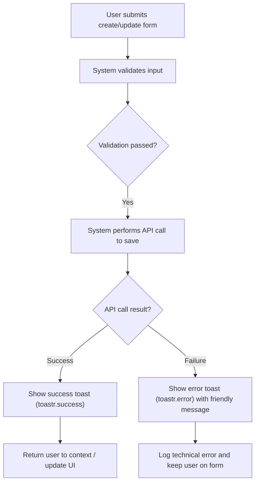
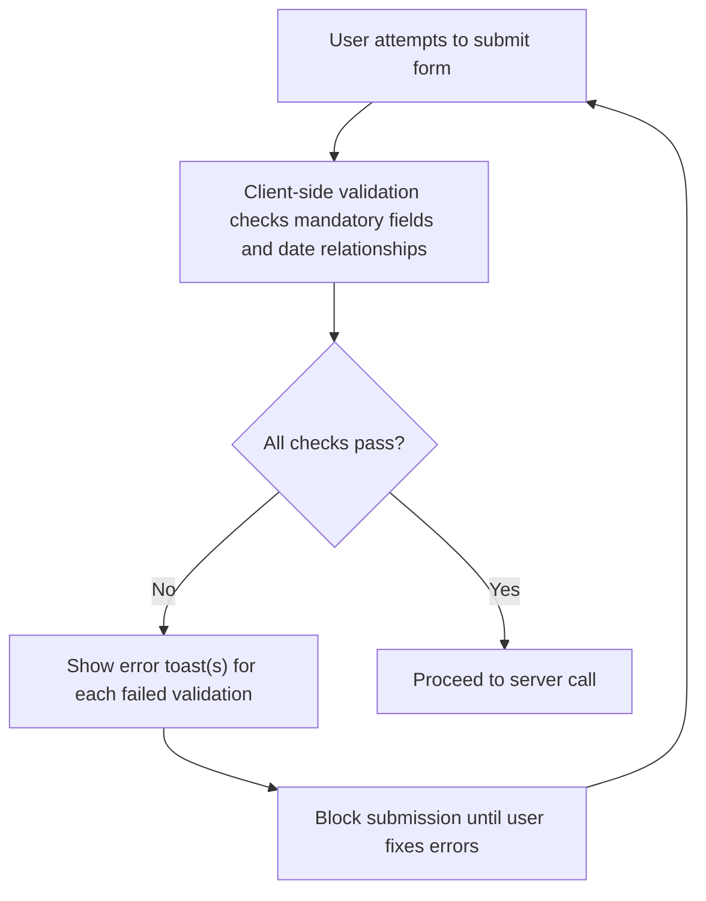
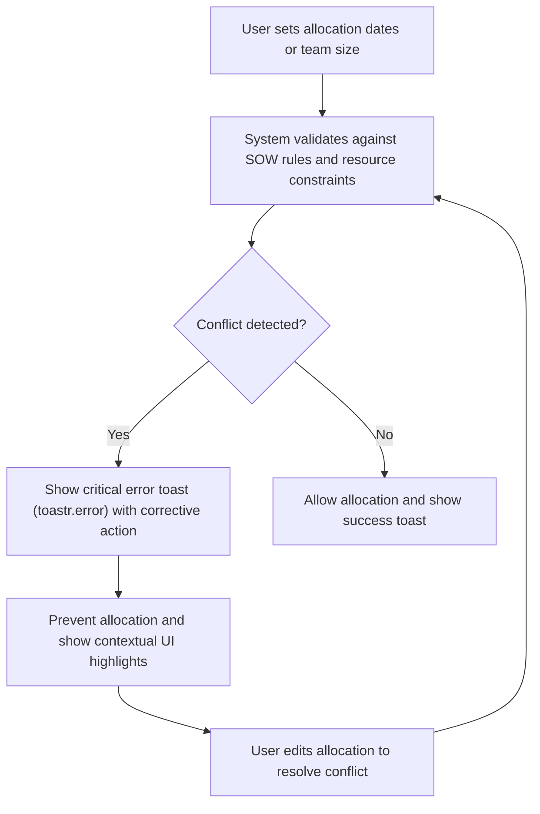

# Notifications and Messaging — RRE-UI

## Business Overview
The RRE-UI uses toastr-based transient toast notifications across the application to surface immediate feedback to users after actions (creates/updates/deletes), to warn of validation failures, and to surface non-blocking informational messages. Notifications are used by operational users (Resource/Account/Project managers) to confirm successful transactions, highlight missing mandatory data, and warn of business-rule violations (allocation date conflicts, SOW name collisions, team size constraints). The strategy favors short-lived, contextual messages rather than modal dialogs for most feedback, reserving modals for workflows that require explicit user decisions.

Business objectives for notifications:
- Confirm successful completion of user actions quickly and unobtrusively.
- Prevent invalid operations by clearly calling out missing or inconsistent input.
- Surface urgent issues (allocation conflicts, duplicate SOW names) so users can correct them before proceeding.
- Maintain consistent tone and predictable behavior across features.

Scope: Analysis covers toastr library usage and representative JS files where notifications are triggered (sowCreate.js, accountEdit.js, emp_create.js, resourceAllocation.js, useBench.js, overStaff.js). Only files in the provided scope were examined.

## Key Findings (behavioral patterns)
- Notification types used: success (toastr.success), error (toastr.error), info and warning (toastr.info/toastr.warning used less frequently).
- Timeouts are explicitly set before many messages (typically 2000ms or 3000ms) using toastr.options.timeOut, indicating a short-lived, confirmation-first UX.
- Messages are primarily used for:
  - Form validation errors (e.g., "Please select account name", "Legal Start Date should not be empty").
  - Operation confirmations (e.g., "SOW Created successfully", "Updated Successfully").
  - Critical business-rule violations (e.g., "SOW name already in use. Please enter a unique name", "Selected end date cannot be after the SOW end date").
  - API error reporting (often showing raw json or error text: e.g., "Message error" + JSON.stringify(error)).
- Messaging consistency gaps found:
  - Many messages use short imperative phrases for errors and successes, but formatting (capitalization, punctuation) varies.
  - Some error messages include raw JSON or debug text which is not user-friendly.
  - Some workflows rely on alerts fallback if toastr is undefined (e.g., notes planning). Mixed fallback approaches exist.

## Critical Alerts (require immediate user action)
From code patterns, the following notification categories are treated as critical and should block progress until resolved (business impact):
- Mandatory field missing: account, SOW, dates, buying center, stakeholder, minimum billing rates.
- Date inconsistencies: end date earlier than start date for legal, billing, or allocation dates.
- Business rule violations: duplicate SOW name, team size invalid (negative), resource count zero where >0 expected.
- Allocation conflicts: resource allocation end date outside SOW window, or selected end date after SOW end date.
These messages are surfaced as toastr.error and are used to prevent the user from proceeding until corrected.

## User Roles & Personas (business view)
- Resource Manager: assigns resources to SOWs; needs immediate validation and conflict warnings.
- Account/Growth Manager: creates and updates accounts and buying centers; needs confirmation and validation messages.
- Project/SOW Owner: creates/edits SOWs and expects success/failure feedback for SOW operations.
- HR/People Ops: creates employees and bench operations; expects success/failure notifications for employee creation and bench assignments.

## Functional Requirements
- **FR-001**: The system shall display a transient success notification when a user action completes successfully (create/update/delete). (Example: "SOW Created successfully")
- **FR-002**: The system shall display a transient error notification when a user action fails validation or violates a business rule, and prevent the action from continuing until resolved. (Example: "Please select account name")
- **FR-003**: The system shall use clearly distinguishable notification types: success, error, info, and warning, mapped to consistent visual styles and default timeouts.
- **FR-004**: The system shall allow message timeout customization per message and support a default timeout of 2–3 seconds for non-critical messages and a sticky or longer timeout for critical alerts.
- **FR-005**: The system shall never display raw JSON or unformatted technical error payloads to end users; instead it shall map technical errors to user-friendly messages.
- **FR-006**: The system shall provide a fallback mechanism (such as an alert) only when the primary notification library is unavailable; the fallback should use the same user-facing text.
- **FR-007**: The system shall provide consistent message phrasing for similar events (e.g., mandatory field errors should follow "[Field] is required" pattern).
- **FR-008**: The system shall surface critical business-rule violations (date conflicts, duplicate names, allocation range errors) using error notifications and prevent submission until resolved.
- **FR-009**: The system shall support a developer-friendly publish/subscribe for notifications so components can optionally listen for toast lifecycle events (toastr.subscribe is available in library).
- **FR-010**: The system shall log the underlying technical error to a developer/audit channel while providing a generic, actionable message to the user (e.g., "Could not save — try again or contact support").

## User Workflows & Journeys

### User Workflow: Save/Create Success Confirmation

Workflow Steps:
1. User completes form and clicks save.
2. Client-side validation runs.
3. If validation passes, client issues API call.
4. On API success, system shows toastr.success and updates UI.
5. On API failure, system shows toastr.error with a friendly message and logs the detailed error.

Business Rules Applied:
- BR-001: Success messages display for 2s by default unless overridden.
- BR-002: Failure messages must not expose raw technical JSON to the end user.

### User Workflow: Form Validation Error (Mandatory Fields & Date Rules)

Workflow Steps:
1. User clicks submit.
2. Client performs mandatory field and date validations.
3. If any check fails, system displays toastr.error for each issue and blocks submission.
4. User corrects input and resubmits.

Business Rules Applied:
- BR-003: Mandatory fields must follow consistent message pattern: "[Field] should not be empty" or standardized to "[Field] is required".
- BR-004: Date validation messages must indicate which date is incorrect and why (e.g., "Billing End Date should be after Billing Start Date").

### User Workflow: Critical Allocation Conflict (Requires Immediate Action)

Workflow Steps:
1. User enters allocation details.
2. System checks that allocation dates fall inside SOW window and team size is non-negative.
3. If a conflict is detected, an error toast is shown, the allocation is blocked, and the UI guides correction.

Business Rules Applied:
- BR-005: Allocation end date cannot be after SOW end date.
- BR-006: Team size must be >= 0 and resource count must be > 0 where required.

## Business Rules & Validations
- **BR-001**: Default non-critical toast timeout shall be 2000ms; configurable per message. (Observed in code as toastr.options.timeOut = 2000)
- **BR-002**: Mandatory field errors are surfaced as error toasts and must block form submission.
- **BR-003**: Date relationships (start/end) for Legal/Billing/Actual must be enforced client-side and surfaced as clear error messages.
- **BR-004**: Duplicate SOW names must be rejected and surfaced as errors: "SOW name already in use. Please enter a unique name".
- **BR-005**: Any API or unexpected failure shown to users must be accompanied by a developer-facing log entry; user text must be non-technical.

## Data Entities (Business View)
- Notification
  - Type: success | error | info | warning
  - Message: user-facing text
  - Context: feature or form (SOW, Account, Allocation, Employee)
  - Timeout: display duration in ms
  - Sticky: boolean (timeOut=0)
  - CreatedAt: timestamp (not persisted in current UI — ephemeral)

## Integration Points
- Toastr library (js/toastr/2.0.1/js/toastr.js): primary rendering engine and configuration holder.
- Backend APIs: many flows surface API success or error via toasts after server responses.
- Logging/Audit: recommended integration to capture technical errors separate from user-facing messages.

## UI Requirements
- All toasts should be visible and dismissible (via close button or tap-to-dismiss) and should not obstruct critical form controls.
- Critical errors should additionally highlight relevant form fields (visual validation states) in addition to the toast.
- Timeouts for success toasts: default 2000ms; for critical errors consider sticky toasts or longer timeout + visual emphasis.

## Non-Functional Requirements
- Notification rendering should be performant (rendering dozens of toasts should not degrade UI responsiveness).
- Accessibility: Toasts should be accessible to screen readers and not rely solely on color to convey meaning.

## Business Scenarios & Use Cases
- US-001: As a SOW creator, I want to see a confirmation when a SOW is created so that I know my action succeeded.
  - Acceptance: "SOW Created successfully" toast appears and SOW list updates.
- US-002: As a Resource Manager, I want the system to prevent allocations that fall outside SOW dates so that I avoid incorrect assignments.
  - Acceptance: Error toast appears and allocation is blocked until dates are corrected.
- US-003: As an Account Manager, I want validation feedback when mandatory account fields are missing so that data integrity is preserved.
  - Acceptance: Error toast(s) specify missing fields and prevent save.

## Error Handling & Edge Cases
- If toastr is unavailable, the code sometimes falls back to alert(); standardize this fallback to use the same user-facing text and a single fallback channel.
- Avoid showing raw JSON blobs to users; map technical errors to user-friendly messages and optionally '#error-id' the incident for support.
- Handle long messages via truncation or modal for details if needed.

## Assumptions & Constraints
- Assumes toastr library is present and loaded on pages where messages are used.
- Current implementation exposes technical error payloads in some places; changing this requires a mapping layer between technical errors and user messages.
- Client-side validation is primary gate for many checks; some business rules should also be enforced server-side.

## Recommendations
- Standardize message phrasing and capitalization into a messaging style guide (e.g., "[Field] is required" for mandatory fields).
- Replace occurrences that show raw JSON with mapped, user-friendly messages and an internal error code for support.
- Consider a small notification utility wrapper around toastr to centralize timeouts, stickiness, logging, and fallbacks.

---

*Prepared from code inspection of toastr usage in representative modules (sowCreate.js, accountEdit.js, emp_create.js, resourceAllocation.js, useBench.js, overStaff.js) and the toastr library (2.0.1).*
