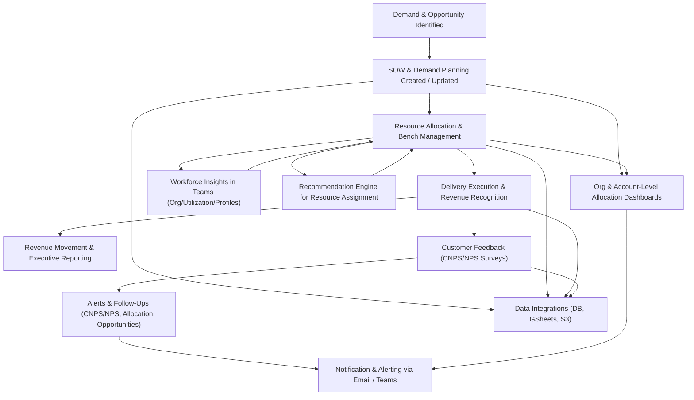

# ARCUS RRE Platform – Business Requirements Document (BRD)

## 1. Business Process Overview (with End‑to‑End Flow)

The ARCUS RRE platform supports end‑to‑end revenue, resource, and relationship management for services delivery organizations. At a high level, it covers:

- Opportunity and SOW lifecycle (planning, signing, demand capture, and revenue recognition)
- Resource supply, allocation, bench management, and recommendation
- Customer feedback via CNPS/NPS surveys
- Workforce insights through Microsoft Teams
- Reporting, analytics, alerts, and integrations with external systems (GSuite, S3, DB services)

### 1.1 End‑to‑End Business Process Flow (High-Level)

This BRD compiles detailed functional requirements (FR‑XXX) and workflows from feature‑specific sections produced for:

- Bench Management and Bench Reporting (03_bench_management.md)
- SOW & Demand Planning (04_sow_and_demand_planning.md)
- Notification & Alerting (06_notification_and_alerting.md)
- CNPS Planning & Scheduling (07_cnps_planning_and_scheduling.md)
- Teams-based Workforce Insights (09_teams_workforce_insights.md)
- Revenue Recognition & Movement (12_revenue_recognition_and_movement.md)
- Data Integration & External Systems (14_data_integration_and_external_systems.md)

> NOTE: Some analyst sections (authentication, core allocation app, recommendation engine, etc.) could not be persisted in this run. This master BRD therefore focuses on the sections that are present under the specified output folder.

## 2. Business Domains and Scope

### 2.1 Bench Management & Bench Reporting
- Identify and track employees not allocated to billable work (bench) across time.
- Provide dashboards and KPIs to reduce non‑billable time.
- Feed recommendation/allocation processes with bench data.

### 2.2 SOW & Demand Planning
- Manage Statements of Work, Buying Centres, and demand lines.
- Backfill and standardize Buying Centre identifiers.
- Provide revenue movement and reconciliation capability.

### 2.3 Notification & Alerting
- Central framework for email and Teams alerts.
- Delivery of allocation shortages/excess, opportunity inactivity, and org‑level reports.

### 2.4 CNPS Planning & Scheduling
- Canonical CNPS master and schedule generation.
- Google Sheets response ingestion and alert payloads.

### 2.5 Teams-based Workforce Insights
- Org charts, utilization dashboards, and employee profiles embedded in Teams.

### 2.6 Revenue Recognition & Movement
- Weekly snapshots of recognized vs planned revenue and movements.
- Adjustments to projections via stakeholder‑maintained sheets.

### 2.7 Data Integration & External Systems
- Use of Google Sheets for reporting and CNPS/NPS.
- Use of S3 for resumes and other assets.
- Use of relational DB (via db_service) as system of record.

## 3. Consolidated Functional Requirements Catalogue

Below is a consolidated FR index. For detailed wording, see each referenced section.

### 3.1 Bench Management (from 03_bench_management.md)
- FR‑BCH‑001 to FR‑BCH‑017 map directly to FR‑001..FR‑017 in that section:
  - FR‑BCH‑001: Identify bench periods when there is a gap between allocations.
  - FR‑BCH‑002: Treat new joiners without allocations as bench from join date.
  - FR‑BCH‑003: Label bench records with employee, manager, SOW, account and billing attributes.
  - FR‑BCH‑004: Generate current/future bench views and associated headers for UI.
  - FR‑BCH‑005: Exclude configured leadership roles from bench KPIs.
  - FR‑BCH‑006: Deduplicate bench entries per employee and period.
  - FR‑BCH‑007: Separate overlapping allocations from bench calculations.
  - FR‑BCH‑008: Populate BENCH_MAPPING snapshot table for reporting.
  - FR‑BCH‑009: Provide /bench_data API for dashboard consumption.
  - FR‑BCH‑010: Flag resources under approval using approval‑related fields.
  - FR‑BCH‑011: Compute bench_flag where bench start aligns with allocation start.
  - FR‑BCH‑012: Normalize dates to standard formats.
  - FR‑BCH‑013: Support scheduled cache updates for bench API.
  - FR‑BCH‑014: Convert unallocated resources into bench records with default identifiers.
  - FR‑BCH‑015: Support deletion of bench mapping entries by employee.
  - FR‑BCH‑016: Prioritize bench resources for recommendations.
  - FR‑BCH‑017: Exclude ended employees from bench reporting.

### 3.2 SOW & Demand Planning (from 04_sow_and_demand_planning.md)
- FR‑SOW‑001: Create SOWs with key attributes (account, BC, dates, value, status).
- FR‑SOW‑002: Normalize and validate Buying Centre on create/update.
- FR‑SOW‑003: Provide Buying Centre backfill utility with BC_MASTER lookup.
- FR‑SOW‑004: Support dry‑run for bulk backfill and show grouped change summary.
- FR‑SOW‑005: View and edit Demand Lines per SOW.
- FR‑SOW‑006: Enforce approval workflow on high‑impact Demand changes.
- FR‑SOW‑007: Record SOW and Demand history in SOW_MASTER_HISTORY.
- FR‑SOW‑008: Produce revenue movement reports by status and snapshot.
- FR‑SOW‑009: Flag anomalies in Demand/Revenue.
- FR‑SOW‑010: Provide reconciliation checks for bulk changes.
- FR‑SOW‑011: Scope bulk operations by account.

### 3.3 Notification & Alerting (from 06_notification_and_alerting.md)
- FR‑NTF‑001: Accept structured NotificationRequests with channels, recipients, body/template.
- FR‑NTF‑002: Support Email and Microsoft Teams channels.
- FR‑NTF‑003: Validate notification payloads before send.
- FR‑NTF‑004: Render HTML templates with safe escaping.
- FR‑NTF‑005: Enforce allowed domains, CC, and max recipients.
- FR‑NTF‑006: Retry transient failures with configurable policy.
- FR‑NTF‑007: Audit every notification attempt with status.
- FR‑NTF‑008: Provide helper APIs for sending via email/templates/Teams.
- FR‑NTF‑009: Skip sends when config or recipients are invalid, but audit.
- FR‑NTF‑010: Attach metadata (source_app, type, reference_id) to notifications.
- FR‑NTF‑011: Support synchronous send and pluggable async enqueue.
- FR‑NTF‑012: Build role‑aware recipient lists for allocation/opportunity alerts.
- FR‑NTF‑013: Provide rich, contextual alert contents.
- FR‑NTF‑014: Send org‑level allocation report ready alerts with sheet links.
- FR‑NTF‑015: Generate weekly opportunity activity alerts.
- FR‑NTF‑016: Support test/dry‑run routing for non‑production.
- FR‑NTF‑017: Allow per‑alert CC/BCC lists.
- FR‑NTF‑018: Validate email addresses.
- FR‑NTF‑019: Configure SMTP/Teams settings via notification.yaml/env.
- FR‑NTF‑020: Expose notification priority levels.

### 3.4 CNPS Planning & Scheduling (from 07_cnps_planning_and_scheduling.md)
- FR‑CNPS‑001: Build canonical CNPS master data from BC V2 sources.
- FR‑CNPS‑002: Generate CNPS schedules for eligible SOW‑stakeholder mappings.
- FR‑CNPS‑003: Provide safe backfill that inserts only missing schedule rows.
- FR‑CNPS‑004: Ingest responses from Google Sheets and map to canonical entities.
- FR‑CNPS‑005: Mark schedule entries as COLLECTED when matching responses exist.
- FR‑CNPS‑006: Generate alert payloads (2A/2B) for upcoming/overdue CNPS.
- FR‑CNPS‑007: Support dry‑run across sync/backfill/ingestion/alert jobs.
- FR‑CNPS‑008: Persist alert run and item logs.
- FR‑CNPS‑009: Allow account/bc‑scoped sync/backfill.
- FR‑CNPS‑010: Expose canonical endpoints for planning grids and summaries.
- FR‑CNPS‑011: Clear buying‑centre caches after successful syncs.

### 3.5 Teams-based Workforce Insights (from 09_teams_workforce_insights.md)
- FR‑TMS‑001: Provide Teams Org Chart view with default and saved scenarios.
- FR‑TMS‑002: Allow creation, update, and finalization of org‑chart scenarios.
- FR‑TMS‑003: Expose Teams utilization dashboard for a status‑as‑of date.
- FR‑TMS‑004: Expose Employee Profile endpoint with allocations, skills, training, utilization, and availability.
- FR‑TMS‑005: Provide skills/filters endpoints.
- FR‑TMS‑006: Cache expensive Teams responses.
- FR‑TMS‑007: Provide administrative cache refresh endpoint.
- FR‑TMS‑008: Enforce role‑based visibility (HR, managers, employees).
- FR‑TMS‑009: Validate scenarios and preserve SOW/manager history on changes.
- FR‑TMS‑010: Return structured error payloads for missing keys or failures.

### 3.6 Revenue Recognition & Movement (from 12_revenue_recognition_and_movement.md)
- FR‑REV‑001: Import SOW‑level actual revenue and aggregate per account.
- FR‑REV‑002: Group amounts into Signed/Green/Signed_Green buckets.
- FR‑REV‑003: Persist weekly account‑level snapshots in SOW_REVENUE_MOVEMENT.
- FR‑REV‑004: Expose historical Thursday header and DELTA column.
- FR‑REV‑005: Ingest stakeholder adjustments and apply to projections.
- FR‑REV‑006: Provide overall summary across OP, Signed, Signed+Green, Actual/Projected.
- FR‑REV‑007: Flag GREEN/RED status vs OP targets.
- FR‑REV‑008: Schedule or run on‑demand snapshots.
- FR‑REV‑009: Exclude configured TOTAL_* columns from adjustments.
- FR‑REV‑010: Support new‑logo logic for accounts/SOWs.
- FR‑REV‑011: Enable drill‑down reconciliation views.

### 3.7 Data Integration & External Systems (from 14_data_integration_and_external_systems.md)
- FR‑INT‑001: Authenticate with Google APIs using a service account.
- FR‑INT‑002: Create/open Google spreadsheets and timestamped worksheets.
- FR‑INT‑003: Grant sheet access to routed email lists.
- FR‑INT‑004: Provide presigned S3 URLs for asset access.
- FR‑INT‑005: Upload files to S3 and confirm success.
- FR‑INT‑006: Read/write DB records via db_service with SSM‑backed credentials.
- FR‑INT‑007: Support batched upsert operations.
- FR‑INT‑008: Clean data from sheets before processing.
- FR‑INT‑009: Route emails differently in non‑production.
- FR‑INT‑010: Fail fast and surface integration errors.

## 4. Key User Journeys (Cross‑Domain)

### 4.1 From SOW Creation to Revenue Movement
1. Account Manager creates/updates a SOW and Demand Lines (FR‑SOW‑001..006).
2. Buying Centre is normalized or backfilled (FR‑SOW‑002..004).
3. Delivery commences; actual revenue is recorded in SOW reports.
4. Weekly revenue movement snapshot runs (FR‑REV‑001..004), combining actuals with plan.
5. Adjustments from finance are loaded (FR‑REV‑005), and summary reports flag variances (FR‑REV‑006..007).

### 4.2 From Bench to Re‑allocation via Teams & Recommendations
1. An employee’s allocation ends; bench logic identifies a bench period (FR‑BCH‑001..003).
2. Bench dashboard highlights the resource with skills and availability (FR‑BCH‑004..009).
3. Manager views employee profile and team utilization in Teams (FR‑TMS‑003..004).
4. Staffing team uses bench and skill data to identify or request a recommendation (FR‑BCH‑016; rec engine section referenced conceptually).
5. New allocation created; bench period ends and mappings are updated (FR‑BCH‑008; FR‑TMS‑009 for scenario‑driven changes).

### 4.3 Customer Feedback & CNPS Alerts
1. CNPS canonical sync runs and generates CNPS schedules based on SOWs and stakeholders (FR‑CNPS‑001..003).
2. Survey responses are collected via Google Sheets and ingested (FR‑CNPS‑004..005; FR‑INT‑001..002).
3. Schedules are marked COLLECTED; summaries updated (FR‑CNPS‑005).
4. CNPS alerts jobs build 2A/2B alert payloads and hand off to notification service (FR‑CNPS‑006..008; FR‑NTF‑001..008).

## 5. Data Entities (Business View)

### 5.1 Shared Core Entities
- **Employee** – identity, manager, skills, location, billing status.
- **SOW** – contract with customer: type, status, start/end, value.
- **Account** – customer or business unit owning SOWs.
- **Buying Centre** – decision‑making unit, linked to accounts and SOWs.
- **Allocation** – link between employee and SOW with dates and status.
- **BenchPeriod** – gap in allocations, with start/end and contextual fields.
- **CNPS/NPS Entities** – stakeholders, schedules, responses.
- **Revenue Snapshot** – weekly revenue status per account.
- **Notification** – messages representing alerts and their audit trail.

(See each domain section for detailed attributes and relationships.)

## 6. Business Rules (Cross‑Cutting Highlights)

- Bench start/end rules and leadership exclusions (03_bench_management.md – BR‑001..BR‑010).
- Buying Centre normalization and dry‑run requirements (04_sow_and_demand_planning.md – BR‑001..BR‑010).
- Email/Teams configuration and routing safeguards (06_notification_and_alerting.md – BR‑001..BR‑010).
- CNPS eligibility and schedule/response matching rules (07_cnps_planning_and_scheduling.md – BR‑001..BR‑008).
- Teams visibility and cache rules (09_teams_workforce_insights.md – BR‑001..BR‑010).
- Revenue snapshot cadence and adjustment behavior (12_revenue_recognition_and_movement.md – BR‑001..BR‑010).
- Integration security and idempotency rules (14_data_integration_and_external_systems.md – BR‑001..BR‑008).

## 7. Assumptions, Constraints, and Open Questions

- Upstream systems (HR, SOW, BC V2, financials) are authoritative; RRE reflects and enriches their data.
- Production secrets are always sourced from secure stores (SSM); YAML configs are non‑prod only.
- CNPS/NPS rely heavily on Google Sheets as primary external channel for now.
- Teams is a primary consumption channel for workforce insights; web/other UIs are secondary.

Open questions and recommendations are captured in each feature section (e.g., approval thresholds for SOW changes, CNPS MIN_RESPONSE_YEAR configurability, notification severity‑based escalation, snapshot retention policies).

## 8. Traceability

Each detailed section file (03, 04, 06, 07, 09, 12, 14) maintains its own FR‑XXX identifiers. For implementation traceability:

- Bench: 03_bench_management.md
- SOW & Demand: 04_sow_and_demand_planning.md
- Notification: 06_notification_and_alerting.md
- CNPS: 07_cnps_planning_and_scheduling.md
- Teams Workforce Insights: 09_teams_workforce_insights.md
- Revenue Movement: 12_revenue_recognition_and_movement.md
- Integrations: 14_data_integration_and_external_systems.md

These can be mapped to code modules via the generated `brd_index.json` (see below).
