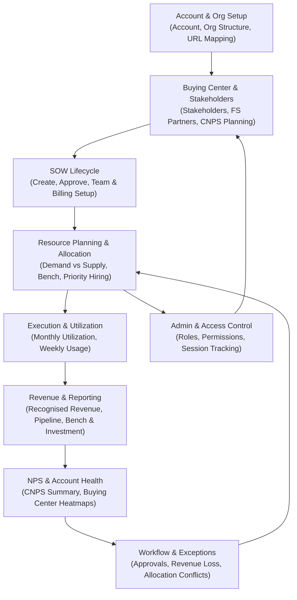

# BUSINESS REQUIREMENTS DOCUMENT (BRD)

RRE-UI — Resource, Revenue & Engagement UI

Location: /home/ubuntu/cvs-brd-github/github_repo_BRD/RRE-UI/Prod_new/RRE-UI_brd_20260722_c534e8

---

## 1. Document Overview

This BRD describes the business requirements for the RRE-UI (ARCUS) application based on analysis of the HTML/JS UI source, configuration files, legacy UI flows and product user manuals.

It is organized into feature-focused sections that can be owned and reviewed by domain stakeholders (Sales, Delivery, Resource Management, Finance, HR, Admin, CXO). Technical implementation details are intentionally avoided; emphasis is on user journeys, business rules and functional requirements in FR-XXX format.

---

## 2. End-to-End Business Process Overview

The following high-level diagram summarizes the RRE-UI business lifecycle from account setup to reporting and exceptions.

Sections below map to this flow:
- Section 3 – Authentication & Access Control
- Section 4 – Employee Management
- Section 5 – SOW Lifecycle & Allocation
- Section 6 – Buying Center & NPS
- Section 7 – Resource Allocation & Utilization
- Section 8 – Account & Revenue Management
- Section 9 – Admin & Configuration
- Section 10 – Dashboards & Navigation
- Section 11 – Reporting & Analytics
- Section 12 – Workflow & Exception Handling
- Section 13 – User Manual Alignment
- Section 14 – Structural Metadata & URL Mapping
- Section 15 – Legacy UI & Historical Requirements
- Section 16 – Common Components & Cross-cutting UX
- Section 17 – Notifications & Messaging

Each section contains:
- Business overview/objectives
- Functional requirements (FR-XXX)
- User roles & workflows
- Business rules & validations
- Data entities (business view)
- Integration requirements
- Assumptions and open questions

---

## 3. Authentication & Access Control (UI Perspective)

See detailed section: `01_auth_and_access_control.md`.

Key points:
- Google Identity Services based sign-in, backend /checkaccess validation, localStorage session model.
- Role-based routing (Admin vs Home) and menu visibility driven by access-page-list and user-access-details.
- Admin role management and session/activity telemetry.

All FRs, rules, workflows and entities are defined in the referenced section.

---

## 4. Employee Management

See detailed section: `02_employee_management.md`.

Scope:
- Employee onboarding, profile, skills/persona, training & certifications, resume viewing.
- HR and Delivery personas managing employee master data and readiness for allocation.

---

## 5. SOW Lifecycle & Allocation

See detailed section: `03_sow_lifecycle_and_allocation.md`.

Scope:
- SOW creation, stages, approvals, persona rows, billing and allocation flag.
- SOW team composition and allocation pages that bridge to resource management.

---

## 6. Buying Center & NPS

See detailed section: `04_buying_center_and_nps.md`.

Scope:
- Buying Center models, stakeholders, FS partner assignments.
- Engagement notes, audit logs and CNPS planning/summary and heatmaps.

---

## 7. Resource Allocation & Utilization

See detailed section: `05_resource_allocation_and_utilization.md`.

Scope:
- Allocation flows, bench, overstaff, priority hiring and utilization charting.

---

## 8. Account & Revenue Management

See detailed section: `06_account_and_revenue_management.md`.

Scope:
- Account onboarding, enrichment, heads, growth/delivery teams.
- Revenue pages and recognised revenue views by SOW and account.

---

## 9. Admin & Configuration

See detailed section: `07_admin_and_configuration.md`.

Scope:
- Role and access definition, assignment, org master data and admin dashboard.

---

## 10. Dashboards & Navigation

See detailed section: `08_dashboards_and_navigation.md`.

Scope:
- Home tiles, dashboard pages, allocation dashboard, POC/POV dashboard and utilization chart as navigation hubs.

---

## 11. Reporting & Analytics

See detailed section: `09_reporting_and_analytics.md`.

Scope:
- Executive summary, SOW-by-SOW, SOW-by-Account, Resource Utilization, Weekly Usage, Revenue Movement, Bench & Investment and Account Allocation reports.

---

## 12. Workflow Tracking & Exception Handling

See detailed section: `10_workflow_and_exception_handling.md`.

Scope:
- Workflow groupings (SOW/Account/Resource) and exceptionResult revenue loss and conflict views.

---

## 13. User Manual Alignment

See detailed section: `11_user_manual_alignment.md`.

Scope:
- Reconciliation of UI-driven requirements with formal user manuals and release notes.
- Additional FR-XXX items derived only from manuals (e.g., report scheduling, explicit audit expectations).

---

## 14. Structural Metadata & URL Mapping

See detailed section: `12_structural_metadata_and_url_mapping.md`.

Scope:
- URL-to-page mapping and Org_Structure CSV as canonical metadata for navigation and reporting hierarchies.

---

## 15. Legacy UI & Historical Requirements

See detailed section: `13_legacy_ui_and_historical_requirements.md`.

Scope:
- Legacy /old/ flows for allocation, bench, priority hiring and SOW details.
- Requirements that may have been simplified in the current UI but remain relevant for migration planning.

---

## 16. Common Components & Cross-cutting UX

See detailed section: `14_common_components_and_ux.md`.

Scope:
- Header, navigation, profile/sign-out, notifications, quick links and activity tracking.

---

## 17. Notifications & Messaging

See detailed section: `15_notifications_and_messaging.md`.

Scope:
- Toast-based notification strategy, critical vs non-critical messages and consistency rules.

---

## 18. Global Cross-cutting Requirements

This section consolidates cross-cutting FRs and business rules that span multiple modules.

### 18.1 Cross-cutting Functional Requirements

- **FR-GL-001**: The system shall enforce role-based access control consistently across all pages using centrally-managed roles and per-page access lists.
- **FR-GL-002**: The system shall provide consistent navigation and branding via a shared header and Home page, with tiles and links tailored to user role and access.
- **FR-GL-003**: The system shall log key user activities (page visits, key actions) and API timings for auditability and performance monitoring.
- **FR-GL-004**: The system shall support export to Excel for all major tabular reports where business users need offline analysis.
- **FR-GL-005**: The system shall provide a consolidated notifications mechanism aggregating approval and allocation conflict counts.
- **FR-GL-006**: The system shall maintain a unified concept of SOW across Account, Allocation, Reporting and NPS modules, using a stable SOW identifier.
- **FR-GL-007**: The system shall support both India and US (and CA) locations, with region-aware utilization and revenue metrics.

### 18.2 Cross-cutting Business Rules

- BR-GL-001: All date fields (Legal, Billing, Actual, Allocation, Usage) must have start <= end and follow agreed display/input formats.
- BR-GL-002: All monetary values (SOW Amount, Revenue, Bench Investment) must be non-negative and formatted with appropriate thousand separators.
- BR-GL-003: Client-side validations must be complemented by server-side validations to prevent bypass via API.
- BR-GL-004: Access checks on the client (localStorage access-page-list) must be mirrored on the server.
- BR-GL-005: Error messages presented to end users must be non-technical, with technical details logged separately.

### 18.3 Non-functional Requirements (Global)

- NFR-GL-001: Core dashboard and transactional pages should target <3s initial load under normal load.
- NFR-GL-002: Reporting queries may take longer but should present progressive loading indicators and support pagination for large datasets.
- NFR-GL-003: The product shall support 100s of concurrent users with role-based segmentation and acceptable response times.
- NFR-GL-004: All data-in-transit must use HTTPS/TLS; sensitive data in client storage should be minimized.

---

## 19. Open Questions & Next Steps

Open topics collected across sections:
- Clarification of revenue recognition rules used by finance and how they map to recognised vs billed vs pipeline amounts.
- Confirmation of exception severity thresholds and SLA timelines for workflow and revenue loss handling.
- Decision on whether scheduled reporting (email delivery) is in scope for near-term releases or remains manual.
- Confirmation of source-of-truth for Org Structure (CSV vs HRIS) and planned integration patterns.

Recommended next steps:
- Review each feature section with corresponding business owners.
- Create a consolidated requirements traceability matrix mapping FR-XXX to UI elements and backend APIs.
- Prioritize enhancements (notifications standardization, removal of hard-coded admin emails, security improvements).

---

## 20. References (Section Files)

All detailed sections are stored under the BRD folder:

- 00_rre_ui_end_to_end_flow.md
- 01_auth_and_access_control.md
- 02_employee_management.md
- 03_sow_lifecycle_and_allocation.md
- 04_buying_center_and_nps.md
- 05_resource_allocation_and_utilization.md
- 06_account_and_revenue_management.md
- 07_admin_and_configuration.md
- 08_dashboards_and_navigation.md
- 09_reporting_and_analytics.md
- 10_workflow_and_exception_handling.md
- 11_user_manual_alignment.md
- 12_structural_metadata_and_url_mapping.md
- 13_legacy_ui_and_historical_requirements.md
- 14_common_components_and_ux.md
- 15_notifications_and_messaging.md

These documents together constitute the full BRD for RRE-UI.
